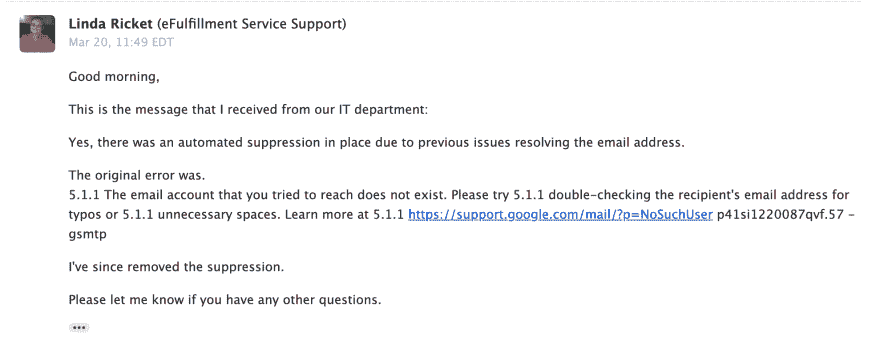

# 你的收件箱是不是感觉太安静了？暂时中断电子邮件的潜在后果。

> 原文：<https://dev.to/tracymakes/does-your-inbox-feel-too-quiet-the-hidden-consequences-for-temporarily-breaking-your-email-3no5>

一个月前，我公司的电子邮件地址出错，导致它被退回。即使在我发现并解决了这个问题之后，这还是导致了未知数量的电子邮件在我不知情的情况下被悄悄禁止。

电子邮件抑制*应该*是每个人都应该知道的事情，但我在过去几周发现，没有服务提供商知道他们的邮件 API 服务(如 Mailgun、Sendgrid 等)会抑制被退回的电子邮件。

我写这篇文章不仅是为了分享我的经历，也希望提高客户和服务提供商对此类问题的认识，这样就没有人会像我一样经历这种非常恼人的混乱。

## 犯了一个愚蠢的错误，弄坏了我的电子邮件，导致了我没有预料到的问题。

因为我是运行这个 web 应用程序的人，所以我想要一个使用域名的个人电子邮件地址—[tracy@hellowebbooks.com](mailto:tracy@hellowebbooks.com)。

当然，建立一个电子邮件地址需要一些后勤工作，我最初走的是简单但昂贵的方式，建立谷歌应用程序，每月支付 5 美元。我设置了我的个人 Gmail 来接收从 tracy@hellowebbooks.com 发来的邮件，然后迅速转移到其他事情上。这大概是 2018 年年中做的。

2019 年 2 月，我注意到我的信用卡每月收费 5 美元，决定注销我的谷歌应用程序账户，以节省一些零钱，完全忘记了这是 tracy@hellowebbooks.com 的动力。我有一堆其他的电子邮件，这些邮件是使用传统的免费版本的谷歌应用程序设置的，它们被转发到我的 Gmail 帐户，在短暂的一瞬间，我忘记了这个电子邮件地址不是这样设置的，也不记得在取消付费订阅后它不会回到这种行为。

来自任何使用该邮件的服务的所有邮件现在都会被退回，当然，我不知道会发生这种情况。

后来，一个善良的人给我发邮件，告诉我我的电子邮件地址被退回了，导致我在几个小时内疯狂地发现，当我禁用谷歌应用程序时，我的电子邮件被破坏了，导致我建立了一个临时邮件服务器，然后为未来的转发设置了谷歌域名。瞧，[tracy@hellowebbooks.com](mailto:tracy@hellowebbooks.com)又成功了！我继续我的生活，自信我解决了这个问题。

## 我的收件箱感觉更安静了，但*一些*邮件还能用。

几周后，我开始注意到一些奇怪的事情。我收到的邮件比以前少了，我想知道邮件是否还能用。但是当从外部来源给自己发邮件时，邮件会成功到达，所以我会再次把它忘掉。

直到几天前，我才意识到我没有收到来自 Gumroad 的任何电子邮件，这尤其令人担忧，因为我需要在收到产品付款通知后运送实物产品。

> (是，通知已启用。不，它们不在垃圾邮件里。是的，来自 Gumroad 的其他电子邮件正在工作。)[pic.twitter.com/40TRaSaE7R](https://t.co/40TRaSaE7R)
> 
> —特雷西·奥斯本([@ Tracy makes](https://dev.to/tracymakes))[2019 年 3 月 8 日](https://twitter.com/tracymakes/status/1104117667844288518?ref_src=twsrc%5Etfw)

Gumroad 回应说，他们的 Gmail 有问题，所以我把整件事归咎于 Gumroad 的 Gmail 电子邮件出现了问题，而不是我的错或责任，并再次把它抛在脑后。

> 补充一下:这非常奇怪，因为它们不会影响所有的邮件，也不会变成垃圾邮件。他们就是不出现(有时过一会儿会出现)。
> 
> —Sahil Lavingia(@ SHL)[2019 年 3 月 8 日](https://twitter.com/shl/status/1104117855358861312?ref_src=twsrc%5Etfw)

然后我注意到邮件列表导出没有从 ConvertKit 发送到我的电子邮件中，也没有密码重置请求。我又一次给自己发了测试邮件，邮件很快就到了，我确信我的电子邮件地址确实有效。

## 修复我自己的邮件服务让我意识到邮件 API 服务正在悄悄地压制我的邮件。

直到我开发这个 web 应用程序的新版本时，我才最终发现实际发生了什么。我发布了新版本，在测试中，遇到了一个 500 错误。这本应该给我发一份报告，但报告没有到(当然)，所以我赶紧去 Mailgun 看看我的网络服务器是否真的发了这封邮件。

就是在那里，我发现了邮件 API 服务是如何无声地抑制退回的邮件的，我已经有大约一个月没有收到来自我的*自己的*邮件服务的邮件了。

<figure> 

<figcaption>抑制了上个月的邮件。</figcaption>

</figure>

看到[tracy@hellowebbooks.com](mailto:tracy@hellowebbooks.com)被我自己的邮件服务压制引起了大*啊哈*瞬间:**T5】我用那个邮箱的所有网络服务都在默默压制我的邮件。它解释了为什么我收到了一些邮件，而其他的却没有；为什么从另一个电子邮件地址发送电子邮件可以正常工作，而从我使用的服务发送的电子邮件和通知却无声无息地失败了。**

网络服务本身并不经常意识到这个问题，就像上面的 Gumroad，他把这个问题归咎于 Gmail。

我现在的任务是检查我用这个邮箱注册的每一项服务，看看我的邮件是否被屏蔽了。

<figure> 

<figcaption>我的电子邮件截图，其中显示了一个具有电子完成服务的会议，该会议禁止我的电子邮件。</figcaption>

</figure>

## Web 服务和支持忘记了这是他们的邮件 API 服务提供的功能。

例如，在 [Mailgun 的功能页面](https://www.mailgun.com/deliverability/bounce-management-software)上:

> 两种类型的电子邮件退回: (...)硬退回:邮件可能会永久失败，因为电子邮件地址实际上不存在或不再有效。对于这种退回类型，**退回管理软件可以自动将这些邮件从您的电子邮件列表中删除。**这将帮助你保持一个干净的电子邮件列表和一个积极的电子邮件声誉。

在[顶杆侧](https://mandrill.zendesk.com/hc/en-us/articles/205582937-About-Bounces):

> 收件人电子邮件地址发生退回后，Mandrill 停止尝试发送电子邮件。发送到该地址的进一步电子邮件将被暂时拒绝。
> 
> 拒绝不应该被批量删除，但是如果你知道退回是暂时的，或者你已经解决了接收服务器的问题，你可以删除对你的帐户声誉有轻微影响的个别拒绝。

## 越来越多的人意识到，如果他们怀疑电子邮件有问题，就应该检查一下。

最初的问题完全是我的错，因为我做出了一个快速愚蠢的决定，取消了我正在使用的服务，而且没有考虑后果。

然而，找出并解决这个问题变得更加困难*,因为当我发邮件请求支持时，我使用的服务忘记检查他们的电子邮件抑制列表。*

 *我也曾向几个非常精通计算机和网络的朋友寻求帮助来解决我的电子邮件问题，但他们也不记得电子邮件抑制列表可能是我的电子邮件问题的原因

## 修复您遇到的这种情况。

1.  当然，不要改变你的电子邮件提供商，这可能会导致退信。预防是最好的良药。
2.  密码重置是一种快速触发电子邮件以测试您的电子邮件地址是否被禁止的好方法。
3.  如果你使用的是 Gmail 之类的电子邮件提供商，你可以在你的电子邮件地址中添加+WORD(例如，[tracy+test@hellowebbooks.com](mailto:tracy+test@hellowebbooks.com)仍然会发送到【tracy@hellowebbooks.com】T2)。你可以关闭网站上使用的电子邮件，并触发密码重置，以查看电子邮件是否会到达。如果他们这样做了，那很可能意味着你的原始邮件被他们的系统屏蔽了。
4.  请支持人员将您的电子邮件地址从他们的电子邮件禁止列表中删除，并准备好引导他们完成这一过程，因为与我交谈过的很多人都没有意识到这可能是一个问题。

* * *

在过去的几周里，这是一个需要诊断和解决的有趣问题，我在这段时间里学到了很多。希望对你也有帮助！*