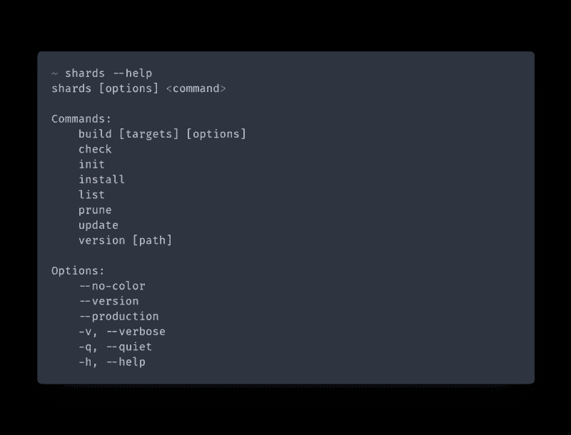
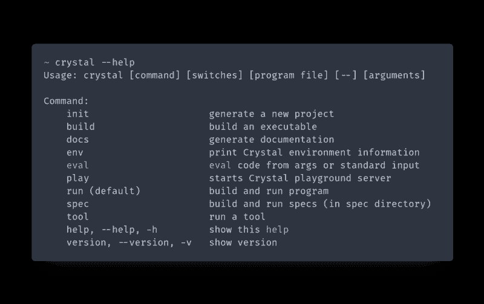
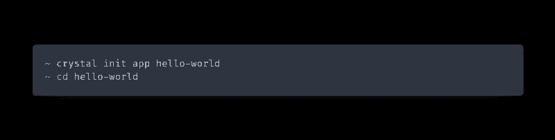
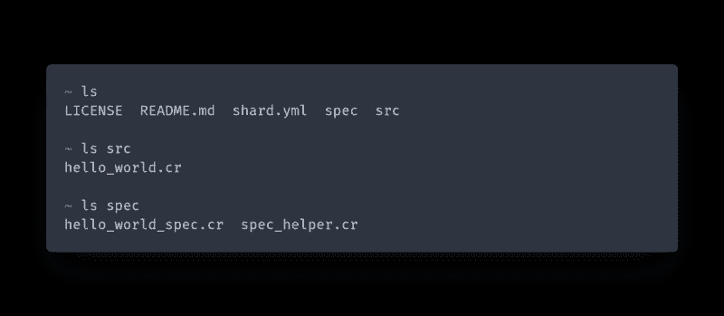
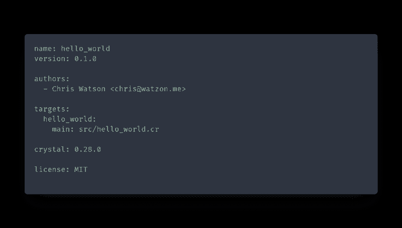
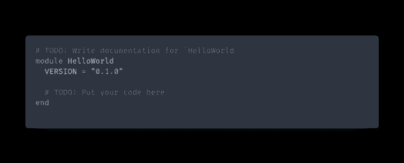
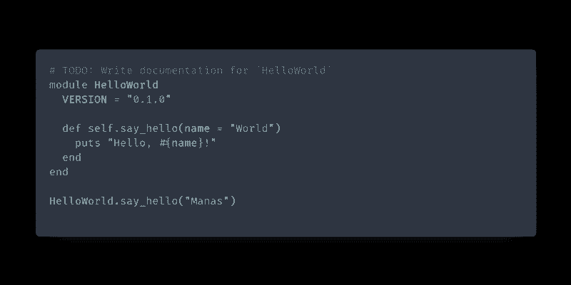
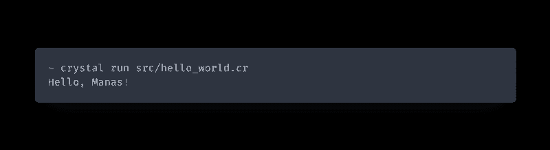

# 使用 Crystal #2:开始使用 Crystal

> 原文：<https://dev.to/watzon/doing-crystal-2-getting-started-with-crystal-13dk>

你好，欢迎来到另一个版本的做水晶。在这篇文章中，我将简要介绍如何安装 Crystal、Crystal Shards、使用 CLI 以及建立一个新项目。

如果你还没有阅读这个系列的第一部分，你可以在这里查看一下。

Crystal 很容易安装，但有时会出现挂起。随着语言的成熟(记住，它只是一门 5 岁的语言)，安装过程变得更简单，现在比以前支持更多的操作系统。话虽如此，以下是一些需要记住的事情:

### Windows 支持

对于许多刚刚开始使用 Crystal 的人来说，这可能是最大的障碍。在撰写本文时，Crystal 还不支持 Windows。有[正在努力](https://github.com/crystal-lang/crystal/issues/26)移植编译器并使在 Windows 上编译成为可能，但现在如果你想在 Windows 上开始使用 Crystal，你有两个选择。

1.  安装 Linux。你可以双引导，使用 VM，或者干脆一起去掉 Windows，但是 Linux 绝对是用 Crystal 开发的最好方式。
2.  使用 WSL。这在技术上仍然是使用 Linux，但是更容易一些。WSL(或 Linux 的 Windows 子系统)是一个本地内核兼容层，允许您在 Windows 中运行真正的 Linux。这里的一个瓶颈是编辑器支持，我试图用我的项目 [wsl-proxy](https://github.com/watzon/wsl-proxy) 来缓解这个问题。对 WSL 的支持也被添加到 VS 代码的[水晶语言](https://marketplace.visualstudio.com/items?itemName=faustinoaq.crystal-lang)插件中。

### 从源代码编译

如果你不知道自己在做什么，从源文件进行编译会非常困难。在构建编译器之前，需要几个[库](https://github.com/crystal-lang/crystal/wiki/All-required-libraries)。在有说明的系统上，即 Ubuntu、Fedora 和 OS X，下载和安装你需要的库是很容易的，但是对于 Arch 或 Alpine Linux 这样的系统，找到正确的库可能有点困难。

幸运的是，只需点击一下就能获得帮助。

一般安装说明位于[crystal-lang.org/reference/installation](https://crystal-lang.org/reference/installation/)。

### 碎片

Ruby 有 Bundler，NodeJS 有 NPM，Rust 有 Cargo，Crystal 有**碎片**。Shards 是一个包管理器，就像 Crystal 本身一样，它仍处于起步阶段。也就是说，Shards 擅长于它所做的事情:从 git 存储库中获取和安装外部 Crystal 库。

碎片应该和水晶一起包装。要检查您是否安装了它，请运行`shards --help`。

如果您安装了 shards，并且它在您的路径上被正确引用，您应该会看到这个输出。可用的命令如下:

*   **构建** —构建命令检查您的`shard.yml`中的二进制定义，如果存在的话就构建它们。您可以使用`[targets]`选项来构建特定的目标。
*   **检查** —检查您的依赖项是否是最新的。
*   **init** —在当前目录下生成一个`shard.yml`文件。
*   **安装** —安装`shard.yml`中列出的依赖项。
*   **列表** —列出已安装的碎片。
*   **修剪** —删除不再需要的已安装碎片。
*   **更新** —更新碎片。
*   **版本** —获取项目的版本。

不幸的是，安装二进制碎片(就像在 Ruby 中使用`gem install [gemname]`一样)还不被支持，但是希望有一天会被支持。

### 水晶 CLI

Crystal CLI 是编译器、Crystal Playground、工具、文档生成、测试运行等的接口。首先运行`crystal --help`看看你是否正确安装了它。

如果你看到这个，你就可以走了。让我们回顾一下 CLI 的命令。

*   **init** —生成一个新的水晶项目。您可以使用`crystal init lib [name]`生成一个库项目，或者使用`crystal init app [name]`生成一个二进制项目。
*   **构建** —构建一个文件。在大多数情况下，您将运行`crystal build ./src/project-name.cr`，其中`project-name.cr`是运行`crystal init`时为您生成的主文件。
*   **docs** — Crystal 自带一个内置的文档生成器。就我个人而言，我觉得在文档生成方面缺少了很多东西，但是您可以通过运行`crystal docs`使用您的注释和类型定义非常容易地生成文档。
*   **env** —打印水晶的环境信息。环境变量包括`CRYSTAL_CACHE_DIR`、`CRYSTAL_PATH`、`CRYSTAL_VERSION`和`CRYSTAL_LIBRARY_PATH.`
*   **eval** —评估并运行来自标准输入的 Crystal 代码。
*   **play** —启动本地水晶游乐场服务器。这有点像位于 https://play.crystal-lang.org/[的游乐场。](https://play.crystal-lang.org/)
*   **运行** —构建并运行提供的文件名。使用 like `crystal run [file]`。
*   **规范** —构建并运行位于`/spec`目录中的规范。
*   **工具** —运行一个可用的水晶工具。可用的工具有`context`、`expand`、`format`、`hierarchy`、`implementations`、`types`。

现在我们已经对 CLI 有了一点了解，让我们建立一个新项目。

### 创建项目

因为编码之神认为这是强制性的，所以让我们创建一个 hello world 应用程序。

首先，让我们打开我们选择的终端，进入一个项目目录。在我的例子中，我将运行`cd ~/Projects`。使用 CLI，我们将生成一个新的项目支架，然后`cd`进入我们新创建的项目。

如果您运行`ls`，您应该会看到以下输出:

这里重要的文件是`shard.yml`和`src/hello_world.cr`。首先让我们来看看`shard.yml`。

我不会详细讨论这一点，因为大多数项目应该是不言自明的。如果你需要关于`shard.yml`中可用选项的帮助，你可以在这里查看规格[。](https://github.com/crystal-lang/shards/blob/master/SPEC.md)

让我们打开位于`src/hello_world.cr`的主文件。

这是为所有新的 Crystal 项目生成的样板内容。正如你所看到的，我们的项目名称`hello_world`已经被替换为基础模块的名称。按照惯例，Crystal 使用 snake_case 作为项目名、方法名、变量名等。而 PascalCase 用于模块名和类名等常量。

现在，按照惯例，我们的 hello world 应用程序必须打印类似“hello，world！”到控制台，所以让我们来实现它。

为了这个例子的缘故，我们将会比我们需要的更详细一点。

首先，我们在名为`say_hello`的`HelloWorld`模块中创建新的类方法。您可以通过寻找`self.`语法来区分类和实例方法。`def self.say_hello`生成一个类方法，其中`def say_hello`生成一个实例方法。

我们的`say_hello`方法接受一个参数“name ”,该参数被赋予默认值“World”。如果我们在没有任何参数的情况下运行`say_hello`，将使用默认值“World”。

接下来，我们在`HelloWorld`模块之外运行我们的新方法。由于`say_hello`是一个实例方法，我们可以用`HelloWorld.say_hello`来调用它。类方法不能直接在模块上使用，因为模块不能被实例化。

最后，我们给`HelloWorld.say_hello("Manas")`打电话，向[玛纳斯科技](https://manas.tech)的人们大声喊出来，他们创造了 Crystal。

让我们运行我们的程序，看看输出。

这个程序需要几秒钟的时间来运行，因为它必须先编译，但是你应该会听到“你好，Manas！”。恭喜你！你已经写了你的第一个水晶程序。用`build`替换`run`来构建当前目录的二进制文件。

### 结论

Crystal 是一种非常强大的语言，到目前为止我们只是触及了它的皮毛。下一次我们将讨论使 Crystal 如此强大的众多因素之一，那就是类型系统。

请不要忘记点击看起来像有人鼓掌的自我助推器按钮，如果你想分享这个到社交媒体上。如果你分享到 twitter，请务必在@_watzon 标记我。

一些有帮助的链接:

[https://crystal-lang.org/](https://crystal-lang.org/)

[https://github.com/kostya/benchmarks](https://github.com/kostya/benchmarks)

[https://github.com/kostya/crystal-benchmarks-game](https://github.com/kostya/crystal-benchmarks-game)

[https://github.com/crystal-lang/crystal](https://github.com/crystal-lang/crystal)

在线找我:

[https://medium.com/@watzon](https://medium.com/@watzon)

[https://twitter.com/_watzon](https://twitter.com/chrystal_coder)

[https://github.com/watzon](https://github.com/watzon)

[https://watzon . me](https://watzon.me)