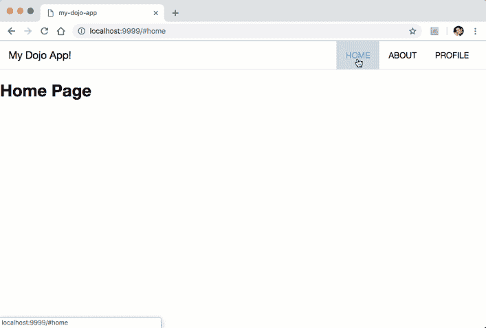
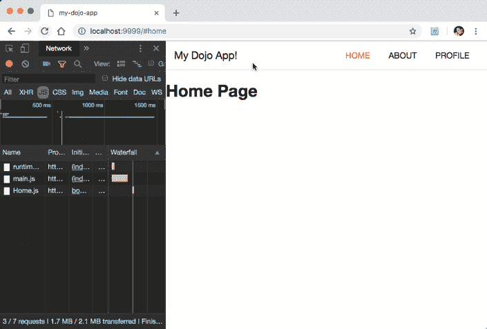

# Dojo CLI 模板应用程序

> 原文：<https://dev.to/odoenet/dojo-cli-template-app-59kc>

Dojo 4 的发布在他们的构建管道中引入了一些非常好的新功能，以优化[渐进式网络应用](https://developers.google.com/web/progressive-web-apps/)，在渲染引擎中的一些性能改进，等等。

然而，我还没有看到谈论太多的真正酷的东西之一是您通过 dojo cli 获得的新模板应用程序。您可以使用@dojo/cli 查看我在[上的早期帖子，了解如何开始。](https://learn-dojo.com/up-and-running-with-dojo-cli/)

前面的模板应用程序很好地介绍了基本的小部件以及如何在应用程序中显示小部件。作为一个介绍，这很好，但是如果你想做得更多一点，比如路由，你必须做更多一点的研究。不再是了！新的模板应用程序自带路由，因此您可以快速启动并运行某个功能，您可能会在某个更大的应用程序中最终使用该功能。

不幸的是，最新的模板应用程序不在代码沙箱中，很可能是因为路由在那个环境中不能正常工作，至少在我最后一次尝试时没有。

下面是模板应用程序的样子。

[](https://res.cloudinary.com/practicaldev/image/fetch/s--R4lFJ60F--/c_limit%2Cf_auto%2Cfl_progressive%2Cq_66%2Cw_880/https://learn-dojo.com/wp-content/uploads/2019/01/dojo4-template-app.gif)

我已经在 github 上发布了模板应用[的原始代码。](https://github.com/odoe/dojo-4-template-app)

现在，让我们来看看你用新的模板应用程序得到了什么。

我将在以后发表一篇关于路由的更详细的文章，但是你可以在 [Dojo 文档](https://dojo.io/docs/index.html#doc--dojo__framework__v4_0_0__src__routing__README_md)中阅读更多的细节。这里的关键是路线的每个视图都由一个出口定义。一个[出口](https://dojo.io/docs/index.html#doc--dojo__framework__v4_0_0__src__routing__README_md___outlets)只是将显示在 routes 视图中的小部件的包装器。

```
// src/App.ts
import WidgetBase from "@dojo/framework/widget-core/WidgetBase";
import { v, w } from "@dojo/framework/widget-core/d";
import Outlet from "@dojo/framework/routing/Outlet";

import Menu from "./widgets/Menu";
import Home from "./widgets/Home";
import About from "./widgets/About";
import Profile from "./widgets/Profile";

import * as css from "./App.m.css";

export default class App extends WidgetBase {
  protected render() {
    return v("div", { classes: [css.root] }, [
      w(Menu, {}),
      v("div", [
        w(Outlet, {
          key: "home", id: "home", renderer: () => w(Home, {})
        }),
        w(Outlet, {
          key: "about", id: "about", renderer: () => w(About, {})
        }),
        w(Outlet, {
          key: "profile",
          id: "profile",
          renderer: () => w(Profile, {
            username: "Dojo User"
          })
        })
      ])
    ]);
  }
} 
```

好的，让我们稍微分解一下。 **w** 是一个呈现窗口小部件的函数，而 **v** 将创建虚拟 dom 节点。您可以看到，在这种情况下，有一个顶级菜单，下面有一个 div。在这个 div 中定义了每个 Outlet，id，key(可选)，以及在**渲染**方法中显示的内容。

我不会对每个视图进行详细描述。它们是相当标准的小部件，但是让我们看看路由部分。路线是在一个简单的对象中定义的。

```
// src/routes.ts
export default [
  {
    path: "home",
    outlet: "home",
    defaultRoute: true
  },
  {
    path: "about",
    outlet: "about"
  },
  {
    path: "profile",
    outlet: "profile"
  }
]; 
```

每条路由都有一条路径，其名称为 outlet id，与前面代码片段中定义的 outlet id 一致。超级简单直接。您还可以看到，home 路由被定义为 **defaultRoute** 。

这是整个事情是如何放在一起的。

```
// src/main.ts
import renderer from '@dojo/framework/widget-core/vdom';
import Registry from '@dojo/framework/widget-core/Registry';
import { w } from '@dojo/framework/widget-core/d';
import { registerRouterInjector } from '@dojo/framework/routing/RouterInjector';
import {
  registerThemeInjector
} from '@dojo/framework/widget-core/mixins/Themed';
import dojo from '@dojo/themes/dojo';
import '@dojo/themes/dojo/index.css';

import routes from './routes';
import App from './App';

const registry = new Registry();
registerRouterInjector(routes, registry);
registerThemeInjector(dojo, registry);

const r = renderer(() => w(App, {}));
r.mount({ registry }); 
```

我将在以后进行更详细的介绍，但是您可以向[注册表、](https://dojo.io/tutorials/1020_registries/)注册您的路线，这是一种您可以使用小部件进行更多配置的方式，而不仅仅是在页面上显示它们。你甚至可以通过[主题注入器](https://dojo.io/docs/index.html#doc--dojo__framework__v4_0_0__src__widget-core__README_md___styling--theming)体验使用[主题](https://dojo.io/tutorials/007_theming/)的工作。

一旦您的路由被注册，您就可以[在注册表中安装](https://dojo.io/docs/index.html#doc--dojo__framework__v4_0_0__src__widget-core__README_md___rendering-a-widget-in-the-dom)应用程序。如果我在这里做什么不同的事情，可能是在一个单独的模块中做所有的注册工作，但这只是一个偏好。

我真的很高兴看到新的 dojo cli 模板应用程序为用户提供了路由和注册中心介绍的坚实基础，在我看来，这是构建可伸缩应用程序的关键组件。

现在，为什么路由在渐进式网络应用中很重要？它允许您延迟加载应用程序的某些部分，直到您需要它们。例如，在模板应用程序中，一些用户可能永远不会点击 profile 页面，那么为什么您的应用程序要为该页面加载不必要的文件呢？你可以在这个动画形象中明白我的意思。

[](https://res.cloudinary.com/practicaldev/image/fetch/s--Jq_t1Gtg--/c_limit%2Cf_auto%2Cfl_progressive%2Cq_66%2Cw_880/https://learn-dojo.com/wp-content/uploads/2019/01/dojo4-template-app-files.gif)

在这里，您可以看到页面的文件直到我点击它们才被加载。这是代码分割，Dojo 1 非常擅长，新的 Dojo 在其构建工具中也利用了 [webpack](https://webpack.js.org/) 来处理。

请务必[订阅时事通讯](https://learn-dojo.com/sign-up/)，了解最新内容！