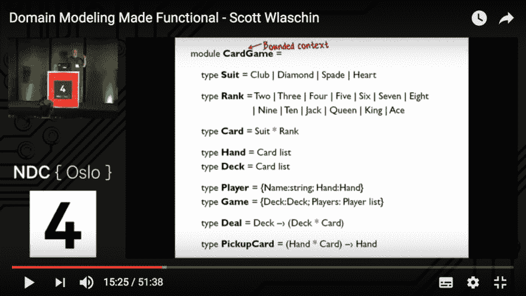
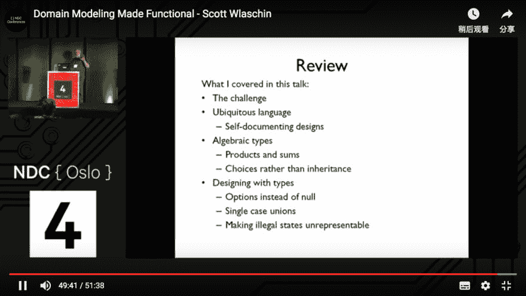

# 领域建模功能化——Scott Wlaschin

> 原文：<https://dev.to/chenge/domain-modeling-made-functional---scott-wlaschin-4p29>

图中是一个纸牌游戏的模型。就一页，简短明了。

在这个视频中，Scott 介绍了使用 F#的函数建模。它结合了 DDD 和泛函方法。代数类型是由类型组成的。作曲就是力量。

[https://www.youtube.com/embed/Up7LcbGZFuo](https://www.youtube.com/embed/Up7LcbGZFuo)

# 结束

[更多信息](https://fsharpforfunandprofit.com/ddd/)