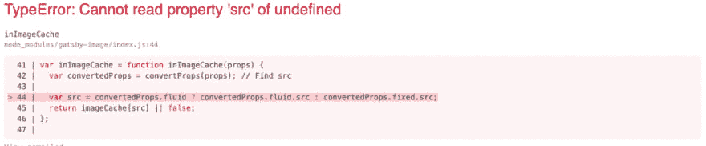
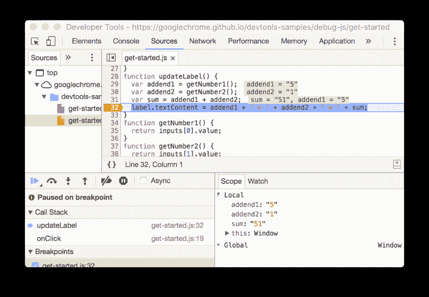

# 不要被错误所迷惑

> 原文：<https://dev.to/laurieontech/don-t-get-fooled-by-errors-314c>

即使今天是愚人节，我也不想恶作剧。相反，我想我应该利用这一天的精神来写一些经常让我们觉得自己像个傻瓜，引发错误的事情！每个人都有自己调试代码的方法。然而，我认为开发新事物最困难的部分之一是开发这种方法。当我在不熟悉的代码库中寻找错误来源时，这是我尝试并遵循的操作顺序。

## 编译时还是运行时？

在我深入调试之前，讨论您可能会遇到的两种类型的错误是很重要的。由于调试的目标是找到错误的来源，请记住，在开发过程中有两个不同的点可能会触发错误。

### 编译时间

编译时错误被及早发现。它们通常是语法错误或文件未找到错误等。如果它是一种强类型语言，那么它可能会在类型不匹配上出错。

```
error There was a problem parsing "/Users/laurie/Personal/practice/src/pages/index.js";  any GraphQL fragments or queries in this file were not processed.
This may indicate a syntax error in the code, or it may be a file type that Gatsby does not know how to parse.
 ERROR  Failed to compile with 1 errors                              12:39:25 PM

 error  in ./src/pages/index.js

Syntax Error: SyntaxError: /Users/laurie/Personal/practice/src/pages/index.js: Unterminated regular expression (14:30)

  12 |             {node.title}
 13 |             <ul>  >  14 |               <li>{node.year</li>
 |                               ^ 15 |               <li>  16 |                 {"Characters"} 17 |                 <ul> 
```

Enter fullscreen mode Exit fullscreen mode

*这是一个由删除括号*触发的语法错误的例子

当您尝试生成项目时，可以等待查看编译时错误。但是，在编写代码时，使用带有语法突出显示的 IDE 或其他文本编辑器通常会出现编译时错误。试着运行一个 linter，在你的 IDE 中寻找专注于你所写语言的插件。所有这些都可以帮助您在触发相关错误之前发现问题。

### 运行时

运行时错误是与代码实际运行时遇到的问题有关的错误。这是我们程序员通常认为的错误类型。

```
Objects are not valid as a React child (found: object with keys {allMarvelYaml}). If you meant to render a collection of children, use an array instead.
    in div (at pages/index.js:8)
    in main (created by Context.Consumer)
    in div (created by Context.Consumer)
    in StaticQuery (created by Layout)
    in Layout (at pages/index.js:7) 
```

Enter fullscreen mode Exit fullscreen mode

*这是我在 React* 中触发的一个错误的例子

这篇文章的大部分将集中在运行时错误的底部。

## 错误信息和堆栈跟踪

出现运行时错误的第一个线索通常是消息和难看的堆栈跟踪的某种组合。这个文本块可以在你的浏览器控制台中，在你的终端中，在你的 IDE 中，在日志中，有这么多的选项！第一个挑战是找到它。
*提示:寻找给出运行代码命令的源代码*

一旦这样做了，错误消息和堆栈跟踪的内容就是一种资源。请记住，有时这些机器响应中最有用的部分被隐藏了。通读人类友好信息，往下看几行，看有什么有用的吗？

您正在寻找您认识的任何东西，或者有助于映射到您自己的代码的任何东西。包含变量名或行号是有用的。如果您看不到任何内容，并且您不理解错误消息在说什么，那也没关系。

```
Objects are not valid as a React child (found: object with keys {allMarvelYaml}). If you meant to render a collection of children, use an array instead.
    in div (at pages/index.js:8)
    in main (created by Context.Consumer)
    in div (created by Context.Consumer)
    in StaticQuery (created by Layout)
    in Layout (at pages/index.js:7) 
```

Enter fullscreen mode Exit fullscreen mode

还记得我在上面提到的这个错误消息吗？指出我们的错误来自 index.js 文件和第 8 行非常有用。在这种情况下，它指出我不能使用对象，我必须使用字符串或其他原语。

另一件要记住的事情是，错误消息可能只是您的代码的结果。堆栈跟踪中提到的细节实际上可能没有指出根本原因。这就是为什么触发错误修复起来如此复杂！

[](https://res.cloudinary.com/practicaldev/image/fetch/s--lxN45CBL--/c_limit%2Cf_auto%2Cfl_progressive%2Cq_auto%2Cw_880/https://tenmilesquare.com/wp-content/uploads/2019/02/Screen-Shot-2019-02-18-at-11.46.03-AM-1024x212.png)

这个错误是直接给我们看源代码！不幸的是，源代码不是我们写的东西，而是我们触发的底层框架代码的[部分。](https://dev.to/laurieontech/rewriting-a-static-website-using-gatsby-and-graphql---part-3-4ho9)

## 谷歌机器爆发的时间

不幸的是，错误消息经常是模糊的，或者堆栈跟踪太深，我们无法确定涉及到代码的哪一部分。这是你依靠在你之前出现的程序员的时候。

谷歌搜索错误大约是程序员谋生的 75%。我开玩笑，但我经常有这种感觉。使用谷歌是一项合法的技能，它对你的生产力有巨大的影响。当搜索特定错误的修复方法时，有几件事需要记住。

1.  复制错误信息时，请保持简短，并且只使用底层代码提供的词语。您希望捕获尽可能多的答案，并且使用您的特定代码中的变量名与发布此错误的其他人不匹配。

2.  包括技术。如果你知道你的程序的哪一层触发了这个错误，即 [Javascript v. React](https://dev.to/laurieontech/the-layers-of-javascript-15op) 包括在你的谷歌搜索词中。你经常会发现由不同技术引发的同样的错误，你可以用这种方法消除那些搜索结果。

当谷歌搜索时，你使用的具体词汇很重要！

请记住，即使你找到了遇到错误的人以及他们是如何解决的，*并不总是给定的*，你也可能不理解它，这已经足够了。新程序员(或者甚至是对这项技术不熟悉的程序员)可能很难理解这些响应线程中的答案。如果对问题的上下文没有更透彻的理解，就很难理解特定于技术的词汇。要有信心，它会随着时间的推移而到来，你自己仍然有其他的方法来找到解决方案。

事实上，如果你想看看你已经走了多远，回到一个月前你还不理解的谷歌资源。我打赌你现在会的！

## 返回代码

上面的调试步骤不是说明性的。有时候，特别是在学习的时候，从这里开始，从你的代码开始，会很有帮助。无论您是否已经完成了上面的步骤，查看代码是了解您是如何触发错误的最好方法。

从查看您最近添加的代码行开始。如果你反复构建并经常测试，这将会更容易。在添加最后 2-3 行代码之前，知道您有一个工作项目，可以更容易地隔离潜在的罪魁祸首。

如果你不幸写了很多代码而没有测试，试着隐藏你的改变，或者向后工作。目标是找到导致问题的代码片段，然后您可以专注于修复它。注释掉是隔离错误代码的另一种方式，而不会删除您计划稍后添加的进度。

## 调试器是你的朋友...断点也是如此

尝试在代码运行时逐句通过它。变量是否被赋值给你期望看到的值？你按照你预期的顺序完成操作了吗？

[](https://res.cloudinary.com/practicaldev/image/fetch/s--dTvISFe4--/c_limit%2Cf_auto%2Cfl_progressive%2Cq_auto%2Cw_880/https://developers.google.com/web/tools/chrome-devtools/javascript/imgs/conditional-loc-breakpoint.png)

做这件事有不同的方法。如果您正在运行 javascript，您可以使用检查器，并在浏览器中运行代码时设定断点。如果你在 IDE 中直接运行你的代码，你可以在 IDE 中设置断点。

根据项目的不同，打印出变量的结果，或者到达代码中的某个点可能会更容易。

```
getResults(searchString: string): void {
   this.githubSearchService.getUsers(searchString) // pull results
      .subscribe(result => {
        this.result = result;
        console.log("I AM HERE!")
        if (this.result) {
          this.items = this.result.items;
        }
   });
} 
```

Enter fullscreen mode Exit fullscreen mode

控制台日志记录或打印语句是调试代码的非常有效的方法。

## 还卡着？

记住，你可以随时寻求帮助！提问时尽可能多地提供信息很重要。使用的技术、版本号，包括错误和堆栈跟踪等。如果您能设置您的代码在一个公共可访问的环境中运行，比如 jsfiddle，那就更好了！

调试是一项技能，解决错误可能非常耗时，并可能令人沮丧。然而，一旦你弄明白了，这也是工作中最令人满意的部分之一！