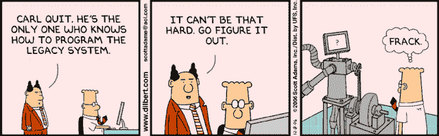

# (不要？)保持简单愚蠢！

> 原文：<https://dev.to/sommertim/don-t-keep-it-simple-stupid-55d1>

从我记事起， [KISS](https://en.wikipedia.org/wiki/KISS_principle) (保持简单愚蠢)原则就一直存在，以提醒开发者和企业尽可能用最容易(或最简单)的解决方案来处理给定的问题。

这基本上意味着软件设计的复杂性应该总是与它试图解决的问题的复杂性相关联。

所以，简单来说:简单问题，简单解决，复杂问题，复杂解决..

简单吧？

> 简单的艺术是复杂的拼图。道格拉斯·霍顿

## 建筑上的东西

我做软件架构师已经有几年了。我解决过非常大的“问题”，也解决过小问题。我在职业生涯中学到的许多事情之一是[软件设计必须进化](https://www.timsommer.be/using-fitness-functions-to-create-evolving-architectures/)，你必须能够评估变化如何影响架构的重要特征，并防止这些特征随着时间的推移而退化。这些变化可能包括技术领域的变化、团队的变化、需求的变化等等。

在过去的几年中(可能从 2009 年 NodeJS 的第一个主要版本开始更是如此),新的技术栈已经以闪电般的速度在。NET 开发社区。CQS，CQRS，安古拉吉斯，安古拉克斯(2，3，4，5，6)，React，VueJS，VueX，。NET Core、JS 函数式编程、CLI tooling、bower(或者现在是 Yarn)、NPM、事件源、docker、并行计算、AI 甚至量子计算..这个清单还在继续。

我们目前有可能用最先进的解决方案来解决最复杂的问题。但这取决于你能否跟上。在我看来，最大的问题就在这里。

### 不断变化的发展格局带来的挑战

作为一名架构师，你必须随着技术领域的变化而发展。你必须坚持下去，这样你才能为你试图解决的问题提供最好的、最新的解决方案。但是这并不总是容易的。随着形势的不断变化，保持领先变得非常困难，甚至是不可能的。当你今天开始学习一项新技术、语言或框架时；在你有机会掌握这项技术之前，它很有可能会过时、升级或过时。掌控全局有点像一只假想的狗，试图抓住自己的尾巴。

给定问题的复杂性只是你在决定软件设计时要考虑的因素之一(姑且称之为*维度*)。你必须与之合作的开发团队是一个同样重要的方面(他们熟悉 web 技术吗，他们远程工作吗，他们使用什么软件方法，等等)。).另一个重要的方面是决定你的软件设计的“心脏”在哪里，以及你将如何和用什么来测试它的发展。

也许最重要的是，你将采用哪些技术。你会选择哪些设计模式？设计需要可重用吗？设计会用多久？你必须做得恰到好处，重复你的想法，并做出相应的改变。

看起来——至少在比利时——作为一名应用程序架构师，多年来学到的实践经验中有一条不知何故被遗忘了。你必须准备好适合手头问题的东西。永远不要忘记，增加复杂性永远是一个恶性循环。就像担心一样，你最终发现你担心是因为你担心，因为你担心。增加复杂性就像那样。没有好坏之分，它就是这样；但是你要知道你在做什么，你的行为会有什么后果。当你开始仅仅为了增加复杂性而增加复杂性时，事情往往会很快失去控制。

让我们尝试一个用例:假设我们有一个 web 应用程序，在某个时间点必须处理超过它所能处理的负载。应用程序使用内存缓存来避免与数据库服务器之间的往返。由于新的负载(=新的复杂性)，我们必须将缓存机制更改为分布式缓存，以便我们可以横向扩展(在多台服务器上部署您的应用)。因此，我们添加了复杂性来整合新的复杂性！

因为我们现在使用的是分布式缓存，所以我们所有的开发者也需要访问本地分布式缓存。我们需要将它添加到我们的开发周期中，我们必须添加自动化，添加集成测试，教我们的开发人员他们需要知道什么，并为我们的不同环境设置分布式缓存。

复杂性中一个相当简单的变化就像往池子里扔石子。您创建的每个波纹就像一个新的复杂层，不仅跨越开发本身，而且跨越整个开发和部署过程(从开发到生产)。

永远记住，最复杂或者最酷的解决方案并不总是正确的。仅仅因为你能，并不意味着你应该！驱动软件设计的因素有很多，技术栈只是其中之一。

如果您使用某样东西只是为了使用某样东西(因为它很酷，因为它很前沿)，而这并没有增加适量的业务价值，或者不适合您的业务案例或架构领域；对不起，在我看来，你做得不对。

让我澄清一下，我并不是说我反对改变或升级技术栈或者在你的软件设计中增加复杂性。我没有。作为一个社区，我们需要努力向前发展，这的确是一个成为. NET 开发者的绝佳时机。但是如果你决定使用一个完整的 CQRS 解决方案，带有异步事件源，带有 Angular - Redux 前端；允许用户在几个列表上执行 CRUD 操作(真实的例子)；抱歉，您过度设计了应用程序中的 sh*t。

### 棱角分明

在比利时，许多公司都选择 Angular 作为他们的主要前端技术。我没有隐瞒我不是 AngularX 粉丝的事实。我假设每一个版本都有突破性的变化(大概每两个月一次？)、复杂程度、CLI、对 TypeScript 的固执己见的依赖；关于它的一切都是我不喜欢的。一个前端应用，对我来说，应该保持尽可能的简单，尽可能简单的查看和编辑你的数据。

还要记住涟漪效应。你的开发者不仅仅需要学习 AngularX，如果是这样的话。他们需要学习打字稿。tsconfig 文件、webpack(不要让我开始谈论这个)、16 个不同的包管理器(我可能有点夸张)、CLI、E2E JavaScript 测试、NPM、为不同的环境构建配置、不同的调试工具，甚至在大多数情况下，一个全新的 IDE..

如果你的团队只有高年级学生，我倾向于说，去吧。去狂野吧！但我希望你意识到这是多么不现实。团队会发生变化，初级和/或中级人员会处理您的代码。至少可以说，像 AngularX 这样复杂的框架，尤其是与 Redux 或 Flux 结合使用时，维护您的应用程序将是一个挑战..

## 论 docker、Kubernetes 与“开发运营文化”

随着的兴起。NET Core 中，微服务的引入被完全引入到。网络世界。微服务带来了 CQRS 和活动采购。微服务带来了 Docker、基于容器的应用程序开发、更好或更一致的 DDD 实现、Linux 部署，以及最终使用 Kubernetes 的可维护性。每项技术都很酷，“新”，而且创造起来棒极了。

但是为了保持..哦亲爱的。如果使用异步 CQRS 出现系统范围的故障，您不仅面临停机的风险；您冒着整个系统数据损坏的风险。如果没有正确实现，一个简单的错误可能会带来灾难性的后果..当我与实现如此复杂和庞大的应用程序的软件工程师交谈时，我倾向于向他们挑战可维护性。因为那是致命的弱点，那是一切都可能完全出错的地方。当我与他们谈论这些容器化应用程序的管理时，他们的眼中都充满了狂热。了解 Kubernetes，但从未合作过..思考大规模系统故障及其对数据的影响。如果容器关闭，或者更糟的是(共享的)数据容器损坏，就会得到通知。他们根本不知道！他们正在开发应用程序，但他们对这些应用程序一无所知，即使他们的生命依赖于此，也不知道万一系统崩溃了该怎么办。

在他们的辩护中，你可以认为他们不应该需要知道这些事情。他们应该与他们领域的开发运营团队共同承担责任，这样他们就可以在需要的时候帮助开发人员。因此，他/她可以专注于开发，而不是维护。但是，这种共同的责任正在慢慢地、但肯定地消失。

曾经有一段时间，开发团队与开发运营团队一起维护生产应用程序。但这种分化越来越成为过去。我们不再谈论开发运营团队，我们谈论“开发运营”文化。开发人员应该学习如何部署、管理和维护生产应用程序。当你看到它的时候并不奇怪。你不能指望一个开发-运营团队的成员来维护一个需要每个容器的专业知识的应用程序。你就是不能。但是把所有的责任都推给开发者也不是一个好主意..设计太复杂了，开发人员和程序员的职责和功能之间的界限已经变得太模糊了。

## 结论

对你来说，这可能是一种更“消极”的解读，因为我试图用语言来表达我对我们世界中技术进步的过山车的沮丧。你可能会错意了。我真的不反对改变和发展，我喜欢学习新的东西，我喜欢引导客户进入我们现在作为软件开发人员所处的新时代。

但我也看到它有时的样子。就像一列高速行驶的火车，每一次迭代、每一个新的框架、每一个新的技术栈都会让它跑得更快。而且，至少在比利时，我看到了火车可能出轨的那一点。一切都进行得太快了。

如果你是一名架构师或软件工程师，我敦促你做出负责任的选择。做出决策，迭代这些决策，并在编写代码时调整您的愿景和架构维度。如果你需要，融入新的想法和技术，而不是因为有人告诉你它们很酷，现在每个人都在这么做。并且总是，保持它(尽可能)简单。

*照片由[汉斯-彼得·高斯特](https://unsplash.com/photos/3y1zF4hIPCg)在[Unsplash](https://unsplash.com)T5 拍摄*