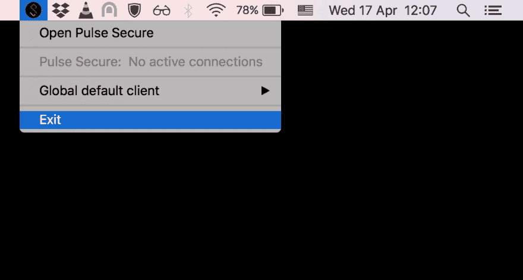
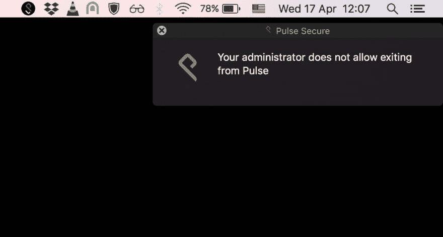
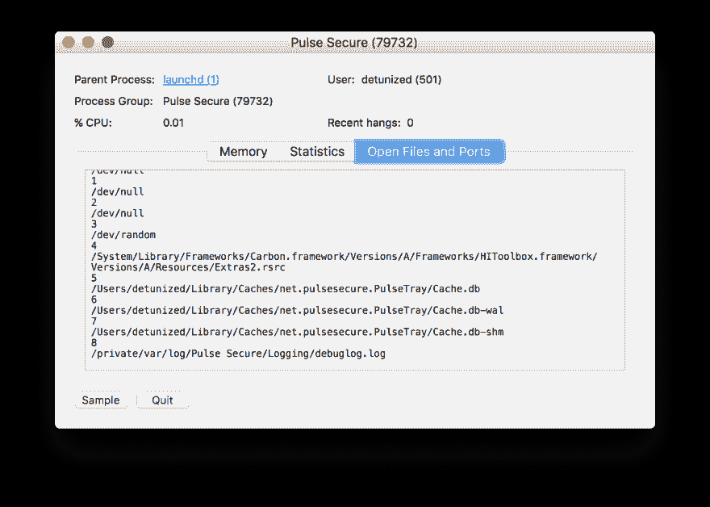
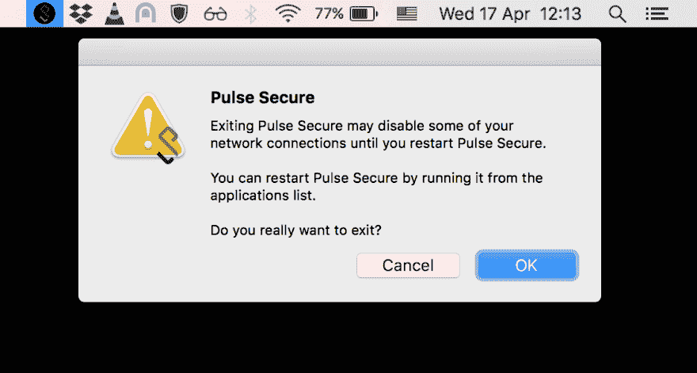

# 别让我黑你的软件

> 原文：<https://dev.to/detunized/don-t-make-me-hack-your-software-2k8d>

前几天我得到了一个新的公司 VPN 工具。叫做[脉冲安全](https://www.pulsesecure.net/)。它工作得很好，非常感谢，没有抱怨。但是后来我试着戒了

[](https://res.cloudinary.com/practicaldev/image/fetch/s--9c-hRaVe--/c_limit%2Cf_auto%2Cfl_progressive%2Cq_auto%2Cw_880/https://i.imgur.com/Nf6gDQ1.png)

我得到了这个

[](https://res.cloudinary.com/practicaldev/image/fetch/s--IHgoDilk--/c_limit%2Cf_auto%2Cfl_progressive%2Cq_auto%2Cw_880/https://i.imgur.com/f8rI72s.png)

那让我当时就很生气。为什么远程管理员会告诉我在本地机器上做什么？哪怕是公司机器。当我不使用 VPN 或者我甚至没有连接到任何 WiFi 时，我为什么要运行它呢？试图阻止我在我有根权限的机器上做一些事情是愚蠢的。当这被推到开发人员的笔记本电脑上时(相对于会计或人力资源职员而言),它就变成了一个挑战。

当它只是在后台运行时，对机器或公司网络的安全性没有影响。这不是杀毒软件。虽然它对电池寿命和其他资源如 RAM 和 CPU 有影响。我需要这些。正是这种类型的程序不退出，徘徊，并阻止我在我的笔记本电脑上运行另一个电子应用程序。有时候一个是不够的，你知道。

我想我不得不弄脏我的手，而不是做一些我实际上要做的事情。简单地从命令行杀死它不起作用。它只是重新开始。那就调查吧。

首先，我从活动监视器中快速浏览了一下打开文件的列表。我在那里找到了一个日志文件(底部一行):

[](https://res.cloudinary.com/practicaldev/image/fetch/s--vwYmzI7y--/c_limit%2Cf_auto%2Cfl_progressive%2Cq_auto%2Cw_880/https://i.imgur.com/2g86MNQ.png)

工具开发人员非常友好，在每个重启周期都会将大约半兆字节的内容转储到日志中。所以这也浪费了我的磁盘空间。在成千上万行中，我找到了对`/Library/Application Support/Pulse Secure/Pulse/connstore.dat`的引用。听起来很有希望。在浏览了那个文件并尝试了这个和那个之后，我找到了一个负责这个的参数。

```
ive "921sn438-qoo8-4pp4-85p7-68q5s2592o32" {
    ...
    connection-policy-override: "false"
    ...
} 
```

当该参数更改为`true`并且工具重启时，我可以退出。瞧啊。

[](https://res.cloudinary.com/practicaldev/image/fetch/s--FYaftxc5--/c_limit%2Cf_auto%2Cfl_progressive%2Cq_auto%2Cw_880/https://i.imgur.com/xfEeC0C.png)

是的，我知道。

这里是自动化整个事情的脚本:

```
cd '/Library/Application Support/Pulse Secure/Pulse'
sudo sed -i '' \
      s'/connection-policy-override: "false"/connection-policy-override: "true"/' \
      connstore.dat
sudo killall PulseTray 'Pulse Secure' dsAccessService 
```

亲爱的开发者和系统管理员们，请不要再这样做了。你只是在浪费大家的时间。不如努力让软件更可靠，更少资源消耗，更安全。

*原载于[detunized.net](https://detunized.net/posts/2019-04-17-dont-make-me-hack-your-software/)T3】*