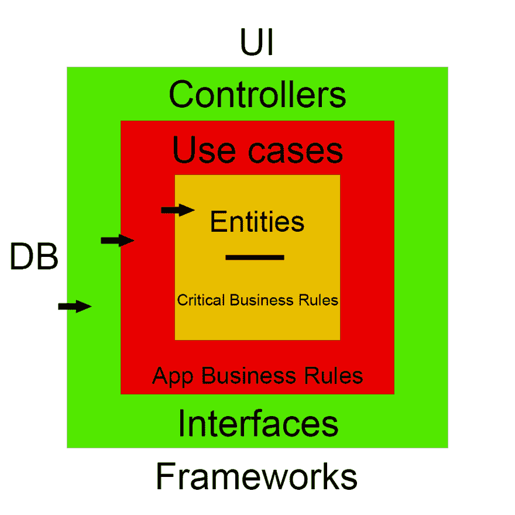

# 不要嫁给框架！

> 原文：<https://dev.to/andercodes/don-t-marry-the-framework-5h63>

> 在这篇文章中，我将谈论后端框架

框架在许多生态系统中都很流行，不仅仅是 javascript。这给社区带来了多样性。开发者的选择太多了，有免费的框架，也有付费的。它们功能强大，非常有用。

但是一些框架试图取代我们系统的架构。这仅仅是问题的开始。

许多框架卖家和作者提供这些软件来解决社区问题，这很完美。我们都很感激。但是一个框架不会解决你所有的问题，他们不能。作者知道他们自己的问题、同事的问题、朋友的问题，也许还有他们在 twitter、reddit 或 DEV.to 上看到的对开发流程的一些抱怨。这就是为什么创建框架的原因，是为了解决那些问题，而不是你的问题。

您遇到的问题可能与作者试图解决的问题相吻合，这很常见，否则框架不会如此受欢迎。

当我们开始爱上框架时，风险就开始了。阅读文档并找到详细描述如何将该框架集成到应用程序的教程或起始页是很常见的。换句话说，用这个框架来包装你的架构。通常这意味着扩展框架的公共类或在你的业务实体中导入一些源代码，将越来越多的应用程序与你编写的每一行代码链接起来。

所以。如果您系统架构非常严格，会发生什么？很明显，你不希望第三方代码出现在你的业务规则中，但是假设你可以接受，你信任 framework X。

酪如果框架对你的应用程序不再有用，会发生什么？产品已经成熟，框架可能无法满足当前应用的需求，因此框架不再像早期阶段那样有用。但是这对你来说是可以的，你会觉得多写几个小时的代码很舒服。

如果随着时间的推移，框架朝着对你的应用不理想的方向发展呢？
功能改变、功能失效、不可恢复兼容的更新等。

问题是显而易见的，所有这些风险迟早会收取发票，并且随着应用程序越来越多，损害会越来越大。这些风险总是存在的，但大多数时候我们会说‘我同意’，然后戴上结婚戒指。

## 解决方法很简单:不要和框架结婚！

好的软件架构是独立于框架的。你可以将框架视为应用程序细节或工具，让它们尽可能远离业务规则是一个好习惯

如果有必要将一些扩展类放在应用程序的内部层中，理想的解决方案是使用代理，并将这些代理作为插件，您可以在您的业务规则中使用。

## 结论

这些框架可能是强大而有用的。作者将永远是他们为我们的社区编写的软件的忠实信徒，当用户与框架结合时，问题就开始了。你不想成为那样的人。

密切关注每一个框架，不要因为它是趋势就购买。是的，X 框架看起来很酷，但是，它的成本是多少呢？你将如何使用它？你将如何保护你的应用程序免受其害？当你集成框架时，你将如何保存系统设计？
持怀疑态度。在选择一个新框架的时候，问自己所有这些问题，以防止它完全控制你的应用程序。