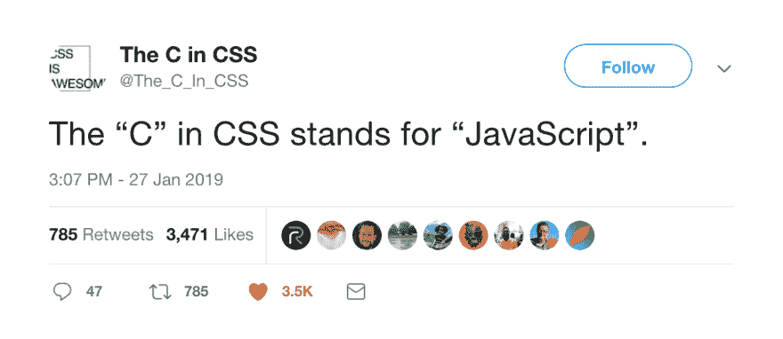

# 不要相信级联——为什么我用 JavaScript 写 CSS

> 原文：<https://dev.to/thepaulmcbride/don-t-trust-the-cascade-why-i-write-css-in-javascript-408k>

如果你最近在网上，你可能听说过 CSS-in-JS。

这项技术最近越来越受欢迎，但并不是每个人都是粉丝。今天，我想揭开它是什么，为什么我认为你应该使用它。

CSS-in-JS 可以有多种含义，但主要用于描述在 JavaScript 中创作样式逻辑的技术。这可以通过将[内联样式附加到 react 组件](https://reactjs.org/docs/dom-elements.html#style)的形式来完成，或者通过利用像[样式组件](https://www.styled-components.com/)这样的工具来完成。

现在，如果你和我一样，当你第一次听到 CSS-in-JS 这个术语时，你可能会想:

> 哦...我不用再学什么了！

我有一个好消息，如果你已经知道 CSS，你真的不需要学习任何新的东西。但是等等，如果你已经知道了 CSS，那么为什么还要写 CSS-in-JS 呢，这不是增加了复杂性吗？

## 我为什么要写 CSS-in-JS🎨

CSS 代表级联样式表。当 CSS 被创建的时候，我们建立的网站以今天的标准来看是非常简单的。当时，CSS 的*层叠*部分超级有用。然而，今天，我认为它最终成为一个脚枪更多的是有益的。想想看，你能记住你上一个项目中用到的每个类名吗？

现在想象一下和其他几个人一起做一个项目。编写与他人风格冲突或覆盖他人风格的 CSS 本质上是不可避免的。像 BEM 和 SMCSS 这样的技术会有所帮助，但是你必须依赖所有遵循规则的开发人员，随着项目的增长，有人出错的可能性也会增加。

对我来说，CSS-in-JS 和样式化组件特别有助于把我从自我中拯救出来。我受到 API 而不是惯例的保护，不会犯自己的错误。CSS-in-JS 允许我专注于设计我的 UI，而不必担心在其他地方覆盖 CSS。

然而，级联仍然是有用的。对于样式化的组件，您仍然可以利用级联，但是它受限于您正在处理的组件的范围。你可以鱼与熊掌兼得。

### 表现🚀

好吧，假设你从不犯错。CSS-in-JS 除了控制级联还有什么好处吗？事实证明，是有的。CSS-in-JS 库负责如何将样式注入 DOM。他们可以跟踪哪些组件被渲染，并且只注入所需的样式。

这意味着用户最终会下载更少字节的代码，并会有更快的时间来首次绘画。大获成功。

### 维护🔧

你是否曾经想从一个项目中删除一些 CSS，但是你没有办法确定它没有在某个地方被使用。对于 CSS-in-JS，这通常不是问题，因为样式通常与依赖它们的组件放在一起。你再也不用去寻找影响你正在处理的组件的 CSS 了。

### 动态样式

使用 CSS-in-JS 的另一个好处是，您可以利用 JavaScript 的强大功能。你可以使用函数来创建 mixins 和可重用的样式模块，props 可以用于创建组件的变体，变量可以用于主题化。

大多数 CSS-in-JS 工具也为您提供了传统 CSS 预处理程序的所有好处，包括嵌套规则和自动供应商前缀。

## CSS-in-JS 有什么缺点

所有的技术选择都包含某种妥协，使用 CSS-in-JS 也不例外。使用类似样式组件的东西的主要缺点是增加了复杂性。首先需要从 npm 安装。没什么大不了的，但这是额外的一步。

如果你是服务器渲染你的代码，你将需要安装和配置一个巴别塔插件，以确保你的风格在第一次加载时也能工作。

CSS-in-JS 的另一个缺点是它可能不适合您的特定应用程序。如果你没有使用 React 或 Vue 这样的前端框架，CSS-in-JS 可能不是正确的选择。

如果你的情况是 CSS-in-JS 不是很合适，我强烈推荐你去看看 [Tailwind CSS](https://tailwindcss.com/docs/what-is-tailwind/) 。它是一个实用的 CSS 框架，可以帮助你快速构建用户界面。你不会得到 CSS-in-JS 的任何好处，但是它可以帮助你避免 CSS 的一些陷阱。

## 关闭思绪

作为开发人员，我们的工作是用代码解决问题。CSS-in-JS 是一个工具，帮助我们更有效地解决问题，编写应该更容易维护的代码。

如果你尝试过 CSS-in-JS 解决方案，但没有成功，那也很酷。做对你和你的团队最有利的事情。

让我知道你是否使用过 CSS-in-JS，它为你解决了/引起了什么问题！