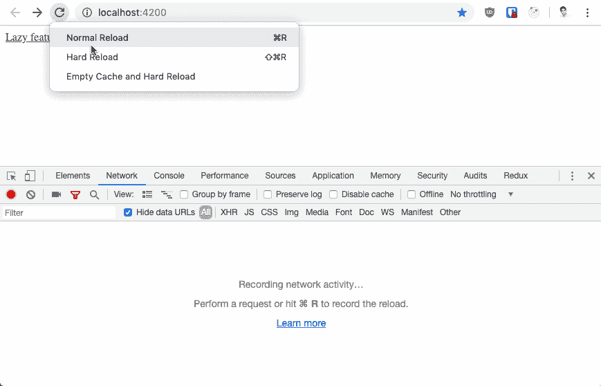

# [快速完成]带角度 8°的轻松惰性装载

> 原文：<https://dev.to/nitinja/done-quick-easy-lazy-loading-with-angular-8-256e>

以下是快速添加延迟加载模块(仅在用户导航到特定功能或页面后加载)的步骤:

请注意，您的应用程序必须安排为功能模块，而不是一个大的 AppModule。使用命令`npm install -g @angular/cli`确保安装了最新的 angular cli。

*步骤 1* :创建一个演示应用

`ng new MyApp --routing`

*第二步*:在需要惰性加载的新模块中添加一个特性模块和组件

`ng g module feature --routing`
T1】

*第三步*:在你的`app.component.html`中添加一个链接到懒惰模块

`<a routerLink="/feature">Lazy feature</a>`
注意，这个文件还有`<router-outlet></router-outlet>`

*第四步*:在主 app 路由器文件(`app-routing.module.ts`)中添加惰性加载。注意 import 语句——这就是神奇的地方！

```
import { NgModule } from '@angular/core';
import { Routes, RouterModule } from '@angular/router';

const routes: Routes = [
  {
    path: 'feature',
    loadChildren: () =>
      import('./feature/feature.module').then(module => module.FeatureModule)
  }
];

@NgModule({
  imports: [RouterModule.forRoot(routes)],
  exports: [RouterModule]
})
export class AppRoutingModule { } 
```

*第五步*:最后，在特征模块布线文件中添加懒惰布线(`feature-routing.module.ts` )

```
import { NgModule } from '@angular/core';
import { Routes, RouterModule } from '@angular/router';
import { MyFeatureComponent } from '../my-feature/my-feature.component';

const routes: Routes = [{
  path: '',
  component: MyFeatureComponent
}];

@NgModule({
  imports: [RouterModule.forChild(routes)],
  exports: [RouterModule]
})
export class FeatureRoutingModule { } 
```

就是这样！用`ng serve`运行项目，并点击新应用中的链接。查看浏览器控制台中的延迟加载模块。

[](https://res.cloudinary.com/practicaldev/image/fetch/s--WLy4SAxa--/c_limit%2Cf_auto%2Cfl_progressive%2Cq_66%2Cw_880/https://thepracticaldev.s3.amazonaws.com/i/epjztun291kukpj20zdz.gif)