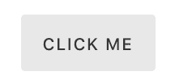
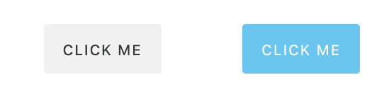
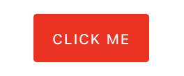
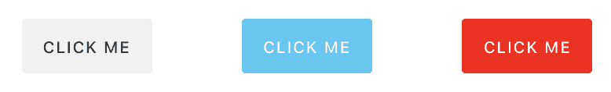
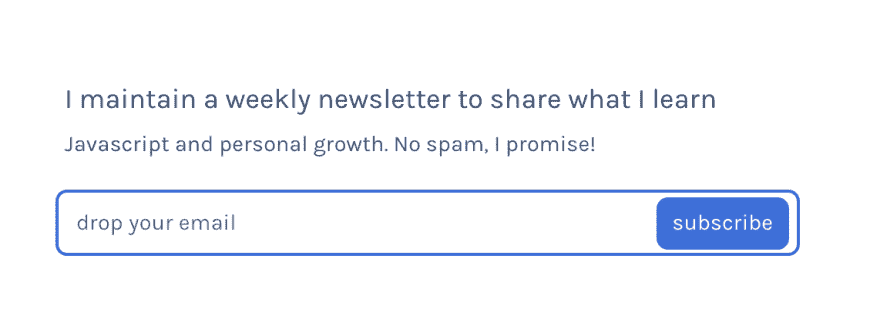

# 不要创造冲突的道具

> 原文：<https://dev.to/siddharthkp/dont-create-conflicting-props-518c>

> 这是关于编写组件 API 以获得良好开发体验的系列文章的一部分。
> 
> 这个帖子最初是几周前发布在[我的简讯](https://sid.studio/newsletter)上的，只是说。

这是比较简单的一个:

我们这里有一个按钮:

[](https://res.cloudinary.com/practicaldev/image/fetch/s--JWKKEExi--/c_limit%2Cf_auto%2Cfl_progressive%2Cq_auto%2Cw_880/https://sid.studio/blog/21/button-1.png)T3】

```
<Button>Click me</Button> 
```

您可能还需要一个主按钮作为页面上的主要操作。我过去喜欢像你说的那样塑造 API“给我一个主按钮”

[](https://res.cloudinary.com/practicaldev/image/fetch/s--zl74KgMJ--/c_limit%2Cf_auto%2Cfl_progressive%2Cq_auto%2Cw_880/https://sid.studio/blog/21/button-2.png)T3】

```
<Button>Click me</Button>
<Button primary>Click me</Button> 
```

太漂亮了。

现在，随着按钮的出现，你可能需要更多的按钮。下面是道具桌的最终外观:

| 名字 | 描述 | 类型 | 系统默认值 |
| --- | --- | --- | --- |
| `primary` | 用于表示主要动作 | `boolean` | 错误的 |
| `secondary` | 用于不太重要的操作 | `boolean` | 错误的 |
| `destructive` | 表明用户应该谨慎，例如:删除 | `boolean` | 错误的 |
| `link` | 用于设计类似超链接的按钮样式 | `boolean` | 错误的 |

有多个道具可以用来改变按钮的外观。如果有人一起使用它们，预期的结果是什么？

[](https://res.cloudinary.com/practicaldev/image/fetch/s--EF1iywbV--/c_limit%2Cf_auto%2Cfl_progressive%2Cq_auto%2Cw_880/https://sid.studio/blog/21/button-3.png)T3】

```
<Button primary destructive>
  Click me
</Button> 
```

他们中的一个会赢吗，哪一个？是否取决于订单？

我总是会问:为什么有人会这么写？这是一个真实的用例吗——“给我一个主要的破坏性按钮”？

大多数时候，这是错误的。但是，如果开发人员不得不问类似上面的问题，这可能不是一个好的 API。

作为 API 的决策者，您的工作是:

1.  尽量减少错误
2.  尽量减少围绕 api 的混淆

所以给你一个建议:*不要创造冲突的道具*

我们可以通过使用一个允许选项列表的 prop 来非常容易地修复上面的代码:`appearance`

[](https://res.cloudinary.com/practicaldev/image/fetch/s--zy3Ijjaa--/c_limit%2Cf_auto%2Cfl_progressive%2Cq_auto%2Cw_880/https://sid.studio/blog/21/button-4.png)T3】

```
<Button appearance="default">Click me</Button>
<Button appearance="primary">Click me</Button>
<Button appearance="destructive">Click me</Button> 
```

我们可以使用[道具类型](https://reactjs.org/docs/typechecking-with-proptypes.html)添加一个受支持的`appearance`列表。

```
Button.PropTypes = {
  appearance: PropTypes.oneOf(['default', 'primary', 'secondary', 'link', 'destructive'])
} 
```

现在，即使开发人员犯了一个错误，他们也会在他们的开发人员工具上得到一个有用的警告。

[](https://res.cloudinary.com/practicaldev/image/fetch/s--JWKKEExi--/c_limit%2Cf_auto%2Cfl_progressive%2Cq_auto%2Cw_880/https://sid.studio/blog/21/button-1.png)T3】

```
<Button appearance="danger">Click me</Button> 
```

```
Warning: Failed prop type:
Invalid prop `appearance` of value `danger` supplied to `Button`,
expected one of `["default","primary","secondary","link","destructive"]`
in Button 
```

这个技巧很容易实现，但是会使您的 API 更容易使用(和维护)。

希望这对你的旅途有帮助

（同 suddenionosphericdisturbance）电离层的突然骚扰

* * *

[](https://sid.studio/newsletter)