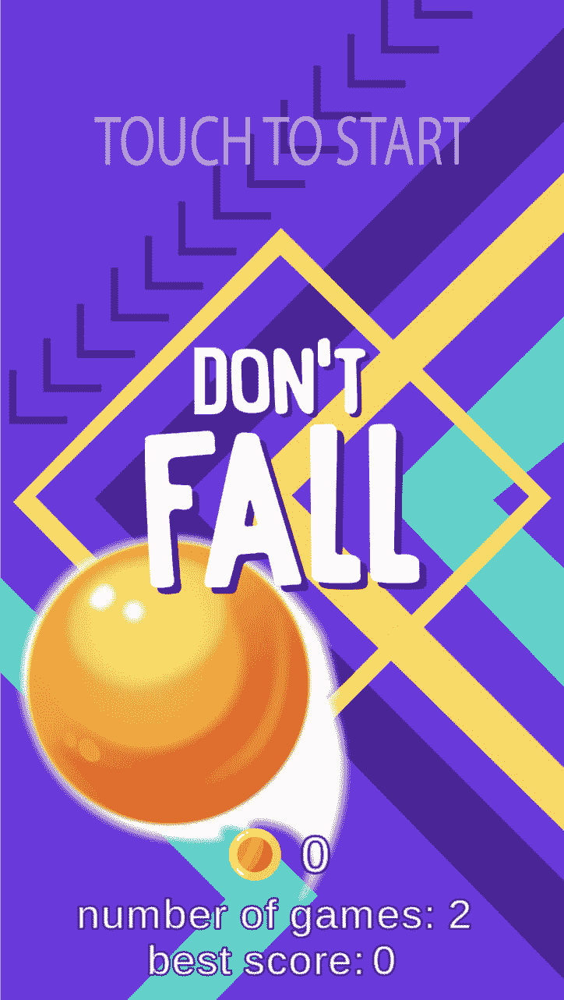
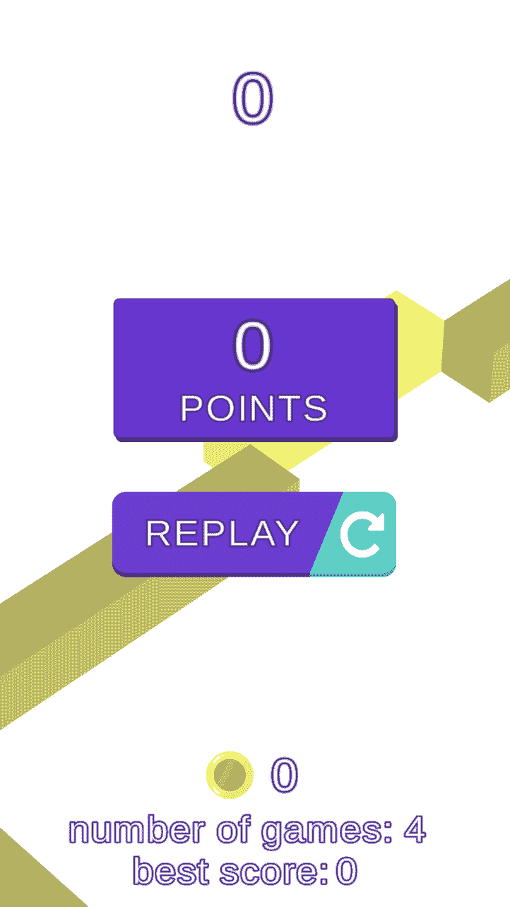

# [GameDev]不要摔倒

> 原文：<https://dev.to/balconygames/dont-fall-5g8h>

大家好！

今天我终于发布了 Google Play 的新游戏。

就发展而言，现在没有什么特别要说的。可能令人兴奋的是，我决定尝试使用 [https://appcenter.ms](https://appcenter.ms) 。微软为移动开发者做了很好的 sdk，有分析仪表板，推送通知的简单设置(基于跟踪事件的基本受众支持)。如果你是 Unity 开发者，唯一不能使用的是构建系统。在构建系统中，你现在可以选择 Android、iOS 项目来构建并分发到商店，但不可能有自定义设置来将构建从 unity 导出到 xcode、gradle 项目。

我相信我会使用 Gitlab 钩子将项目导出到 xcode、gradle 子模块，并将其推送到 Github，因为 appcenter 尚未开始支持 Gitlab 作为同步的存储库。

[https://play.google.com/store/apps/details?id = com . balcony games . don tfall](https://play.google.com/store/apps/details?id=com.balconygames.dontfall)

希望，它看起来像一个消磨时间的应用程序。

感谢您的阅读！

