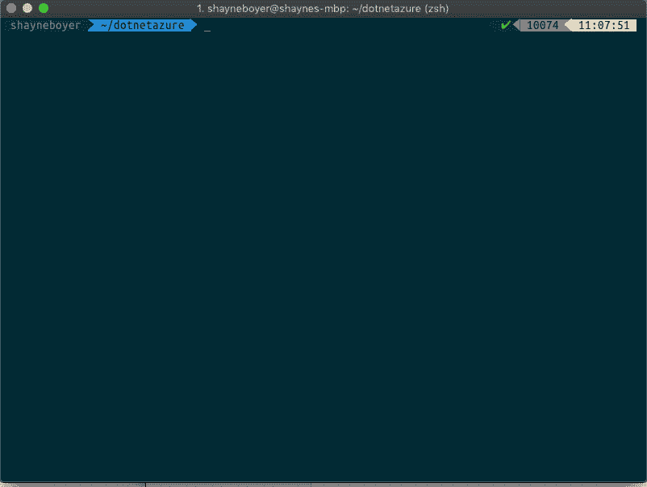

# dotnet-azure:一个. net 核心全局工具，通过一个命令将应用程序部署到 azure

> 原文：<https://dev.to/azure/dotnet-azure-a-net-core-global-tool-to-deploy-an-application-to-azure-in-one-command-noi>

[](https://res.cloudinary.com/practicaldev/image/fetch/s--eeAFx4ze--/c_limit%2Cf_auto%2Cfl_progressive%2Cq_66%2Cw_880/https://thepracticaldev.s3.amazonaws.com/i/rkuayq6d7aks75ifibl5.gif)

推动您的。NET 核心应用程序并不缺乏，这取决于您面前有什么 IDE 或编辑器。

Visual Studio 有一个丰富的 GUI 界面，可以根据你的应用程序的架构进行选择——Web、容器、SQL Server、注册表等。；多年来一直擅长提供完整的体验。

VS Code 提供了一个很棒的 Azure 扩展包，并以自己的方式提供了一种将 web 应用直接发布到 AppService、容器和/或注册表的体验。

如果命令行体验更适合你，那么 [Azure CLI](https://docs.microsoft.com/cli/azure/install-azure-cli?view=azure-cli-latest&WT.mc_id=blog-devto-shboyer) 是可用的，任何资源发布选项都可以通过`az`命令获得。

但是如果你只是想用一个命令把你的应用程序转移到 Azure 上呢？

## 安装

dotnet-azure 是一个. net 核心全球工具，可以通过 NuGet 获得。要安装，请运行以下命令。

```
dotnet tool install dotnet-azure --global 
```

Enter fullscreen mode Exit fullscreen mode

*要求-需要一个 Azure 账户，在[【https://aka.ms/dotnet-azure】](https://aka.ms/dotnet-azure)*免费获得一个

## 用法

每个命令都有一个`-h|--help`选项可用。

`dotnet azure -h|--help`

### 帮助

```
Usage: dotnet-azure [options] [command]

Options:
  -?|-h|--help  Show help information

Commands:
  deploy        Deploy application to Azure App Service. Options are used for [NEW] application deployments only.
  login         Login into Azure 
```

Enter fullscreen mode Exit fullscreen mode

### 登录

首先运行`login`命令来验证你的 Azure 帐户。系统会提示您使用代码和 URL 进行身份验证。

`dotnet azure login`

```
To sign in, use a web browser to open the page https://microsoft.com/devicelogin and enter the code XXXXXXXXX to authenticate. 
```

Enter fullscreen mode Exit fullscreen mode

### 部署

使用默认值、随机生成的应用程序和资源组名称。假设当前目录用于部署应用程序。

#### 例子

```
dotnet azure deploy 
```

Enter fullscreen mode Exit fullscreen mode

传递项目文件夹。

```
dotnet azure deploy \mynewproject 
```

Enter fullscreen mode Exit fullscreen mode

传递所有选项。

```
dotnet azure deploy --location westus --name fancywebapp --group fancywebgroup --plan BasicB1 
```

Enter fullscreen mode Exit fullscreen mode

`location`、`name`、`group`和
的简称

```
dotnet azure deploy -l eastus2 -n fancywebapp -g fancygroup 
```

Enter fullscreen mode Exit fullscreen mode

**部署**命令的完整帮助输出。

```
Deploy an application to Azure App Service. Options are used for [NEW] application deployments only.

Usage: dotnet-azure deploy [arguments] [options]

Arguments:
  AppPath

Options:
  -?|-h|--help                       Show help information
 -n|--name <APP_NAME>  Name of application, must be unique.
 -l|--location <LOCATION>  Region or location of app deployment. (eastus, westus, etc.)
 -g|--group <RESOURCE_GROUP>  Resource group name to create and use for deployment.
 -p|--plan <APP_SERVICE_PLAN_TYPE>  Type of App Service Plan to create for application. Options (BasicB1, SharedD1, FreeF1, PremiumP1 - more info https://aka.ms/azure-appserviceplans ) 
```

Enter fullscreen mode Exit fullscreen mode

## 接下来是什么？

安装它，提供反馈。有想法，贡献。这是好事吗？让我知道 [@spboyer](https://twitter.com/spboyer)

*   github:[https://github.com/spboyer/dotnet-azure](https://github.com/spboyer/dotnet-azure)