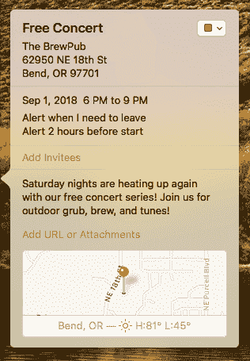

# 可下载的 iCalendar 文件

> 原文：<https://dev.to/eecms/downloadable-icalendar-files-4mg3>

本教程将向您展示如何创建可下载的 iCalendar 文件。有了 ExpressionEngine，这很容易，因为您可以根据需要使用结构良好的内容。您可以使用用于网站的相同条目来创建可共享的`.ics` iCalendar 格式文件。以下是三个简单的步骤。

1.  安装“下载内容”插件。
2.  创建您的 iCalendar 格式模板。
3.  建立到您的 iCalendar 模板的链接。

## 安装免费下载内容插件

为了让你的 ExpressionEngine 生成的`.ics`文件像可下载文件一样被对待，抓取并安装免费下载内容插件。

*   [从 GitHub 下载插件。](https://api.github.com/repos/EllisLab/Download-Content/zipball/3.0.1)
*   解压并上传随附的 download_content 文件夹到`/system/user/addons`。
*   访问控制面板中的插件管理器，点击“下载内容”插件的安装。

## 创建您的下载模板

现在我们需要创建一个端点，我们将链接到这个端点，允许我们的访问者下载我们的`.ics`文件。在本例中，我为当地 brewpub 举办的免费音乐会创建了一个 iCalendar 文件。我在我的`concerts`模板组中创建了一个名为`add-to-my-calendar`的模板。

它使用音乐会的进入日期和截止日期、标题和一个名为`meta_description`的自定义字段。旁注:`meta_description`是我添加到每个频道的 SEO 字段标准集的一部分。将它重新用于描述日历事件是有意义的。我还将利用几个 iCalendar 字段在活动开始前两小时设置一个默认警报。

```
{exp:channel:entries channel='concerts' limit='1' show_future_entries='yes' require_entry='yes'}
    {if no_results}
        {redirect='404'}
    {/if}

{exp:download_content filename='{url_title}.ics'}
BEGIN:VCALENDAR
VERSION:2.0
BEGIN:VEVENT
UID:{url_title}-{entry_date format='%Y%m%d'}@{site_name:url_slug}
DTSTART;TZID={entry_date format='%e:%Y%m%dT%H%i%s'}
DTEND;TZID={expiration_date format='%e:%Y%m%dT%H%i%s'}
SUMMARY:{title}
X-APPLE-TRAVEL-ADVISORY-BEHAVIOR:AUTOMATIC
LOCATION:The BrewPub\n62950 NE 18th St\nBend\, OR 97701
BEGIN:VALARM
X-WR-ALARMUID:{url_title}-{entry_date format='%Y%m%d'}@{site_name:url_slug}
TRIGGER:-PT120M
DESCRIPTION:{meta_description}
ACTION:DISPLAY
END:VALARM
END:VEVENT
END:VCALENDAR
{/exp:download_content}

{/exp:channel:entries} 
```

Enter fullscreen mode Exit fullscreen mode

让我们来分解标签:

```
{exp:channel:entries channel='concerts' show_future_entries='yes' limit='1' require_entry='yes'} 
```

Enter fullscreen mode Exit fullscreen mode

*   `show_future_entries=`让我们使用报名日期作为活动的开始时间。因为我们希望人们看到还没有发生的事件，所以我们告诉 Channel Entries 标签显示未来的事件。
*   `limit='1' require_entry='yes'`是单条目模板的常见设计模式。这确保我们只显示一个条目，如果 URL 标题无效，我们不希望它显示任何内容。我们将它与:

```
{if no_results}
    {redirect='404'}
{/if} 
```

Enter fullscreen mode Exit fullscreen mode

如果没有结果—无效的 URL、已经过期的条目、关闭状态等。—我们会有适当的 404 行为。

下一个标签是我们之前安装的下载内容插件。

```
{exp:download_content filename='{url_title}.ics'} 
```

Enter fullscreen mode Exit fullscreen mode

使用条目的 URL 标题作为文件名并不是必需的，但这将有助于访问者在下载后识别文件的用途。它需要一个`.ics`扩展名，这样桌面和移动日历应用程序就知道这个文件是为他们准备的。这个插件确保输出只包含插件标签中的内容，并被视为下载，而不是显示在屏幕上。

**注意:** iCalendar 文件对空格很挑剔。这就是为什么代码没有像我们通常鼓励的那样缩进。

其余内容由标准 iCalendar 文件格式属性构成。你可以在这里阅读更多关于文件格式及其属性的信息: [iCalendar 文件格式](https://en.wikipedia.org/wiki/ICalendar)。以下是一些有助于剖析我们的模板决策的注释:

*   `UID:`提供 UID 允许日历应用程序在现有事件更新时对其进行更改。否则添加新版本将创建新事件。URL 标题、日期和网站名称应该给我们一个唯一的 ID。`:url_slug`变量修饰符用斜线等替换空格，所以我们可以在这里使用站点的名称。
*   `DTSTART/DTEND:`这里使用的格式参数(`%e:%Y%m%dT%H%i%s`)将输出:`America/Los_Angeles:20180827T105300`
*   我们使用`entry_date`作为开始日期，使用 expiration_date 作为结束日期。
*   `SUMMARY`使用条目的标题作为事件的名称
*   一些日历应用程序可能不使用该描述，但我们为那些使用该描述的应用程序添加了该描述。-同样，我们添加`DTSTAMP`是因为 Outlook 需要它。
*   `TRIGGER:-PT120M`在活动开始前 120 分钟(2 小时)设置闹钟
*   `X-APPLE-TRAVEL-ADVISORY-BEHAVIOR:AUTOMATIC`当用户需要离开当前位置以准时参加活动时，为 Apple 客户端设置闹铃。

## 创建下载链接

现在我们需要做的就是链接到我们的`.ics`文件，我们就可以开始了！从我的演唱会列表页面，我会添加:

```
<a href="{url_title_path='concerts/add-to-my-calendar'}">Add this concert to my calendar!</a> 
```

Enter fullscreen mode Exit fullscreen mode

现在，当我点击链接时，它会下载一个格式正确的`.ics`文件，我可以将它添加到我的日历中！

[](https://res.cloudinary.com/practicaldev/image/fetch/s--Wp1aD704--/c_limit%2Cf_auto%2Cfl_progressive%2Cq_auto%2Cw_880/https://u.expressionengine.com/asset/article-images/sample-calendar-event.png)

有了这些知识，你就可以创建事件、待办事项、日记条目以及任何你能想到的其他类型的 iCalendar 文件。使用这些相同的原则，以其他文件格式输出你的内容；天空是无限的！有了 ExpressionEngine，你永远不必努力让你的内容为你工作。