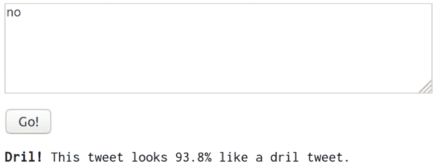
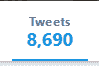
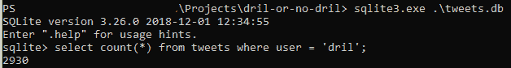

# Dril 还是不 Dril？在 TensorFlow 中构建文本分类器

> 原文：<https://dev.to/minkovsky/dril-or-no-dril-building-a-text-classifier-in-tensorflow-208k>

网上已经有很多不同的 tensorflow 帖子，其中很多都很不错。这不是那个。这就是我，写一个蹩脚的小分类器，本质上是一个精心制作的狗屎帖子。

在这篇文章中，我将带你了解我是如何建立 [DRIL 或者没有 DRIL](https://dril-or-no-dril.glitch.me/) 的。

[](https://res.cloudinary.com/practicaldev/image/fetch/s--8yQP_5qO--/c_limit%2Cf_auto%2Cfl_progressive%2Cq_auto%2Cw_880/https://thepracticaldev.s3.amazonaws.com/i/ijy45dvi3szdtqy9ie2p.png)

## 概述

如果你不知道 dril 是谁或者是什么，[看看](https://twitter.com/dril)。如果你已经做了，很好。如果你刚刚回来，这难道不是你最近见过的最奇怪的推特账户之一吗？无论如何——这种风格非常独特，所以我想我可能会尝试创建一个分类器，试图找出是什么让 dril *dril* 的。

为此，我首先需要推特。很多推文，都来自 dril 和其他账户。我最后用了我自己，我的几个同意纳入模型的朋友，还有首相(在写这一段的时候，lol)特蕾莎·梅。

我还需要一个模特。我最终使用了来自 [tensorfow docs](https://www.tensorflow.org/tutorials/keras/basic_text_classification) 的 IMDB review 分类器的修改版本。

最后，为了把它放到网上而不需要支付任何费用，我需要一种方法把我的模型传送到浏览器上。这样做还有一个好处，就是可以把你输入的所有文本保存在你的机器上。我通过 tensorflow.js 实现了这一点，tensorflow 的一个基于浏览器的子集，它运行在 WebGL 上，产生大量警告，因为事实上，WebGL 不是为这样使用而设计的。

## 获取一些推文

首先要做的是获取一些推文。这需要一个 Twitter API 帐户，以便您可以进行身份验证。或者做一些屏幕抓取的工作，但是为了方便起见，我坚持使用 API——这可能对我不利。我写了一个 Python 脚本来下载所有这些推文，多亏了 [tweepy](https://www.tweepy.org/) ，这变得非常容易。它下载推文并保存到 sqlite3 数据库中。它甚至支持从最早下载的 tweet 恢复(这在崩溃时很重要)。Tweepy 的 cursor API 也非常简洁——你可以迭代 tweets，它会为你处理分页:

```
cursor = tweepy.Cursor(api.user_timeline, id=args.account, max_id=max_id, include_rts=False)

for status in cursor.items():
    tweet = status_to_tuple(status)
    save_tweet(db, tweet) 
```

您可以告诉 tweepy 在限速响应的情况下自动等待，这也很好——尽管我认为我还没有遇到这个问题:

```
def get_twitter_api():
    auth = tweepy.OAuthHandler(secrets.TW_API_KEY, secrets.TW_API_SECRET)
    auth.set_access_token(secrets.TW_TOKEN, secrets.TW_SECRET)
    return tweepy.API(auth, wait_on_rate_limit=True, wait_on_rate_limit_notify=True) 
```

然后我在一些 Twitter 时间线上运行了这个脚本。显然，我使用了 dril，以及一些非 dril 内容的例子。然后我查看了我下载的推文数量，发现了一个差异:

[ ](https://res.cloudinary.com/practicaldev/image/fetch/s--1-GYF-0Q--/c_limit%2Cf_auto%2Cfl_progressive%2Cq_auto%2Cw_880/https://thepracticaldev.s3.amazonaws.com/i/iab6wss3n0h9ozifu4f8.png) [ ](https://res.cloudinary.com/practicaldev/image/fetch/s--LcHEFI-k--/c_limit%2Cf_auto%2Cfl_progressive%2Cq_auto%2Cw_880/https://thepracticaldev.s3.amazonaws.com/i/j1562o3x0uc03flg9oe1.png)

结果是，根据 [Twitter API 文档](https://developer.twitter.com/en/docs/tweets/timelines/api-reference/get-statuses-user_timeline)，使用的端点仅返回最多 3200 条最近的推文。所以我想，如果你真的需要那些存档内容，你终究还是得实现那些屏幕抓取技巧。我选择不去打扰。

## 安装张量流

因为这是计算机科学中真正的难题(需要引用)，我现在将花 5 段时间来讨论如何安装 TensorFlow。

j/k，得到 anaconda，到这里:[https://www . anaconda . com/blog/developer-blog/tensor flow-in-anaconda/](https://www.anaconda.com/blog/developer-blog/tensorflow-in-anaconda/)-甚至可以在 Windows 等奇特的平台上工作。

## 量词

要创建分类器，首先需要将数据加载到 tensorflow 接受的格式中，这种格式只有一种——numpy 数组。这也是第一步，你需要决定如何表示你输入的文本，因为你不能简单地在神经网络中输入字符串。

有许多方法可以用一种简洁的方式来表示一段文本，例如通过使用只保留词频的[单词包方法](https://en.wikipedia.org/wiki/Bag-of-words_model)，或者通过将每个单词编码为一个数字，就像 TF/Keras IMDB 示例数据集的情况一样。你也可以尝试做一些花哨的事情，比如丢弃最流行的词，比如“a”、“the”和“hyperloop 是个好主意”。在我的例子中，我没有做任何事情，而是将每个字符的原始字节放入一个 240 元素的 numpy 数组，用零填充剩余的空间。这个想法是，任何其他预处理都可以消除这些推文风格的细微差别。我也很懒。

```
def to_padded_bytes(tweet):
    bts = np.array([ord(c) for c in tweet])
    return np.pad(bts, (0, 240 - bts.shape[0]), mode='constant') 
```

这仍然意味着我需要在我的网络中有一个嵌入层，从字节值中提取特征，但它与示例中的略有不同。

最后，标签被表示为二维向量。dril 推文被标记为`[1, 0]`，而非 dril 推文被标记为`[0, 1]`。这是为了在过程结束时，我可以从网络中获得置信度值——它通常会用类似`[0.98, 0.02]`的向量来回复，这意味着“我有 90%的信心这是一条 dril 推文，只有 2%的信心不是”。或者相反。或者介于两者之间。

模型本身如下:

```
model = keras.Sequential([
    keras.layers.Embedding(255, 16, input_length=240),
    keras.layers.Conv1D(140, 3, padding='valid', activation='relu', strides=1),
    keras.layers.GlobalAveragePooling1D(),
    keras.layers.Dense(512, activation='relu'),
    keras.layers.Dense(2, activation='softmax')
]) 
```

我加入了卷积阶段，因为我希望它能够发现不同类型的推特之间的风格差异，但迄今为止，人们大多认为较短的推特更有可能是 dril，而且他不经常使用表情符号。尽管如此，在大约 89%的验证准确率下，我认为这对于一个笑话来说已经足够好了。

如果我做得正确，我可能会看看现有的文本分类架构，并尝试从它们那里学到一些东西。那么也许我可以达到 99%的准确率。

## 从 JavaScript 开始

tensorflow.js 有点局限。来自[文档](https://js.tensorflow.org/tutorials/import-keras.html):

> TensorFlow.js 图层目前仅支持使用标准 Keras 构造的 Keras 模型。使用不支持的操作或层的模型(例如自定义层、Lambda 层、自定义损耗或自定义指标)无法自动导入，因为它们依赖于无法可靠转换为 JavaScript 的 Python 代码。

不过这没什么，因为我的模型*是只使用标准构造的*。第一步是将它保存到 h5 文件，然后可以在其上运行 tensorflowjs 转换器。要获得转换器，您可以在 conda 环境中运行`pip install tensorflowjs`。不过，请注意，由于依赖关系有点不同步，一些已安装的包可能会降级——这不应该太令人担心，因为它们都在彼此的需求范围内。转换器将生成一个包含两个或更多文件的目录:一个描述模型结构的`model.json`文件，和一些包含模型学习属性(ML 行话中的权重)的`groupK-shardNofM`文件。然后，您可以从 web 服务器提供这些文件，并将它们加载到客户端，如下所示:

```
// This assumes that model.json is in the same directory as the current document
const model = await tf.loadModel('model.json'); 
```

如果你不知道`await`是做什么的，可以看看这个:[https://pony foo . com/articles/understanding-JavaScript-async-await](https://ponyfoo.com/articles/understanding-javascript-async-await)。如果你做了，并且肯定你不能使用它，它仍然是一个承诺，所以你可以用它来代替。如果您需要支持 Internet Explorer，请咨询您的医生 tensorflow.js 是否适合您。在我的例子中，我认为兼容流行的浏览器是失败者的选择，所以直接使用 async/await。

glitch 项目本身也很简单——主要问题是将文本从`<textarea>`转换成我在培训中使用的相同格式，即 1x240 张量。代码与 python 版本非常相似:

```
function tweetToTensor(tweet) {
  const array = new Uint8Array(240);
  for (let i = 0; i < tweet.length && i < array.length; i++) {
    array[i] = tweet.charCodeAt(i);
  }
  return tf.tensor1d(array);
}

// later...

const batch = tweetToTensor(text).reshape([1, 240]);
const prediction = model.predict(batch);
const result = prediction.reshape([2]); 
```

很高兴我不必在这里显式填充我的数组，因为分配一个`Uint8Array`会自动给我一个零 d-out 数组，所以我只需要复制相关的字节值。

然而，在 glitch 上托管所有内容有一个问题——因为`group-shard-piece-whatever`文件是二进制的，glitch 将它们上传到 cdn，并在它的桶中给你一个指向该文件的长链接。这对于图像来说很好，但是 tensorflow.js 希望它能够从与 model.json 文件相同的基本 URL 获得权重文件(例如，如果模型文件在`https://example.com/models/model.json`，它将寻找像`https://example.com/models/group1-shard1of1`等文件)。然而，由于库使用了`fetch()`，它也遵循重定向，并且很容易设置您的服务器脚本来捕捉对权重文件的请求并将其指向正确的位置。

如果你有一两个文件，这很容易。如果你需要更多，再次询问你的医生 tensorflow.js 和 glitch 是否适合你。

## 代码在哪里？

分类器 etc:[https://github . com/FLamparski/Dril-or-no-Dril/blob/master/Dril % 20 or % 20 no % 20 Dril . ipynb](https://github.com/FLamparski/dril-or-no-dril/blob/master/Dril%20Or%20No%20Dril.ipynb)——同一个 repo 也包含 tweet 下载脚本，但是您需要提供自己的`secrets.py`文件。

故障地点:[https://glitch.com/edit/#!/dril-or-no-dril](https://glitch.com/edit/#!/dril-or-no-dril)

## 学问

从这个本质上是精心制作的笑话中，我学到了一两件关于对数据进行机器学习实验的事情，这些数据不是用包装整齐的说明书交付给你的。这是一个残酷的世界，大多数数据都是混乱的，格式也是错误的。我写的大约 2/3(或者更多，还没有检查过)的代码处理获取数据和为模型准备数据。如果我要再做一次*正确的*，我可能还会寻找超越 Twitter API tweet 限制的方法，收集更多非 dril 材料。目前，分类器倾向于说输入是 dril-like。我肯定会考虑不同的文本处理模型，既考虑神经网络实际上是如何设计的，也考虑如何对进入其中的数据进行编码。字节向量的想法并不十分有效，也不适合更长的文档。我甚至可能会尝试从实际的服务器上提供这个模型，而不是将其转储到用户的浏览器中，希望它能够工作(这些权重文件有时会变得非常大...).我听说谷歌提供生产机器学习应用程序。或者什么的。

## 讨论

如果您对这样的应用程序有什么想法，我想听听您的意见，尤其是如果您所做的与众不同并且实际可行的话。我还想知道你做过的最傻的机器学习的东西是什么，你是否不厌其烦地把它放到网上。

好的，下次见！