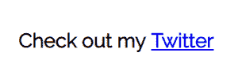
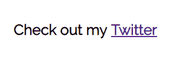
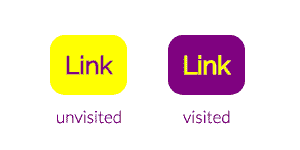
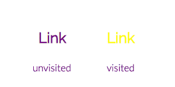
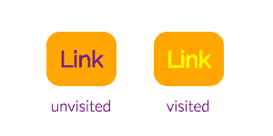
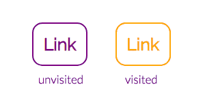

# 扔掉锚！关于超链接，它们的样式和状态，以及为什么 LVHA 规则很重要的小故事

> 原文：<https://dev.to/barbaraszott/drop-the-anchooor-short-story-about-hyperlinks-their-styling-and-states-and-why-lvha-rule-is-important-2d9p>

# 我相信你知道什么是主播！

它们是链接，或者更确切地说是[超链接](https://en.wikipedia.org/wiki/Hyperlink)。它们是互联网的基础建设材料——它们打造互联网信息高速公路。我们可以穿越它们，瞬间传送到网络的不同部分。我们都知道它们是什么。对吗？没错。但是要 100%清楚，HTML 中的`<link>`和`<a>`标签是不同的。

## `<link>`元素

我不打算写太多。根据 W3C:

> 标签定义了一个文档和一个外部资源之间的链接，用来链接到外部样式表。

另外:

> 元素是空元素，它只包含属性。这个元素只出现在 head 部分，但是它可以出现任意次。

在 HTML 中,`<link>`标签没有结束标签。所有浏览器的默认样式都是`display: none`。最常见的是，你会在 HTML 文档的头部分看到这样的内容:

```
<head>
    <link rel="stylesheet" href="styles.css">
</head> 
```

如果你想了解更多关于`<link>`的信息，我鼓励你访问 [MDN 文档](https://developer.mozilla.org/en-US/docs/Web/HTML/Element/link)。但是现在，让我们回到正题。

## `<a>`元素

这是这个故事的主角。著名的锚元素，创建一个到其他网站、文件、电子邮件地址或同一页面中其他位置的超链接。与`<link>`相反，它需要结束标签。它可以有一大堆属性——最广为人知的是`href`。没有它，我们的锚将不会带我们去任何地方。

```
<p>Check out my <a href="http://twitter.com/BarbaraSzott">Twitter</a></p> 
```

另一个非常常用的属性是`target`——默认值是`_self`，意思是“在这里加载内容，在与当前相同的浏览上下文中”；其他常用的值是`_blank`——“在新的浏览上下文中加载内容”，通常是指浏览器中的一个新标签页。我要在这里停一下，提醒你一下`rel="noopener"`。您应该考虑在使用`target="_blank"`时添加这个属性，尤其是对于不可信的来源。为什么？

主要是出于**安全**的原因——如果使用`rel="noopener"`，我们可以避免利用`window.opener` API。由于这一点，当点击链接后创建新窗口时，运行在新窗口上的潜在恶意代码将不会通过`window.opener`属性访问以前的窗口。

```
<a href="http://someoneswebsite.com" target="_blank" rel="noopener">Some website</a> 
```

乌夫，那部分很难！如果你有兴趣，请点击阅读更多关于`noopener` [的内容。](https://mathiasbynens.github.io/rel-noopener/)

## 造型链接——让我们潜进去吧！

看看默认样式的简单链接是什么样子的:

[](https://res.cloudinary.com/practicaldev/image/fetch/s--xfsoAA59--/c_limit%2Cf_auto%2Cfl_progressive%2Cq_auto%2Cw_880/https://thepracticaldev.s3.amazonaws.com/i/e9m3z0o1xml8e48ytsa3.png)

嗯，它是蓝色的，有下划线。紫色，如果访问:

[](https://res.cloudinary.com/practicaldev/image/fetch/s--3MjlTqeu--/c_limit%2Cf_auto%2Cfl_progressive%2Cq_auto%2Cw_880/https://thepracticaldev.s3.amazonaws.com/i/exslw1wd7n43gwht2ryj.png)

尽管如此，这通常不是我们想要的外观。幸运的是——设计链接和设计其他元素一样简单。我们可以改变颜色，添加背景色，边框，改变字体等。看看在为我们的`<a>`元素:
改变一些简单的 CSS 之后会发生什么

```
a {
  padding: 15px;
  background-color: #00acee;
  border: solid 1px #008abe;
  border-radius: 15px;
  color: white;
  text-decoration: none; /* remove underline */
} 
```

...结果是:

[](https://res.cloudinary.com/practicaldev/image/fetch/s--Vw9Pf4Ag--/c_limit%2Cf_auto%2Cfl_progressive%2Cq_auto%2Cw_880/https://thepracticaldev.s3.amazonaws.com/i/zpd4mbnpdgoaivcngk1t.png)

不要太花哨。我们可以随心所欲地摆弄它。乐趣始于**链接状态**的介绍，基本上有**四个**。

## 链接状态

### :链接

`:link`状态是 [CSS 伪类](https://developer.mozilla.org/en-US/docs/Web/CSS/Pseudo-classes)基本意思是“未访问”。它匹配每一个具有`href`属性的未访问元素(所以不仅仅是`<a>`)。

> 但是为什么要用这个伪类，为什么我不能只样式化我的锚元素呢？两种情况都适用，那么这个状态的目的是什么..？

可能会有这样的情况，当你只是想要一些锚元素的通用样式和一些未访问链接的特殊样式，比如说，不同的类(所以样式不同)。除此之外- `:link`属性只匹配具有`href`属性的元素。根据 [W3C 规范](https://www.w3.org/TR/2016/REC-html51-20161101/textlevel-semantics.html#the-a-element):

> 如果`a`元素没有`href`属性，那么这个元素就代表一个占位符，如果它是相关的，那么这个占位符就代表一个链接可能被放置的位置，只包含元素的内容。

所以使用不带`href`的锚似乎是有效的。况且在很远很远的星系里，在 HTML5 推出之前，主播可以有`name`属性，没有`href`属性进行现场导航。所以我们可以这样做:

```
<a href="#aboutUs">Click here to know us better!</a>
<!-- some code... -->
<a name="aboutUs"></a>
<div>Something about us</div> 
```

**现在这种技术被认为是过时的，不应该被使用** -我们可以简单地使用 IDs 来做同样的事情:

```
<a href="#aboutUs">Click here to know us better!</a>
<!-- some code... -->
<section id="aboutUs">Something about us</section> 
```

### :已访问

这种状态是不言自明的——它选择当前浏览器已经访问过的链接。我们可以为`:visited`添加一些样式，帮助用户区分他们点击过或没点击过的链接。听起来很简单——但是有一个问题。又是关于**安全**——仔细听 [MDN](https://developer.mozilla.org/en-US/docs/Web/CSS/Privacy_and_the_:visited_selector) 是怎么说的:

> 大约在 2010 年之前，CSS 选择器允许网站揭露用户的浏览历史，并找出用户访问过哪些网站。这是通过`window.getComputedStyle`和其他技术完成的。这个过程执行起来很快，不仅可以确定用户在网上的位置，还可以用来猜测用户身份的许多信息。

我起鸡皮疙瘩了。看在上帝的份上，这只是一个我们想要设计的链接状态，突然就出现了这个问题。幸运的是，几年过去了，现在浏览器很好地照顾了我们。如今，`window.getComputedStyle`方法(以及类似的函数，如`document.querySelector`)将总是返回对未访问的链接或页面足够的值。结束主题，你不会得到任何样式与这些方法的`:visited`链接。

那么造型呢？我们能做我们想做的吗？不完全是这样——我们这里的选项有限，它们包括:`color`、`background-color`、`border-color`、`outline-color`以及`fill`和`stroke`属性的颜色部分。更重要的是，如果链接已经为其未访问版本设置了这些属性，那么您只能**更改这些样式。让我们看看它是如何工作的...**

为了简单起见，我将把一般的`a`样式与其状态的样式:
分开

```
a {
  padding: 15px;
  border-radius: 15px;
  text-decoration: none;
} 
```

...现在状态:

```
a:link {
  color: purple;
  background-color: yellow;
}

a:visited {
  color: yellow;
  background-color: purple;
} 
```

一切都很好-未访问的链接是黄色背景的紫色，已访问的是紫色背景的黄色，就像我们希望的那样。
[](https://res.cloudinary.com/practicaldev/image/fetch/s--fWoR_xGj--/c_limit%2Cf_auto%2Cfl_progressive%2Cq_auto%2Cw_880/https://thepracticaldev.s3.amazonaws.com/i/mw303doqvp9pl3um7k62.png) 
但是如果我们决定只有访问过的链接才应该有背景色呢..？

```
a:link {
  color: purple;
}

a:visited {
  color: yellow;
  background-color: purple;
} 
```

你猜对了-没用的。
[](https://res.cloudinary.com/practicaldev/image/fetch/s--rJDhdAX9--/c_limit%2Cf_auto%2Cfl_progressive%2Cq_auto%2Cw_880/https://thepracticaldev.s3.amazonaws.com/i/6l53yda34w6d2poffxn7.png) 
颜色会有所不同，但背景色不适用，因为该链接的未访问版本不具备该属性。如果你要做相反的事情，从`:link`风格将适用于未访问的链接。

```
a:link {
  color: purple;
  background-color: orange;
}

a:visited {
  color: yellow;
} 
```

[](https://res.cloudinary.com/practicaldev/image/fetch/s--9IA1PESW--/c_limit%2Cf_auto%2Cfl_progressive%2Cq_auto%2Cw_880/https://thepracticaldev.s3.amazonaws.com/i/vgf6ai1jodxwuvi2p1hl.png)

我在这里还发现了有趣的事情——如果你不指定边框颜色，它将从`color`属性中借用。*(这同样适用于其他元素)*

```
a {
  /* some styles... */
  border: 2px solid;
}

a:link {
  color: purple;
}

a:visited {
  color: orange;
} 
```

[](https://res.cloudinary.com/practicaldev/image/fetch/s--xpX634c0--/c_limit%2Cf_auto%2Cfl_progressive%2Cq_auto%2Cw_880/https://thepracticaldev.s3.amazonaws.com/i/aeogpu2zys63o3yqkdh8.png)

无论你如何设计你的未访问和已访问的链接，都要记住它们应该很容易区分开来。

### :悬停

`:hover`用于在鼠标经过时选择元素。它不仅可以用在链接上，还可以用在所有元素上。重要的是要记住，它可能无法在触摸屏上正常工作。根据 [MDN](https://developer.mozilla.org/en-US/docs/Web/CSS/:hover) :

> 这个伪类在触摸屏上有问题。根据浏览器的不同,: hover 伪类可能永远不会匹配，只在触摸一个元素后匹配一会儿，或者甚至在用户停止触摸后继续匹配，直到用户触摸另一个元素。Web 开发人员应该确保内容可以在悬停功能有限或不存在悬停功能的设备上访问。

### :活动

这个伪类表示被激活的元素(通常通过点击)。Link(或者其他任何东西，因为任何元素都可以有`:active`伪类)只在几分之一秒内是活动的，但是如果我们改变这个状态的外观，我们将给出元素确实被点击的视觉反馈。

## LVHA 法则

现在是一个很好的时机来提醒你关于我们心爱的 CSS 的非常重要的方面- **特异性**。(*如果你不熟悉这个话题——在 [CSS 窍门](https://css-tricks.com/specifics-on-css-specificity/)* 上有一篇很好的文章)每个选择器都有一个。如果两个选择器应用于同一个元素，具有较高特异性的那个胜出，如果您添加两个声明，以相同的权重指向样式表中的同一个元素，CSS 将选择后者。这就是级联的工作原理。

```
a {...}         /* specificity = 1 */
a:link {...}    /* specificity = 1,1 */
a:visited {...} /* specificity = 1,1 */
a:hover {...}   /* specificity = 1,1 */
a:active {...}  /* specificity = 1,1 */ 
```

这就是为什么顺序很重要，尤其是对于`:hover`和`:active`伪类。你在这里可以看到的另一件事——带有伪类的选择器具有更高的特异性，因此来自`a:link`的样式可能会覆盖来自`a`的样式。

如果你愿意，你可以为一个被访问的链接设置不同的风格`:hover`——只要记住更高的特异性:

```
a:visited:hover {...} /* specificity = 1,2 */ 
```

1.`:link`将被任何后续的链接相关伪类
2 覆盖。`:hover` **必须**跟在`:link`和`:visited`
3 之后。`:active` **必须**作为最后一个去(否则它将总是被覆盖)

LVHA 代表:

*   L - `:link`
*   五- `:visited`
*   H - `:hover`
*   一- `:active`

这也很容易记作一条**L**O**V**E-**HA**TE 法则。使用这种顺序被认为是**最佳实践**。

## 总结

*   `target="_blank"`应始终与`rel="noopener'`搭配
*   已访问和未访问的链接应该很容易区分——请记住，不仅要考虑美观，还要考虑可读性，尤其是对于视力受损的用户
*   `:visited`伪类具有有限的样式(`color`、`background-color`、`border-color`、`outline-color`以及`fill`和`stroke`属性的颜色部分)
*   只有当链接的未访问版本也有样式时，`:visited`的样式才适用
*   这个伪类在触摸屏上可能会有问题
*   样式化的`:active`状态给用户视觉上的反馈，告诉他们某些东西确实被点击了
*   爱恨规则

我希望你读这篇文章的时候觉得有趣——我确实写了它。这是我的第一篇技术文章，希望能收到你的反馈！干杯:)