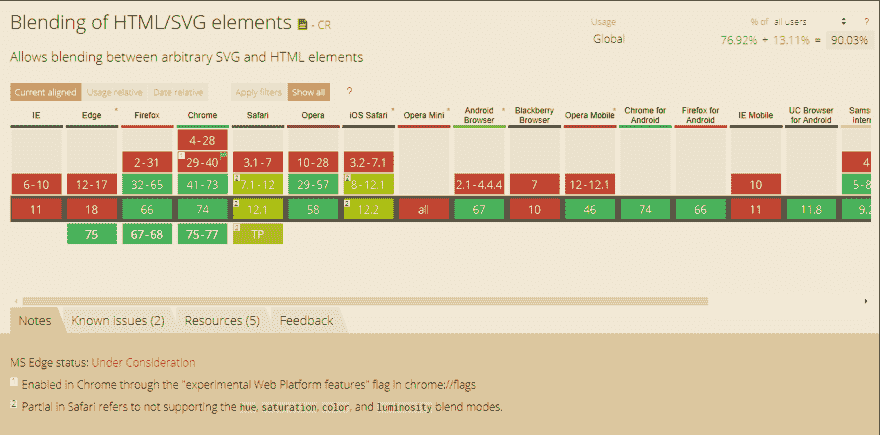

# css 混合模式下的动态文本效果

> 原文：<https://dev.to/kaos/dynamic-text-effects-with-css-mix-blend-mode-242a>

我最近发现了 css 属性`mix-blend-mode`，它描述了文本如何融合到背景中，并开始对它进行实验。
无需手动调整文本颜色，即可实现动态文本颜色。使用这种技术，即使一个字符也可以有多种颜色。这能让我们找到一些..姑且称之为*有趣的*..结果。

这支笔使用`mix-blend-mode: difference`来反转背景上的颜色。

[https://codepen.io/kaos1910/embed/mYPWBQ?height=600&default-tab=result&embed-version=2](https://codepen.io/kaos1910/embed/mYPWBQ?height=600&default-tab=result&embed-version=2)

背景也可以转换和动画。

[https://codepen.io/kaos1910/embed/yWOaQV?height=600&default-tab=result&embed-version=2](https://codepen.io/kaos1910/embed/yWOaQV?height=600&default-tab=result&embed-version=2)

当使用相同的文字和背景颜色时，我们可以发挥创意，创造出启示效果。在这个特殊的笔中，我们设置了`mix-blend-mode: darken`来保存深色文本。
[https://codepen.io/kaos1910/embed/gJrRvo?height=600&default-tab=result&embed-version=2](https://codepen.io/kaos1910/embed/gJrRvo?height=600&default-tab=result&embed-version=2)

下面这支笔用的是稍微高级一点的方法。它使用带有背景图像、固定文本和`mix-blend-mode: color-dodge`的遮罩。

[https://codepen.io/kaos1910/embed/GaZqYQ?height=600&default-tab=result&embed-version=2](https://codepen.io/kaos1910/embed/GaZqYQ?height=600&default-tab=result&embed-version=2)

### 浏览器支持

我对你关于如何进一步使用`mix-blend-mode`的评论和想法很感兴趣。