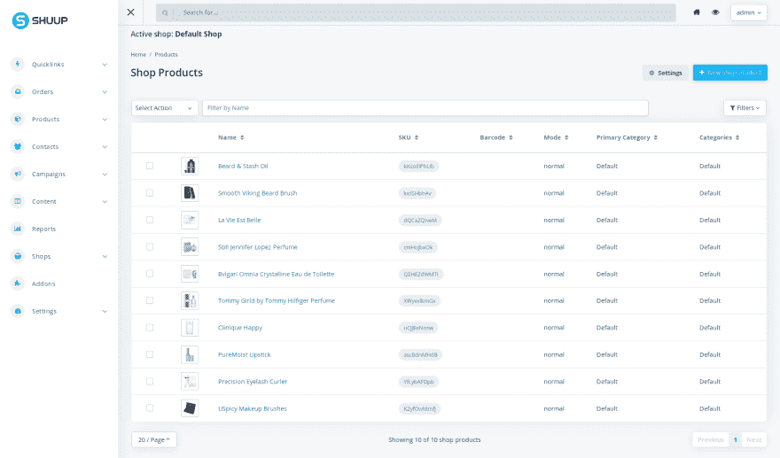
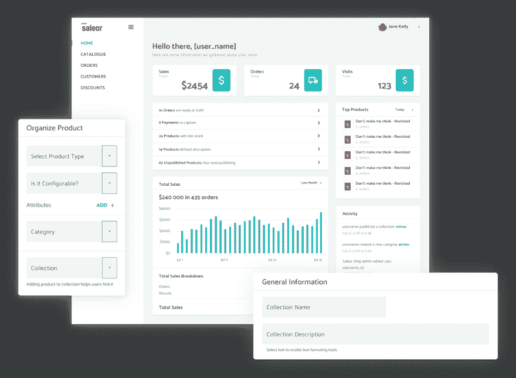
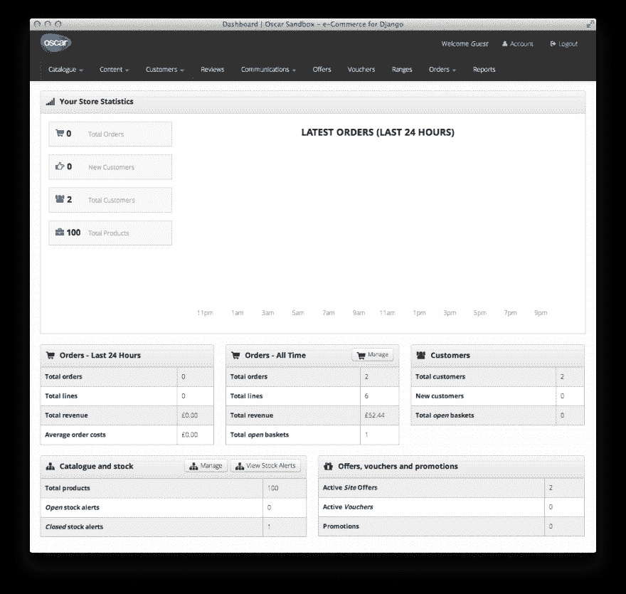

# Django 生态系统中的电子商务平台。

> 原文：<https://dev.to/simo97/e-commerce-solutions-in-the-django-ecosystems-1e26>

另一个棘手问题是，当谈到电子商务时，人们通常会想到 WooCommerce、Prestashop、Magento 等...django 生态系统中也有一些很好的解决方案，像往常一样，这些解决方案非常通用，为开发人员提供了很大的定制可能性。让我看看其中的三个，这是我合作过的一个。

# **舒普**

现成的电子商务解决方案，它是专为在多/单供应商电子商务平台的情况下使用，你可以用 shuup 创建下一个亚马逊或下一个 shopify。它是开源的(当然),有两种主要的使用方式，云版本或者自托管版本。作为你的客人，你将为云版本付费，它允许你做 shuup 允许你做的任何事情，而不用担心服务器的正常运行时间和其他问题，第二个版本很容易在你自己的服务器上安装，就像一个普通的 django 项目，在这种情况下，你负责保持服务器正常运行，包括维护费用等...

就个人而言，我会将它与 magento 这样平台进行比较，看它能做些什么。(从我对这两个平台的了解来看)

## 检查表

*   **项目网站&回购**:【https://shuup.com/】T2T7】https://github.com/shuup/shuup[T5】](https://github.com/shuup/shuup)
*   **Github stars** : 890
*   **多厂商**:是
*   **CMS** :是
*   **默认网站 HTML 模板**:它配有一个现代的 HTML 5 模板，是的，很完整，很好看。足以展示该事物的所有默认特征。
*   可定制性:它附带了一个文档，允许你设计和开发你的电子商务网站。
*   插件:他们(创建者)已经创建了一个易于使用的插件系统(插件)，你可以在 django 项目中定义它们或者在管理界面中上传它们
*   主题:有一种为平台创建主题的方法，它们被创建为 django 应用程序，它使用 Jinja 模板系统，这比默认的 django 的模板系统更先进。
*   **社区**:不适用
*   **云版本**:是
*   **商业支持**:是
*   **API** :是
*   **活动报告**:是
*   **支付和运输解决方案集成能力**:是
*   **仪表盘**:高级

# **塞勒尔**

声称要成为“完美主义者的 GRAPHQL 第一电子商务平台”，这是一个在这个生态系统中非常先进的电子商务平台。It storefront 是用 React.js 作为 PWA 构建的，整个系统在 GraphQL 上工作。

## 检查表

*   **项目网站&休息**:[https://getsaleor . com](https://getsaleor.com)&[https://github . com/mirumee/saleor](https://github.com/mirumee/saleor)
*   **Github stars** : 4050
*   **多厂商**:否
*   **CMS** :是
*   **默认网站 HTML 模板**:默认店面是用 react.js 构建的 PWA
*   **可定制性**:易于定制。
*   **插件**:插件是按照文档中定义好的一些规范构建的
*   **主题**:可以根据文档轻松创建
*   **社区**:不适用
*   **云版本**:否
*   **商业支持**:否
*   **API** :是
*   **活动报告**:否
*   **支付和运输解决方案集成能力**:是
*   **仪表板**:低

# **奥斯卡**

领域驱动的电子商务解决方案。Oscar 已被创建，可根据开发人员的需要进行修改，它允许您轻松地将您的业务逻辑添加到电子商务工作流中。它分为几个应用程序，一个仪表板来处理产品，评论，库存等。

## 检查表:

*   **项目网站&回购**:【http://oscarcommerce.com/】T2T7】https://github.com/django-oscar/django-oscar[T5】](https://github.com/django-oscar/django-oscar)
*   **Github stars** : 3601
*   **多厂商**:否
*   默认网站 HTML 模板:它带有一个简单的引导模板，用来展示默认功能。大部分工作将是覆盖(改变)它的一部分，从改变商店的业务逻辑。
*   可定制性:100 %被定制，代码提供了许多通用代码和许多被设计为继承和重写的类。*抽象产品*为例继承了*的产品*。它甚至提供了一个命令来派生和覆盖它应用程序。
*   从支付网关到 REST api enabler，有一些不同用途的插件。
*   **社区**:https://slack.oscarcommerce.com/
*   **云版本**:否
*   **商业支持**:是
*   **API** :是
*   **活动报告**:是
*   **支付和运输解决方案集成能力**:是
*   **仪表板**:中型

这些并不是这个生态系统中唯一的电子商务解决方案，但这些是最完整的解决方案(据我所见),仍然有很多好的解决方案，这取决于你要建立什么或你的预算，这里是 django 电子商务包网格:[https://djangopackages.org/grids/g/ecommerce/](https://djangopackages.org/grids/g/ecommerce/)

感谢阅读，我是 Django 开发者和写作爱好者(刚开始)，如果你在这篇文章中发现任何错误或任何值得评论的地方，请在评论中留下；玩得开心。