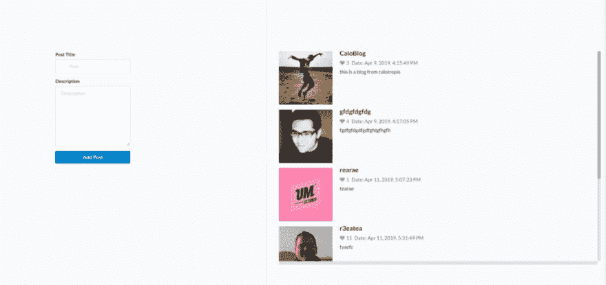
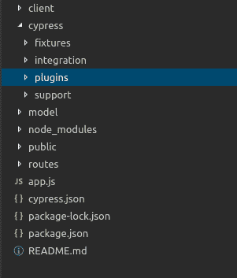
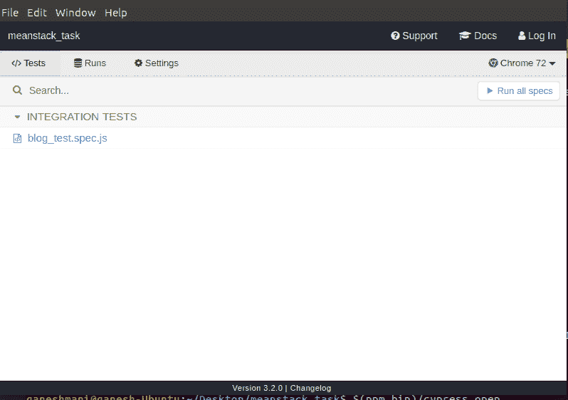
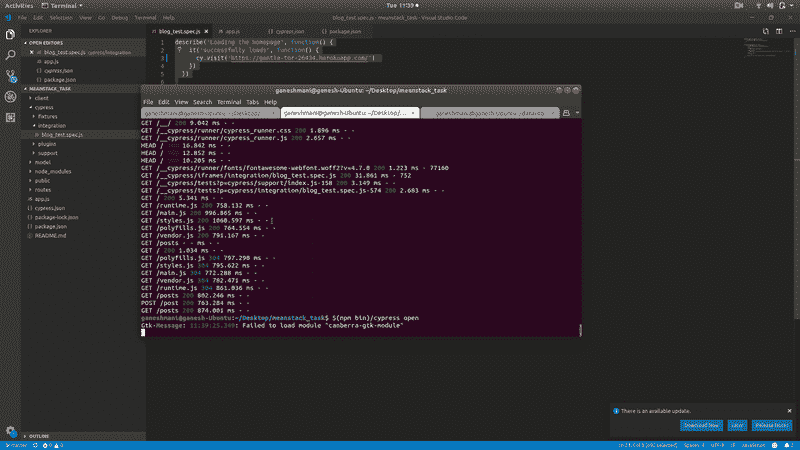

# 使用 cypress.io 在 Node.js 中进行 E2E 测试

> 原文：<https://dev.to/ganeshmani/e2e-testing-in-node-js-using-cypress-io-13l8>

这是我在 dev.to 的第一篇博文，如有错误请指正。为了更好的理解，我会继续重构。支持更多..请阅读这篇博客的原始资料 [E2E 使用 cypress.io 在 Node.js 中测试](https://cloudnweb.dev/2019/04/e2e-testing-in-node-js-using-cypress-io/)

### cypress.io 是什么？

cypress 是现代网络的自动化测试工具，可以用于不同类型的测试，如

*   端到端测试用例
*   集成测试案例
*   单元测试案例

首先，我们将为一个简单的博客应用程序编写一个测试用例:[https://gentle-tor-26434.herokuapp.com/](https://gentle-tor-26434.herokuapp.com/)

来源:https://github.com/ganeshmani/meanstack_task

[](https://res.cloudinary.com/practicaldev/image/fetch/s--e0tGyHWd--/c_limit%2Cf_auto%2Cfl_progressive%2Cq_auto%2Cw_880/https://cloudnweb.dev/wp-content/uploads/2019/04/Screenshot-from-2019-04-16-11-32-41-1024x483.png)

因此，我们需要弄清楚它是如何工作的，以及我们需要测试什么逻辑

对于这个博客应用程序，我们只需测试:

*   当用户输入标题、描述并点击提交按钮时
*   博客应该被添加到博客列表中

首先，我们将在项目中设置柏树

```
npm install cypress --save-dev
```

一旦安装完成，您将看到 cypress 的文件夹结构如下

[](https://res.cloudinary.com/practicaldev/image/fetch/s--SsG3KZCk--/c_limit%2Cf_auto%2Cfl_progressive%2Cq_auto%2Cw_880/https://cloudnweb.dev/wp-content/uploads/2019/04/Screenshot-from-2019-04-16-11-14-45.png)

让我们分析一下 cypress 拥有的每个文件夹的功能

#### 文件夹结构:

*   **fixtures** -它包含了我们想要在测试文件中使用的外部静态数据
*   **集成** -这是我们编写所有测试用例的文件夹
*   **插件**——它包含了我们想和 cypress 一起使用的所有插件。一些用例是[https://docs . cypress . io/guides/tooling/plugins-guide . html #用例](https://docs.cypress.io/guides/tooling/plugins-guide.html#Use-Cases)
*   **支持**——它包含了自定义命令的所有可重用行为。示例:您可以在任何`cypress/support`文件的`beforeEach`中定义您的行为:

```
beforeEach(function () {
  cy.log('I run before every test in every spec file!!!!!!')
})
```

首先，在 **cypress/integration** 文件夹中创建一个文件，并添加以下代码。

```
describe('Loading the homepage', function() {
    it('successfully loads', function() {
      cy.visit('https://gentle-tor-26434.herokuapp.com/') 
    })
  })

describe('adding blog post',function(){
    it('creating a new blog post', function(){
        cy.visit('https://gentle-tor-26434.herokuapp.com/');

        cy.get('input')
            .type('Cypress added blog post')

        cy.get('textarea')
            .type('Hey it is an automated testing blog post.please check it out the cypress.io...it\' so cool');

        cy.get('div.submit')
            .click()

        cy.get('div.item').last().should('contain','Cypress added blog post')    
    })
})
```

之后，我们可以运行 cypress 命令来启动 cypress 界面:

```
$(npm bin)/cypress open
```

还有其他几种方法可以做到这一点[https://docs . Cypress . io/guides/getting-started/installing-Cypress . html # Opening-Cypress](https://docs.cypress.io/guides/getting-started/installing-cypress.html#Opening-Cypress)

它会像这样打开一个 cypress 接口。

[](https://res.cloudinary.com/practicaldev/image/fetch/s--BunPbXc4--/c_limit%2Cf_auto%2Cfl_progressive%2Cq_auto%2Cw_880/https://cloudnweb.dev/wp-content/uploads/2019/04/Screenshot-from-2019-04-16-11-38-21.png)

选择您想要运行的测试用例，或者您可以选择**运行所有规范**

<figure>[](https://res.cloudinary.com/practicaldev/image/fetch/s--k3rC5jK4--/c_limit%2Cf_auto%2Cfl_progressive%2Cq_66%2Cw_880/https://cloudnweb.dev/wp-content/uploads/2019/04/ezgif.com-video-to-gif.gif) 

<figcaption>输出为柏树测试用例</figcaption>

</figure>

总之，cypress 运行测试用例并在浏览器中返回断言。呀呀呀！..我们做到了:-)

了解更多关于赛普拉斯的信息。[https://docs . cypress . io/guides/core-concepts/introduction-to-cypress . html](https://docs.cypress.io/guides/core-concepts/introduction-to-cypress.html)

快乐学习！！！！！:-)