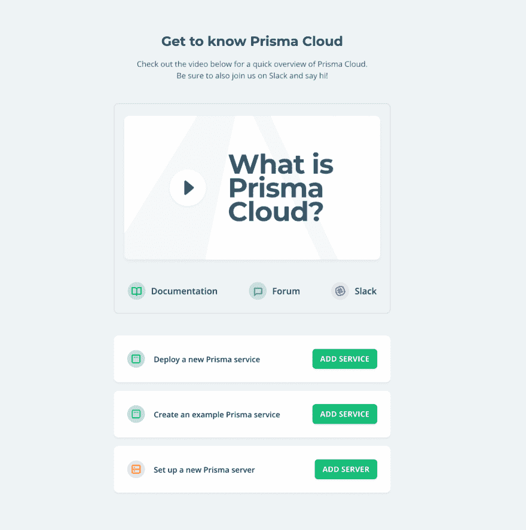
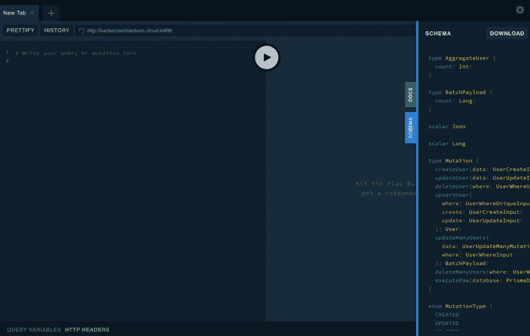
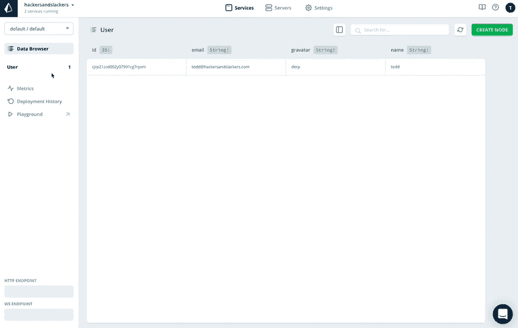

# 使用 Prisma 轻松构建 GraphQL APIs

> 原文：<https://dev.to/hackersandslackers/easily-build-graphql-apis-with-prisma-5f67>

[](https://res.cloudinary.com/practicaldev/image/fetch/s--rRpZqXX---/c_limit%2Cf_auto%2Cfl_progressive%2Cq_auto%2Cw_880/https://res-2.cloudinary.com/hackers-and-slackers/image/upload/f_auto%2Cq_auto/img/prisma.jpg)

上周，联合国国际酷理事会发布了一份官方声明，这让科技行业感到震惊。该声明清楚地陈述了几个月来现状开发者所担心的事情:如果到目前为止您还没有从 REST 转移到 GraphQL，那么您将被国际社会正式承认拥有“不酷”的地位。一场人道主义危机已经展开，酷酷的难民正威胁着越过边境，引发了人们对 Thinkpad 笔记本电脑、IntelliJ 和其他 A 级非酷毒品涌入的担忧。

### 保持住:GraphQL 比 REST 有那么大的改进吗？

老实说，我发现正确回答这个问题的唯一方法是先说“有点”，然后反复思考一会儿，然后以一句“非常好，是的”这样的弱语句结束。

这么说吧。当你第一次熟悉一组数据时，你会怎么做？您是否阅读了大量关于即将检验的 SQL 表的文档？您是否阅读了您的 PostgreSQL 版本的整个规范，以查看它是否包含可能由于某种原因而缺失的功能？我猜你两者都不做——你很可能只看数据。

使用任何 REST API 本质上都是一种上下文切换。无论您过去使用过多少 API，您都永远无法知道一个新 API 的端点、怪癖，或者创建者完全放弃 GET、POST 或 PUT 方法之间的任何区别的糟糕方式。GraphQL 在技术上不一定比 REST 更令人印象深刻，但它*确实*为我们提供了一种语法和工作流程，可以与我们已经熟悉的数据库直接工作相媲美。

还记得我们年轻人在一开始用 NodeJS 替换老开发者时的理由吗，他们认为上下文切换*会改变一切*？GraphQL 就是这样:一种“更好”的技术，更少的心理环境转换，对于那些希望解雇任何他们认为超过 30 岁的人的企业来说，它方便地服务于双重目的。祝你找到比这更好的大纲。

## 这是什么 Prisma 废话？

[Prisma](https://www.prisma.io/) 是免费的(免费！)服务，它提供了创建 API 客户端的工具以及管理它的管理面板。Prisma 为我们提供了以下内容，而无需事先了解 GraphQL:

*   一个 CLI 建立了一个 web 服务器，它将作为我们的 API:无论是云还是自托管的。
*   与您选择的数据库(包括云数据库，如 RDS)自动集成。
*   通过简单的配置文件对数据模型进行巧妙的混淆。没有课，没有代码，没有废话。
*   一个“游乐场”接口，它允许我们在不破坏任何东西的情况下，对我们的模型使用 GraphQL 语法。
*   一个 web GUI，显示所有这些东西和它们的用法之间的关系。

简而言之，Prisma 为我们做了我们的工作。现在，与构建 API、创建 ORM 和管理数据库相关的任务都变得琐碎了，我们终于可以减少一些我们之前提到的负担了——特别是 Bob，这个混蛋在他 35 岁生日的时候趾高气扬，只是因为他有义务养活 3 个漂亮的孩子。抱歉，鲍勃，这样不行。

prisma*是否提供了在他们的云上建立测试环境的选项，但是让我们做一次对我们的生活有用的事情，并构建一些生产就绪的东西。在这种情况下，这意味着站起来一个 5 美元的数字海洋水滴。*

 *### 创建 Prisma 帐户

去性感迷人的 [Prisma Cloud 登陆页面](https://www.prisma.io/cloud)给自己注册一个账户。出现提示时，确保选择**部署新的 Prisma 服务**。

[](https://res.cloudinary.com/practicaldev/image/fetch/s--KrPwo19q--/c_limit%2Cf_auto%2Cfl_progressive%2Cq_auto%2Cw_880/https://res-3.cloudinary.com/hackers-and-slackers/image/upload/f_auto%2Cq_auto/img/prisma-step1.png) 

<figcaption>示例服务是针对 sissys 的。</figcaption>

然后，您应该会看到以下屏幕提示。它将指导你安装一个 NPM 软件包，但有几件事我们需要先做。

[](https://res.cloudinary.com/practicaldev/image/fetch/s--Z14ynV0d--/c_limit%2Cf_auto%2Cfl_progressive%2Cq_auto%2Cw_880/https://res-3.cloudinary.com/hackers-and-slackers/image/upload/f_auto%2Cq_auto/img/prisma-step2.png) 

<figcaption>当她说“等待登录”时，她的意思是“我会等你一辈子，我的爱。”</figcaption>

## 在新的 VPS 上安装 Prisma 依赖项

SSH 到你选择的任何一个 VPS。在本教程中，我将使用一个 Ubuntu 实例。如果你碰巧也在使用 Ubuntu，请随意复制+粘贴所有的东西，我相信你已经做过无数次了。首先，我们需要安装节点:

```
$ apt update
$ apt upgrade
$ curl -sL https://deb.nodesource.com/setup_10.x | sudo -E bash -
$ sudo apt-get install -y nodejs 
```

在你做像从 Prisma 复制粘贴这两行代码这样疯狂的事情之前，你需要在几个步骤之后设置 Docker，所以你最好现在就做:

### 1。安装 Docker 依赖项

```
$ sudo apt-get install \
    apt-transport-https \
    ca-certificates \
    curl \
    gnupg-agent \
    software-properties-common 
```

### 2。添加 Docker 键

```
$ curl -fsSL https://download.docker.com/linux/ubuntu/gpg | sudo apt-key add -
$ sudo apt-key fingerprint 0EBFCD88 
```

### 3。获取 Docker 存储库

```
$ sudo add-apt-repository \
   "deb [arch=amd64] https://download.docker.com/linux/ubuntu \
   $(lsb_release -cs) \
   stable" 
```

### 4。最后安装 Docker

```
$ sudo apt-get update
$ sudo apt-get install docker-ce docker-ce-cli containerd.io 
```

干得好，你做得很好。

## 安装&激活 Prisma CLI

酷，现在我们可以继续 Prisma 的要求了:

```
$ npm install -g prisma
$ prisma login -k eyJhbGciGYU78tfuyLALALTHISKEYISFAKELOL69KFGs 
```

在我们成功登录后，下一步将创建本地文件，这些文件是我们 API 的核心和灵魂。确保您将 init `Prisma`放在您喜欢存放东西的目录中:

```
$ cd /my/desired/directory/
$ prisma init my-prisma 
```

启动该项目将启动一个快速和无痛的审讯过程。请记住，建议将 Prisma 与新的数据库实例一起使用；在我的例子中，我构建了一个云 PostgreSQL 实例。

```
? Set up a new Prisma server or deploy to an existing server? Use existing database
? What kind of database do you want to deploy to?:
? Does your database contain existing data?:
? Enter database host:
? Enter database port:
? Enter database user:
? Enter database password: 
? Enter database name (the database includes the schema):
? Use SSL?: 
```

完成此操作将产生以下结构:

```
my-prisma
├── datamodel.prisma
├── docker-compose.yml
├── generated
│ └── prisma-client
│ ├── index.ts
│ └── prisma-schema.ts
└── prisma.yml 
```

我们快到了牛仔和/或女牛仔。

## 将相位器设置为“部署”

Prisma 将在端口 **4466** 上自立门户，该端口在大多数服务器上是默认关闭的。确保您打开了此端口:

```
$ ufw allow 4466 
```

最后，我们需要设置一个*秘密*来连接 Prisma cloud。打开`docker-compose.yml`文件，取消对`managementApiSecret`行的注释。用你的某种隐秘的个人秘密来代替这个价值。

```
$ vim docker-compose.yml

version: '3'
services:
  prisma:
    image: prismagraphql/prisma:1.25
    restart: always
    ports:
    - "4466:4466"
    environment:
      PRISMA_CONFIG: |
        port: 4466
        # uncomment the next line and provide the env var PRISMA_MANAGEMENT_API_SECRET=my-secret to activate cluster security
        managementApiSecret: my-secret
        databases:
          default:
            connector: postgres
            host: 123.45.678.90
            database: databasename
            user: username
            password: password
            rawAccess: true
            port: '5432'
            migrations: true 
```

重申我们的`yml`文件中的注释，导出您在 Prisma 目录中作为环境变量存储的相同秘密。

```
$ export PRISMA_MANAGEMENT_API_SECRET=my-secret 
```

## 游戏时间到了

该部署了，宝贝！！！做吧，按下按钮！现在就做！

```
$ docker-compose up -d
$ prisma deploy 
```

第一次部署会做一些事情:它会在你的服务器上建立一个操场接口(localhost:4466 ),并让你使用 Prisma 云接口。

### 查看您的工作区

访问您的服务器的 IP:4466，看看您做了什么:

[](https://res.cloudinary.com/practicaldev/image/fetch/s--FpEN8B5Z--/c_limit%2Cf_auto%2Cfl_progressive%2Cq_auto%2Cw_880/https://res-5.cloudinary.com/hackers-and-slackers/image/upload/f_auto%2Cq_auto/img/Screen-Shot-2019-02-03-at-2.06.10-PM.png) 

<figcaption>老少皆宜的游乐场</figcaption>

快看，伙计！除了 Prisma 附带的通用数据模型的文档，您可以在 UI 的左侧测试查询或变化，并在右侧接收响应。比邮递员强多了。

### 不要往下看:你在云端

您现在可以将您的服务器添加到 Prisma Cloud，以获得其管理面板的好处。从这里，您可以直接修改信息，查看使用指标，并管理多个实例:

[](https://res.cloudinary.com/practicaldev/image/fetch/s--uhKpLEQj--/c_limit%2Cf_auto%2Cfl_progressive%2Cq_66%2Cw_880/https://res-5.cloudinary.com/hackers-and-slackers/image/upload/f_auto%2Cq_auto/img/prismacloud.gif) 

<figcaption>突发新闻:Prisma 上学太酷了。</figcaption>

## 与 Prisma 合作

既然我们已经旋转了这个闪亮的新玩具，让我们确定我们知道如何驾驶它。

在你的 VPS 上，看一下`datamodels.prisma`文件:

```
$ vim datamodels.prisma 
```

您应该看到一个名为 User 的数据模型(每个人都有这个模型)。要添加或修改数据模型，我们需要做的就是根据需要更改字段，设置它们的数据类型，并指定我们是否希望字段是惟一的。下面我添加了几个新的“字段”

```
type User {
  id: ID! @unique
  name: String!
  email: String! @unique
  gravatar: String!
} 
```

通过这些更改再次部署 Prisma 将修改我们数据库的表结构以匹配新模型:

```
$ prisma deploy 
```

现在你知道了:简历中又多了一个时髦词。事实上，完全伪造 GraphQL 认证的存在并把它放在那里也可以。如果你是那种喜欢在空闲时间阅读此类技术文章的人，那么你很有可能已经胜任这份工作。除非你是鲍勃。*