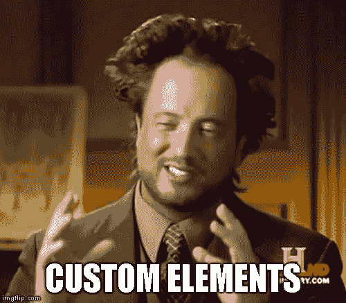

# 使用 hyperHTML-6 的简易应用程序，自定义我的自定义元素

> 原文：<https://dev.to/pinguxx/easy-apps-with-hyperhtml-6-1e73>

第 6 部分由 Trevor Ganus 撰写，

## [伊凡](/pinguxx)

[standard geek](/pinguxx)

[pinguxx](https://twitter.com/pinguxx)[pinguxx](https://github.com/pinguxx)

## [保罗·汤普森](/paritho)

[lover of dogs and javascript. and coffee. and writing.](/paritho)

[帕里托](https://github.com/paritho)

1.  [介绍，焊线/绑定](https://dev.to/pinguxx/easy-apps-with-hyperhtml-1-31cc)
2.  [事件和组件](https://dev.to/pinguxx/easy-apps-with-hyperhtml-2-hbi)
3.  [关于组件和简单状态管理的 Moar】](https://dev.to/pinguxx/easy-apps-with-hyperhtml-3-1m3l)
4.  [电线类型和自定义定义(意图)](https://dev.to/pinguxx/easy-apps-with-hyperhtml-4-38k3)
5.  [用 hyper 定制元素](https://dev.to/pinguxx/easy-apps-with-hyperhtml-5-5hdl-temp-slug-7285698)
6.  **定制我的定制元素**
7.  [测试！](https://dev.to/pinguxx/easy-apps-with-hyperhtml-7-5b9g)
8.  [异步加载、占位符和带超链接的提前输入](https://dev.to/pinguxx/easy-apps-with-hyperhtml-8-async-loading-5d96)
9.  [搬运路线](https://dev.to/pinguxx/easy-apps-with-hyperhtml-9-routing-59k0)
10.  [第三方库](https://dev.to/pinguxx/easy-apps-with-hyperhtml-10-3rd-party-libraries-2n7b)

### 重述

在第 1-5 部分中，我们讨论了 hyperHTML 的基础知识。我们还了解了一个叫做 hyper.Component 的惊人特性，我们深入研究了让我们扩展 hyperHTML 并简化模板的“意图”。在学习这一切的同时，我们创建了一个简单的表格:

[https://stackblitz.com/edit/basics-table-7?embed=1&&](https://stackblitz.com/edit/basics-table-7?embed=1&&)

最后，我们学习了定制元素的基础知识和一个叫做 hyperHTML-Element 的小实用程序，它为我们提供了一些开箱即用的`hyper.Component`特性，等等。

在第 6 部分中，我们将探索如何将表格从组件转换成定制元素。我们还将看到向我们的定制元素添加功能是多么容易，扩展它会更加有用。使用定制元素使得重用我们的代码变得如此容易，一个婴儿也能做到——当然，如果这个[婴儿知道 HTML](https://www.amazon.com/HTML-Babies-Code-Sterling-Childrens/dp/1454921552) 和 [JavaScript](https://www.amazon.com/Javascript-Babies-Code-Sterling-Childrens/dp/1454921579) 的话。此外，一旦我们有了自定义元素，我们就不需要在应用程序的其他地方使用 hyperHTML，除非我们想要它。这使得定制元素可以与任何框架即插即用。React 组件上一次这么说是什么时候？

### 列

让我们开始考虑表格的元素:页眉、页脚和正文。对于我们的例子，页眉和页脚是重要的部分。我们将像前面一样基于数据生成页脚。

让我们从列的定制元素开始。该元素将包含呈现以下内容所需的信息:

*   标签(用于页眉)
*   用于此列的属性(来自数据)
*   是否可以分类
*   要显示的数据类型

[https://stackblitz.com/edit/intermediate-ce-07?embed=1&&](https://stackblitz.com/edit/intermediate-ce-07?embed=1&&)

简单吧？我们甚至不渲染任何东西，所有的重担都在桌子本身。

### 表

现在让我们用一个简单的表生成一个定制元素。

[https://stackblitz.com/edit/intermediate-ce-08?embed=1&&](https://stackblitz.com/edit/intermediate-ce-08?embed=1&&)

让我们首先在 HTML 中添加一个超级列