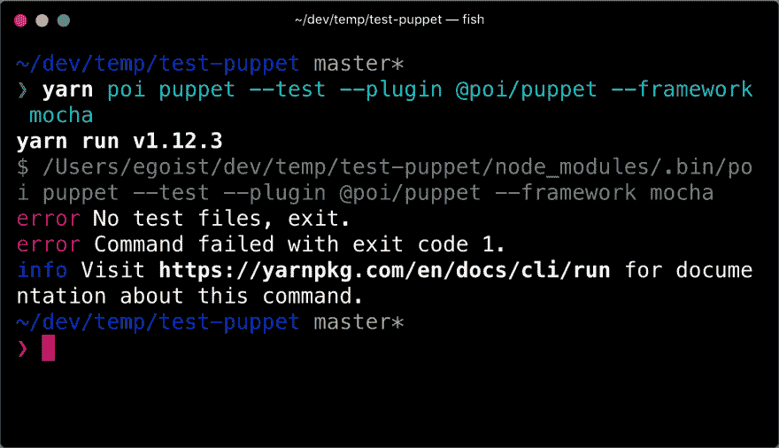
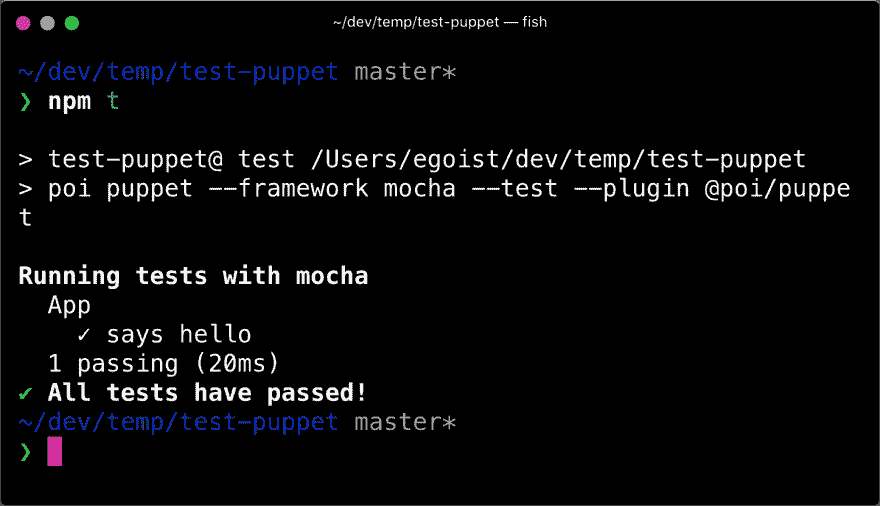
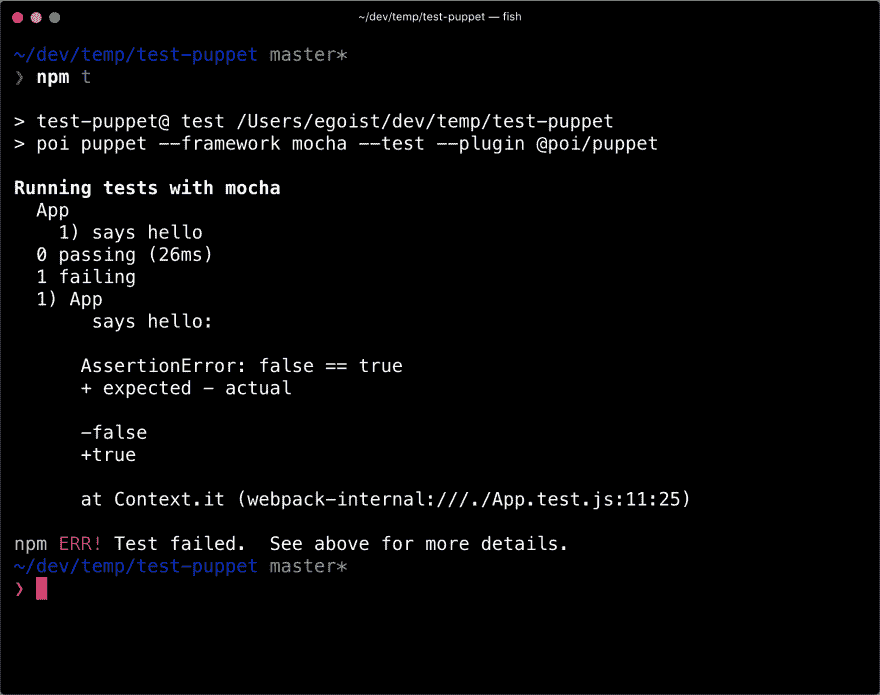
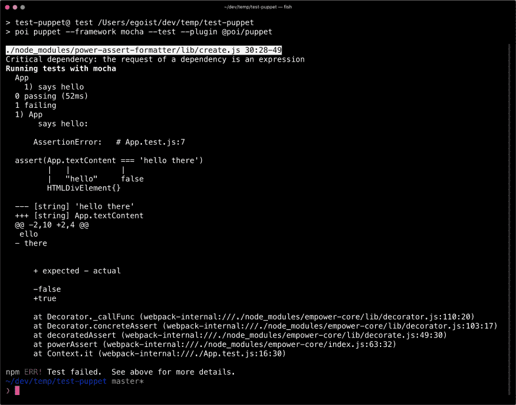

# 使用 Poi 和木偶师轻松测试浏览器

> 原文：<https://dev.to/egoist/easy-browser-testing-with-poi-and-puppeteer-18ah>

Poi 是现代 web 开发的模块化工具，几天前我发布了一个名为 Puppet 的 Poi 插件，它可以在浏览器中运行你的代码。

这个插件使用[木偶师](https://github.com/GoogleChrome/puppeteer)在引擎盖下，它启动你机器上现有的 Chrome 浏览器来运行测试。

## 木偶入门

如果您没有现有的 Poi 项目，运行以下命令创建一个:

```
npx create-poi-app test-puppet
# You don't need to select any features from the CLI prompts
# Just press Enter 
```

然后在你的项目中安装这个插件:

```
yarn add @poi/plugin-puppet --dev 
```

现在你可以运行这个插件提供的一个新命令`poi puppet`，就像这样:

```
yarn poi puppet --test --plugin @poi/puppet --framework mocha 
```

[](https://res.cloudinary.com/practicaldev/image/fetch/s--Xb71JuNZ--/c_limit%2Cf_auto%2Cfl_progressive%2Cq_auto%2Cw_880/https://thepracticaldev.s3.amazonaws.com/i/jl8gv6z7v1kripru8fek.png)

这里有一些错误，因为`poi puppet`命令只会在浏览器中捆绑和运行`**/*.test.js`，现在让我们创建一个。

`App.test.js` :

```
import assert from 'assert'
import App from './App'

describe('App', () => {
  it('says hello', () => {
    assert(App.textContent === 'hello')
  })
}) 
```

`App.js` :

```
const App = document.createElement('div')
App.textContent = 'hello'

export default App 
```

在我们再次运行测试命令之前，我想在 npm 脚本中进行配置，这样我们就不需要每次都键入这么长的命令:

```
{  "scripts":  {  "test":  "poi puppet --test --plugin @poi/puppet --framework mocha",  "build":  "poi --prod",  "dev":  "poi --serve"  }  } 
```

现在运行`npm t`就很简单了:

[](https://res.cloudinary.com/practicaldev/image/fetch/s--37a9fNtb--/c_limit%2Cf_auto%2Cfl_progressive%2Cq_auto%2Cw_880/https://thepracticaldev.s3.amazonaws.com/i/ab101zv4k01qjko65ilu.png)

## 自定义断言库

我们在上面运行的命令中添加了`--framework mocha`标志，以使用 Mocha 作为测试框架，Mocha 没有内置的断言库，所以我们使用 Node.js 的内置`assert`模块。然而，如果您想要更多的描述性断言消息，您可以将`assert`模块与 [power-assert](https://github.com/power-assert-js/power-assert) 结合使用。

让我们调整我们的测试文件来创建一个失败的测试:

```
import assert from 'assert'
import App from './App' 
describe('App', () => {
  it('says hello', () => {
-   assert(App.textContent === 'hello') +   assert(App.textContent === 'hello there')
  })
}) 
```

运行测试以查看默认的断言消息:

[](https://res.cloudinary.com/practicaldev/image/fetch/s--Cm0uqul---/c_limit%2Cf_auto%2Cfl_progressive%2Cq_auto%2Cw_880/https://thepracticaldev.s3.amazonaws.com/i/6t183xp07127w0fens2k.png)

很难从错误消息中判断出测试中到底出了什么问题，你唯一得到的是`false !== true`，这有点没用。

现在我们通过添加一个巴别预设来添加`power-assert`。

`babel.config.js` :

```
module.exports = {
  presets: [
    // Add Poi's default preset first
    'poi/babel',
    'power-assert'
  ]
} 
```

别忘了安装`power-assert` :

```
yarn add power-assert babel-preset-power-assert --dev 
```

最后，让我们再次运行测试:

[](https://res.cloudinary.com/practicaldev/image/fetch/s--kjaxteue--/c_limit%2Cf_auto%2Cfl_progressive%2Cq_auto%2Cw_880/https://thepracticaldev.s3.amazonaws.com/i/4jgbvkl1jxgxt98o1g28.png)

<small>*你可以忽略`Critical dependency: the request of a dependency is an expression`警告，[如何抑制这个警告](https://gist.github.com/egoist/82bd6c394f94fa301cc76477fc272244)见此要诀。*</small>

又失败了，但是现在实际上可以从错误信息中得到`App.textContent`的实际值和期望值了，甜！

## 链接

*   [GitHub 上的示例代码](https://github.com/poi-bundler/examples/tree/master/examples/testing-with-puppet)。
*   [@ poi/插件-傀儡文档](https://poi.js.org/guide/plugin-puppet.html)。