# 轻松的实时 GraphQL API，无服务器业务逻辑在任何云中运行

> 原文：<https://dev.to/vladimirnovick/effortless-real-time-graphql-api-with-serverless-business-logic-running-in-anycloud-2j6b>

在本文中，我将向您展示如何使用无服务器业务逻辑轻松创建实时 GraphQL API，并将其部署到任何云上。听起来有点像点击诱饵标题对不对？什么是不费力的？显然，这需要一些努力。如果您熟悉 GraphQL，或者您听说过它，并且总是想知道它是什么以及我如何开始编写 GraphQL 服务器，您可能会认为我们将创建自己的 GraphQL 服务器。此外，您可能认为我们将处理云部署、无服务器功能。简而言之，复杂的东西。

嗯，毫不费力是这里的关键词。在现有 Postgres 或其扩展之上，在您选择的任何云中设置和运行您自己的 GraphQL API 非常简单。不，我们不会设置服务器和谈论云部署。嗯，也许有一点点。在这篇博客文章中，我将解释 [Hasura.io](https://hasura.io) 开源引擎的大部分功能集，以及它如何在不创建自己的服务器的情况下为您带来实时 GraphQL API。我们将了解如何浏览它的特性，为您提供一个深入的概述，以及使用它的用例，甚至是与您现有的服务器、非 Postgres 数据库或无服务器功能一起使用。

# 目录

GraphQL 简介

*   这个引擎是什么，为什么它是开源的
*   让我们从 Heroku 开始吧
*   其他的云呢？
*   在现有 Postgres 之上运行
*   Postgres 扩展(PostGIS，TimescaleDB)怎么样
*   如果我不用 Postgres 呢？
*   Hasura 发动机控制台概述
*   数据建模、关系和访问控制
*   证明
*   自定义外部 GraphQL 服务器，也称为远程模式
*   带有事件触发器的异步无服务器业务逻辑

# GraphQL

GraphQL 不仅是一个时髦的词，而且是一种被广泛采用的与服务器交互的方式，正逐渐取代 REST API。简而言之，GraphQL 是一种用于 API 和特定类型系统的查询语言，您可以在其中定义数据。在您定义了数据形状以及如何在服务器上检索这些数据之后，您可以在客户端使用特定的查询格式来查询、更改甚至订阅数据更改。您将收到的数据将与您要求的完全相同。在这篇博文中，我不会深入描述 GraphQL 是什么，但如果你是 GraphQL 的新手，我正在做一个免费的 4 天训练营，你应该完全订阅！我们将讲述如何在 React、Angular 或 Vue 中使用现有的 GraphQL API，以及如何在 NodeJS 中创建我们自己的 GraphQL API。

液体错误:内部

正如你可能从这篇文章的标题中想到的，这里我们将讨论毫不费力的实时 GraphQL API。听起来很神奇，对吧？嗯，用 [hasura.io](https://hasura.io) [开源](https://github.com/hasura) GraphQL 引擎当然感觉如此！让我们开始吧！

# 这个引擎是什么，为什么它是开源的

Hasura engine 为您提供了一个在 docker 容器中运行的引擎，并作为一个层存在于新的或现有的 Postgres 数据库之上。

是啊，没错。您不仅可以轻松地从头开始创建自己的 GraphQL API，还可以在现有的 Postgres 数据库上运行引擎。

由于它运行在 docker 容器中，你基本上可以在 Docker 可以运行的任何地方运行它，也就是说，在 Heroku、Digital Ocean、AWS、Azure、Zeit、GCP 甚至你的本地环境中。

Hasura engine 带有光滑的 UI，你可以通过使用 GraphiQL 工具扩展各种很酷的插件来测试你的查询、变化或订阅，我们将在稍后概述这些插件
那么为什么它是开源的呢？这是我问[坦迈·戈帕尔](https://twitter.com/tanmaigo)—[哈苏拉·io](https://hasura.io)的联合创始人的问题。

> 因为它是你堆栈的一部分。在当今时代，你需要开源组件的透明性和灵活性。开源使得移植和移植变得容易，提高了安全性、扩展的灵活性和你想看到的特性，加入社区。社区还可以帮助您确保您的开源产品可以在不同的环境中运行。在我们的社区的帮助下，Hasura 是多云和多平台的，在他们最喜欢的环境中运行，并向项目反馈信息。

# 让我们从 Heroku 开始吧

当你访问 hasura.io 时，首先看到的是作为免费选项的 Heroku 入门。

[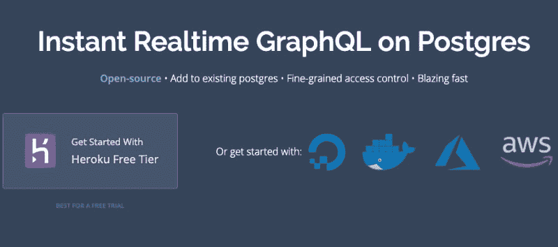](https://res.cloudinary.com/practicaldev/image/fetch/s--lChVLXPG--/c_limit%2Cf_auto%2Cfl_progressive%2Cq_auto%2Cw_880/https://cdn-images-1.medium.com/max/800/1%2AGaDehSsImG95-w9wJuk6NQ.png)

这是一个非常快速和可靠的设置，但是对于生产级应用程序，您应该考虑使用不同的云。如您所见，您可以从各种云选项中进行选择，但为了简单起见，让我们从 Heroku 免费层的基本设置开始。

[](https://res.cloudinary.com/practicaldev/image/fetch/s--YeAAfhbB--/c_limit%2Cf_auto%2Cfl_progressive%2Cq_auto%2Cw_880/https://cdn-images-1.medium.com/max/800/1%2AXts79g-89CauVyOgvAvZ1Q.png)

导游会告诉你这个神奇的按钮。当你点击它的时候，引擎和 Heroku Postgres 插件一起被部署到 Heroku。

## 那么这里发生了什么呢？

Heroku 有一个你可以部署的模板的概念。因此，当我们运行 deploy to Heroku 时，所发生的情况是我们点击了这个链接。

[https://heroku.com/deploy？template = https://github . com/hasura/graph QL-engine-heroku](https://heroku.com/deploy?template=https://github.com/hasura/graphql-engine-heroku)

事实上，我们正在部署的模板是:

[https://github . com/hasura/graph QL 引擎英雄库](https://github.com/hasura/graphql-engine-heroku)

## 越陷越深

让我们检查这个模板`app.json`文件(定义 Heroku 配置的文件)

[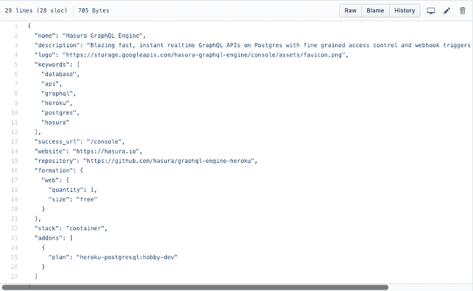](https://res.cloudinary.com/practicaldev/image/fetch/s--hILCpg41--/c_limit%2Cf_auto%2Cfl_progressive%2Cq_auto%2Cw_880/https://cdn-images-1.medium.com/max/800/1%2AjiT6Hg_gOxonE2YP-WYNog.png)

这个 json 文件告诉 Heroku 使用 Postgres addon 在自由层大小部署 web 编队。

除了`app.json`,我们还有`heroku.yml`,它很简单:

[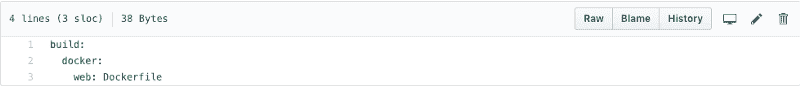](https://res.cloudinary.com/practicaldev/image/fetch/s--9fwtsqVw--/c_limit%2Cf_auto%2Cfl_progressive%2Cq_auto%2Cw_880/https://cdn-images-1.medium.com/max/800/1%2Aw7w-cVyoJIL9J-zhHp0oPw.png)

## 都是 Docker！

如您所见，我们指定了要运行的 Dockerfile 文件。因此，一个要点是，部署到 Heroku 基本上是围绕将 docker 容器部署到 Heroku 的语法糖。对于数字海洋，一键部署有点不同，但符合相同的想法。

数字海洋影像只是一个已经设置好的 Ubuntu + docker + Postgres

AWS 和 Azure 的设置有点复杂，但想法是一样的——在 Docker 容器中运行引擎并将其连接到 Postgres db。

# 其他的云呢？

所以你可能已经发现，在任何可以运行 Docker 和 Postgres 的地方，运行 [hasura.io](https://hasura.io) 引擎都是可能的。AWS、Azure、Zeit、GCP，应有尽有。

例如，让我们在本地环境中设置 Hasura。

## 先决条件

在本地安装引擎之前，您需要 Docker 和 Docker Compose，您可以从这里安装:

*   [码头工人](https://docs.docker.com/install/)
*   [坞站组成](https://docs.docker.com/compose/install/)

## 获取货单

现在让我们从下面的 repo 中获取`docker-compose`文件:

[https://github . com/hasura/graph QL-engine/tree/master/install-manifests](https://github.com/hasura/graphql-engine/tree/master/install-manifests)

这个 repo 包含在任何地方部署 Hasura 所需的各种安装清单。

所以要得到它，创建一个新目录并运行

```
wget https://raw.githubusercontent.com/hasura/graphql-engine/master/install-manifests/docker-compose/docker-compose.yaml 
```

Enter fullscreen mode Exit fullscreen mode

## 运行 docker 容器

```
docker-compose up -d 
```

Enter fullscreen mode Exit fullscreen mode

现在检查容器是否正在运行:

```
docker ps 
```

Enter fullscreen mode Exit fullscreen mode

你应该得到这样的东西

[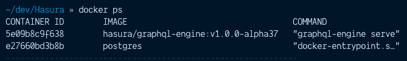](https://res.cloudinary.com/practicaldev/image/fetch/s--cmeyVX1q--/c_limit%2Cf_auto%2Cfl_progressive%2Cq_auto%2Cw_880/https://cdn-images-1.medium.com/max/800/1%2AXSk0VOUZ1La3UVMPcXX3Eg.png)

如您所见，引擎实例与 Postgres db 一起运行。

现在唯一剩下的就是去[http://localhost:8080/console](http://localhost:8080/console)看看了

[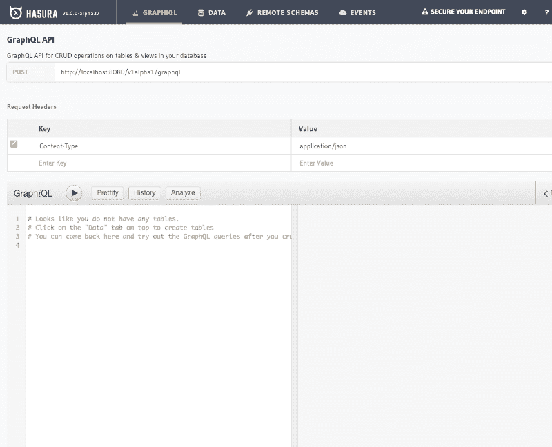](https://res.cloudinary.com/practicaldev/image/fetch/s--QT6Jm-wL--/c_limit%2Cf_auto%2Cfl_progressive%2Cq_auto%2Cw_880/https://cdn-images-1.medium.com/max/800/1%2A6-Qz7FD6O4winhcfGegKzg.png)

# 运行在现有 Postgres 之上

也可以在现有的 Postgres 数据库上运行 Hasura 引擎。为此，我们从 [install-manifests](https://github.com/hasura/graphql-engine/tree/master/install-manifests) repo 中获取`docker-run.sh`脚本并编辑`HASURA_GRAPHQL_DATABASE_URL`变量，而不是像以前那样获取`docker-compose`。你可以在[这里](https://docs.hasura.io/1.0/graphql/manual/deployment/docker/index.html)阅读更多信息

# Postgres 扩展怎么样

完全有可能。有几篇关于将 PostGIS(Postgres 的空间数据库扩展器)与 Hasura 一起使用的很棒的博客帖子，比如这个 [one](https://blog.hasura.io/graphql-and-geo-location-on-postgres-using-hasura-562e7bd47a2f/)

或者使用带有 TimeScaleDB(完全支持 SQL 的开源时序数据库)的 Hasura，就像这篇博客[帖子](https://blog.hasura.io/using-timescaledb-with-hasura-graphql-d05f030c4b10/)中描述的那样

# 而如果我不用 Postgres 呢？

在 Firebase 上运行？没问题，检查一下 [firebase2graphql](https://github.com/hasura/graphql-engine/tree/master/community/tools/firebase2graphql) 工具。使用蒙哥或任何其他 NoSQL 数据库？您可以导出 JSON dump，并使用 [json2graphql](https://github.com/hasura/graphql-engine/tree/master/community/tools/json2graphql) 工具通过 Hasura 引擎将您的数据导入 Postgres 数据库。使用 MySQL？没问题。你可以使用 https://www.symmetricds.org/的[从 MySQL 迁移到 Postgres，甚至使用 Postgres 的](https://www.symmetricds.org/)[FDW](https://wiki.postgresql.org/wiki/Foreign_data_wrappers)使 Postgres 成为 MySQL 中数据的代理

# 控制台概述

所以现在我们知道，我们可以在本地或我们选择的任何云上运行 engine，不仅可以在任何 Postgres 数据库上运行，还可以在 PostGIS 等 Postgres 扩展或 TimeScaleDB 等开源数据库上运行。但是我们还没有谈到引擎的能力。让我们回到本地运行引擎时已经看到的控制台。
控制台有 4 个主要选项卡

## 图 QL

### 端点和表头

在这个页面的顶部，您将找到 API 端点以及请求头，如果您想从客户端访问 GraphQL API，您需要提供这些请求头。

[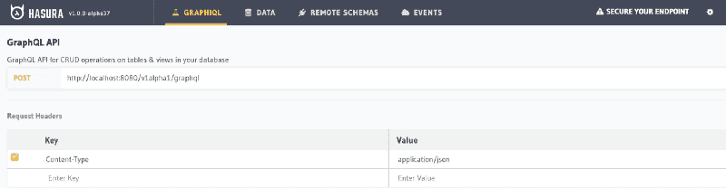](https://res.cloudinary.com/practicaldev/image/fetch/s--UvkbDOJt--/c_limit%2Cf_auto%2Cfl_progressive%2Cq_auto%2Cw_880/https://cdn-images-1.medium.com/max/800/1%2A9bQps8vAjxbfixptH-jzcA.png)

正如您在我们新创建的示例中看到的，我们只有内容类型的头，这并不真正安全，因为每个人都可以访问我们的 API。您会在右上角看到一个通知“保护您的终端”，该通知将引导您找到解释如何保护您的终端的文档。
这是一个安全访问 API 的不同示例:

[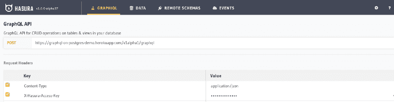](https://res.cloudinary.com/practicaldev/image/fetch/s--8n2vGpkJ--/c_limit%2Cf_auto%2Cfl_progressive%2Cq_auto%2Cw_880/https://cdn-images-1.medium.com/max/800/1%2ApzOCoy5SnCiHTijXu4Migw.png)

在这里你可以看到我们有 X-Hasura-Access-Key 头来保护我们的端点。这也将确保对我们控制台的访问。

### 带扩展的图形集成开发环境

GraphiQL 选项卡嵌入了 [GraphiQL](https://github.com/graphql/graphiql) IDE，使您能够运行查询/变异或订阅，以便在舒适的浏览器中测试您的 GraphQL API。您还可以浏览 GraphQL 模式的文档，以查看数据的形状以及可以执行哪些查询、变化和订阅。Hasura engine 在 GraphiQL 的基础上增加了额外的特性。

[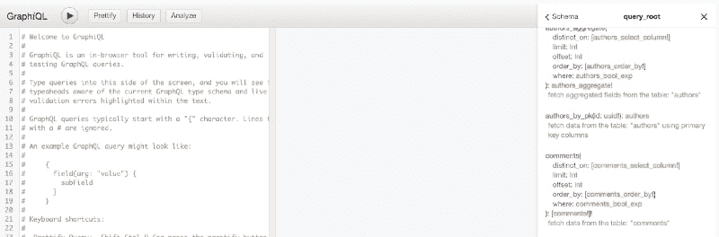](https://res.cloudinary.com/practicaldev/image/fetch/s--KcoOqk5V--/c_limit%2Cf_auto%2Cfl_progressive%2Cq_auto%2Cw_880/https://cdn-images-1.medium.com/max/800/1%2A6VtgDlPsRre2f1U9gYqqZA.png)

*   将修饰左窗格中的 GraphQL 语法
*   **历史** -将显示最近执行的查询/突变
*   **分析**——这真是个牛逼的工具。Hasura engine 不运行解析器来获取数据，而是将 GraphQL 查询编译成 SQL 查询。“分析”按钮显示它是如何编译的。

考虑下面的查询:

```
{
  posts {
    author {
      user {
        name
      }
    }
  }
} 
```

Enter fullscreen mode Exit fullscreen mode

单击分析按钮时，您将看到:

[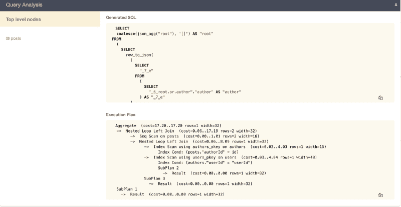](https://res.cloudinary.com/practicaldev/image/fetch/s--lsrqmSLR--/c_limit%2Cf_auto%2Cfl_progressive%2Cq_auto%2Cw_880/https://cdn-images-1.medium.com/max/800/1%2AkgUTU0XQARt-XZblRm0hPg.png)

在这里，您可以分析如何针对数据库执行查询，并向您自己或您的 DBA 指出如何优化数据库关系以提高效率。

## 数据

这个标签是对你的 Postgres 数据库的一种管理。在这里，您可以定义您的模式结构、表关系、设置角色和权限，甚至可以运行您自己的自定义 SQL。我们将在下一节探讨数据建模。

## 远程模式

远程模式选项卡是一个选项卡，您可以在其中为您的自定义业务逻辑指定您的**自定义 GraphQL 服务器**的 URL。

[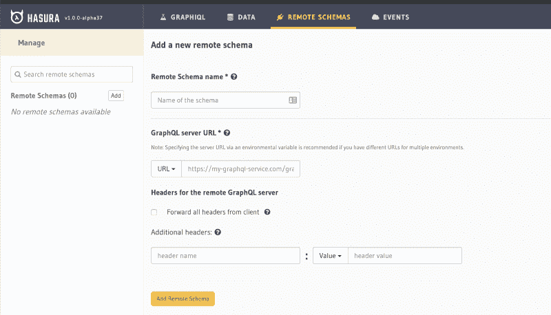](https://res.cloudinary.com/practicaldev/image/fetch/s--6N92PK8f--/c_limit%2Cf_auto%2Cfl_progressive%2Cq_auto%2Cw_880/https://cdn-images-1.medium.com/max/800/1%2AYXKM1scMRGbq21cvm3qm5g.png)

Hasura engine 将在您的 hasura GraphQL API 和您的自定义 GraphQL 服务器之间进行模式拼接。因此，例如，如果您正在考虑在向数据库添加内容之前执行自定义业务逻辑，您可以在自己的 GraphQL 服务器上编写一个变体，为 hasura 引擎提供服务器 URL 以及用于安全的附加标头，引擎将缝合模式。

## 事件

Hasura 引擎使用强大的事件系统。每当从数据库中插入、更新或删除任何内容时，都会触发一个事件。建议将事件连接到无服务器函数。我们将在下一节详细讨论它

# 数据建模

现在，在我们了解了如何导航控制台之后，让我们更深入地了解一下数据选项卡，并了解如何对数据建模以及设置表关系

## 创建或修改表格

当我们访问我们的数据选项卡时，我们将有一个创建表格的选项。当创建一个表时，你需要指定它的列和类型。

[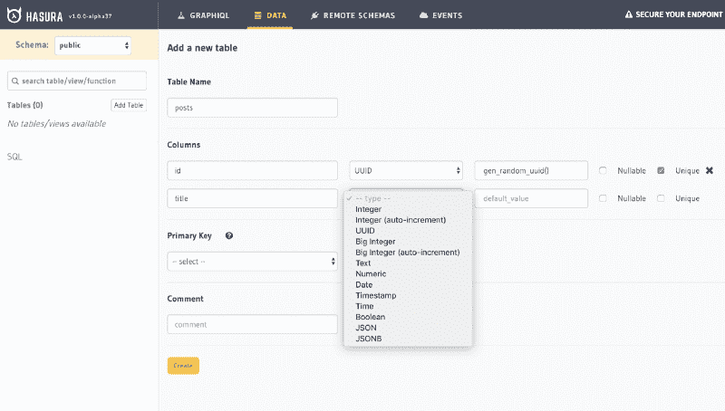](https://res.cloudinary.com/practicaldev/image/fetch/s--1DNggI9H--/c_limit%2Cf_auto%2Cfl_progressive%2Cq_auto%2Cw_880/https://cdn-images-1.medium.com/max/800/1%2A873xA1dBG0gG3MUYWxhDLw.png)

Hasura 也给你助手函数。在我们的例子中，为 post id 主键自动生成唯一标识符的是`gen_random_uuid()`。这里您需要选择您的主键列或几列。

与任何数据库管理员一样，您可以将外键映射设置到不同的表，如下例所示，我们将`posts`表中的`authorId`映射到`authors`表的`id`列:

[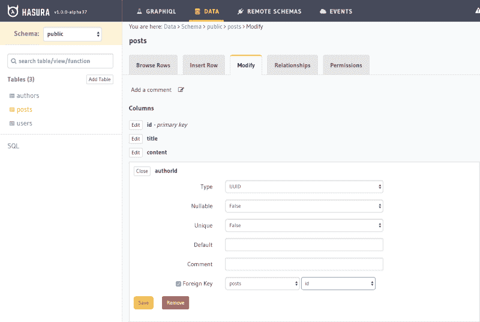](https://res.cloudinary.com/practicaldev/image/fetch/s--c3s6CHdB--/c_limit%2Cf_auto%2Cfl_progressive%2Cq_auto%2Cw_880/https://cdn-images-1.medium.com/max/800/1%2A9LFU3gBFWD9HUhhAITjX3A.png)

从这个例子中还可以看出，只要我们已经有了表，我们就可以修改它们、浏览行、插入行或添加关系。

## 自动生成查询

最棒的是，每当我们添加一个表时，我们都可以在表上访问以下查询/订阅:

[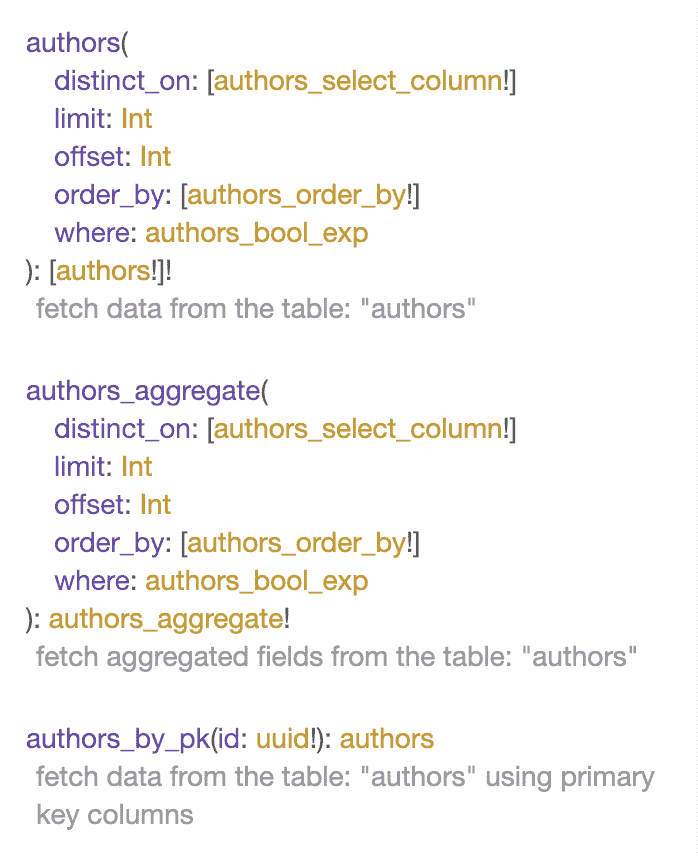](https://res.cloudinary.com/practicaldev/image/fetch/s--KxEmz5xz--/c_limit%2Cf_auto%2Cfl_progressive%2Cq_auto%2Cw_880/https://cdn-images-1.medium.com/max/800/1%2AkSlc7sSqo8CqJfQ2u_73Wg.png)

如你所见，它们非常强大。我们不仅可以查询或订阅我们的数据，还可以对其进行排序和过滤。当然，你有删除/插入/更新突变。

## 关系构建器

通过访问“关系”选项卡，我们将能够在表之间建立两种类型的关系:

*   对象关系
*   数组关系

当我们设置了一个外键时，例如在我们的用例中`posts`表`authorId`列指向`authors`表中的`id`，我们可以查询`posts`，但是我们不能像在 GraphQL 中所期望的那样从`authors`表中获取嵌套数据。为此，我们需要设置对象关系

[](https://res.cloudinary.com/practicaldev/image/fetch/s--2j7L-EQI--/c_limit%2Cf_auto%2Cfl_progressive%2Cq_auto%2Cw_880/https://cdn-images-1.medium.com/max/800/1%2Abe-XbotmHFwmE7GfmWEYAw.png)

在 UI 的各个部分也会建议创建它。因此，您可以在*建议的对象关系*中点击添加，或者您可以手动创建关系。
每当你这样做的时候，你将能够运行这样的查询:

```
{
  posts {
    id
    author {
      bio
    }
  }
} 
```

Enter fullscreen mode Exit fullscreen mode

## 权限

在 Hasura engine 中，我们可以定义角色和权限，并达到真正精细的级别。例如，我们可以只在满足特定规则时才允许访问特定的列。我们还可以从我们的自定义身份验证 webhook 传递变量，并基于它定义自定义访问。在控制台中，它看起来像这样:

[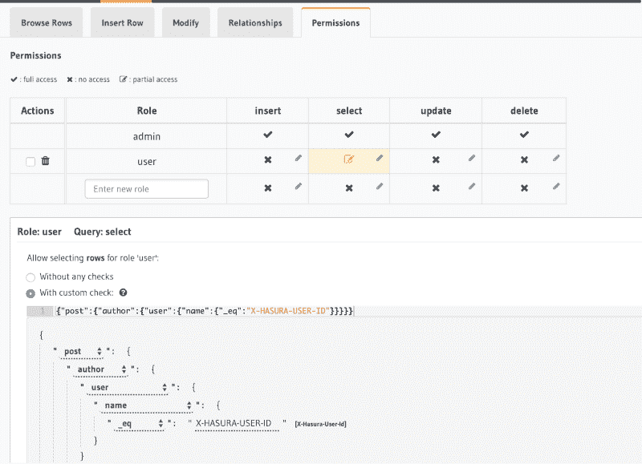](https://res.cloudinary.com/practicaldev/image/fetch/s--GY65gVsP--/c_limit%2Cf_auto%2Cfl_progressive%2Cq_auto%2Cw_880/https://cdn-images-1.medium.com/max/800/1%2AoRL24h62QYlByPRZi4Klag.png)

在本例中，我们检查是否提供了`X-HASURA-USER-ID`

# 认证

Hasura 引擎支持各种类型的认证。您可以使用 JWT 令牌，您的自定义令牌或 Hasura-access-key。幕后发生的事情如下:授权层检查密钥令牌/JWT 配置或 webhook 配置。

让我们看看 Heroku 的例子:

[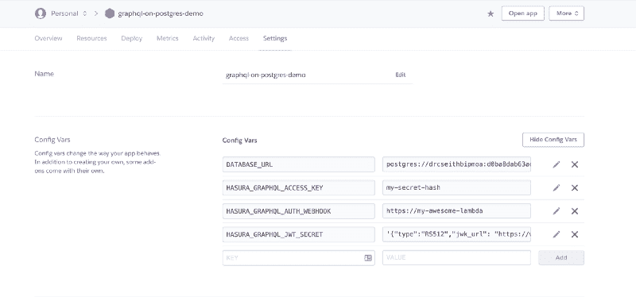](https://res.cloudinary.com/practicaldev/image/fetch/s--fatTNINR--/c_limit%2Cf_auto%2Cfl_progressive%2Cq_auto%2Cw_880/https://cdn-images-1.medium.com/max/800/1%2ATWWlRidIqSvqfHtXMAHnag.png)

这里您可以看到 Heroku dashboard 中设置的环境变量。

*   `HASURA_GRAPHQL_ACCESS_KEY` -密钥令牌
*   `HASURA_GRAPHQL_AUTH_WEBHOOK` -您的定制授权提供商的 url
*   `HASURA_GRAPHQL_JWT_SECRET`  - JWT config

例如，如果我们使用`HASURA_GRAPHQL_ACCESS_KEY`，那么我们需要提供`X-Hasura-Access-Key`来访问 API 或控制台

[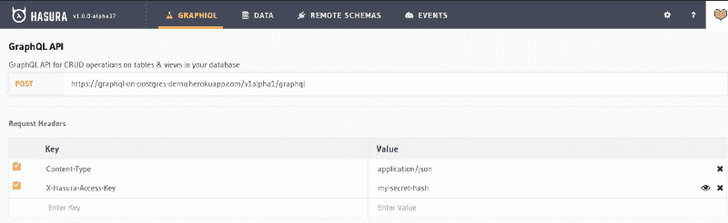](https://res.cloudinary.com/practicaldev/image/fetch/s--GeFZJbZL--/c_limit%2Cf_auto%2Cfl_progressive%2Cq_auto%2Cw_880/https://cdn-images-1.medium.com/max/800/1%2ABpXF9lOs61yNhyHq12RCIA.png)

您可以在此阅读更多关于不同认证选项的信息

# 自定义外部 GraphQL 服务器又名远程模式

那么您将使用远程模式做什么呢？让我们想想下面的例子。假设您希望基于一些自定义服务器验证在数据库中插入一行，但是您仍然希望订阅数据库更改。在这种情况下，您可以通过自己编写或使用 hasura [样板](https://github.com/hasura/graphql-engine/tree/master/community/boilerplates/remote-schemas)之一来创建远程模式，在您选择的服务器上运行它，并通过提供您的定制服务器 Graphql 端点 URL 来连接它。

[](https://res.cloudinary.com/practicaldev/image/fetch/s--6N92PK8f--/c_limit%2Cf_auto%2Cfl_progressive%2Cq_auto%2Cw_880/https://cdn-images-1.medium.com/max/800/1%2AYXKM1scMRGbq21cvm3qm5g.png)

在您的服务器上，假设您定义了一个变异，在将一行插入到同一个数据库之前，解析器运行一些定制逻辑，hasura 引擎连接到这个数据库。那么当数据被插入时会发生什么呢？来自 hasura 引擎的 GraphQL 订阅将按预期运行。

# 带事件触发器的异步无服务器业务逻辑

如上所述，哈苏拉对事件有一个强有力的概念。不仅表操作可以触发事件，列更改也可以触发事件。每当事件被触发时，事件数据被传递到 webhook URL。这些 webhooks 被认为是无服务器的函数。您可以检查这些[样板](https://github.com/hasura/graphql-engine/tree/master/community/boilerplates/event-triggers)来创建您的无服务器函数。

[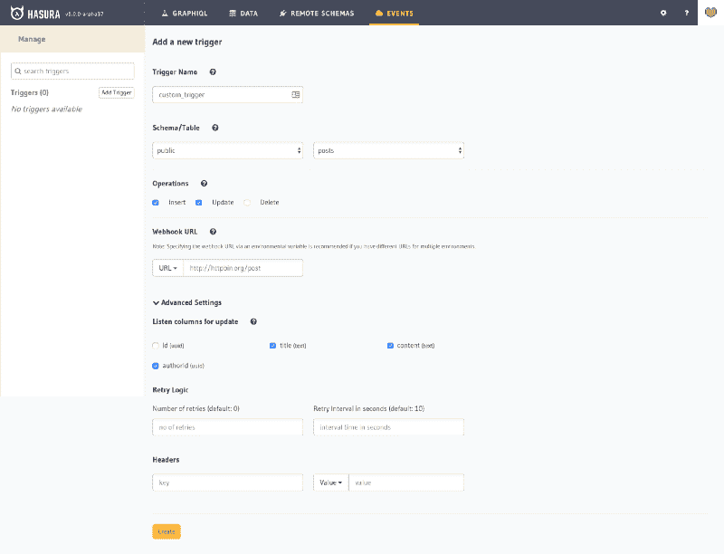](https://res.cloudinary.com/practicaldev/image/fetch/s--zvxn1VDF--/c_limit%2Cf_auto%2Cfl_progressive%2Cq_auto%2Cw_880/https://cdn-images-1.medium.com/max/800/1%2ArDAPtPK_PRfYdpmCc-RfcQ.png)

# 总结

正如您从这个概述中看到的， [hasura.io](https://hasura.io) 平台非常灵活，几乎可以在任何地方运行，并且有许多功能可以帮助您轻松创建任何复杂程度的 GraphQL API。另外，Hasura 是[开源的](https://github.com/hasura)，用 Haskell 和 JavaScript 编写，所以欢迎所有的贡献。也欢迎[加入哈苏拉的不和谐](https://discordapp.com/invite/vBPpJkS)或[关注推特](https://twitter.com/hasurahq)