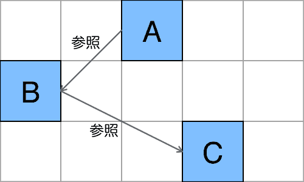
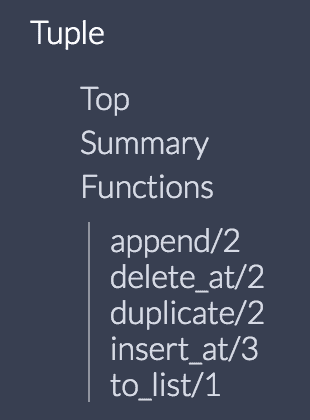

# Elixir :列表和元组什么时候用

> 原文：<https://dev.to/gumi/elixir--1fme>

列表和元组都是多个数据的容器。 无论值类型如何，都可以作为要素容纳任意数量(参照《[Elixir 入门 02 :类型的基本](https://dev.to/gumi/elixir-02--30n1))。

```
iex> list = [3.14, :pie, true, "Apple"]
[3.14, :pie, true, "Apple"]
iex> tuple = {3.14, :pie, true, "Apple"}
{3.14, :pie, true, "Apple"} 
```

Enter fullscreen mode Exit fullscreen mode

但是，两种结构不同，因此使用方法也不同。 作为两者的区别，可以列举以下几点。

| 不同的地方 | 元组 | 列表 |
| --- | --- | --- |
| 尺寸 | fixed | Kezhen |
| 使用元素 | 原则上不做 | 除了`List`以外，还可以使用`Enum`的函数 |
| 浏览数据 | 好快 | 有时会很晚 |

# 列表的结构

列表为“[连接列表](https://ja.wikipedia.org/wiki/%E9%80%A3%E7%B5%90%E3%83%AA%E3%82%B9%E3%83%88)”。 每个元素都有值和对以下元素的引用: 不具备确定元素的索引。

[](https://res.cloudinary.com/practicaldev/image/fetch/s--_tc6koUr--/c_limit%2Cf_auto%2Cfl_progressive%2Cq_auto%2Cw_880/https://qiita-image-store.s3.amazonaws.com/0/262045/8a3e67ae-1176-b0f1-937d-614c5fb64ac6.png)

# 元组的结构

元组是具有序号索引的静态数据结构。 按索引顺序统一存储在内存中。

[](https://res.cloudinary.com/practicaldev/image/fetch/s--5DIC7N7q--/c_limit%2Cf_auto%2Cfl_progressive%2Cq_auto%2Cw_880/https://qiita-image-store.s3.amazonaws.com/0/262045/0b83549a-f113-6a14-1618-e8721bcd81b8.png)

# 与尺寸相关的差异

列表可以自由添加或删除要素。 列表的大小取决于其数量及其数据。 元组的大小是在将元素放在一起时确定的。 实际上不会添加或删除元素。

得到大小的函数的列表为[`length/1`](https://hexdocs.pm/elixir/Kernel.html#length/1)，元组为[`tuple_size/1`](https://hexdocs.pm/elixir/Kernel.html#tuple_size/1)<sup id="fnref1">[1](#fn1)</sup> 。 处理有以下不同。

| Numbering | 价格的计算方法 | Jun Li |
| --- | --- | --- |
| 长度/1 | 数着还给你 | 太慢了 |
| tuple_size/1 | 被预先计算好 | 好快 |

# 要素的追加和删除等操作

列表除了[`List`](https://hexdocs.pm/elixir/List.html)之外，还可以通过[`Enum`](https://hexdocs.pm/elixir/Enum.html)模块的丰富函数进行操作。 不仅可以添加、删除或修改特定元素，还可以提取和处理所有元素。

操作元组的[`Tuple`](https://hexdocs.pm/elixir/Tuple.html)模块的[函数](https://hexdocs.pm/elixir/Tuple.html#functions)不多(图 001 )。 当您想处理元素时，建议使用列表。 因为添加要素或改写时，会在内存中创建新的元组，导致负荷变高。

> 若要操作元素集合，请改用列表。
> ([元组](https://hexdocs.pm/elixir/Tuple.html) 」より)

#### t0-t1-001■tuple 具备的函数

[](https://res.cloudinary.com/practicaldev/image/fetch/s--VL3IjZDp--/c_limit%2Cf_auto%2Cfl_progressive%2Cq_auto%2Cw_880/https://thepracticaldev.s3.amazonaws.com/i/qafhjmlhsry8ferqz5dd.png)

# 数据的参照和取出

列表中没有索引，通过在元素之间进行引用来检索值。 这意味着，要引用最后一个元素，必须按顺序遍历所有元素。 不过，枚举和处理所有要素也可以，可以使用`Enum`模块的函数。

元组元素可以通过[`elem/2`](https://hexdocs.pm/elixir/Kernel.html#elem/2)函数进行索引并立即检索。 但是，不能使用`Enum`模块的函数。

```
iex> tuple = {:ok, "hello"}
{:ok, "hello"}
iex> elem(tuple, 1)
"hello" 
```

Enter fullscreen mode Exit fullscreen mode

# 合适的使用方法

列表可以自由操作元素，在内存允许的情况下添加。 元组将趋向于预先确定的数据交换。

处理数据、数量变化，特别是处理很多数据时使用列表。 当表示一个数据的多个属性值时，元组可能比较合适。 典型的是键和值的组合。 常用于函数返回值。 例如，[`File.read/1`](https://hexdocs.pm/elixir/File.html#read/1)会以元组形式返回文件读取的结果和内容。

```
iex> File.read("path/to/existing/file")
{:ok, "... ファイルの中身 ..."}
iex> File.read("path/to/unknown/file")
{:error, :enoent} 
```

Enter fullscreen mode Exit fullscreen mode

此外，元组还用于模式匹配。

```
iex> tuple = {:ok, :example}
{:ok, :example}
iex> {:ok, atom} = tuple
{:ok, :example}
iex> atom
:example 
```

Enter fullscreen mode Exit fullscreen mode

随着属性数量的增加，贴图可能比元组更容易理解。

```
iex> {100, 150, 50}
{100, 150, 50}
iex> %{x: 100, y: 150, z: 50}
%{x: 100, y: 150, z: 50} 
```

Enter fullscreen mode Exit fullscreen mode

也可以将列表和元组组合在一起。 关键字列表就是一个例子(参照《[Elixir 入门 07 :关键字列表和地图](https://dev.to/gumi/elixir-07--39hi))。

```
iex> point = [x: 100, y: 150, z: 50]
[x: 100, y: 150, z: 50]
iex> point == [{:x, 100}, {:y, 150}, {:z, 50}]
true 
```

Enter fullscreen mode Exit fullscreen mode

# 总结

*   列表和元组都可以存储多个任意类型的数据。
*   由于列表和元组的工作方式不同，因此在以下方面存在差异:
    *   尺寸
    *   使用元素
    *   浏览数据
*   列表和元组都有各自性质的用途。
    *   列表:操作元素，数量变化的数据
    *   元组:具有多个属性值的固定数据

* * *

1.  关于计数数据结构中元素的函数，Elixir 决定了命名方法。 返回预先计算的值的是带`size`的函数。 计数并返回的函数附有`length`。 调查了长度后返回的话，数量越多处理越慢。