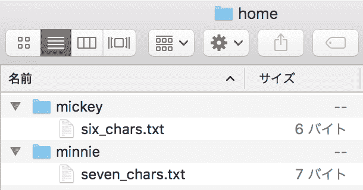

# Elixir Beginner's 17: Record of Internal Package

> 原文：<https://dev.to/gumi/elixir-17--5gci>

本文在 Elixir 官方网站的许可下，根据“[Comprehensions](https://elixir-lang.org/getting-started/comprehensions.html) ”的解说，加以修改，对 Elixir 中可以使用的内涵表记的句法进行说明。

Elixir 经常循环检索可枚举的数据，进行筛选，然后将值映射到其他列表。 内涵标记是这样处理的糖衣句法。 [使用`for/1`](https://hexdocs.pm/elixir/Kernel.SpecialForms.html#for/1)按以下 3 个要素组装。

*   发电机
*   过滤器
*   收藏家

例如，以下代码将整数列表中的值平方映射:

```
iex> for n <- [1, 2, 3, 4, 5], do: n * n
[1, 4, 9, 16, 25] 
```

Enter fullscreen mode Exit fullscreen mode

# 发生器

从基础数据结构中检索值的表达式就是生成器。 用内涵表示法从`<-`的右边制作的值按顺序传递到左边。 如果是枚举类型的数据，可以放在生成器表达式的右边。

```
iex> for n <- 1..5, do: n * n
[1, 4, 9, 16, 25] 
```

Enter fullscreen mode Exit fullscreen mode

关键词列表、地图、二进制等也可以通过生成器处理。

```
iex> for {_key, val} <- [one: 1, two: 2, three: 3], do: val
[1, 2, 3]
iex> for {key, val} <- %{one: 1, two: 2, three: 3}, do: {key, val}
[one: 1, three: 3, two: 2]
iex> for <<char <- "hello">>, do: <<char>>
["h", "e", "l", "l", "o"] 
```

Enter fullscreen mode Exit fullscreen mode

生成器表达式的左边可以使用模式匹配。 与模式不匹配的值将被忽略。 例如，以下示例使用关键字列表中的键作为模式。

```
iex> numbers = [identity: 1, prime: 2, prime: 3, normal: 4, prime: 5]
[identity: 1, prime: 2, prime: 3, normal: 4, prime: 5]
iex> for {:prime, n} <- numbers, do: n * n
[4, 9, 25] 
```

Enter fullscreen mode Exit fullscreen mode

可以使用多个生成器。

```
iex> for i <- [:a, :b, :c], j <- [1, 2], do:  {i, j}
[a: 1, a: 2, b: 1, b: 2, c: 1, c: 2] 
```

Enter fullscreen mode Exit fullscreen mode

多个生成器被视为嵌套循环。

```
iex> for i <- [1, 2, 3], j <- 1..i, do: [i: i, j: j]
[
  [i: 1, j: 1],
  [i: 2, j: 1],
  [i: 2, j: 2],
  [i: 3, j: 1],
  [i: 3, j: 2],
  [i: 3, j: 3]
] 
```

Enter fullscreen mode Exit fullscreen mode

另外，内涵标记中变量的代入不会对外部产生影响。

# 滤波器

从生成器中提取的值通过过滤器缩小范围。 作为过滤器规定的是函数。 只使用返回值既不是`false`也不是`nil`的值。

```
iex> multiple_of_3? = fn(n) -> rem(n, 3) == 0 end
#Function<6.99386804/1 in :erl_eval.expr/5>
iex> for n <- 0..10, multiple_of_3?.(n), do: n * n
[0, 9, 36, 81] 
```

Enter fullscreen mode Exit fullscreen mode

可以将过滤器视为内涵标记中的防护。 内置函数也可以用作过滤器。

```
iex> import Integer
Integer
iex> for n <- 0..10, is_even(n), do: n
[0, 2, 4, 6, 8, 10] 
```

Enter fullscreen mode Exit fullscreen mode

和生成器一样，也会给出多个过滤器。

```
iex> for n <- 0..100,
...>   is_odd(n),
...>   rem(n, 7) == 0,
...> do: n
[7, 21, 35, 49, 63, 77, 91] 
```

Enter fullscreen mode Exit fullscreen mode

使用内涵表示法的话，使用`Enum`和`Stream`模块的函数的处理可以写得简洁多了。 而且，可以增加几个生成器和过滤器。 以下代码从目录列表中查找文件的路径，确保是标准文件，然后以列表输出每个文件的大小(图 001 )。

```
# example.exs
dirs = ['home/mickey', 'home/minnie']
for dir  <- dirs,
    file <- File.ls!(dir),
    path = Path.join(dir, file),
    File.regular?(path) do
  IO.puts(File.stat!(path).size)
end 
```

Enter fullscreen mode Exit fullscreen mode

```
$  elixir example.exs
6
7 
```

Enter fullscreen mode Exit fullscreen mode

#### [t1■目录内的文件](#%E5%9B%B3001%E2%96%A0%E3%83%87%E3%82%A3%E3%83%AC%E3%82%AF%E3%83%88%E3%83%AA%E5%86%85%E3%81%AE%E3%83%95%E3%82%A1%E3%82%A4%E3%83%AB)

[](https://res.cloudinary.com/practicaldev/image/fetch/s--_bQSuBVK--/c_limit%2Cf_auto%2Cfl_progressive%2Cq_auto%2Cw_880/https://thepracticaldev.s3.amazonaws.com/i/11jyulcxwddu56xrxvnl.png)

*   [`File.ls!/1`](https://hexdocs.pm/elixir/File.html#ls!/1):以列表形式返回目录中文件的路径。
*   [`File.regular?/1`](https://hexdocs.pm/elixir/File.html#regular?/1):返回逻辑值的路径是否为标准文件。
*   [`File.stat!/2`](https://hexdocs.pm/elixir/File.html#stat!/2):用结构体返回[文件的信息](https://hexdocs.pm/elixir/File.Stat.html#t:t/0)。

# 比特串生成器

位串也可以由生成器处理。 它便于分析比特流。 例如，您可以以流的形式接收像素的 RGB 颜色分量值，并将每个像素组织为 RGB 分量值的元组。

```
iex> pixels = <<213, 45, 132, 64, 76, 32, 76, 0, 0, 234, 32, 15>>
<<213, 45, 132, 64, 76, 32, 76, 0, 0, 234, 32, 15>>
iex> for <<r::8, g::8, b::8 <- pixels>>, do: [r: r, g: g, b: b]
[
  [r: 213, g: 45, b: 132],
  [r: 64, g: 76, b: 32],
  [r: 76, g: 0, b: 0],
  [r: 234, g: 32, b: 15]
] 
```

Enter fullscreen mode Exit fullscreen mode

# : into 选项

内涵默认情况下返回列表。 但是，结果也可以收纳到列表以外的数据结构中。 在这种情况下，用`:into`选项给出其数据结构。 下面的代码是一个从字符列表中获取字符串的示例。

```
iex> for c <- [104, 101, 108, 108, 111], into: "", do: <<c>>
"hello" 
```

Enter fullscreen mode Exit fullscreen mode

以下示例返回字符串，但字符串中不包含空格。

```
iex> for <<char <- " to be, to be, ten made to be ">>, char != ?\s, into: "", do: <<char>>
"tobe,tobe,tenmadetobe" 
```

Enter fullscreen mode Exit fullscreen mode

`:into`选项被赋予安装了[`Collectable`协议](https://hexdocs.pm/elixir/Collectable.html)的数据结构。 最常用的情况是保留贴图的关键帧并更改值。

```
iex> for {key, val} <- %{a: 1, b: 2, c: 3}, into: %{}, do: {key, val * val}
%{a: 1, b: 4, c: 9} 
```

Enter fullscreen mode Exit fullscreen mode

[`IO.stream/2`](https://hexdocs.pm/elixir/IO.html#stream/2)将输入设为[`IO.Stream`](https://hexdocs.pm/elixir/IO.Stream.html)后返回。 并且，`IO.Stream`安装的协议是`Enumerable`和`Collectable`。 以下代码将从键盘输入的英文字母以[`String.upcase/2`](https://hexdocs.pm/elixir/String.html#upcase/2)大写并输出到 shell。 另外，要退出等待输入的状态，请结束`IEx`。

```
iex> stream = IO.stream(:stdio, :line)
%IO.Stream{device: :standard_io, line_or_bytes: :line, raw: false}
iex> for line <- stream, into: stream do
...>   String.upcase(line) <> "\n"
...> end
elixir  #<- 入力
ELIXIR  #<- 出力 
```

Enter fullscreen mode Exit fullscreen mode

#### Elixir 入门彩票

*   [Elixir 入门 01 :编写代码并尝试](https://dev.to/gumi/elixir-01--2585)
*   [Elixir 入门 02 :型的基本](https://dev.to/gumi/elixir-02--30n1)
*   [Elixir 入门 03 :运算符的基本](https://dev.to/gumi/elixir-03--33im)
*   [Elixir 入门 04 :模式匹配](https://dev.to/gumi/elixir-04--1346)
*   [仙丹入門 05: 条件-情况/条件/条件](https://dev.to/gumi/elixir-05----casecondif-60o)
*   [Elixir 入门 06 :二进制和字符串以及字符列表](https://dev.to/gumi/elixir-06--35na)
*   [Elixir 入门 07 :关键词列表和地图](https://dev.to/gumi/elixir-07--39hi)
*   [Elixir 入门 08 :模块和函数](https://dev.to/gumi/elixir-08--1c4c)
*   [Introduction T0】 Elixir 09: Rethink](https://dev.to/gumi/elixir-09--1a0p)
*   [仙丹入門 10: EnumとStream](https://dev.to/gumi/elixir-10-enumstream-4fpb)
*   [Elixir 入门 11 :流程](https://dev.to/gumi/elixir-11--2mia)
*   [Elixir 入门 12 :输入输出和文件系统](https://dev.to/gumi/elixir-12--4og6)
*   [仙丹入門 13: aliasとrequireおよびimport](https://dev.to/gumi/elixir-13-aliasrequireimport-55c1)
*   [Elixir 入门 14 :模块的属性](https://dev.to/gumi/elixir-14--3511)
*   [T0】 Elixir Beginner 15: Structure
*   [Elixir 入门 16 :协议](https://dev.to/gumi/elixir-16--lif)
*   Elixir Beginner's 17: Record of Internal Package
*   [Elixir 入门 18 :锡吉尔](https://dev.to/gumi/elixir-18--5791)
*   [仙丹入門 19: tryとcatchおよびrescue](https://dev.to/gumi/elixir-19-trycatchrescue-50i8)
*   [Elixir 入门 20 :类型规格和行为](https://dev.to/gumi/elixir-20--j50)
*   [Elixir 入门 21 :调试](https://dev.to/gumi/elixir-21--21a1)
*   [Elixir 入门 22: Erlang 库](https://dev.to/gumi/elixir-22-erlang-2492)
*   [Elixir 入门 23 :下一步](https://dev.to/gumi/elixir-23--50ik)

##### Fanwai

*   [Elixir 入门:使用 Plug 为](https://dev.to/gumi/elixir-plug-40lb)