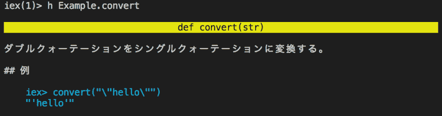

# Elixir 入门 18 :锡吉尔

> 原文：<https://dev.to/gumi/elixir-18--5791>

本文在 Elixir 官方网站的许可下，根据“[Sigils](https://elixir-lang.org/getting-started/sigils.html) ”的解说，加以修改，对 Elixir 中锡吉尔的使用方法进行说明。

Elixir 处理的文本中，有双引号(`""`)的字符串和单引号的字符列表(`''`)。 除此之外阿童木也是文本表达方式之一。 另外，作为在 Elixir 中处理文本表现的结构，将对锡吉尔进行说明。

Elixir 重视可扩展性。 因为如果语言容易扩展的话，开发者和社区等会根据各自的目的增加功能。 西尔也可以扩展 Elixir 的文本表示。

西格尔在以颚化符(`~`)开始的识别符上附上分隔符表示。 之后可能还会添加可选的修饰符。

# Normal performance

Elixir 中使用最多的锡吉尔是`~r`，制作[正则表达式](https://hexdocs.pm/elixir/Regex.html#content)。 Elixir 的正则表达式是通过 Perl 兼容的[PCRE](https://ja.wikipedia.org/wiki/Perl_Compatible_Regular_Expressions) 库实现的。 也可以使用修饰符。 例如，`i`不区分大小写。 请使用[`=~/2`](https://hexdocs.pm/elixir/Kernel.html#=~/2)与正则表达式进行等价比较。

```
iex> "hello" =~ ~r/hello/
true
iex> "HELLO" =~ ~r/hello/
false
iex> "HELLO" =~ ~r/hello/i
true
iex> "world" =~ ~r/hello|world/
true 
```

Enter fullscreen mode Exit fullscreen mode

以下代码确定正则表达式中的字符串是否至少包含以半角空格分隔的两个单词。

```
iex> words = ~r/(\w+)\s(\w+)/
~r/(\w+)\s(\w+)/
iex> "hello" =~ words
false
iex> "hello world" =~ words
true 
```

Enter fullscreen mode Exit fullscreen mode

此外，Elixir 可以使用基于 Erlang 正则表达式的 API。 以下代码是分为字符串列表的[`Regex.split/3`](https://hexdocs.pm/elixir/Regex.html#split/3)和替换字符串的[`Regex.replace/4`](https://hexdocs.pm/elixir/Regex.html#replace/4)的使用示例。 详情请参阅“[`Regex`](https://hexdocs.pm/elixir/Regex.html)”模块的解说。

```
iex> string = "100_000_000"
"100_000_000"
iex> Regex.split(~r/_/, string)
["100", "000", "000"]
iex> Regex.replace(~r/_/, string, ",")
"100,000,000" 
```

Enter fullscreen mode Exit fullscreen mode

在介绍的代码示例中，正则表达式的分隔符使用了反斜杠(`\`)。 但是，锡吉尔可以使用以下 8 个分隔符。

```
~r/hello/
~r|hello|
~r"hello"
~r'hello'
~r(hello)
~r[hello]
~r{hello}
~r<hello> 
```

Enter fullscreen mode Exit fullscreen mode

之所以能够区分使用多个分隔符，是因为即使文字中包含分隔符也不会转义。

```
iex> ~r(^https?://) == ~r/^https?:\/\//
true 
```

Enter fullscreen mode Exit fullscreen mode

# 字符串和字符列表以及单词列表的西里尔

除了正则表达式外，还有字符串、字符列表和单词列表西里尔。

## text column

锡吉尔`~s`会生成字符串。 与双引号(`""`)的字符串相同。 但是，字符串中包含双引号时很方便。

```
iex> ~s(this is a string with "double" quotes, not 'single' ones)
"this is a string with \"double\" quotes, not 'single' ones" 
```

Enter fullscreen mode Exit fullscreen mode

## 字符列表

制作文字列表的是吉尔`~c`。 可以很容易地写下包含单引号(`''`)的文字列表。

```
iex> ~c(this is a char list containing 'single' and "double" quotes)
'this is a char list containing \'single\' and "double" quotes' 
```

Enter fullscreen mode Exit fullscreen mode

## 单词列表

西里尔`~w`用于编制单词列表。 单词是用空格分隔的字符串。 作为修饰符附加`s`或`a`或`c`。 要改变的是单词列表元素的数据类型。 `s`为默认字符串，`a`为原子，`c`为字符列表。

```
iex> ~w(hello tokyo japan)
["hello", "tokyo", "japan"]
iex> ~w(hello tokyo japan)a
[:hello, :tokyo, :japan]
iex> ~w(hello tokyo japan)c
['hello', 'tokyo', 'japan']
iex> ~w(拝啓　時下ますます)
["拝啓", "時下ますます"] 
```

Enter fullscreen mode Exit fullscreen mode

## NaiveDateTime

锡吉尔`~N`制作的是特别的[`NaiveDateTime`结构体](https://hexdocs.pm/elixir/NaiveDateTime.html)。 表示没有时区的日期和时间。 `NaiveDateTime`很少直接制作结构体吧。 但是，可以考虑用于模式匹配。

```
iex> new_year_18 = NaiveDateTime.from_iso8601("2018-01-01 00:00:00")
{:ok, ~N[2018-01-01 00:00:00]}
iex> new_year_18 == {:ok, ~N[2018-01-01 00:00:00]}
true 
```

Enter fullscreen mode Exit fullscreen mode

# 锡吉尔的插值和转义

西里尔除了`~N`外，分别有小写和大写。 区别在于是否对应转义字符和插值(表 001 )。 大写的西里尔将转义字符也直接作为字符处理，不进行插值。

```
iex> intr = "inter "
"inter "
iex> pol = "polation"
"polation"
iex> ~s(String with escape codes \x26 #{intr <> pol})
"String with escape codes & inter polation"
iex> ~S(String without escape codes \x26 #{intr <> pol})
"String without escape codes \\x26 \#{intr <> pol}"
iex> ~w(String without escape codes \x26 #{intr <> pol})
["String", "without", "escape", "codes", "&", "inter", "polation"]
iex> ~W(String without escape codes \x26 #{intr <> pol})
["String", "without", "escape", "codes", "\\x26", "\#{intr", "<>", "pol}"] 
```

Enter fullscreen mode Exit fullscreen mode

#### 表 001■锡吉尔和逃跑

| 有转义 | 无转义 | expression |
| --- | --- | --- |
| ~r | ~R | Normal expression |
| ~s | ~S | Text column |
| ~c | ~C | 字符列表 |
| ~w | ~W | 单词列表 |
|  | ~N | `NaiveDateTime` Structure |

可以使用的转义码如下(参照“[ASCII 控制字符](https://ja.wikipedia.org/wiki/ASCII#ASCII%E5%88%B6%E5%BE%A1%E6%96%87%E5%AD%97)”)。

*   `\\`:反斜杠(`\`)
*   `\a`:铃声(警告)
*   `\b`:后空间
*   `\d`: cut off
*   `\e`:退出
*   `\f`:格式进给
*   `\n`: Change professions.
*   `\r`: Dress up.
*   `\s`:空格
*   `\t`:标签
*   `\v`:垂直标签
*   `\0`:空字符
*   `\xDD`:十六进制 1 字节
    *   Example: `\x13`
*   `\uDDDD`或`\u{D...}`:十六进制 Unicode 代码点
    *   Example: \u{1F600})

(双引号或单引号)如果引号中包含相同的引号，则必须用`\`转义。

此外，用双引号括起来的字符串中的双引号必须作为\ "转义，用单引号括起来的字符列表中的单引号必须作为\ '转义。 这时，使用大写字母就可以避免转义的烦恼。

锡吉尔在[手册](https://ja.wikipedia.org/wiki/%E3%83%92%E3%82%A2%E3%83%89%E3%82%AD%E3%83%A5%E3%83%A1%E3%83%B3%E3%83%88)中也可以使用。 分隔符是三连引号。

```
iex> ~s"""
...> これは
...> ヒア文字列
...> """
"これは\nヒア文字列\n" 
```

Enter fullscreen mode Exit fullscreen mode

写文档时，最能考虑在透明文档中使用锡吉尔的情况。 它经常包含转义字符(图 001 )。 特别是转义字符持续的话很难看清，也容易发生错误。

```
defmodule Example do
  @doc """
    ダブルクォーテーションをシングルクォーテーションに変換する。

    ## 例

      iex> convert("\\\"hello\\\"")
      "'hello'"

  """
  def convert(str) do

  end
end 
```

Enter fullscreen mode Exit fullscreen mode

#### [t1■被显示的文档](#%E5%9B%B3001%E2%96%A0%E8%A1%A8%E7%A4%BA%E3%81%95%E3%82%8C%E3%81%9F%E3%83%89%E3%82%AD%E3%83%A5%E3%83%A1%E3%83%B3%E3%83%88)

[](https://res.cloudinary.com/practicaldev/image/fetch/s--4SCH92FB--/c_limit%2Cf_auto%2Cfl_progressive%2Cq_auto%2Cw_880/https://thepracticaldev.s3.amazonaws.com/i/n3kr0pucd4kim4hp0nz7.png)

这种时候，只要使用大写字母`~S`，就可以直接写字符串。

```
defmodule Example do
  @doc ~S"""
    ダブルクォーテーションをシングルクォーテーションに変換する。

    ## 例

      iex> convert("\"hello\"")
      "'hello'"

  """
  def convert(str) do

  end
end 
```

Enter fullscreen mode Exit fullscreen mode

# 定制锡吉尔

Elixir 的锡吉尔可以扩展。 例如，使用锡吉尔`~r`与调用[`sigil_r/2`](https://hexdocs.pm/elixir/Kernel.html#sigil_r/2)相同。 将二进制或字符列表传递给第一个参数，将可选修饰符传递给第二个参数。

```
iex> r_hello = sigil_r(<<"hello">>, 'i')
~r/hello/i
iex> "HELLO" =~ r_hello
true 
```

Enter fullscreen mode Exit fullscreen mode

根据`sigil_{identifier}`的模式安装函数时，会确定西里尔。 [`String.upcase/2`](https://hexdocs.pm/elixir/String.html#upcase/2)和[`String.downcase/2`](https://hexdocs.pm/elixir/String.html#downcase/2)是将字符串分别转换为大写字母或者小写字母的函数。 在这两个函数中，可以按以下方式将字符串更改为大小写。 小写字母作为修饰符添加到了第二个参数的字符列表中。

```
defmodule MySigils do
  def sigil_u(string, []), do: String.upcase(string)
  def sigil_u(string, [?d]), do: String.downcase(string)
end 
```

Enter fullscreen mode Exit fullscreen mode

```
iex> import MySigils
MySigils
iex> ~u(hello world)
"HELLO WORLD"
iex> ~u(Hello World)d
"hello world" 
```

Enter fullscreen mode Exit fullscreen mode

锡吉尔宏观确定的话，也可以用于编译时的工作。 例如，正则表达式在编译源代码时会优化其表示形式。 然后，在运行时将省略该步骤。

#### Elixir 入门彩票

*   [Elixir 入门 01 :编写代码并尝试](https://dev.to/gumi/elixir-01--2585)
*   [Elixir 入门 02 :型的基本](https://dev.to/gumi/elixir-02--30n1)
*   [Elixir 入门 03 :运算符的基本](https://dev.to/gumi/elixir-03--33im)
*   [Elixir 入门 04 :模式匹配](https://dev.to/gumi/elixir-04--1346)
*   [仙丹入門 05: 条件-情况/条件/条件](https://dev.to/gumi/elixir-05----casecondif-60o)
*   [Elixir 入门 06 :二进制和字符串以及字符列表](https://dev.to/gumi/elixir-06--35na)
*   [Elixir 入门 07 :关键词列表和地图](https://dev.to/gumi/elixir-07--39hi)
*   [Elixir 入门 08 :模块和函数](https://dev.to/gumi/elixir-08--1c4c)
*   [Introduction T0】 Elixir 09: Rethink](https://dev.to/gumi/elixir-09--1a0p)
*   [仙丹入門 10: EnumとStream](https://dev.to/gumi/elixir-10-enumstream-4fpb)
*   [Elixir 入门 11 :流程](https://dev.to/gumi/elixir-11--2mia)
*   [Elixir 入门 12 :输入输出和文件系统](https://dev.to/gumi/elixir-12--4og6)
*   [仙丹入門 13: aliasとrequireおよびimport](https://dev.to/gumi/elixir-13-aliasrequireimport-55c1)
*   [Elixir 入门 14 :模块的属性](https://dev.to/gumi/elixir-14--3511)
*   [T0】 Elixir Beginner 15: Structure
*   [Elixir 入门 16 :协议](https://dev.to/gumi/elixir-16--lif)
*   [T0】 Elixir Beginner's Level 17: Record of Internal Package
*   Elixir 入门 18 :锡吉尔
*   [仙丹入門 19: tryとcatchおよびrescue](https://dev.to/gumi/elixir-19-trycatchrescue-50i8)
*   [Elixir 入门 20 :类型规格和行为](https://dev.to/gumi/elixir-20--j50)
*   [Elixir 入门 21 :调试](https://dev.to/gumi/elixir-21--21a1)
*   [Elixir 入门 22: Erlang 库](https://dev.to/gumi/elixir-22-erlang-2492)
*   [Elixir 入门 23 :下一步](https://dev.to/gumi/elixir-23--50ik)

##### Fanwai

*   [Elixir 入门:使用 Plug 为](https://dev.to/gumi/elixir-plug-40lb)