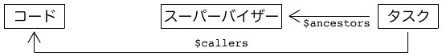

# Elixir 1.8.0 已正式发布

> 原文：<https://dev.to/gumi/elixir-180-pfo>

Elixir 1.8 现已正式发布。 主要是对基础部分进行了改善。 本文以[发行说明](https://github.com/elixir-lang/elixir/releases/tag/v1.8.0)(英文)为基础，对以下 4 个项目进行说明。

*   定制结构检查
*   应对时区数据库
*   加快编译速度和其他性能改善
*   改善测量和监视功能和添加$callers

# 定制结构检查

Elixir 的[`Inspect`](https://hexdocs.pm/elixir/Inspect.html)协议的实现，可以提取数据了。 检查数据结构时，字段可以很容易地过滤。 当用户的数据结构包含与隐私相关的信息时可以使用。 例如，在以下结构体中，`:email`和`:encrypted_password`等个人信息。 [`inspect/2`](https://hexdocs.pm/elixir/Kernel.html#inspect/2)函数调查的话，默认情况下会取出所有的字段。

```
defmodule User do
  defstruct [:id, :name, :age, :email, :encrypted_password]
end 
```

Enter fullscreen mode Exit fullscreen mode

对于不想输出到日志或错误报告等中的数据，将规定`Inspect`协议的自定义安装。 在 Elixir 1.8 中，再在`Inspect`协议中加入[`@derive`](https://hexdocs.pm/elixir/Inspect.html#module-deriving)，可以轻松提取数据。 如果在选项`:only`中选择字段，则不显示其他内容。

```
defmodule User do
  @derive {Inspect, only: [:id, :name, :age]}
  defstruct [:id, :name, :age, :email, :encrypted_password]
end

inspect(%User{id: 1, name: "Homer", age: 33, address: "742 Evergreen Terrace"})
#=> #User<id: 1, name: "Homer", age: 33, ...> 
```

Enter fullscreen mode Exit fullscreen mode

选项中还有一个`:except`，用于筛选不显示的字段(`@derive {Inspect, except: [...]}`)。

# 对应时区数据库

为了处理日期和时间，Elixir 1.3 提供了以下四种日历类型:

*   `Time`
*   `Date`
*   `NaiveDateTime`(无时区)
*   `DateTime`(有时区)

虽然通过之后的更新对日历类型进行了改善，但是[`DateTime`](https://hexdocs.pm/elixir/DateTime.html)模块没能与时区数据库对应。

Elixir 1.8 中新增加了[`Calendar.TimeZoneDatabase`](https://hexdocs.pm/elixir/Calendar.TimeZoneDatabase.html)行为。 该行为使开发人员可以自己填充时区数据库。 通过在时区行为中明确规定规章，可以扩展 Elixir 的`DateTime API`。 例如，改变`DateTime`时区的是[`DateTime.shift_zone/3`](https://hexdocs.pm/elixir/DateTime.html#shift_zone/3)函数。 Elixir 默认配备只处理 UTC 的[`Calendar.UTCOnlyTimeZoneDatabase`](https://hexdocs.pm/elixir/Calendar.UTCOnlyTimeZoneDatabase.html)作为时区数据库。

除此之外，作为日历方面的改进，还新增了以下四个函数。

*   [T2`Date.day_of_year/1`](https://hexdocs.pm/elixir/Date.html#day_of_year/1)
*   [T2`Date.quarter_of_year/1`](https://hexdocs.pm/elixir/Date.html#quarter_of_year/1)
*   [T2`Date.year_of_era/1`](https://hexdocs.pm/elixir/Date.html#year_of_era/1)
*   [T2`Date.day_of_era/1`](https://hexdocs.pm/elixir/Date.html#day_of_era/1)

# 编译高速化和其他性能改善

通过去年对编译器的改进，Elixir 1.8 的编译平均快了 5%。 而且，这次为了缩短编译时间，进行舒适的开发而进行了改善。

在以下情况下，编译器将生成更高效的代码:

*   监控中的范围确认(`x in y..z`等)
*   插入字符列表(`'foo #{bar} baz'`等)
*   [`Record`](https://hexdocs.pm/elixir/Record.html)模块的记录操作

[`EEx`](https://hexdocs.pm/eex/EEx.html)对模板进行了共同的优化，代码变小，执行变快了。

# 改善测量监视功能和增加$callers

[`Task`](https://hexdocs.pm/elixir/Task.html)模块常用于生成几个轻流程并同时处理。 而且，Elixir 制定了新的流程时，为了表示其母体而赋予的是`$ancestors`键。 该信息用于跟踪测量工具在多个进程中发生的事件之间的关系。 但是在很多情况下，只有`$ancestors`的信息是不够的。

建议在管理员的指导下开始任务。 因为前景更好，可以管理节点掉落时如何完成任务。 为此，您将执行任务，例如，如下代码所示。 任务是用这个代码制作的。 但是这个时候，直接生成任务的父母会成为管理者。 管理员包含在任务的`$ancestors`列表中。 但是，与代码的关系会消失。

```
Task.Supervisor.start_child(MySupervisor, task_specification) 
```

Enter fullscreen mode Exit fullscreen mode

在 Elixir 1.8 中，现在可以从流程词典中用`$callers`键跟踪代码和任务之间的关系。 这个键可以和`$ancestors`一起使用。 在上述使用`Task.Supervisor`的代码中，有以下关系吧。

[](https://res.cloudinary.com/practicaldev/image/fetch/s--HI3ZRpwb--/c_limit%2Cf_auto%2Cfl_progressive%2Cq_auto%2Cw_880/https://thepracticaldev.s3.amazonaws.com/i/o1usuov1q7b4h15360su.png)

此时，对两个键`$ancestors`和`$callers`施加的内容如下。

[](https://res.cloudinary.com/practicaldev/image/fetch/s--kRfdPWGb--/c_limit%2Cf_auto%2Cfl_progressive%2Cq_auto%2Cw_880/https://thepracticaldev.s3.amazonaws.com/i/g1e1vup9n0lpf0bzwom8.png)

如果不使用管理员，直接从代码中创建任务，则代码运行的过程将进入`$ancestors`和`$callers`两个列表。

此功能将使检测和监控工具更容易跟踪和关联系统中发生的事件。 而且，也可以使用 Ecto 沙箱之类的工具。 Ecto 沙箱允许同时对数据库进行多个测试。 其中使用的事务和拥有机制都明确地分配了每个进程。 如果没有`$callers`，即使制作了询问数据库的任务，也不知道任务是从哪里调用的，不知道连接到哪里。 在许多情况下，依赖于任务的功能将无法同时测试。 通过`$callers`可以很容易地了解这一点，可以进行充分利用机器功率的测试。

详细变更请参考[发行说明](https://github.com/elixir-lang/elixir/releases/tag/v1.8.0)(英文)。