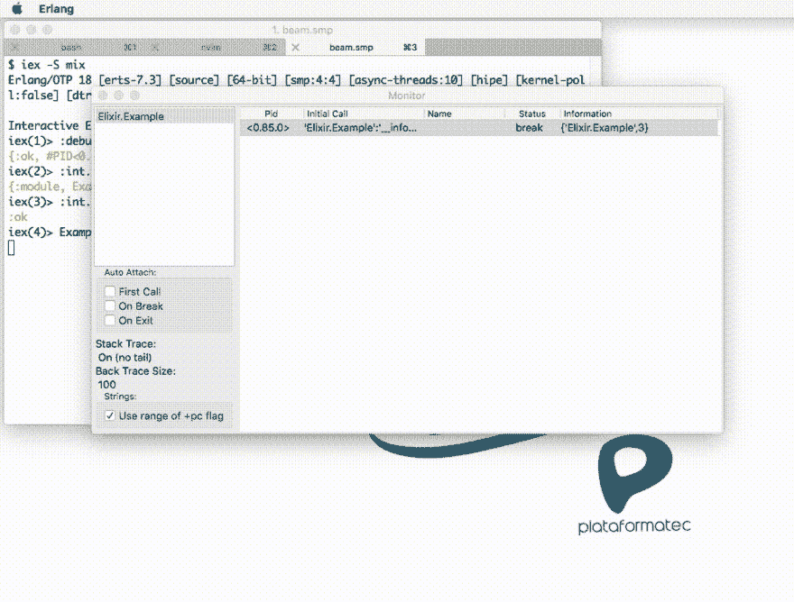
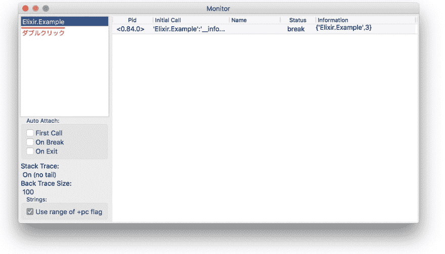
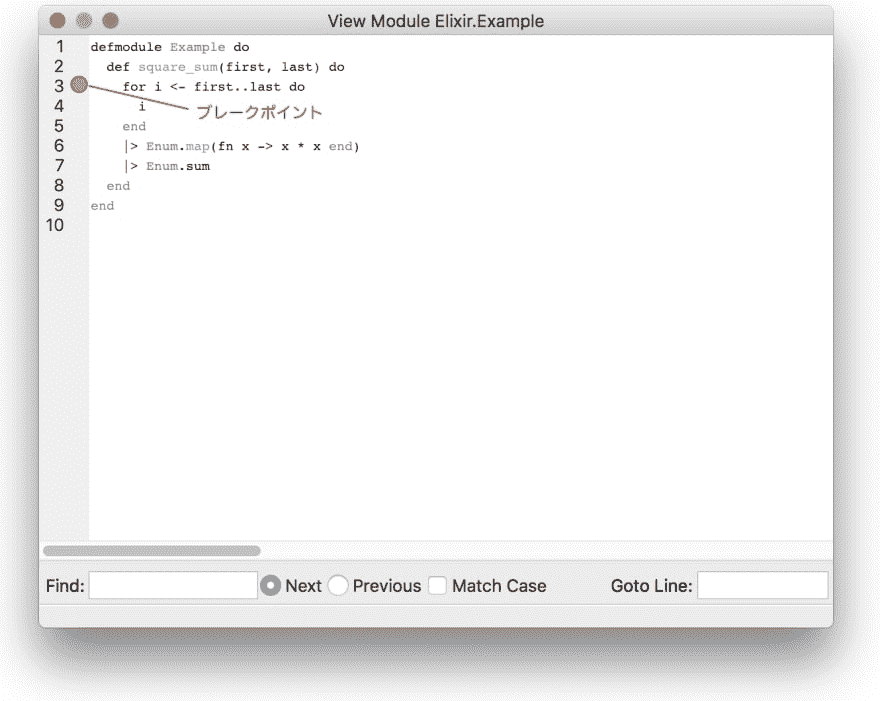
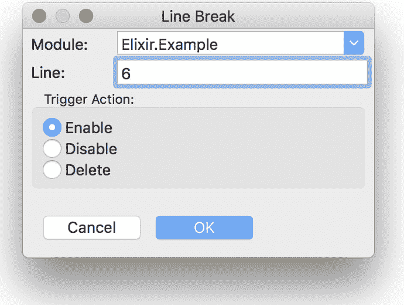
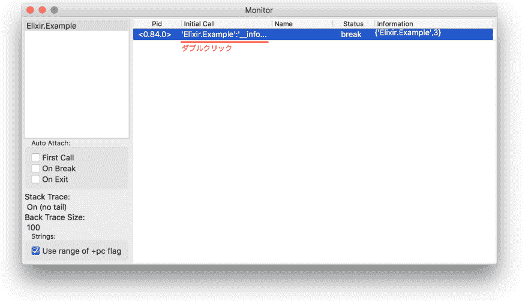
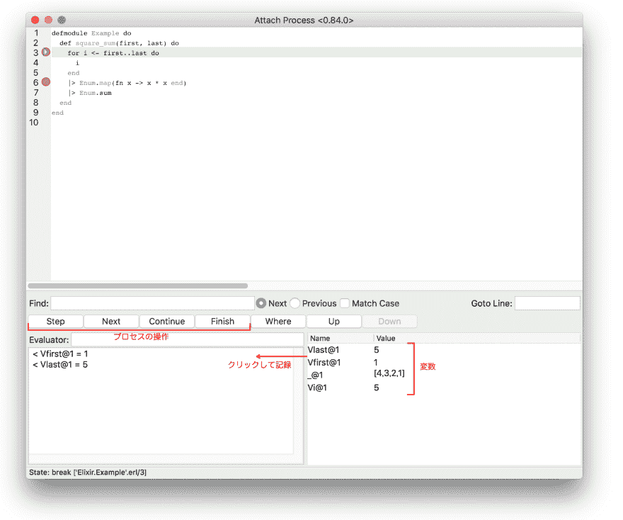
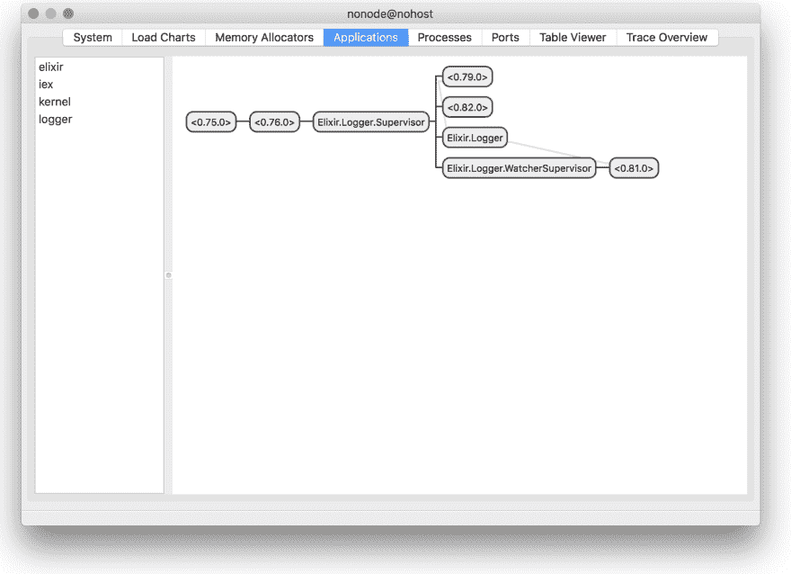

# Elixir 入门 21 :调试

> 原文：<https://dev.to/gumi/elixir-21--21a1>

本文在 Elixir 官网的许可下，根据“[Debugging](https://elixir-lang.org/getting-started/debugging.html) ”的解说，加以修改，对 Elixir 中经常进行的调试方法进行说明。

# IO.inspect/2

[`IO.inspect/2`](https://hexdocs.pm/elixir/IO.html#inspect/2)不改变原来的代码的动作，返回第 1 参数`item`，所以用于调试很方便。

```
inspect(item, opts \\ []) 
```

Enter fullscreen mode Exit fullscreen mode

例如，如下所示，在管道运算符`|>`后面的处理之间插入`IO.inspect/2`，确认值是如何变化的。 这样不会改变结果。

```
defmodule Example do
  def square_sum(first, last) do
    for i <- first..last do
      i
    end
    |> IO.inspect
    |> Enum.map(fn x -> x * x end)
    |> IO.inspect
    |> Enum.sum
  end
end 
```

Enter fullscreen mode Exit fullscreen mode

```
iex> Example.square_sum(1, 5)
[1, 2, 3, 4, 5]
[1, 4, 9, 16, 25]
55 
```

Enter fullscreen mode Exit fullscreen mode

如果将`:label`传递到`IO.inspect/2`的第 2 参数的选项，则会在要输出的第 1 参数的项目前添加该字符串。 经常组合使用的是返回变量和值的关键字列表的[`binding/0`](https://hexdocs.pm/elixir/Kernel.html#binding/0)。 如果传递到`IO.inspect/2`，则会确认调用函数时收到的参数名称和值。

```
defmodule Example do
  def square_sum(first, last) do
    IO.inspect binding()
    for i <- first..last do
      i
    end
    |> IO.inspect(label: "before")
    |> Enum.map(fn x -> x * x end)
    |> IO.inspect(label: "after")
    |> Enum.sum
  end
end 
```

Enter fullscreen mode Exit fullscreen mode

```
iex> Example.square_sum(1, 5)
[first: 1, last: 5]
before: [1, 2, 3, 4, 5]
after: [1, 4, 9, 16, 25]
55 
```

Enter fullscreen mode Exit fullscreen mode

关于可以向`IO.inspect/2`的第 2 自变量传递什么样的格式化用选项，请参阅“[Inspect.Opts](https://hexdocs.pm/elixir/Inspect.Opts.html) ”。

# IEx.pry/0とIEx.break!/2

使用`IO.inspect/2`是静态调试。 Elixir 的交互式 shell 还提供了一种允许交互式调试代码的动态方法。 其中之一是代替静态的`IO.inspect binding()`的[`IEx.pry/0`](https://hexdocs.pm/iex/IEx.html#pry/0)。 使用前请务必在[`require/2`](https://hexdocs.pm/elixir/Kernel.SpecialForms.html#require/2)中加入`IEx`模块。

```
defmodule Example do
  def square_sum(first, last) do
    require IEx; IEx.pry
    for i <- first..last do
      i
    end
    |> Enum.map(fn x -> x * x end)
    |> Enum.sum
  end
end 
```

Enter fullscreen mode Exit fullscreen mode

`iex`在会话中调用函数时，代码停止执行，`pry`会移动。 可以从 IEx 中引用所有变量、`import`或别名等。 要重新开始执行代码并返回`iex`，请调用[`respawn/0`](https://hexdocs.pm/iex/IEx.Helpers.html#respawn/0)。 在 Mix 项目中，也可以通过`iex -S mix`进行同样的调试。

```
iex> Example.square_sum(1, 5)
Break reached: Example.square_sum/2 (example.exs:3)

    1: defmodule Example do
    2:   def square_sum(first, last) do
    3:     require IEx; IEx.pry
    4:     for i <- first..last do
    5:       i

pry> first
1
pry> last
5
pry> respawn

Interactive Elixir (1.6.5) - press Ctrl+C to exit (type h() ENTER for help)
55 
```

Enter fullscreen mode Exit fullscreen mode

`IO.inspect/2`和`IEx.pry/0`都必须添加用于调试的代码。 [使用`break!/2`](https://hexdocs.pm/iex/IEx.html#break!/2)，无需修改源代码就可以在 IEx 中设置和管理断点。

但是，代码必须已编译。 例如，编译写有以下代码的文件`example.ex`(请参见“[Elixir 入门 08 :模块和函数](https://dev.to/gumi/elixir-08--1c4c)”“编译”)。

```
defmodule Example do
  def square_sum(first, last) do
    for i <- first..last do
      i
    end
    |> Enum.map(fn x -> x * x end)
    |> Enum.sum
  end
end 
```

Enter fullscreen mode Exit fullscreen mode

```
$  elixirc example.ex 
```

Enter fullscreen mode Exit fullscreen mode

在`iex`会话中调用`break!/2`时，在参数的函数中添加断点，可以在`pry`中参照参数和变量等。 表示现在位置的是[`whereami/1`](https://hexdocs.pm/iex/IEx.Helpers.html#whereami/1)。 根据参数不同，显示的代码范围会发生变化。

```
iex> break! Example.square_sum/2
1
iex> Example.square_sum(1, 5)
Break reached: Example.square_sum/2 (example.ex:2)

    1: defmodule Example do
    2:   def square_sum(first, last) do
    3:     for i <- first..last do
    4:       i

pry> first
1
pry> last
5
pry> whereami
Location: example.ex:2

    1: defmodule Example do
    2:   def square_sum(first, last) do
    3:     for i <- first..last do
    4:       i

    Example.square_sum/2

pry> whereami 9
Location: example.ex:2

    1: defmodule Example do
    2:   def square_sum(first, last) do
    3:     for i <- first..last do
    4:       i
    5:     end
    6:     |> Enum.map(fn x -> x * x end)
    7:     |> Enum.sum
    8:   end
    9: end

    Example.square_sum/2

pry> respawn

Interactive Elixir (1.6.5) - press Ctrl+C to exit (type h() ENTER for help)
55 
```

Enter fullscreen mode Exit fullscreen mode

使用`break!/2`，还可以确认已嵌入函数的动作(图 001 及链接影像)。 例如，[`URI.decode_query/2`](https://hexdocs.pm/elixir/URI.html#decode_query/2)是将查询字符串解码为地图的函数。

```
decode_query(query, map \\ %{}) 
```

Enter fullscreen mode Exit fullscreen mode

```
iex> break! URI.decode_query/2
1
iex> URI.decode_query("percent=oh+yes%21", %{"starting" => "map"})
Break reached: URI.decode_query/2 (/private/tmp/elixir-20180507-68757-17gx35t/elixir-1.6.5/lib/elixir/lib/uri.ex:140)
pry> query
"percent=oh+yes%21"
pry> map
%{"starting" => "map"}
pry> respawn

Interactive Elixir (1.6.5) - press Ctrl+C to exit (type h() ENTER for help)
%{"percent" => "oh yes!", "starting" => "map"} 
```

Enter fullscreen mode Exit fullscreen mode

#### 图 001■break！ 在/2 中调试

[
>>向影像](https://asciinema.org/a/0h3po0AmTcBAorc5GBNU97nrs)

`break!/2`不是源代码，而是调试编译的代码。 因此，不能参考别名或`import`。

# 调试器

Erlang/OTP 提供了图形用户界面调试器`:debugger`。 可以在视觉上操作断点，调查变量值等(图 002 )。

#### t0.t1:002■基于图形用户界面的:调试程序的操作

[](https://res.cloudinary.com/practicaldev/image/fetch/s--I01fS81E--/c_limit%2Cf_auto%2Cfl_progressive%2Cq_66%2Cw_880/https://elixir-lang.oimg/contents/debugger-elixir.gif)
[调试仙丹中的技巧](http://blog.plataformatec.com.br/2016/04/debugging-techniques-in-elixir-lang/) 」より

`iex`在 shell 中执行以下三项操作，即可准备调试器。 另外，模块必须经过编译。

*   [`debugger.start/0`](http://erlang.org/doc/man/debugger.html#start-0):开始调试器，打开调试器窗口。
*   [`int.ni/1`](http://erlang.org/doc/man/int.html#ni-1):确定要调试的模块。
*   [`int.break/2`](http://erlang.org/doc/man/int.html#break-2):指定添加到模块中的断点行。

然后调用模块的函数，就可以使用调试器了。

```
iex> :debugger.start()
{:ok, #PID<0.86.0>}
iex> :int.ni(Example)
{:module, Example}
iex> :int.break(Example, 6)
:ok
iex> Example.square_sum(1, 5) 
```

Enter fullscreen mode Exit fullscreen mode

双击“[Monitor]”窗口左上方的模块以打开“[View Module]”窗口(图 003 )。

#### t0.t1 .从 003■监视器打开 View Module 的窗口

[](https://res.cloudinary.com/practicaldev/image/fetch/s--H11w-jLu--/c_limit%2Cf_auto%2Cfl_progressive%2Cq_auto%2Cw_880/https://thepracticaldev.s3.amazonaws.com/i/l9ui753m072nj5jdtmwt.png)
[T6】](https://res.cloudinary.com/practicaldev/image/fetch/s--NQXdcJ4u--/c_limit%2Cf_auto%2Cfl_progressive%2Cq_auto%2Cw_880/https://thepracticaldev.s3.amazonaws.com/i/76fd48nxg2g471j03tzy.png)

在从“[Break]”菜单中选择“[Line Break] ...”打开的“[Line Break]”对话框中，可以添加或删除断点等操作(图 004 )。

#### [t1■操作断点](#%E5%9B%B3004%E2%96%A0%E3%83%96%E3%83%AC%E3%83%BC%E3%82%AF%E3%83%9D%E3%82%A4%E3%83%B3%E3%83%88%E3%82%92%E6%93%8D%E4%BD%9C%E3%81%99%E3%82%8B)

[](https://res.cloudinary.com/practicaldev/image/fetch/s--Q6qElJxM--/c_limit%2Cf_auto%2Cfl_progressive%2Cq_auto%2Cw_880/https://thepracticaldev.s3.amazonaws.com/i/7o2fvv4rw8ehf6go5feb.png)

您可以返回到“监视器”窗口，然后双击包含右侧断点的进程列表以打开“附加进程”窗口，以与该进程交互(图 005 )。 在进程中，[ prod 137 ]会检查窗口底部右侧变量的值如何变化。 单击变量，可以在左侧记录每个时候的变量值。

#### t0 操作 005■过程后数值的变化得到确认

[](https://res.cloudinary.com/practicaldev/image/fetch/s--CEH5zAI2--/c_limit%2Cf_auto%2Cfl_progressive%2Cq_auto%2Cw_880/https://thepracticaldev.s3.amazonaws.com/i/u7kfmb2brcws05m5c65z.png)
[T6】](https://res.cloudinary.com/practicaldev/image/fetch/s--O3unkaNQ--/c_limit%2Cf_auto%2Cfl_progressive%2Cq_auto%2Cw_880/https://thepracticaldev.s3.amazonaws.com/i/kwp5nc7kpb13og90g7of.png)

有关调试器的操作，请参阅 Erlang 的“[Debugger](http://erlang.org/doc/apps/debugger/debugger_chapter.html) ”。

# 观察员

要调试复杂的系统，只追溯代码是不够的。 我们必须了解整个虚拟机、流程和 APP，并建立跟踪机制。 因此 Erlang 具备了[`:observer`](http://erlang.org/doc/man/observer.html)。 打开图形用户界面，帮助您通过多个屏幕了解运行时和项目(请参见[观察器](http://erlang.org/doc/apps/observer/observer_ug.html))。

```
iex> :observer.start() 
```

Enter fullscreen mode Exit fullscreen mode

#### t0.t1.006■:观察器的图形用户界面

[](https://res.cloudinary.com/practicaldev/image/fetch/s--J833AqFE--/c_limit%2Cf_auto%2Cfl_progressive%2Cq_auto%2Cw_880/https://thepracticaldev.s3.amazonaws.com/i/p0t94tpx6pt6xwih89v7.png)

“MIX AND OTP”的“动态支持”在实际项目中处理“[观察器](https://elixir-lang.org/getting-started/mix-otp/dynamic-supervisor.html#observer)”。 另外，使用`:observer`可以对远程节点进行内部检查(参照“[tracing and observing your remote node](http://blog.plataformatec.com.br/2016/05/tracing-and-observing-your-remote-node/)”)。 Phoenix 框架是在一台机器上调试 200 万个连接的技术(参照“[the road to2million web socket connections in phoenix](https://phoenixframework.org/blog/the-road-to-2-million-websocket-connections)”)。

另外，只要在 IEx 中调用[`runtime_info/0`](https://hexdocs.pm/iex/IEx.Helpers.html#runtime_info/0)，就可以确认运行时信息。

```
iex> runtime_info

## System and architecture

Elixir version:     1.6.5
OTP version:        20
ERTS version:       9.3.1
Compiled for:       x86_64-apple-darwin17.5.0
Schedulers:         4
Schedulers online:  4

## Memory

Total:              25 MB
Atoms:              379 kB
Binaries:           309 kB
Code:               9611 kB
ETS:                864 kB
Processes:          5666 kB

## Statistics / limits

Uptime:             54 minutes and 7 seconds
Run queue:          0
Atoms:              14407 / 1048576 (1% used)
ETS:                25 / 2053 (1% used)
Ports:              7 / 65536 (0% used)
Processes:          64 / 262144 (0% used)

Showing topics:     [:system, :memory, :limits]
Additional topics:  [:applications]

To view a specific topic call runtime_info(topic) 
```

Enter fullscreen mode Exit fullscreen mode

# 其他工具和社区

Erlang VM 提供了其他工具。

*   除了`: observer`之外，还包括显示故障转储的[`:crashdump_viewer`](http://erlang.org/doc/man/crashdump_viewer.html)(请参见“[Crashdump Viewer](http://erlang.org/doc/apps/observer/crashdump_ug.html) ”)。
*   与操作系统级示踪剂的集成
    *   Linux 跟踪工具包(」 [LTTng 和 Erlang/OTP](http://erlang.org/doc/apps/runtime_tools/LTTng.html) )参照)
    *   DTrace(」[DTrace 和 Erlang/OTP](http://erlang.org/doc/apps/runtime_tools/DTRACE.html) 参照)
    *   SystemTap(」[SystemTap 和 Erlang/OTP](http://erlang.org/doc/apps/runtime_tools/SYSTEMTAP.html) 参照)
*   微状态记帐测量运行时在短时间间隔内为多个低级任务所花费的时间(请参见[msacc](http://erlang.org/doc/man/msacc.html) )。
*   Mix 在`profile`的名字空间中有[`mix profile.cprof`](https://hexdocs.pm/mix/Mix.Tasks.Profile.Cprof.html)和[`mix profile.cprof`](https://hexdocs.pm/mix/Mix.Tasks.Profile.Cprof.html)等任务。
*   其他

也有对社区制作的产品化和开发有用的工具。

*   [Wobserver](https://github.com/shinyscorpion/wObserver) :通过 web 界面监视生产节点。
*   [Visualixir](https://github.com/koudelka/visualixir) :将开发时的流程信息可视化。
*   [erlyberly](https://github.com/andytill/erlyberly) :用于开发时跟踪的 GUI。

#### Elixir 入门彩票

*   [Elixir 入门 01 :编写代码并尝试](https://dev.to/gumi/elixir-01--2585)
*   [Elixir 入门 02 :型的基本](https://dev.to/gumi/elixir-02--30n1)
*   [Elixir 入门 03 :运算符的基本](https://dev.to/gumi/elixir-03--33im)
*   [Elixir 入门 04 :模式匹配](https://dev.to/gumi/elixir-04--1346)
*   [仙丹入門 05: 条件-情况/条件/条件](https://dev.to/gumi/elixir-05----casecondif-60o)
*   [Elixir 入门 06 :二进制和字符串以及字符列表](https://dev.to/gumi/elixir-06--35na)
*   [Elixir 入门 07 :关键词列表和地图](https://dev.to/gumi/elixir-07--39hi)
*   [Elixir 入门 08 :模块和函数](https://dev.to/gumi/elixir-08--1c4c)
*   [Introduction T0】 Elixir 09: Rethink](https://dev.to/gumi/elixir-09--1a0p)
*   [仙丹入門 10: EnumとStream](https://dev.to/gumi/elixir-10-enumstream-4fpb)
*   [Elixir 入门 11 :流程](https://dev.to/gumi/elixir-11--2mia)
*   [Elixir 入门 12 :输入输出和文件系统](https://dev.to/gumi/elixir-12--4og6)
*   [仙丹入門 13: aliasとrequireおよびimport](https://dev.to/gumi/elixir-13-aliasrequireimport-55c1)
*   [Elixir 入门 14 :模块的属性](https://dev.to/gumi/elixir-14--3511)
*   [T0】 Elixir Beginner 15: Structure
*   [Elixir 入门 16 :协议](https://dev.to/gumi/elixir-16--lif)
*   [T0】 Elixir Beginner's Level 17: Record of Internal Package
*   [Elixir 入门 18 :锡吉尔](https://dev.to/gumi/elixir-18--5791)
*   [仙丹入門 19: tryとcatchおよびrescue](https://dev.to/gumi/elixir-19-trycatchrescue-50i8)
*   [Elixir 入门 20 :类型规格和行为](https://dev.to/gumi/elixir-20--j50)
*   Elixir 入门 21 :调试
*   [Elixir 入门 22: Erlang 库](https://dev.to/gumi/elixir-22-erlang-2492)
*   [Elixir 入门 23 :下一步](https://dev.to/gumi/elixir-23--50ik)

##### Fanwai

*   [Elixir 入门:使用 Plug 为](https://dev.to/gumi/elixir-plug-40lb)