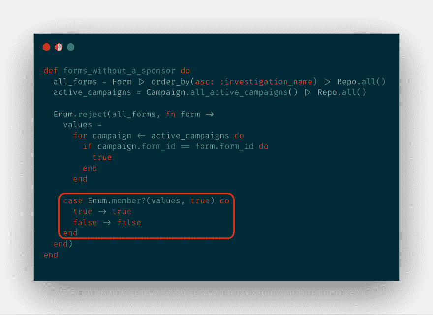
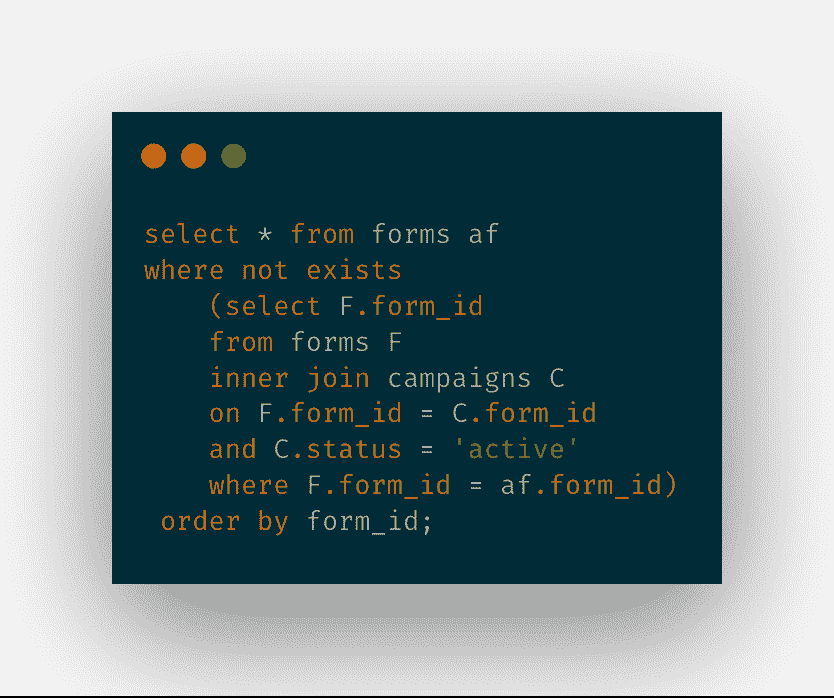
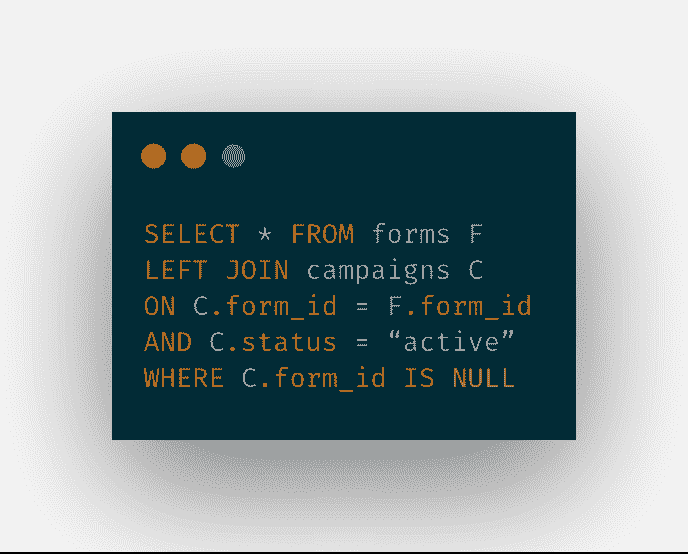
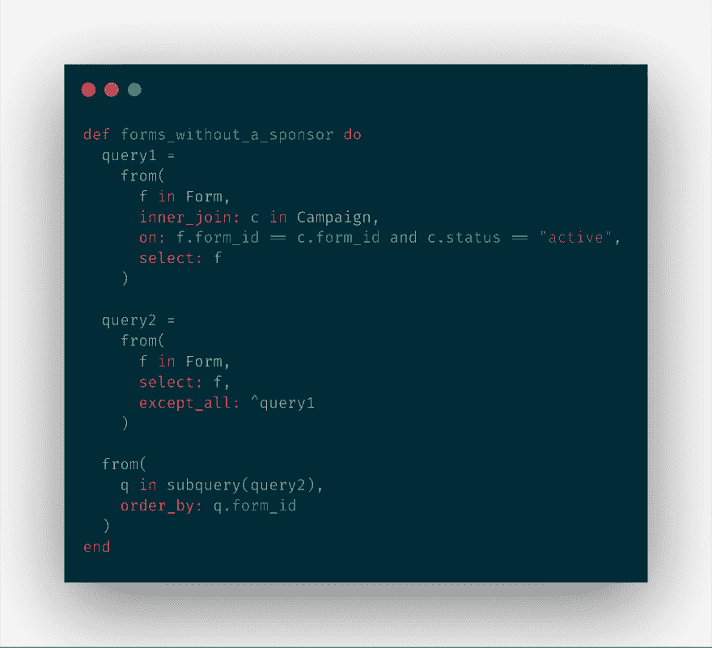
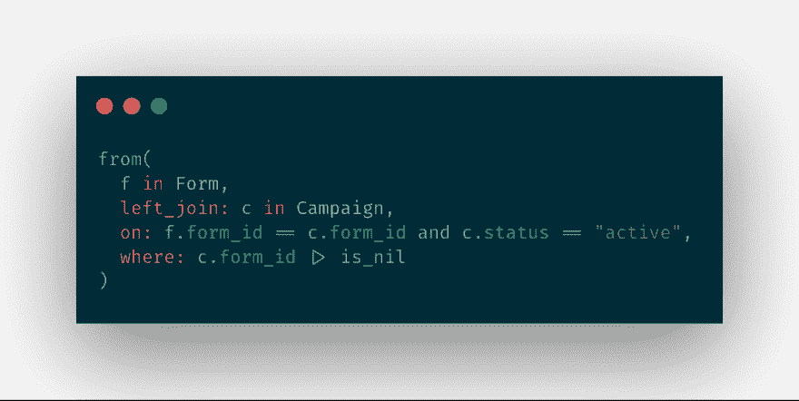

# Elixir Phoenix:我如何将一个函数转换成原始 SQL，然后转换成一个 Ecto 查询

> 原文：<https://dev.to/thebrianemory/elixir-phoenix-how-i-turned-a-function-into-raw-sql-and-then-into-an-ecto-query-995>

## 一些背景信息

正如我在最近的 [Twitter 帖子](https://twitter.com/thebrianemory/status/1083766943239172096)中所描述的，上周五我花了大部分时间来重构一个函数。我一直希望它使用 Ecto 查询，但不太确定如何实现。正如我通常所做的，我从我能想到的第一个解决方案开始，然后进行重构。我从使用 Enum 模块中的一些函数和遍历两个列表，到使用原始 SQL，再到我的 Ecto 查询。

在这个过程中，我犯了一些愚蠢的错误，学习了一些新的东西，并成功地重构了一个 Ecto 查询。

## 阶段 1:构建工作函数

顾名思义，这个函数的目的是获取所有没有赞助商的表单。虽然表单和活动记录都有一个`form_id`字段，但它们彼此没有关联。表单记录中没有字段表示它没有被使用。虽然如果有的话，我可以在具有相同的`form_id`的活动改变状态时更新它。不属于有效活动一部分的表单被称为没有发起人。

我不确定如何使用 Ecto 查询获得我想要的结果。我认为最好的办法是写一些有用的代码，然后从那里开始解决问题。我的想法是获取所有表单的列表，获取所有活动的列表，遍历这两个表单，并返回没有赞助商的表单的列表。

我知道根据表单和活动的数量，我应该得到一个包含 112 个表单的列表。不幸的是，我花了很多时间才想出一个解决方案。这不是一个伟大的解决方案，但它的工作，这是重要的。

我会遍历每个表单。对于每个表单，我将遍历所有活动的活动。如果两者的`form_id`匹配，我将返回 true。每个表单的最终结果将是一个列表。该列表的值将全部为零，或者一个值为真，其余值为零。最后，我会用`Enum.member?`检查列表，看看它是否包含一个`true`值。

这个过程从 Enum.reject 开始，它拒绝任何返回真值的东西。最终结果是 112 份表格没有赞助人。

你可能已经注意到了红框中的那部分代码。正如 [@zimt28 在推特](https://twitter.com/zimt28/status/1084324533069332480)上指出的，这份案情陈述完全没有必要。写`true -> true`和`false -> false`应该给我通风报信了。所以这很尴尬。我想我太兴奋了，以至于没有一个可行的解决方案。我应该用`Enum.member?(values, true)`而不用`case`语句。

## 阶段 2:将它转换成 SQL 查询

当我上周二构建这个函数时，我的意图是将其重构为 Ecto 查询。然而，我不确定我将如何着手去做。当我周五早晨散步时，我恍然大悟。如果我可以用原始 SQL 得到同样的结果，我应该能够把它转换成一个 Ecto 查询。

我周五开始写 SQL 查询。我不擅长 SQL，所以这是一个挑战。我用 pgAdmin 连接到我的开发环境数据库，打开查询工具，开始了数小时的反复试验。我不知道如何在查询中使用查询来获得我想要的结果。

最终，在谷歌的帮助下，我找到了解决方案。使用括号，我可以在查询中使用查询。在我下面的解决方案中，您将看到第二条 select 语句的运行。我知道这是丑陋的，我知道必须有一个更好的方法，但它的工作，再次，这是所有重要的。

正如后来 [@egze 在 Twitter](https://twitter.com/egze/status/1084143819216572416) 上指出的，我本可以用`LEFT JOIN`达成一个更简单的解决方案。他还附上了这张来自 Reddit 帖子[的](https://www.reddit.com/r/programming/comments/1xlqeu/sql_joins_explained_xpost_rsql/)[精美图片](https://external-preview.redd.it/M5QHWsp2vgZ-3QDZ4m-qS58lsOUgDNHau8trSFzS8H0.jpg?auto=webp&s=cae9cdc438b71c9025d40dad4650801fdcae1ef8)，这张图片很有帮助。

## 第三阶段:将 SQL 转换成 Ecto 查询

现在我已经有了复杂的原始 SQL，是时候想办法把它转换成 Ecto 查询了。让这变得棘手的是如何使用我的`WHERE NOT EXISTS`。我在埃克托身上找不到任何类似的东西。谢天谢地，我遇到了`EXCEPT_ALL`，拯救了这一天。

我的第一个查询返回了与一个活动相关联的所有表单。然后我的第二个查询使用`EXCEPT_ALL`返回除了第一个查询中的所有表单之外的所有表单。就这样，我漫长的重构之旅获得了成功。

这是我最初的解决方案。但是在 Twitter 上获得 SQL 建议后，我能够进一步重构，将函数简化为一个 Ecto 查询。

现在你知道了！完成这件事让我感觉很好。虽然花了几个小时才达到这一步，但这与其说是解决方案，不如说是一路走来的旅程。这也是我热爱编程的部分原因。