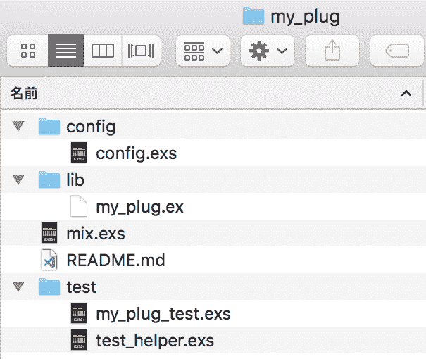
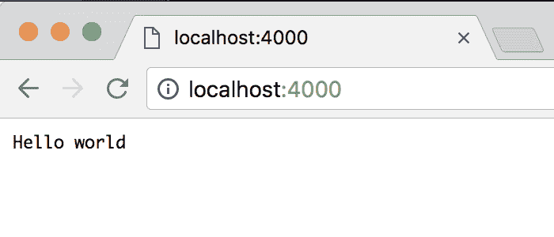

# Elixir 入门:使用 Plug 的步骤

> 原文：<https://dev.to/gumi/elixir-plug-40lb>

本稿作为“Elixir 入门”系列的番外篇，对`Plug`库的安装到启动进行说明。

[`Plug`](https://github.com/elixir-plug/plug)是构建 web 库和框架的基础项目。 使用 Plug 库，开发人员可以定义自己在 web 服务器上工作的 Plug。 在此，安装`Plug`并尝试在本地服务器上打开简单的代码。

`Plug`有以下两个作用。

*   在 web APP 应用程序之间组装的模块规范
*   Erlang VM 中不同 web 服务器的连接适配器

# 用 mix 制作 Elixir 项目

首先，用[mix](https://elixir-lang.org/getting-started/mix-otp/introduction-to-mix.html) 制作 Elixir 项目。 请在命令行工具中的[`mix new`命令](https://hexdocs.pm/mix/Mix.Tasks.New.html)后输入项目名称的路径。

```
$  mix new my_plug 
```

Enter fullscreen mode Exit fullscreen mode

生成了项目的路径(`my_plug`)，应该显示生成了以下文件(图 001 )。

```
* creating README.md
* creating .formatter.exs
* creating .gitignore
* creating mix.exs
* creating config
* creating config/config.exs
* creating lib
* creating lib/my_plug.ex
* creating test
* creating test/test_helper.exs
* creating test/my_plug_test.exs

Your Mix project was created successfully.
You can use "mix" to compile it, test it, and more: 
```

Enter fullscreen mode Exit fullscreen mode

#### t0-t1 -用 001■mix 制作的项目文件

[](https://res.cloudinary.com/practicaldev/image/fetch/s--JaCUN9UM--/c_limit%2Cf_auto%2Cfl_progressive%2Cq_auto%2Cw_880/https://thepracticaldev.s3.amazonaws.com/i/6zoe2qaajx3cfi9bkkjh.png)

# Plug 的安装

切换到 APP 演示的目录(`my_plug`)后，对文件`mix.exs`的`application`和`deps`添加如下依存关系。 `:plug_cowboy`是将 Cowboy 作为 web 服务器与 Plug 一起使用的设定。

```
defmodule MyPlug.MixProject do

  def application do
    [

      applications: [:plug_cowboy]
    ]
  end

  defp deps do
    [
      {:plug_cowboy, "~> 2.0"}
    ]
  end
end 
```

Enter fullscreen mode Exit fullscreen mode

*   `application`:确定 APP 应用的依赖关系。
*   `deps`:确定项目的依赖关系。

然后，请用[`mix deps.get`指令](https://hexdocs.pm/mix/Mix.Tasks.Deps.Get.html)解决依存关系。

```
$  mix deps.get 
```

Enter fullscreen mode Exit fullscreen mode

```
Resolving Hex dependencies...
Dependency resolution completed:
New:
  cowboy 2.6.1
  cowlib 2.7.0
  mime 1.3.1
  plug 1.7.1
  plug_cowboy 2.0.1
  plug_crypto 1.0.0
  ranch 1.7.1
* Getting plug_cowboy (Hex package)
* Getting cowboy (Hex package)
* Getting plug (Hex package)
* Getting mime (Hex package)
* Getting plug_crypto (Hex package)
* Getting cowlib (Hex package)
* Getting ranch (Hex package) 
```

Enter fullscreen mode Exit fullscreen mode

# 移动示例代码

在用 mix 制作的项目文件`my_plug.ex`的模块`MyPlug`中，确定了以下测试用函数。

```
defmodule MyPlug do
  import Plug.Conn
  def init(options) do
    # optionsの初期化
    options
  end
  def call(conn, _opts) do
    conn
    |> put_resp_content_type("text/plain")
    |> send_resp(200, "Hello world")
  end
end 
```

Enter fullscreen mode Exit fullscreen mode

然后，按如下方式在`iex`的会话中打开 mix 项目。

```
$  iex -S mix 
```

Enter fullscreen mode Exit fullscreen mode

`Plug`在 APP 交流中移动上述模块的是以下代码。 服务器从终端启动。 打开[http://localhost:4000/](http://localhost:4000/) 的 URL，页面上会显示“Hello world”的文本(图 002 )。 至此，`Plug`APP 应用程序已启动。

```
iex> {:ok, _} = Plug.Cowboy.http MyPlug, []
{:ok, #PID<0.208.0>} 
```

Enter fullscreen mode Exit fullscreen mode

#### t0:t1:002■在从服务器打开的页中显示文本

[](https://res.cloudinary.com/practicaldev/image/fetch/s--kUUQ6tIl--/c_limit%2Cf_auto%2Cfl_progressive%2Cq_auto%2Cw_880/https://thepracticaldev.s3.amazonaws.com/i/h090sjgi3626ow8vxilh.png)

#### Elixir 入门彩票

*   [Elixir 入门 01 :编写代码并尝试](https://dev.to/gumi/elixir-01--2585)
*   [Elixir 入门 02 :型的基本](https://dev.to/gumi/elixir-02--30n1)
*   [Elixir 入门 03 :运算符的基本](https://dev.to/gumi/elixir-03--33im)
*   [Elixir 入门 04 :模式匹配](https://dev.to/gumi/elixir-04--1346)
*   [仙丹入門 05: 条件-情况/条件/条件](https://dev.to/gumi/elixir-05----casecondif-60o)
*   [Elixir 入门 06 :二进制和字符串以及字符列表](https://dev.to/gumi/elixir-06--35na)
*   [Elixir 入门 07 :关键词列表和地图](https://dev.to/gumi/elixir-07--39hi)
*   [Elixir 入门 08 :模块和函数](https://dev.to/gumi/elixir-08--1c4c)
*   [Introduction T0】 Elixir 09: Rethink](https://dev.to/gumi/elixir-09--1a0p)
*   [仙丹入門 10: EnumとStream](https://dev.to/gumi/elixir-10-enumstream-4fpb)
*   [Elixir 入门 11 :流程](https://dev.to/gumi/elixir-11--2mia)
*   [Elixir 入门 12 :输入输出和文件系统](https://dev.to/gumi/elixir-12--4og6)
*   [仙丹入門 13: aliasとrequireおよびimport](https://dev.to/gumi/elixir-13-aliasrequireimport-55c1)
*   [Elixir 入门 14 :模块的属性](https://dev.to/gumi/elixir-14--3511)
*   [T0】 Elixir Beginner 15: Structure
*   [Elixir 入门 16 :协议](https://dev.to/gumi/elixir-16--lif)
*   [T0】 Elixir Beginner's Level 17: Record of Internal Package
*   [Elixir 入门 18 :锡吉尔](https://dev.to/gumi/elixir-18--5791)
*   [仙丹入門 19: tryとcatchおよびrescue](https://dev.to/gumi/elixir-19-trycatchrescue-50i8)
*   [Elixir 入门 20 :类型规格和行为](https://dev.to/gumi/elixir-20--j50)
*   [Elixir 入门 21 :调试](https://dev.to/gumi/elixir-21--21a1)
*   [Elixir 入门 22: Erlang 库](https://dev.to/gumi/elixir-22-erlang-2492)
*   [Elixir 入门 23 :下一步](https://dev.to/gumi/elixir-23--50ik)

##### Fanwai

*   Elixir 入门:使用 Plug 的步骤