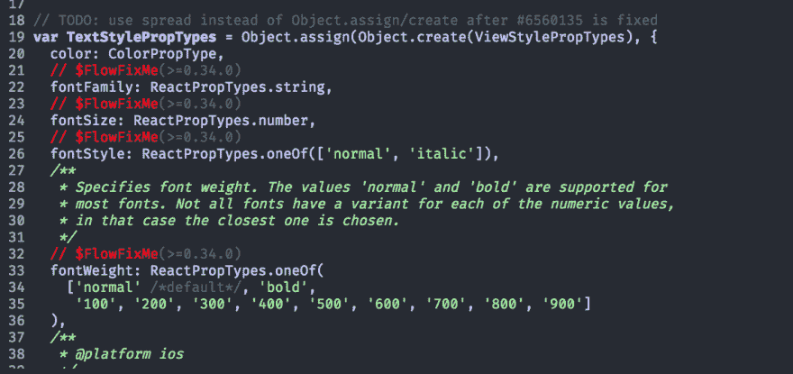

# Emacs:突出显示 FlowFixMe 注释

> 原文：<https://dev.to/chaseadamsio/emacs-highlight-flowfixme-comments-13b4>

自从加入 Webflow 以来，我一直在与 Flow 一起工作，我经常错过的事情之一是`// $FlowFixMe`评论。我决定用红色突出显示`// $FlowFixMe`的评论，这样它们会很醒目。

Emacs 使得添加配置以基于特定标准突出显示特定行变得很简单。在`init.el`或任何加载配置的文件中，您可以添加以下内容:

```
 (defface flow-fix-me-comment '((t (:foreground "#ff0000"))) "Red")

  (font-lock-add-keywords
   'js-mode '(("// $FlowFixMe" 0 'flow-fix-me-comment t))) 
```

Enter fullscreen mode Exit fullscreen mode

打破它

*   `defface`允许我们声明一个可定制的`FACE`(你可以把`FACE`看作一种风格)。我们将其命名为`flow-fix-me-comment`
*   `font-lock-add-keywords`允许我们根据特定关键字突出显示模式。
*   `'js-mode`是我们想要突出显示的模式。
*   `"// $FlowFixMe"`是我们希望用作突出显示标准的术语。
*   如果术语与行匹配，则应用`flow-fix-me-comment` `FACE`。

确保在代码片段上`eval-buffer`,重新加载您的配置或重启 Emacs 以查看发生的变化。

最终结果将如下所示:

[](https://res.cloudinary.com/practicaldev/image/fetch/s--yDpBklLD--/c_limit%2Cf_auto%2Cfl_progressive%2Cq_auto%2Cw_880/https://thepracticaldev.s3.amazonaws.com/i/cyqnkkqw1eb8bdvbme2q.png)

如果您正在使用 Emacs 开发 JavaScript 并在项目中使用 Flow，这是确保您在开发过程中不会被任何`$FlowFixMe`注释烧伤的好方法！