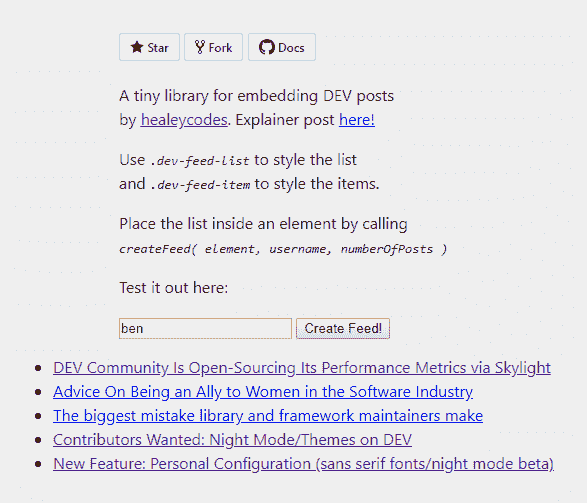

# 将您的最新开发帖子嵌入到任何地方💌

> 原文：<https://dev.to/healeycodes/embed-your-latest-dev-posts-anywhere-lj9>

让我们看看如何使用 DEV.to API 来嵌入您最近的帖子列表。我们还会根据他们的积极反应对他们进行排序！所需要的只是一点客户端 JavaScript。API 还没有发布，也没有文档，可能会改变，但是我会保持这篇文章的更新。

这里有一个[测试页面](https://healeycodes.github.io/embed-DEV-posts/example/)，它使用了我们将要编写的微型库。我们将创建一个简单的列表来保持事情的可扩展性。您也可以直接跳到[库](https://github.com/healeycodes/embed-DEV-posts)来检查最终代码。

[](https://healeycodes.github.io/embed-DEV-posts/example/)

#### DEV API 的易用性如何？

[易](https://dev.to/api/articles?username=healeycodes)。文章路线是`https://dev.to/api/articles?username=$user`。最初，我尝试获取超过 30 个最新帖子，这是默认设置。这可以通过添加`&page=$pageNum`来实现——但是请求多个页面会带来延迟。由于不可能知道帖子的页数，所以你需要继续前进，直到找到一个空页面。一份迟来的清单对伟大的 UX 没有好处。

让我们从使用 [Fetch API](https://developer.mozilla.org/en-US/docs/Web/API/Fetch_API) 从用户的浏览器发出请求开始。

```
fetch(`https://dev.to/api/articles?username=healeycodes`)
    .then(function (response) {

        // Parse it as JSON
        return response.json();
    }).then(function (posts) {

        // An array of posts
        console.log(posts);
    }) 
```

看起来不错。让我们用一些 [JSDoc](http://usejsdoc.org/about-getting-started.html) 注释整理一下，这样代码更容易理解。我们还将它包装在一个函数中。

```
/**
 * Get a DEV user's post objects.
 * Only fetches previously 30 posts. Using `&page=X` is too slow.
 * @param {string} username - DEV username, e.g. 'ben'.
 * @returns {array} User's post objects.
 */
function getPosts(username) {

    // Assume that `api` is defined as a constant
    return fetch(`${api}/articles?username=${username}`)
        .then(function (response) {
            return response.json();
        })
        .then(function (posts) {

            // Sort the array in place with a compare function
            return posts.sort((a, b) => b.positive_reactions_count - a.positive_reactions_count);
        });
} 
```

30 个帖子的列表可能有点多。我们一会儿再把它砍了。现在，请注意我们是如何使用[比较函数](https://developer.mozilla.org/en-US/docs/Web/JavaScript/Reference/Global_Objects/Array/sort#Parameters)对数组进行排序的。我们使用了速记版本。比较函数通常通过在比较两个参数时返回`-1`、`1`或`0`来编写。然而，重要的是比较函数是一致的。

我们想创建一个简单的列表，可以用 CSS 样式。合理的类名可能是`dev-feed-list`和`dev-feed-item`。我们还需要一个元素来附加这个列表，所以这应该是我们库的一个参数。使用 JavaScript，我们可以添加类，创建列表并动态地附加它们，就像这样:

```
// An unordered list
const list = document.createElement('ul');

// A list item
const item = document.createElement('li');
item.classList.add('dev-feed-item');
item.innerText = 'I am a list item.';

// Let's create a relation between them
list.appendChild(item);

// Now between the list and the document, rendering the list
// body -> ul -> li
document.body.appendChild(list); 
```

让我们创建一个函数来构建构成嵌入列表的元素。我们将使用前面的`getPosts`函数来获取排序后的文章数组。

```
/** 
 * Creates a DEV feed of posts.
 * @constructor
 * @param {Element} elem - Place list of posts inside this element.
 * @param {string} username - DEV username, e.g. 'ben'.
 * @param {number} numberOfPosts - Number of posts to list. 
 */
function createFeed(elem, username, numberOfPosts = 5) {
    const feed = document.createElement('ul');
    feed.classList.add('dev-feed-list');
    getPosts(username)

        // With our posts array
        .then(function (posts) {
            posts.length = numberOfPosts;
            posts.forEach(function (post) {

                // We create an element for each item
                const item = document.createElement('li');
                item.classList.add('dev-feed-item');

                // As well as a link for users to click through
                const link = document.createElement('a');
                link.href = post.url;
                link.innerText = post.title;

                // ul -> li -> a
                item.appendChild(link);
                feed.appendChild(item);
            });

            // Attach the list of posts, rendering it
            elem.appendChild(feed);
        });
} 
```

如果我们将所有这些捆绑在一起作为一个脚本，我们可以通过调用`createFeed(element, username, numberOfPosts)`来生成列表，其中`element`是列表的容器，`username`是有效的开发用户，`numberOfPosts`是我们想要呈现的帖子数量。

通过允许获取自定义数量的帖子，以及使用合理的 CSS 类，我们的库是可扩展的，可以作为一个小模块使用！

* * *

加入我的关于编程和个人成长的[时事通讯](https://buttondown.email/healeycodes)的 150 多人注册！

我发关于科技的微博。