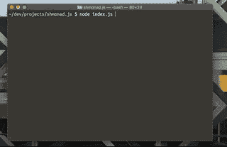
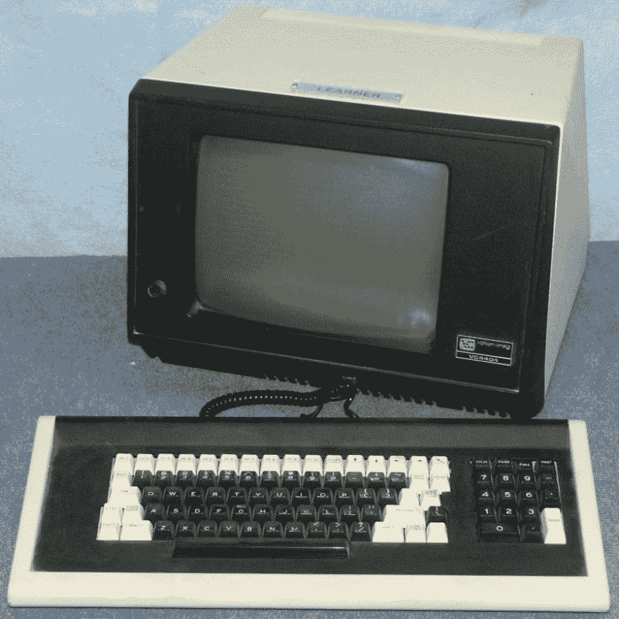

# 在 JavaScript 中模拟 Xmonad 第 2 部分

> 原文：<https://dev.to/luke/emulating-xmonad-in-javascript---part-2-585p>

如果你眯着眼睛看上面的 GIF，你会发现自从我的上一篇文章以来，我已经取得了相当大的进步——一篇很棒的介绍，请阅读上下文。

Shmonad.js 现在可以生成多个子进程并处理它们的输出，将其缓冲到一个适当大小的视口中。现在，格式化控制序列被去掉了——这些通常会产生大量漂亮的颜色。还有[许多](http://ascii-table.com/ansi-escape-sequences-vt-100.php)、[许多](http://ascii-table.com/documents/vt100/chapter3.php)控制序列还没有被处理，我还在弄清楚哪些应该优先处理。

我的最终目标是处理足够多的控制序列来运行，比如说，`vim`。目前，它能做的最好的事情就是处理`top`，这看起来非常令人满意，但它本身并不太有用。

`bash`似乎运行得很好，自动完成和`reverse-i-search` *有点像*在工作，但是它们似乎依赖于一些还不被支持的控制序列。

一切都会好起来的！

那么，我是如何取得这一进步的呢？嗯，在我最后一次深入研究终端和控制序列之后，我又进行了一次深入研究。这一次，我对伪终端了如指掌。

我们来看看吧！

## 伪端子

在我之前的努力中，已经实现了 Xmonad 本身的大部分功能，我将注意力转移到这个项目的另一个重要部分——生成过程。

就其本身而言，这并不是一项复杂的任务。操作系统为此提供了定义良好的 API，Node.js 以相当直接的方式公开了它们。

然而，程序和它们的创造者让事情变得复杂了。

我想通过查看众所周知的`less`命令来开始这段旅程。通常用于手动扫描和跳转文件或程序输出，令人难以置信的有用和强大的`less`自 1984 年就已经出现了(据`man less`)。

### 管道热输出

当我在 shmonad 的早期版本中运行项目目录中的`less package.json`时，发生了一件意想不到的事情。`less`似乎从`stdout`输出了整个文件。`less`的全部意义在于它只输出一部分文件到终端！那么是什么原因呢？

我开始寻找可能表明这里发生了什么的线索。一个用于调试终端程序输出的有用工具是`cat -v`。管道程序输出到`cat -v`将显示所有转义的控制序列，这样它们就可以显示在终端上而无需解释。

例如，运行`nvim | cat -v`会产生 Neovim 用来呈现其 UI 的控制序列和文本。如果您自己尝试这样做，您会注意到“[No Name]”这个字符位于“`nvim`”的某处。当`nvim`在终端中运行时，文本“[No Name]”会插入到由终端的当前光标位置决定的位置。这又取决于先前发送给终端的控制序列(和字符)。

所以你可能认为——我也这样认为——运行`less package.json | cat -v`会产生类似的输出。然而，事实并非如此。

更有经验的基于 POSIX 的开发人员应该熟悉这样一个事实，即从`less`到另一个命令的管道输出基本上什么都不做(没有指定任何选项给`less`)。

在这种情况下，Neovim 和`less`之间的关键区别是它们在*终端*中运行时的行为，而不是将输出流式传输到连接到 *TTY* 的*而不是*(这是一个传统的首字母缩略词，过去指这些东西中的一个):

 
*功劳:[http://www.classiccmp.org/](http://www.classiccmp.org/)*

总之。抛开老式终端不谈。

当面对这种行为差异时，我的第一个想法是:

> 这里*必须*有一个*控制序列*告诉`less`它正在一个终端中运行。

我又错了。

回到 Node.js，我开始想知道访问`stdout`和`stdin`的 API。这个 API 的一部分指示`stdout` / `stdin`是否连接到一个名为`.isTTY`的终端。

对于在终端中启动的进程，该标志始终为真——当有必要在终端中采取不同的行为时，该标志非常有用。

意识到 Node.js 为这样的事情提供了一个接口，我很自然地认为 Node.js 也会提供一个接口，允许程序生成一个进程，让*认为*它是在一个终端中生成的。但是这两个概念是非常不相关的:一个是提供给*当前*程序的 API，另一个需要创建附加到`stdin` / `stdout`流的进程，这些流又(有点)附加到 TTY。

最初，我把这误认为是终端的“原始”模式，这完全是另一回事。如果你对我花了 2.5 小时深入挖掘这一切的深度感兴趣，请看这个 twitter 帖子。作为我深潜的一部分，我偶然发现了一个术语“伪终端”，并决定近距离观察这些奇怪的生物。https://en.wikipedia.org/wiki/Pseudoterminal

> 在包括 Unix 在内的一些操作系统中，伪终端、伪 tty 或 PTY 是一对伪设备，其中一个从设备模拟硬件文本终端设备，另一个主设备提供终端模拟器进程控制从设备的方法。

在这一点上，我就像“为什么之前没有搜索它？?"

在[我最喜欢的搜索引擎](https://duckduckgo.com)中快速搜索，提供的正是我要找的:`a set of Node.js bindings for "Getting certain programs to think you're a terminal, such as when you need a program to send you control sequences` - [`node-pty`](https://github.com/Microsoft/node-pty) 。

`node-pty`是一个开源库，用于在*伪终端*的上下文中生成进程。它还支持许多不同的操作系统，这是非常酷的！它还支持 VSCode、Hyper 和其他一些非常酷的终端模拟器。

找到这个金矿后(开源< 3，耶),我继续给 shmonad 添加了`node-pty`,只做了很少的修改；它非常有效！

下一步将继续增加对越来越多的控制序列的支持。结果应该相当惊人，尤其是当我开始实现格式化时(这将保证它有自己的博客帖子！)

在支持世界上所有的控制序列之前，shmonad 需要一点重构。

现在，我将留给你更多的故事。

 
*vc303:信用[http://www.classiccmp.org](http://www.classiccmp.org)*

 
*vc404:信用[http://www.classiccmp.org](http://www.classiccmp.org)*

 
*vt100*:信用[http://www.classiccmp.org](http://www.classiccmp.org)*

推广 ANSI 控制序列的 TTY！！

# 鳍

请随时留下评论和分享你的想法，如果你渴望更多这样的帖子，请关注我！:)

下次见，谢谢你的阅读。