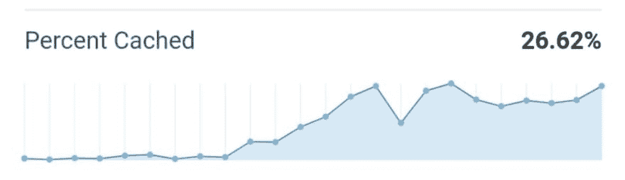

# 为您的 Netlify 站点启用 CDN (Cloudflare)缓存

> 原文：<https://dev.to/hugo__df/enable-cdn-cloudflare-caching-for-your-netlify-site-4lmm>

这篇文章讲述了如何通过利用像 Cloudflare 这样的 CDN(内容交付网络)来减少通过 Netlify 提供的静态资产的数量。这将减少可缓存资产的净带宽使用。

这还意味着您将遵循行业公认的最佳实践，设置接收浏览器缓存您的资产的时间。

原则上，它不会显著提高你的网站加载速度，因为 Netlify 的内置 CDN 在这方面做得很好。这将意味着，与 Netlify 相比，您可以利用 CDN 的能力快速交付资产。

## Netlify 的默认缓存行为是什么？

默认的 Netlify 缓存控制头是`"max-age=0, must-revalidate, public"`,这意味着所有内容都应该被缓存，而且还要重新验证。基本原理是“这有利于你作为一个内容创建者——你可以在一瞬间改变你的任何内容。”- [通过缓存让生活更美好](https://www.netlify.com/blog/2017/02/23/better-living-through-caching/)。

这意味着 web 性能测试对于静态资产没有合理的缓存长度会给你较低的分数。

Netlify 建议前面不要用 CDN(见[为什么不需要 Cloudflare 搭配 Netlify](https://www.netlify.com/blog/2017/03/28/why-you-dont-need-cloudflare-with-netlify/) )。本文的核心观点是，Netlify 提供了 CDN 也有助于解决的以下问题:

*   SSL: Netlify 创建证书，这样你的站点就可以一直在 HTTPS 提供服务。
*   CDN: Netlify 的 CDN 在与托管 DNS 服务一起使用时非常聪明，内置了智能负载平衡/路由和 DDoS 预防功能。
*   DNS:用 Netlify 的 DNS 设置(自定义)域既快又简单。

这 3 项服务也是 Cloudflare 提供的服务。

## 在 Netlify 上设置缓存头

[自定义标题](https://www.netlify.com/docs/headers-and-basic-auth/#custom-headers)的 Netlify 文档没有缓存示例。它还建议有两种方式来添加自定义标题:通过一个`_headers`文件和作为你的`netlify.toml`的`[[headers]]`部分的一部分。

这里有一个为 codewithhugo.com 的[设置的`netlify.toml`示例，忽略`[build]`部分或者查看 netlify 知识库中的](https://codewithhugo.com)[Netlify . toml 文件](https://www.netlify.com/docs/netlify-toml-reference/)文章:

```
[build]
  command = "./scripts/build.sh"
  publish = "public"
  functions = "lambda"

[[headers]]
  for = "/img/*"
  [headers.values]
    Cache-Control = "public, s-max-age=604800"
[[headers]]
  for = "/*.css"
  [headers.values]
    Cache-Control = "public, s-max-age=604800"
[[headers]]
  for = "/*.js"
  [headers.values]
    Cache-Control = "public, s-max-age=604800" 
```

等效的`_headers`文件:

```
/img/*
  Cache-Control: public, s-max-age=604800
/*.css
  Cache-Control: public, s-max-age=604800
/*.js
  Cache-Control: public, s-max-age=604800 
```

我们设置的`Cache-Control`是`public, s-max-age=604800`。我们使用的是`s-max-age`，根据 [MDN 缓存控制文章](https://developer.mozilla.org/en-US/docs/Web/HTTP/Headers/Cache-Control#Expiration)，它是:

> 优先于`max-age`或`Expires`头，但它仅适用于共享缓存(如代理)，并被私有缓存忽略。

这意味着我们在 Netlify 上使用自定义头来告诉 **Cloudflare(我们的 CDN)** 缓存资产多长时间。然后我们将使用 CDN 设置来控制**浏览器**缓存多长时间。

604800 秒相当于 7 天，因此在正常操作期间，Cloudflare 将缓存图像、CSS 和 JavaScript 文件 7 天。

## 缓存规则细分

从 Cloudflare 统计我知道图片+ CSS 占我流量的 60%以上。

### 图像缓存

在网络之外提供图像似乎并不太有用，因为它们并不经常改变。它们实际上也不是核心[codewithhugo.com](https://codewithhugo.com)产品的一部分，它们是“最好拥有的”,而不是“必须拥有的”文本+代码内容。这就是第一条规则的由来:

```
[[headers]]
  for = "/img/*"
  [headers.values]
    Cache-Control = "public, s-max-age=604800" 
```

或者以`_headers`格式:

```
/img/*
  Cache-Control = "public, s-max-age=604800" 
```

### CSS 缓存

我通过 Hugo 生成的 CSS 内置了一个破坏缓存的哈希函数。因此，旧版本和新版本将被分别获取和缓存。因此，在 CDN 和浏览器中积极缓存是安全的。

在`netlify.toml`标题格式:

```
[[headers]]
  for = "/*.css"
  [headers.values]
    Cache-Control = "public, s-max-age=604800" 
```

`_headers`格式:

```
/*.css
  Cache-Control: public, s-max-age=604800 
```

### JavaScript 缓存

我没有利用很多 JavaScript，无论我使用什么，通常都会在页面上显示一些脚本标签。我使用的预建 JavaScript 可以安全地长时间缓存。

在`netlify.toml`标题格式:

```
[[headers]]
  for = "/*.js"
  [headers.values]
    Cache-Control = "public, s-max-age=604800" 
```

`_headers`格式:

```
/*.js
  Cache-Control: public, s-max-age=604800 
```

## 缓存结果

我的缓存请求百分比从 5%上升到了 65%以上。由于 Cloudflare 为我的大部分重要内容(图像)提供服务，因此 Cloudflare → Netlify 的带宽使用减少了 80%。

> 使用 [@Cloudflare](https://twitter.com/Cloudflare?ref_src=twsrc%5Etfw) 缓存资产
> 
> 左侧约 5%，默认网络标题()
> 
> 右 50%+，带缓存控制:public，s-max-age=604800
> 
> 即。允许此站点前面的 CDN 缓存资产 1 周
> 
> [](https://res.cloudinary.com/practicaldev/image/fetch/s--SjCB8202--/c_limit%2Cf_auto%2Cfl_progressive%2Cq_auto%2Cw_880/https://pbs.twimg.com/media/D2F3tpsX0AADboq.jpg)
> 
> —雨果·迪·弗朗切斯科([@雨果 _ _ df](https://dev.to/hugo__df))[2019 年 3 月 20 日](https://twitter.com/hugo__df/status/1108298641100410882?ref_src=twsrc%5Etfw)

[unsplash-logo
Zbynek buri val](https://unsplash.com/@zburival?utm_medium=referral&utm_campaign=photographer-credit&utm_content=creditBadge)