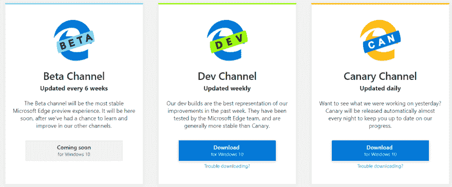
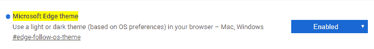
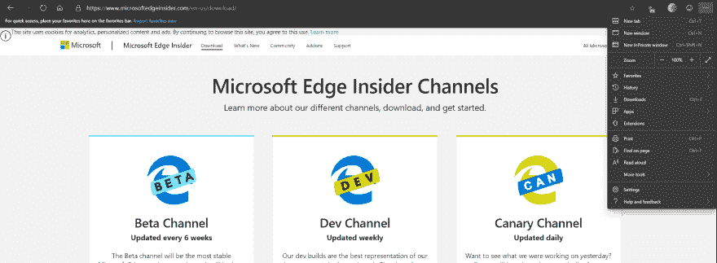

# 在基于 Chromium 的 Edge 浏览器上启用黑暗主题

> 原文：<https://dev.to/kasuken/enable-the-dark-theme-on-chromium-based-edge-browser-33k3>

几周前，微软发布了一款基于 Chromium 的新浏览器。目前你可以使用两个主要的发布渠道:Dev 和 Canary。

将来可以下载和使用测试频道。

目前，你可以在两个频道中启用黑暗主题。
很简单:

*   在 Edge 上打开一个新标签，然后转到这里:**Edge://flags/# Edge-follow-OS-theme**
*   在下拉菜单中选择**启用**
*   在你的桌面上，进入**个性化- >颜色**，将 Windows 的主题改为深色

现在边缘主题反映了你的窗口主题。

