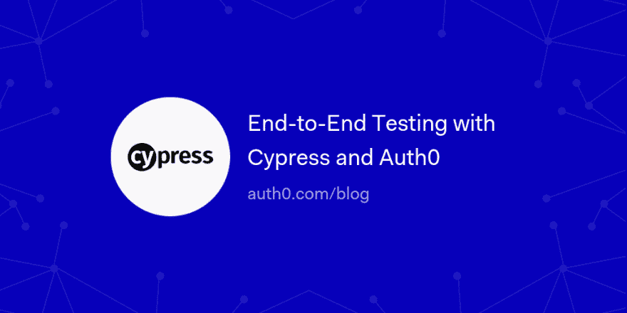

# 使用 Cypress 和 Auth0 进行端到端测试

> 原文：<https://dev.to/auth0/end-to-end-testing-with-cypress-and-auth0-5cd9>

这篇文章讨论了如何在 Cypress 端到端测试中成功地通过 Auth0 认证。您将使用一个小样本 React 应用程序来说明在运行 Cypress 测试时，您可以使用哪些模式以编程方式将您的用户登录到 Auth0，这种方式符合大多数 Cypress 和 Auth0 最佳实践。

[读下去🔬](https://auth0.com/blog/end-to-end-testing-with-cypress-and-auth0/?utm_source=dev&utm_medium=sc&utm_campaign=testing_cypress)

