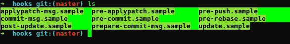

# 强制 Git 提交消息样式

> 原文：<https://dev.to/austincunningham/enforcing-git-commit-message-style-4gah>

我正在做一个项目，该项目需要以下格式的提交消息

```
feat(feature-name): message text here (AEROGEAR-Number)
fix(feature-name): etc...
docs(feature-name): etc...
breaking(feature-name): etc... 
```

Enter fullscreen mode Exit fullscreen mode

这是一个痛苦的手动执行和检查，所以我们决定自动化检查。首先，我写了一个脚本来检查现有的分支提交，看看它们是否匹配格式

```
#!/bin/bash

commit_message_check (){
      # Get the current branch and apply it to a variable
      currentbranch=`git branch | grep \* | cut -d ' ' -f2`

      # Gets the commits for the current branch and outputs to file
      git log $currentbranch --pretty=format:"%H" --not master > shafile.txt

      # loops through the file an gets the message
      for i in `cat ./shafile.txt`;
      do 
      # gets the git commit message based on the sha
      gitmessage=`git log --format=%B -n 1 "$i"`

      ####################### TEST STRINGS comment out line 13 to use #########################################
      #gitmessage="feat sdasdsadsaas (AEROGEAR-asdsada)"
      #gitmessage="feat(some txt): some txt (AEROGEAR-****)"
      #gitmessage="docs(some txt): some txt (AEROGEAR-1234)"
      #gitmessage="fix(some txt): some txt (AEROGEAR-5678)"
      #########################################################################################################

      # Checks gitmessage for string feat, fix, docs and breaking, if the messagecheck var is empty if fails
      messagecheck=`echo $gitmessage | grep -w "feat\|fix\|docs\|breaking"`
      if [ -z "$messagecheck" ]
      then echo "Your commit message must begin with one of the following"
            echo "  feat(feature-name)"
            echo "  fix(fix-name)"
            echo "  docs(docs-change)"
            echo " "
      fi
      # check the gitmessage for the Jira number
      messagecheck=`echo $gitmessage | grep "(AEROGEAR-"`
      if  [ -z "$messagecheck" ]
      then echo "Your commit message must end with the following"
            echo "  (AEROGEAR-****)"
            echo "Where **** is the Jira number"
            echo " " 
      fi messagecheck=`echo $gitmessage | grep ": "`
      if  [ -z "$messagecheck" ]
      then echo "Your commit message has a formatting error please take note of special characters '():' position and use in the example below"
            echo "   type(some txt): some txt (AEROGEAR-****)"
            echo "Where 'type' is fix, feat, docs or breaking and **** is the Jira number"
            echo " "
      fi

      # All checks run at the same time by pipeing from one grep to another
      messagecheck=`echo $gitmessage | grep -w "feat\|fix\|docs\|breaking" | grep "(AEROGEAR-" | grep ": "`

      # check to see if the messagecheck var is empty
      if [ -z "$messagecheck" ]
      then echo "The commit message with sha: '$i' failed "
            echo "Please review the following :"
            echo " "
            echo $gitmessage
            echo " "
            rm shafile.txt >/dev/null 2>&1
            set -o errexit
      else echo "$messagecheck"
            echo "'$i' commit message passed"
      fi  
      done rm shafile.txt  >/dev/null 2>&1
}

# Calling the function
commit_message_check 
```

Enter fullscreen mode Exit fullscreen mode

我将脚本复制到项目根目录下的一个脚本目录中，并且最初使用它和 Circle ci 来检查构建期间的提交。

```
steps:      
  - checkout      
  - run: ./scripts/commit-filter-check.sh 
```

Enter fullscreen mode Exit fullscreen mode

我们认为本地检查更有用，于是我们决定使用 githooks 来运行这个脚本。有一个**。每个 git 项目中的 git/hook** 目录，带有示例 git 挂钩。

[](https://res.cloudinary.com/practicaldev/image/fetch/s--MzNBIYpO--/c_limit%2Cf_auto%2Cfl_progressive%2Cq_auto%2Cw_880/https://cdn-images-1.medium.com/max/800/1%2ANw2sU5pVk16Sq63zxtvwzQ.png%3Fstyle%3Dcenterme)

拆下**。在这种情况下，我使用了 **commit-msg** git 钩子，并用它来运行我的脚本。挂钩是由退出 1
的失败触发的**

```
#!/bin/sh

# Run the script and get the return code if successful of if fails
./scripts/commit-filter-check.sh && rc=$? || rc=$?
echo return code : $rc
if $rc == 1
then echo "Script return code 1 so commit failed"
    exit 1
else echo "No error returned so commit successful"
fi 
```

Enter fullscreen mode Exit fullscreen mode

唯一的问题是**。git 提交永远不会看到 git** 目录。因此，我需要一种方法来推动我的改变，并允许其他人使用它们。将 commit-msg 文件移动到一个**。githook** 目录允许它被提交。然后，您可以在项目的安装脚本中添加一行，创建一个到本地**的 sym 链接。git/hooks** 目录

```
ln -sf $$PWD/.githooks/* $$PWD/.git/hooks/ 
```

Enter fullscreen mode Exit fullscreen mode

现在，每个提交消息都会被检查，如果不符合格式，就会失败

[我的博客](https://austincunningham.ddns.net)