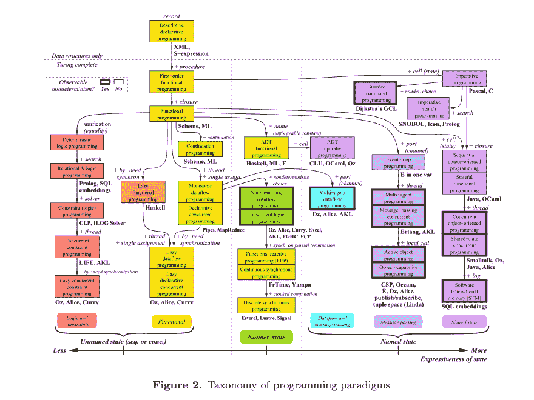
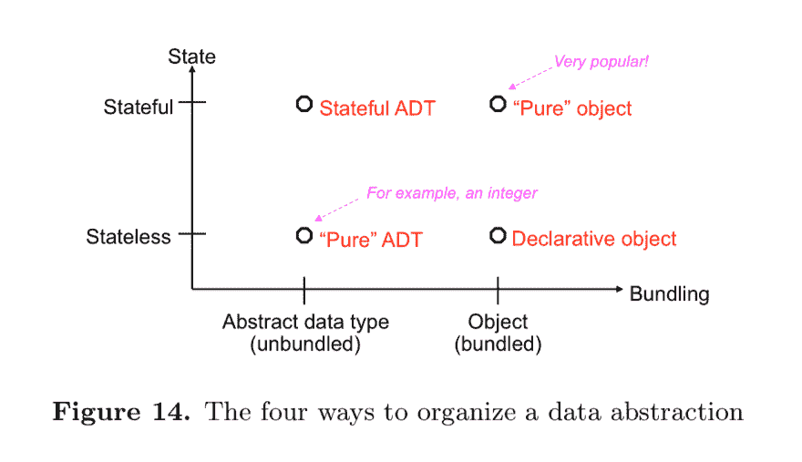
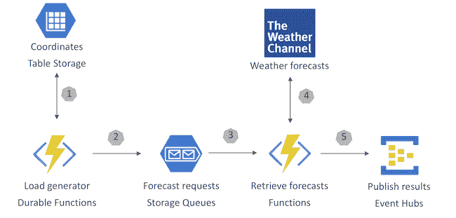
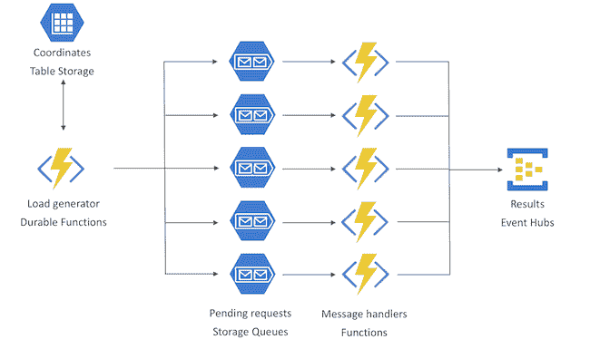

# EnqueueZero Techshack 2019-05

> 原文：<https://dev.to/soasme/enqueuezero-techshack-2019-05-5b7>

# enqueue zero Techshack 2019-05

## 我们的软件依赖问题

[swtch.com](https://research.swtch.com/deps)

*   依赖项是您希望从程序中调用的附加代码。添加依赖项可以避免重复已经完成的工作:设计、编写、测试、调试和维护特定的代码单元。
*   依赖管理器(有时称为包管理器)自动下载和安装依赖包。
*   当使用软件依赖时，
    *   认识到问题。
    *   建立今天的最佳实践。
    *   为明天开发更好的依赖技术。

## Systemd 为悲剧

[lwn.net](https://lwn.net/SubscriberLink/777595/a71362cc65b1c271/)

从历史上看，人们对 systemd 有自己的看法。有人说这违背了 UNIX 做一件事就把它做好的哲学；有人说它只支持 Linux。本文从历史和功能的角度讨论了这些问题。

## 寻找 Kafka 在 Dropbox 基础设施中的吞吐量极限

[blogs.dropbox.com](https://blogs.dropbox.com/tech/2019/01/finding-kafkas-throughput-limit-in-dropbox-infrastructure/)

本文提出了一种理解卡夫卡局限的系统方法。

1.  使用 spark 托管 Kafka 客户端，以任意规模生产和消费流量。
2.  设置三个不同大小的卡夫卡集群
3.  创建一个 Kafka 主题，为测试生成生产和消费流量，并在代理之间平均分配流量。
4.  用十倍于代理数量的分区创建测试主题。每个代理都有一个正好负责 10 个分区的领导者。

有很多因素会影响 Kafka 集群的工作负载:生产者的数量、消费者组的数量、初始消费者偏移量、每秒的消息数、每条消息的大小、涉及的主题和分区的数量等等。但是要考虑的主要因素是吞吐量的基本组成部分:每秒产生的消息数(mps)和每条消息的字节大小(bpm)。

## WePay 上的高可用 MySQL 集群

[wecode.wepay.com](https://wecode.wepay.com/posts/highly-available-mysql-clusters-at-wepay)

核心组件是 Orchestrator、Consul、HAProxy 和 pt-heartbeat。

*   Orchestrator 用于检测故障和角色转换。
*   HAProxy 有两层。
    *   HAProxy 的第一层位于客户端机器上，并连接到 HAProxy 的远程(第二层)。
    *   HAProxy 的第二层分布在连接到同一组 MySQL 服务器的多个 Google zones 上
*   领事是 KV 店。
*   Heartbeat 在每台主机上运行。

## cocroach db 的一致性模型

[cockroachlabs.com](https://www.cockroachlabs.com/blog/consistency-model/)

CockroachDB 的一致性模型不仅仅是可序列化的，更不是严格可序列化的。CockroachDB 实现并且仅实现 SQL 标准指定的事务的可序列化隔离级别。(引用 crdb 作者的话，任何低一级的都只是自讨苦吃。)

或许最简单的方法就是理解它所允许的异常——“因果逆转”——以及它可能发生的有限环境。在大多数情况下，人们可能会对 CRDB 的读和写的语义感到疑惑，口号“没有过时的读”应该可以解决大多数讨论。

延伸阅读:cocroach db on rocks db[cockroachlabs.com](https://www.cockroachlabs.com/blog/cockroachdb-on-rocksd/)。

## 是时候离开两阶段提交了

[dbmsmusings.blogspot.com](http://dbmsmusings.blogspot.com/2019/01/its-time-to-move-on-from-two-phase.html)

然而，在现代，许多系统需要扩展到多台彼此独立失效的机器，这些假设需要昂贵的协调和提交协议，如 2PC。2PC 的性能问题是非 ACID 兼容系统兴起的主要原因，这些系统放弃了重要的保证来实现更好的可伸缩性、可用性和性能。2PC 太慢了——它增加了所有事务的延迟——不仅增加了协议本身的长度，还阻止了访问同一组数据的事务并发运行。2PC 也限制了可伸缩性(通过减少并发性)和可用性(我们上面讨论的阻塞问题)。前进的道路是明确的:我们需要在设计系统时重新考虑过时的假设，并对两阶段提交说“再见”！

## 选择软件架构

[www.javacodegeeks.com](https://www.javacodegeeks.com/2019/01/selecting-software-architecture.html)

架构定义了软件的模型，它将如何工作，并定义了在实现时可能遇到的问题，因为主要的范例有分层架构、微服务、SOA、事件源。

## 一生的系统思考

[thesystemsthinker.com](https://thesystemsthinker.com/a-lifetime-of-systems-thinking/)

以下是我发现的明显错误的一小部分例子:

*   提高系统各部分的性能必然会提高整体的性能。
*   问题是有纪律的。
*   对一个问题所能做的最好的事情就是解决它。

## 将 PostgreSQL 数据库扩展到每月 12 亿条记录的经验教训

[medium.com](https://medium.com/@gajus/lessons-learned-scaling-postgresql-database-to-1-2bn-records-month-edc5449b3067)

有如此多的选项，如 Google Cloud SQL、Amazon RDS、Aiven.io，“一直以来，我都在试图避免不可避免的事情——自己管理数据库。现在，我们租用硬件并维护数据库。”。

优势:

*   控制 pg 版本。
*   安装任何 pg 插件。
*   比任何云提供商能提供的更好的硬件。
*   便宜到可以雇一个自由职业的 DBA 来签到。

其他 PG 要点:

*   PostgreSQL 物化视图对于小型数据集来说是一个很好的特性。
*   随着数据集的增长，使用粒度实体化视图和实体化表列的组合进行规划。

结论:

*   对于不会增长到数十亿条记录且不需要自定义扩展的简单数据库，请选择云服务。
*   为将来需要的功能做好计划。

## 每个程序员都应该知道的傻瓜编程范例

[blog.acolyer.org](https://blog.acolyer.org/2019/01/25/programming-paradigms-for-dummies-what-every-programmer-should-know/)|计算机编程的概念、技术和模型: [www.info.ucl.ac.be](https://www.info.ucl.ac.be/~pvr/book.html)

*   编程范例是基于数学理论或一组特定原则的方法，每个范例支持一组概念。

[](https://res.cloudinary.com/practicaldev/image/fetch/s--ItF6F2L7--/c_limit%2Cf_auto%2Cfl_progressive%2Cq_auto%2Cw_880/https://adriancolyer.files.wordpress.com/2019/01/Programming-paradigms-Fig-2.png)

*   解决一个编程问题需要选择正确的概念，许多问题需要不同部分的不同概念集。而且，很多程序要解决的问题不止一个！缺少问题的范例会让你的程序难看。

[](https://res.cloudinary.com/practicaldev/image/fetch/s--snBwqp-K--/c_limit%2Cf_auto%2Cfl_progressive%2Cq_auto%2Cw_880/https://adriancolyer.files.wordpress.com/2019/01/Programming-paradigms-Fig-3.jpeg)
[T6】](https://res.cloudinary.com/practicaldev/image/fetch/s--xKS0NIlt--/c_limit%2Cf_auto%2Cfl_progressive%2Cq_auto%2Cw_880/https://adriancolyer.files.wordpress.com/2019/01/Programming-paradigms-Fig-14.jpeg)

*   每个范例都有自己的“灵魂”，只有实际使用范例才能理解。我们建议您通过实际编程来探索这些范例。

## Python 中的高性能，采用零拷贝和缓冲协议

[julien.danjou.info](https://julien.danjou.info/high-performance-in-python-with-zero-copy-and-the-buffer-protocol/)

方法是使用函数`memoryview(bytes)`来避免复制。该理论是一个新的 memoryview 对象，通过实现缓冲协议(PEP 3118)，引用原来的对象内存。

基本用法如下。`slice`变量保存原始读取数据的一部分。

```
content = source.read(1024 * 10000)
slice = memoryview(content)[1024:] 
```

Enter fullscreen mode Exit fullscreen mode

## Kubernetes 上的 PostgreSQL 正确的方式

第一部分:[medium.com](https://medium.com/kokster/postgresql-on-kubernetes-the-right-way-part-one-d174ee8a56e3)|第二部分:[medium.com](https://medium.com/kokster/postgresql-on-kubernetes-the-right-way-part-two-1a981d5fb747)

挑战:

*   高可用性
*   负载平衡
*   实例间的同步
*   放大和缩小
*   自动化备份，从备份中恢复
*   滚动升级/降级
*   健康监控，调试

PostgreSQL 遵循主从模式。有一个权威的主服务器(主服务器)和一些镜像主服务器的备用服务器(从服务器)。这种分布式架构有两个目的:

*   故障转移—如果主服务器出现故障，备用服务器可以代替它。
*   负载平衡—备用服务器可以处理只读请求，减少主服务器上的负载。

此外，主服务器持续归档其预写日志(WAL ),并定期创建其整个状态的备份(称为基本备份)。

在 Kubernetes，有主要和备用吊舱

*   主—通常只有一个实例，用于读取和写入。
*   备用—其中许多用于读取，可以升级为主

## 扩展 Azure 功能，在 3 分钟内向 Weather.com 发出 50 万个请求

[madeofstrings.com](https://madeofstrings.com/2019/01/09/scaling-azure-functions-to-make-500000-requests-to-weather-com-in-under-3-minutes/)

*   挑战:提取 50k 数据并在 5 分钟内完成这个过程；每 15 分钟重复一次。
*   总体设计:
    *   坐标存储在 Azure 表存储中。记录是不可变的。
    *   持久函数用于用表中的坐标填充一组存储队列。每条消息代表一个对天气服务的未决请求。
    *   为队列中的每条消息调用 Azure 函数。
    *   向第三方服务发出请求以获取预测详细信息。
    *   预测请求的结果被发布到事件中心以供进一步处理。
*   为了使队列触发的函数运行得更快，负载(数据获取请求)被分布到多个队列中。
*   数据分区:简而言之，每一组 1，000 条记录都有一个惟一的分区键，其命名约定如下:{ queue-number }-{ partition-count }。因此，队列#1 的前 1000 条记录的分区键为 1-0。接下来的 1000 条记录将被分配键 1-1。

## 大规模无服务器:服务堆栈式流量

[blog.binaris.com](https://blog.binaris.com/serverless-at-scale/)

*   “功能即服务”是构建适用于低使用率场景、高负载应用甚至峰值工作负载的应用的绝佳模式。
*   可伸缩性限制确实存在，所以如果您预计应用程序的使用会有很大增长，那么运行一个简单的负载测试来看看它的表现如何。
*   请始终结合您的非无服务器依赖项进行测试。如果您使用数据库或第三方服务，它们很可能会比无服务器计算更早达到可扩展性极限。

## 为什么我们使用 Ruby on Rails 来构建 GitLab

[about.gitlab.com](https://about.gitlab.com/2018/10/29/why-we-use-rails-to-build-gitlab/)

*   Ruby on Rails 生态系统允许您以高质量的方式构建许多功能。
*   它周围有一个巨大的生态系统，可以对你如何做事情做出假设。
*   一些关键的后端组件用 Go 编写，一些前端组件用 Vue 编写。
*   在你进入的每一个厨房，你永远不知道餐刀和餐盘在哪里。但是有了 Ruby on Rails，你进入厨房，它总是在同一个地方，我们希望坚持这一点。(我认为，同样的规则也适用于 Django，React，...)

## websocketd——把任何使用 STDIN/STDOUT 的程序变成 WebSocket 服务器。类似于 inetd，但用于 WebSockets。

[github.com](https://github.com/joewalnes/websocketd)

示例脚本`count.sh`:T1

```
#!/bin/bash
for ((COUNT = 1; COUNT <= 10; COUNT++)); do echo $COUNT
  sleep 1
done 
```

Enter fullscreen mode Exit fullscreen mode

```
$ websocketd --port=8080 ./count.sh 
```

Enter fullscreen mode Exit fullscreen mode

## 开发新功能 v/s 维护

[twitter.com](https://twitter.com/antirez/status/1088459749287493632)

> 我花了几周时间编写 RESP3 和 ACL，而不太关心 Redis 存储库中的问题。我正在尽我最大的努力使用 ACL，我喜欢代码以及从 UX 的角度来看这个特性是如何暴露出来的。编码是一种乐趣，而处理问题/ PRs 是一种压力。然而，没有出路，人们需要不时地关注问题/减贫战略。我想我只是一个更好的程序员，而不是一个更好的维护者。我会像过去几年一样继续我的上下文切换，但对我来说，不要时不时地关心问题是一件关键的事情。奇怪的是，一个项目变得流行，是因为你可以写一些代码，设计一些东西。突然间，你的工作变成了检查别人的代码和设计:项目越来越不关心你的工作质量，除非你 99%的时候都说不