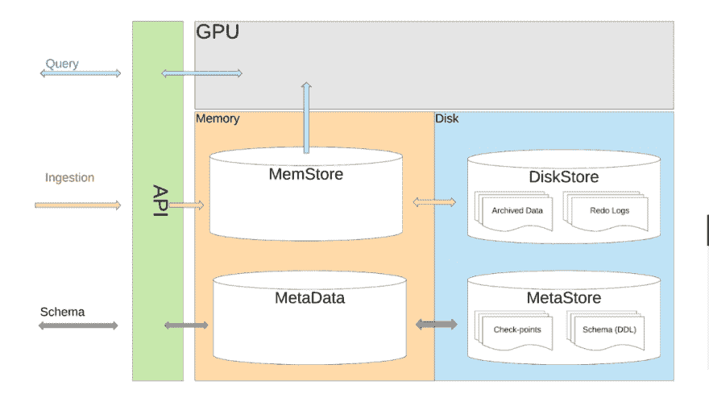
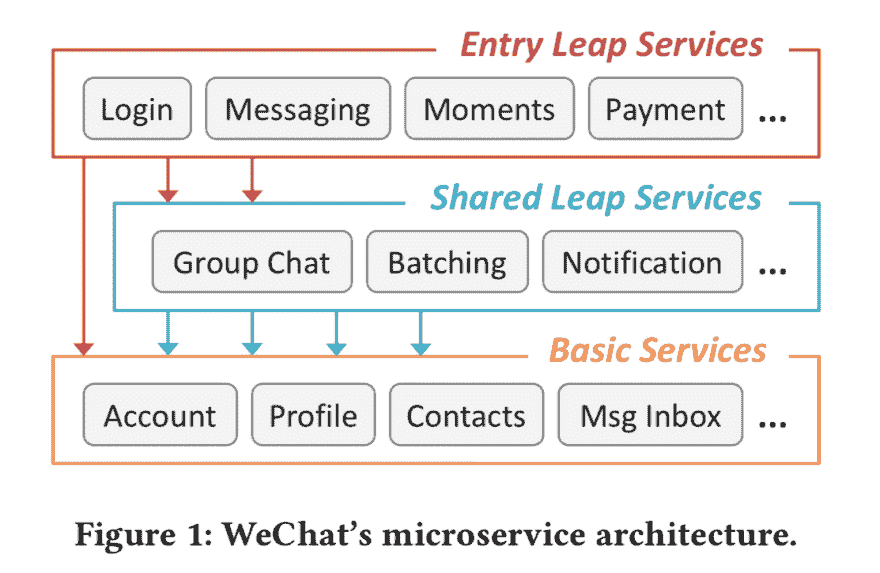
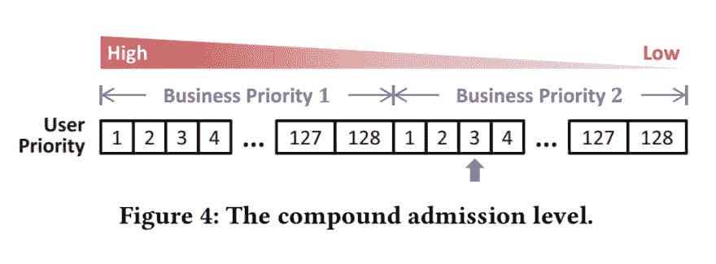
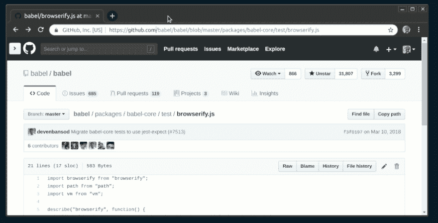

# EnqueueZero Techshack 2019-06

> 原文：<https://dev.to/soasme/enqueuezero-techshack-2019-06-nil>

# enqueue zero Techshack 2019-06

## 面向 MacOS 的 Kubernetes 开发者工作流

[medium.com](https://medium.com/@mo_keefe/a-kubernetes-development-workflow-for-macos-8c41669a4518)

本文为 macOS 用户介绍了一套 kube 扩展的工具:kubectx、kubectl alias、krew、skaffold、dive、stern。

## 你需要知道的事情- GitOps

[weave.works](https://www.weave.works/technologies/gitops/)

GitOps 是一种持续交付的方式。它通过使用 Git 作为声明性基础设施和应用程序的单一事实来源来工作。

规则:

*   所有可以描述的东西都必须存储在 git 中。
*   不应该直接使用 Kubectl。
*   使用遵循操作模式的 Kubernetes 控制器。

下面是一个典型的 GitOps 流程。

*   一个新特性的 pull 请求被推送到 GitHub 进行审查。
*   代码由同事审查和批准。在代码被修改和重新批准后，它被合并到 Git 中。
*   Git 合并触发 CI 和构建管道，运行一系列测试，然后最终构建一个新的映像并将新映像存放到注册中心。
*   “Deployment Automator”监视映像注册表，注意到映像，从注册表中提取新映像，并在配置报告中更新其 YAML。
*   “部署同步器”(安装在集群中)，检测集群是否过期。它从配置报告中提取已更改的清单，并将新功能部署到生产环境中。

## 介绍 AresDB:优步基于 GPU 的开源实时分析引擎

[eng.uber.com](https://eng.uber.com/aresdb/)

AresDB 是一个开源的实时分析引擎，它利用一种非常规的能源，即图形处理单元(GPU)，使我们的分析能够大规模增长。文章介绍了 AresDB 的设计。

在高层次上，AresDB 将其大部分数据存储在主机内存(连接到 CPU 的 RAM)中，使用 CPU 处理数据接收，并通过磁盘进行数据恢复。在查询时，AresDB 将数据从主机内存传输到 GPU 内存，以便在 GPU 上进行并行处理。

[](https://res.cloudinary.com/practicaldev/image/fetch/s--9fh_5gr4--/c_limit%2Cf_auto%2Cfl_progressive%2Cq_auto%2Cw_880/https://eng.uber.com/wp-content/uploads/2019/01/image20-1068x605.png)

AresDB 的架构支持以下特性:

*   基于列的压缩存储
*   通过主键重复数据删除实现实时向上插入
*   GPU 支持的查询处理

## 从 ActiveMQ 到 Amazon MQ:我们为什么以及如何迁移到 AWS 的托管解决方案

[medium.com](https://medium.com/bench-engineering/from-activemq-to-amazon-mq-why-and-how-we-moved-to-awss-managed-solution-afeba3ea7e23)

本文描述了从自托管 ActiveMQ 迁移到 Amazon MQ 的解决方案。

## Kubernetes 的失败故事

[github.com](https://github.com/hjacobs/kubernetes-failure-stories)

与 Kubernetes 相关的公开失败案例的链接列表。这种失败故事的汇编应该使处理 Kubernetes 运营的人(SRE、运营、平台/基础设施团队)更容易向他人学习，并减少在生产中运行 Kubernetes 的未知情况。

## 幸存的随叫随到:来自石墨 SRE 的提示

[hostedgraphite.com](https://www.hostedgraphite.com/blog/surviving-on-call-tips-from-a-hosted-graphite-sre)

*   设置“请勿打扰”。您收到的唯一声音通知是来自近亲、电话报警、传呼机值班通知或紧急工作电话。
*   随叫随到，照顾好自己。抓紧时间或者吃点东西。
*   准备好电话/ 4G 连接，笔记本电脑，电源银行，背包。

## CNAB:用多个工具链打包应用程序

[speakerdeck.com](https://speakerdeck.com/garethr/cnab-packagaging-for-applications-with-multiple-toolchains)

大型组织拥有多样化的工具链，这意味着更多工具的更多版本。CNAB 允许将工具与他们管理的应用程序打包在一起。
它不会创建另一个包标准；这是关于工具之间的兼容性。
CNAB 提供了存储库和注册库之间的兼容性，使得集成任何包格式变得更加容易。
它有以下概念:元数据(bundle.json)、磁盘表示(fs 布局)、执行(带有参数的 oci 运行时入口点)和分发(oci 映像和分发规范)。

关键要点:

*   CNAB 是一个规范。想想 MSI 或 OSI，而不是掌舵图。
*   早期，但有很大的黑客潜力。

## 随分布分布:舵图库即将发生的变化

[blog.bacongobbler.com](https://blog.bacongobbler.com/post/2019-01-25-distributing-with-distribution/index.html)

本文展示了如何在发行版(也称为 Docker Registry v2)中存储舵图。简单地说，图表存储库是一个基本的 HTTP 服务器，它包含一个 index.yaml 文件和一些打包的图表。Docker 的分发项目不只是针对容器图像，而是针对任何形式的内容，包括舵图。

`oras`是在 Helm 3 讨论期间开发的一个开源项目，用于从发行版推送和拉取任何内容。

用法:

1.  在本地启动注册表。

```
$ docker run -dp 5000:5000 --restart=always --name registry registry:2 
```

Enter fullscreen mode Exit fullscreen mode

1.  上传任何文件。

```
$ echo "hello world!" > helloworld.txt
$ oras push localhost:5000/helloworld:latest helloworld.txt:text/plain 
```

Enter fullscreen mode Exit fullscreen mode

1.  下载任何文件。

```
$ oras pull localhost:5000/helloworld:latest -t text/plain 
```

Enter fullscreen mode Exit fullscreen mode

## C 中的协程

[www.chiark.greenend.org.uk](https://www.chiark.greenend.org.uk/~sgtatham/coroutines.html)

这篇文章从头开始描述了协程是如何工作的。通过引入协程，我们保持了几乎相同的代码，但是完全改变了执行流程。基本的想法是通过使用达夫的设备。

```
#define crBegin static int state=0; switch(state) { case 0:
#define crReturn(i,x) do { state=i; return x; case i:; } while (0)
#define crFinish } int function(void) {
    static int i;
    crBegin;
    for (i = 0; i < 10; i++)
        crReturn(1, i);
    crFinish;
} 
```

Enter fullscreen mode Exit fullscreen mode

## 目标标签是为了生活，而不只是为了圣诞节

[www.robustperception.io](https://www.robustperception.io/target-labels-are-for-life-not-just-for-christmas/)

您应该如何选择贴在普罗米修斯监控目标上的标签？

*   目标标签应该是不变的。
*   目标标签应该最少。

## API 网关正在经历一场身份危机

[blog.christianposta.com](http://blog.christianposta.com/microservices/api-gateways-are-going-through-an-identity-crisis/)

API 是一个显式和有目的定义的接口，旨在通过网络调用，使软件开发人员能够以受控和舒适的方式对组织内的数据和功能进行编程访问。API-gateway 模式是为了让不同类别的消费者更好地使用 API。

## 事件驱动之旅——第一部分:为什么事件优先思维会改变一切

[www.confluent.io](https://www.confluent.io/blog/journey-to-event-driven-part-1-why-event-first-thinking-changes-everything)

*   为什么事件很重要？发生了一场革命；组织必须成为实时的；要成为实时，它们必须成为事件驱动的。事件的价值在于相关事件的序列代表行为。
*   两种模式:
    *   事件优先模式，发送事实。
    *   事件命令模式，发出命令。
*   事件优先方法的成本
    *   需要支持可追溯性、故障路径、规模以及对事情出错原因的解释。
*   事件优先方法的优势
    *   退耦
    *   包装
    *   反向知识
    *   进化变化
    *   活动采购

## 伸缩微信微服务的过载控制

[blog.acolyer.org](https://blog.acolyer.org/2018/11/16/overload-control-for-scaling-wechat-microservices/)

本文描述了已经在微信上生产了五年的久经沙场的过载控制系统 DAGOR 的设计。

挑战:

*   后端有超过 3k 项服务，包括即时通讯、社交网络、移动支付和第三方授权。
*   该平台每天会收到 10 到 10 个<sup>到 11 个</sup>的外部请求，引发更多的服务请求，以至于微信后端作为一个整体每秒需要处理数亿个请求。
*   微服务系统运行在超过 20k 台机器上，并且数量还在增加。
*   平均每天有一千个系统变更。
*   在一年中的某些时候(例如中国农历新年前后)，高峰工作量可能会达到日平均工作量的 10 倍。

架构-三层服务:

*   入口 leap 服务:接收外部请求的前端服务
*   共享 leap 服务:中间层编排服务
*   基本服务:不分散到任何其他服务的服务，因此充当请求的接收器

[](https://res.cloudinary.com/practicaldev/image/fetch/s--0JMxlmC4--/c_limit%2Cf_auto%2Cfl_progressive%2Cq_auto%2Cw_880/https://adriancolyer.files.wordpress.com/2018/11/dagor-fig-1.jpeg)

微信的过载控制系统叫做 DAGOR。它旨在为所有服务提供过载控制，因此被设计成服务不可知的。

*   对于过载检测，DAGOR 使用挂起队列中请求的平均等待时间(即排队时间)。
*   一旦检测到过载，就使用一个精选的特征优先级表来丢弃一些请求。它添加了基于用户 id 的第二层准入控制。考虑到总共 128 个级别，当过载控制被设置为业务优先级级别 n 时，来自级别 n+1 的所有请求都将被丢弃。

[](https://res.cloudinary.com/practicaldev/image/fetch/s--U9i4l7nS--/c_limit%2Cf_auto%2Cfl_progressive%2Cq_auto%2Cw_880/https://adriancolyer.files.wordpress.com/2018/11/dagor-fig-4.jpeg)

吸取的教训:

*   大规模微服务架构中的过载控制必须在每个服务中是分散的和自治的
*   过载控制应该考虑各种反馈机制(例如 DAGOR 的协作接纳控制)，而不是仅仅依赖于开环试探法。
*   过载控制设计应该通过分析实际工作负载的处理行为来提供信息。

## 绞杀应用

[martinfowler.com](https://www.martinfowler.com/bliki/StranglerApplication.html)

[](https://res.cloudinary.com/practicaldev/image/fetch/s--1gxOf9Vw--/c_limit%2Cf_auto%2Cfl_progressive%2Cq_auto%2Cw_880/https://www.martinfowler.com/bliimg/stranglerApplication/11090068.jpg)

^多年来，巨大的扼杀者藤蔓在宿主树的上部枝干中播种，长成奇异而美丽的形状，同时扼死并杀死宿主。

这个比喻是，与其建立一个新的系统来取代现有的系统，另一条路线是围绕旧系统的边缘逐渐建立一个新系统，让它在几年内慢慢成长，直到旧系统被扼杀。

基本策略是 EventInterception，它可以用来逐渐将功能转移到扼杀者并启用 AssetCapture。

这里还有另一个重要的想法——当设计一个新的应用程序时，你应该以这样一种方式设计它，使它在将来更容易被扼杀。

## Git 历史

[githistory.xyz](https://githistory.xyz/)

快速浏览任何 GitHub 文件的历史:

1.  在任何文件 url 中用 github.githistory.xyz 替换 github.com
2.  没有第二步

[](https://res.cloudinary.com/practicaldev/image/fetch/s--Jo8cmrUc--/c_limit%2Cf_auto%2Cfl_progressive%2Cq_66%2Cw_880/https://githistory.xyz/static/media/demo.165514d4.gif)

## 网络疯癫

[0x46.net](https://0x46.net/thoughts/2019/02/01/dotfile-madness/)

"我自己的主目录包含 25 个普通文件和 144 个隐藏文件."随着 [XDG 基本目录规范](https://specifications.freedesktop.org/basedir-spec/basedir-spec-latest.html)的创建，这个特殊的问题很久以前就已经被注意到并解决了。

使用标准非常简单。读取相关的环境变量，并使用标准定义的默认路径(如果缺少的话)。然后，您应该为它附加一个特定于程序的目录名，并创建整个目录树来存储您的数据。

* * *

原创发布:[http://enqueuezero.com/techshack.weekly/2019-06.html](http://enqueuezero.com/techshack.weekly/2019-06.html)