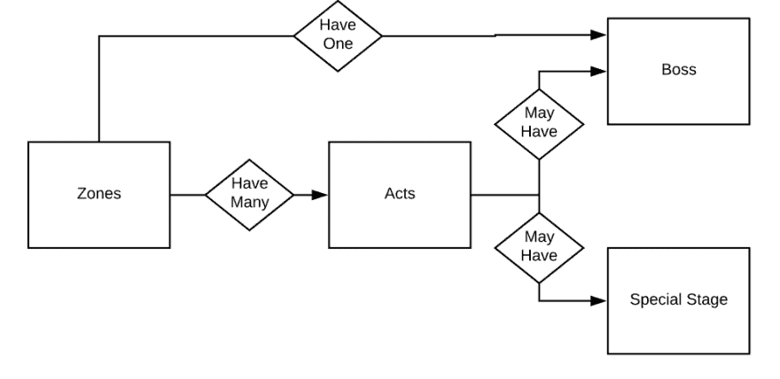
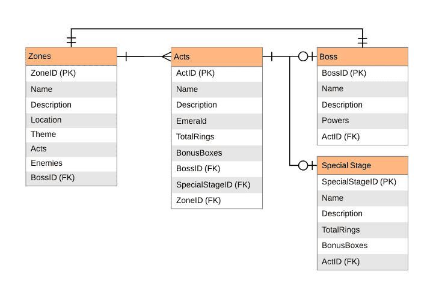
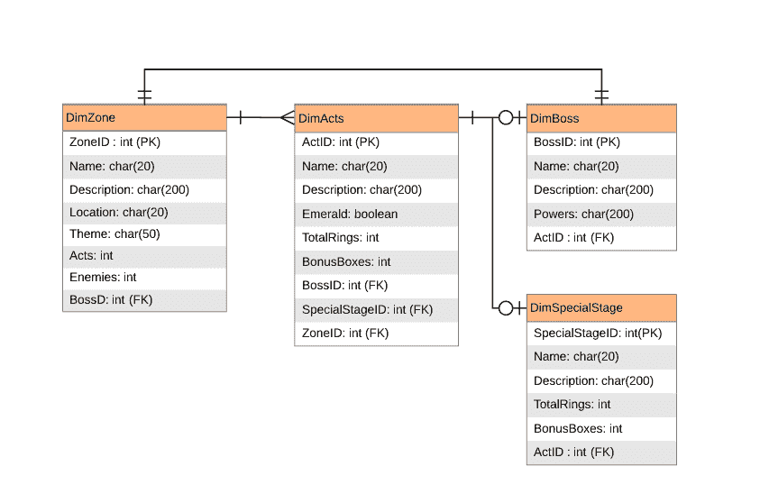
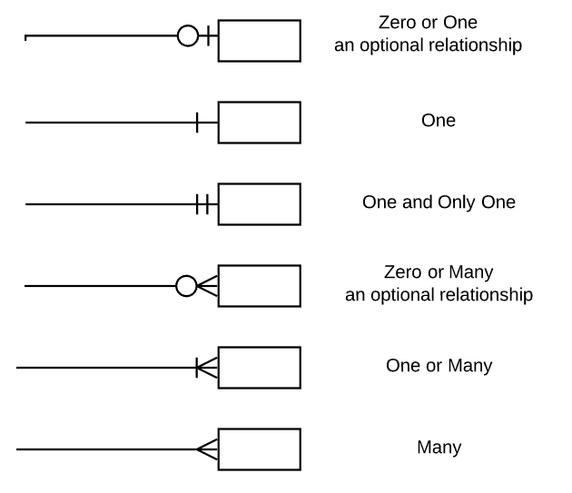

# 刺猬索尼克解释的实体关系图

> 原文：<https://dev.to/helenanders26/entity-relationship-diagrams-explained-by-sonic-the-hedgehog-1m68>

实体关系图(ERD)显示了表和连接它们的公共键之间的关系。最初，它们可能看起来像是一团杂乱的意大利面条。

在这个例子中，我将使用我最喜欢的世嘉主系统游戏《刺猬索尼克》中的数据，并说明区域、行为和 boss 级别如何协同工作。

* * *

> [概念数据模型](#chapter-1)
> [逻辑数据模型](#chapter-2)
> [物理数据模型](#chapter-3)
> [圆圈和箭头是什么意思？](#chapter-4)
> [我们可以建模哪些系统？](#chapter-6)
> [我们如何开始？](#chapter-7)

* * *

## 概念数据模型

一级！

概念数据模型。这是模型中不同实体及其关系的高级概述。

在我们的例子中，我们显示在刺猬索尼克 1，区域可以有许多行为，这些级别可能有特殊的阶段，可能有老板，但每个区域只有一个老板。

这个模型的特点是实体，矩形。这是一个物理的东西，一个事实或者一个事件。这些实体之间的关系用菱形表示。

* * *

## 逻辑数据模型

逻辑数据模型为我们的模型增加了更多的细节。在这个图中，我们使用 crows foot 符号(稍后会详细介绍)添加表之间的关系，并添加主键和外键来准确显示它们之间的关系。

* * *

## 物理数据模型

最后，物理数据模型显示了该模型将如何实际实现。这是我们数据库中表的数据类型和名称。在这种情况下，所有表都记录属性，维度也是如此。

* * *

## 圆圈和箭头是什么意思？

这被称为“乌鸦脚”符号，通过在连接实体的线的两侧使用“乌鸦脚”、线或圆来显示关系。

* * *

## 我们可以对哪些系统建模？

关系系统中的结构化数据。我们需要能够看到表、列和键形式的关系。

* * *

## 我们如何开始？

当你准备好发布时，Lucidchart 做了一件很棒的工作，使绘制图表变得很容易，但是有许多工具可以帮助你开始。

最好的开始方式是选择低技术含量的产品。拿出一支笔和一张大纸。在打开工具之前，请将此作为第一步。另外，它会让你离开屏幕一会儿。祝你好运！

* * *

## 阅读更多

 [## 从头到尾的 SQL 概念

### 海伦·安德森 2 月 6 日 1914 分钟阅读

#data #database #sql #beginners](/helenanders26/sql-series-from-a-to-z-2pk9)

* * *

这篇文章最初出现在[helenanderson.co.nz](https://www.helenanderson.co.nz/entity-relationship-diagrams/)