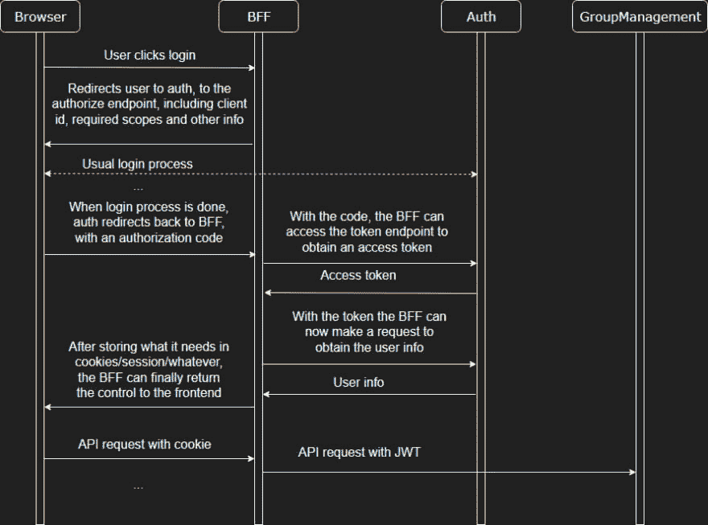

# 第 021 集-整合身份服务器 4 -第 1 部分-概述-ASP.NET 核心:从 0 到过度杀戮

> 原文：<https://dev.to/joaofbantunes/episode-021-integrating-identityserver4-part-1-overview-asp-net-core-from-0-to-overkill-23no>

在这一集中，我们首先概述当前应用程序的架构，以及我们将如何开始将 IdentityServer4 集成到其中。

对于演练，您可以查看下一个视频，但如果您喜欢快速阅读，请跳到书面综合。

[https://www.youtube.com/embed/gitwuhYvFwo](https://www.youtube.com/embed/gitwuhYvFwo)

整个系列的播放列表是[这里是](https://www.youtube.com/playlist?list=PLN0oN9Azm_MMAjk3nhRnmHdr1l0160Dhs)。
T3】

## [T1】简介](#intro)

到目前为止，我们已经开发了应用程序的一些组件，并连接了其中的几个组件:

*   Vue.js 单页应用程序向后端发出请求
*   前端的后端充当 SPA 和组管理 API 之间的接口

然而，在图中仍然看不到认证服务。从这一集开始，一直到第 25 集，我们将改变这一点。我们将把 [IdentityServer4](https://github.com/IdentityServer/IdentityServer4) 引入到认证服务中，然后利用 [OpenId Connect](https://openid.net/connect/) 、 [OAuth 2.0](https://oauth.net/2/) 和其他相关技术让它们一起工作。

这篇文章只是对我们将在接下来的文章中实现的解决方案的一个快速概述。

## 应用架构概述

让我们先来看一下我们期望的架构，包括我们目前拥有的组件。

`Architecture diagram`
[T4】](https://thepracticaldev.s3.amazonaws.com/i/t5cdldndwp83k1od9bhk.jpg)

上图提供了我们目标的快速浏览。所有可以通过互联网访问的组件都不能直接使用，只有一个反向代理是公开的组件。一些服务甚至不能通过反向代理访问，例如组管理服务，它将通过 BFF 使用。

再次查看该图，您会注意到一些带编号的箭头，表示组件之间的交互。快速描述这种相互作用，我们有:

1.  SPA 主机将处理请求以获取组成浏览器应用程序的静态文件(HTML、JS、CSS、images)。
2.  对于 BFF，我们通常会有 SPA 发出的 API 请求，通过 cookies 进行验证。也会出现跨站点请求伪造令牌。
3.  这里，我们将在用户身份验证期间发出请求，直接或通过 OpenId connect 前端通道重定向与身份验证服务交互(例如，当我们在应用程序中单击登录时，它会重定向到身份验证服务)。
4.  对于组管理 API，我们将看到 BFF 发出的请求。使用访问令牌(JWT)对请求进行身份验证。
5.  除了`(3)`中描述的请求，auth 服务还将从 BFF 获取一些反向通道请求(获取用户信息，获取/刷新访问令牌)。

## 认证流程

在下一张图中，我们可以看到从应用程序在用户浏览器中呈现到身份验证过程完成后开始从 API 获取数据的完整流程。

`Authentication flow diagram`
[T4】](https://thepracticaldev.s3.amazonaws.com/i/6bj59eg5o4h88ervsluo.jpg)

这个流程的一部分取决于我们选择的身份验证/授权方法，在本例中是 OpenId Connect 和 OAuth 2。即使在这个最初的选择之后，还有更多的选择，因为 OpenId Connect 为我们提供了更多的选择。在这种情况下，我们使用的是[授权代码流](https://openid.net/specs/openid-connect-core-1_0.html#CodeFlowAuth)(我们将在下一节简要讨论这一点)。

当用户单击 login 并且请求到达 BFF 时，OpenId 连接流就开始了。BFF(依赖方，使用 OpenId 连接措辞)将浏览器重定向到身份提供者，这是我们的认证服务。这个重定向请求采用了 OpenId Connect 实现身份提供者理解的一系列信息。然后，身份验证过程与我们在过去几集中看到的一样，那时我们实现了身份验证服务。当登录完成后，浏览器通过授权代码被重定向回 BFF，BFF 可以使用该代码从 auth 服务获取令牌，以便它可以代表用户调用 API。

## OpenId 连接流

正如我简单提到的，我们将使用授权代码流(至少目前是这样)。其他的选择是隐式流和混合流。关于这一点我不会说得太详细，但是你可以在[这里](https://www.scottbrady91.com/OpenID-Connect/OpenID-Connect-Flows)和[这里](https://leastprivilege.com/2016/01/17/which-openid-connectoauth-2-o-flow-is-the-right-one/)看到一些关于这一点的好帖子。

在任何情况下，我都会在这里快速总结一下可用的流程。

### 授权代码流程

[授权代码流](https://openid.net/specs/openid-connect-core-1_0.html#CodeFlowAuth)通常在我们可以保密的时候使用，就像我们这里的情况一样，我们可以在服务器中保密。这允许我们保留一些凭据，我们的应用程序(BFF)可以使用这些凭据在身份提供者之前进行身份验证，因此在用户完成登录过程并且 BFF 获得授权代码后，我们可以将其交换为访问令牌和刷新令牌。我们用来代表用户发出 API 请求的访问令牌，当访问令牌过期(或即将过期)时我们使用的刷新令牌，因此我们可以获得一个新的令牌并继续，而不需要用户再次登录。

### 隐流

[隐式流](https://openid.net/specs/openid-connect-core-1_0.html#ImplicitFlowAuth)在我们不能保密的时候使用。这种情况的一个例子是一个纯粹基于浏览器的应用程序，它没有可以存储机密的后台服务器。在这种情况下，由于应用程序不能保守秘密(它会在浏览器中被所有人看到),所以它不使用秘密，因为重定向 URI 是验证应用程序身份的手段。鉴于此，我们只能获得一个访问令牌来发出 API 请求，而不能获得刷新令牌，因为它通常比访问令牌具有更长的生命周期，因此它的潜在泄漏是一个更严重的问题。

### 混合流

这个[混血儿流](https://openid.net/specs/openid-connect-core-1_0.html#HybridFlowAuth)，顾名思义，他是前两者的混血儿。它需要保密的能力，如授权代码流(允许使用刷新令牌)，但另外一些令牌在登录过程结束时返回(如访问令牌)，允许需要这些令牌的其他请求立即启动。

**更新:**有一件事我没有提到，但很重要的是，还有一个使用 [PKCE](https://oauth.net/2/pkce/) (代码交换的验证密钥)的选项，它允许我们在通常不太安全的客户端(移动和纯基于浏览器的应用程序)中使用代码流，并且推荐使用隐式流。

## 其他

以上是我们需要做的事情的快速概述。在下一集，我们将从将 IdentityServer4 集成到身份验证服务开始。

我没有深入研究 OpenId Connect 的东西，因为那需要一个自己的帖子(或多个)，我专注于让这一切与 ASP.NET 一起工作。不管怎样，如果有不太清楚的地方，请随意提问。

帖子中的链接:

*   [OpenId 连接规格](https://openid.net/developers/specs/)
*   [身份服务器文档](http://docs.identityserver.io)
*   [识别 GitHub 上的服务器](https://github.com/IdentityServer)
*   [OpenID 连接流程](https://www.scottbrady91.com/OpenID-Connect/OpenID-Connect-Flows)
*   [哪个 OpenID Connect/OAuth 2.0 流程是正确的？](https://leastprivilege.com/2016/01/17/which-openid-connectoauth-2-o-flow-is-the-right-one/)
*   [RFC 7636:代码交换的证明密钥](https://oauth.net/2/pkce/)

这个子系列帖子的源代码分散在[“编码民兵:ASP.NET 核心-从 0 到过度杀戮”组织](https://github.com/AspNetCoreFromZeroToOverkill)的一堆仓库中，标记为`episode021`。

*   [认证](https://github.com/AspNetCoreFromZeroToOverkill/Auth/tree/episode021)
*   [群组管理](https://github.com/AspNetCoreFromZeroToOverkill/GroupManagement/tree/episode021)
*   [web 前端](https://github.com/AspNetCoreFromZeroToOverkill/WebFrontend/tree/episode021)

感谢分享和反馈！

谢谢你的来访，西阿兹！