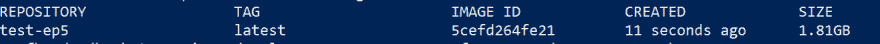
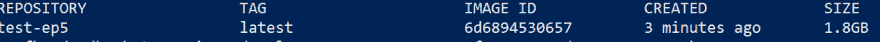

# 第 5 集-使用 ASP.NET 核心的 JSON API，Docker & MongoDB -建模，控制器和单元测试第一部分-书店

> 原文：<https://dev.to/garfbradaz/episode-5---json-api-using-aspnet-core-docker---mongodb---modelling-controller-and-unit-tests-part-i---bookstore-5alk>

## 前情提要

在[第 4 集](https://garfbradaz.github.io/blog/2018/12/31/Episode-4-JSON-API-ASP.NET-Core-Docker-Compose.html)中，我设置了我们的`docker-compose`文件，以允许我们将我们的应用程序和它将使用的服务编织在一起。今天的专题集中在书店对象的**建模、控制器和单元测试。**

这里有一个关于第一阶段的示例*用户故事/史诗*的提示。

> 作为一家*书店，我可以将*我们的*书店*添加到数据库中，这样我们就可以被访问了
> 
> 作为一家书店，我可以将我们在 T2 的库存添加到我们的数据库中，这样我们就可以公开我们的库存
> 
> 作为一家*书店，我们可以更新*图书的库存水平，以获得准确的库存水平
> 
> 作为一名 *API 消费者，我可以查找 a _stores 地址* *，这样*我们就知道在哪里可以买到*的书*
> 
> 作为一个 *API 消费者 _ 我可以查找 a _book* *所以*我们可以得到一个销售 a _book 的*商店*的*列表*
> 
> 由于*book store IT Security _ 我们可以向 API_For_API 消费者添加 _ API 密钥*,以便在查询 API 时使用

## 依赖于 MongoDB

我们的应用程序最终将使用 *MongoDB* 作为其后端数据存储。我们需要依赖 MongoDB 驱动程序。这将允许我们与 MongoDB 通信并使用它。

使用您选择的 shell，将目录更改为`../src/api`目录。概括地说，我们的目录结构是:

```
.
    ├── src
    | ├── api
    | |
    | ├── BookStoreApp.WebApi.csproj
    | ├── Dockerfile
    ├── tests
    | ├── integration
    | ├── unit
    | ├── BookStore.Tests.csproj
    ├── docker 
```

**注:**事情发生了变化，你能猜到是什么吗？是的，没错，我已经把`.csproj`改名为`BookStoreApp.WebApi.csproj`而不是`BookStore.WebApi.csproj`。

现在运行下面的命令，将最新的 Nuget 包添加到您的 api 项目中。

```
dotnet add package MongoDB.Driver 
```

一旦我们在下一集建立了单元测试基础设施，我们将回到 MongoDB。

## 书店

### 造型

我们的第一个模特( **M** VC 中的 *M* ，将代表我们的**书店**。一个简单的[普通的旧 C# (POCO)](https://en.wikipedia.org/wiki/Plain_old_CLR_object) 来表示这个:

```
/// <summary>
    /// BookStore POCO.
    /// </summary>
    public class BookStore
    {
        [BsonId]
        public ObjectId Id {get; set;}
        public string Name {get;set;}
        public string AddressLine1 {get;set;}
        public string AddressLine2 {get;set;}
        public string AddressLine3 {get;set;}
        public string City {get;set;}
        public string PostCode {get;set;}
        public string TelephoneNumber {get;set;}

        /// <summary>
        /// Default constructor
        /// </summary>
        public BookStore()
        {
            this.Id = ObjectId.GenerateNewId();
        }
    } 
```

我在我的`../api`文件夹中添加了一个`Model`文件夹。MongoDB 使用一种叫做 [BSON](https://docs.mongodb.com/manual/reference/glossary/#term-bson) 的序列化格式标准。BSON 有*类型*的想法，其中一个类型是 [`ObjectId`](https://docs.mongodb.com/manual/reference/bson-types/#objectid) ，它代表记录的唯一 id。你用`[BsonId]`属性修饰`Id`属性，通知 MongoDB 驱动什么字段是你的`BsonId`字段。

我还创建了一个默认的构造函数来设置这个 Id。现在我们已经创建了`Models`目录，结构如下:

```
.
    ├── src
    | ├── api
    | ├── Models
    | ├── BookStore.cs
    | ├── BookStoreApp.WebApi.csproj
    | ├── Dockerfile
    ├── tests
    | ├── integration
    | ├── unit
    | ├── BookStore.Tests.csproj 
```

### 控制器

现在我们需要创建一个**书店**控制器。一个控制器是 MV **C** 模式中的 *C* 。控制器将使用*动作*处理进来的 HTTP 请求。HTTP 请求通过 MVC 的路由管道被映射到动作。对于 WebAPIs，它们映射到特定的 HTTP 方法，如`GET`、`POST`、`PUT`等。

ASP.NET 希望你在创建自己的控制器时遵循惯例:

*   控制器类名总是以`Controller`结尾。
*   控制器类应该位于名为`Controllers`的文件夹中。
*   控制器类应该继承自`Microsoft.AspNetCore.Mvc.ControllerBase` (WebAPI) / `Microsoft.AspNetCore.Mvc.Controller`(带有视图的 ASP.NET MVC 应用程序)。

当你做一个`dotnet new webapi`时，模板包括一个标准的`ValuesController.cs`，它位于一个`Controllers`文件夹中。在那里创建一个新的`BookStoreController.cs`文件:

```
.
    ├── src
    | ├── api
    | ├── Controllers
    | ├── BookStoreController.cs
    | ├── Models
    | ├── BookStore.cs
    | ├── BookStoreApp.WebApi.csproj
    | ├── Dockerfile
    ├── tests
    | ├── integration
    | ├── unit
    | ├── BookStore.Tests.csproj 
```

我在这个文件中添加了以下内容:

```
[Route("api/[controller]")]
    [ApiController]
    public class BookStoreController : ControllerBase
    {
        // GET api/values
        [HttpGet]
        public async Task<ActionResult> Get()
        {
            var bookStore = new List<BookStore>{
                new BookStore {
                    Name = "Waterstones",
                    AddressLine1 = "The Dolphin & Anchor",
                    AddressLine2 = "West Street",
                    City = "Chichester",
                    PostCode = "PO19 1QD",
                    TelephoneNumber = "01234 773030"
                }
            };
            return await Task.Run(() => new JsonResult(bookStore));
        }
    } 
```

这是一个简单的`GET`方法，只返回一个硬编码的`BookStore`对象。对于今天的这一集，我们只是专注于建立和运行我们的单元测试基础设施，所以我们可以忽略`PUT`、`POST`和`DELETE`，直到我的下一集。

### 单元测试

在我们继续之前，我们需要使用`dotnet`工具来添加一个项目引用到我们的测试项目中。将目录更改为`tests\unit`，并执行以下操作来添加一个引用:

```
dotnet add reference ..\..\src\api\BookStoreApp.WebApi.csproj 
```

我还添加了两个基本的测试方法来覆盖我们在 oir 控制器中的新的`GET`方法:

```
public class ControllerTests
    {
        [Fact]
        public async Task BookStoreController_Get_Should_Return_ActionResult()
        {
            //Arrange
            var controller = new BookStoreController();

            //Act
            var result = await controller.Get();

            //Assert
            Assert.IsType<JsonResult>(result);
        }

        [Fact]
        public async Task BookStoreController_Get_Should_Return_Correct_BookStore_Data()
        {
            //Arrange
            var controller = new BookStoreController();

            //Act
            var result = await controller.Get();
            var json = result.ToJson<BookStore>();

            //Assert
            Assert.True(json[0].Name == "Waterstones",$"Assert failed, received {json[0].Name} ");
            Assert.True(json[0].PostCode == "PO19 1QD",$"Assert failed, received {json[0].PostCode} ");
            Assert.True(json[0].TelephoneNumber == "01234773030",$"Assert failed, received {json[0].TelephoneNumber} ");
        }
    } 
```

在我们开始与 Docker 集成之前，我们可以使用`dotnet`工具进行测试。确保您在`tests\unit`目录中，并运行:

```
dotnet restore
dotnet test 
```

`test`将首先触发`dotnet build`，然后运行我们的 XUnit 测试。一个测试应该会失败，输出如下:

> 测试总数:2。通过:1。失败:1。跳过:0。
> 
> 测试运行失败。
> 
> 测试执行时间:2.6340 秒

这个错误是故意的，在`"01234773030"`之间应该有一个空格，我修正了这个:

```
Assert.True(json[0].TelephoneNumber == "01234 773030",$"Assert failed, received {json[0].TelephoneNumber} "); 
```

重新运行测试，一切都应该是绿色的:

> 测试总数:2。通过:2。失败:0。跳过:0。
> 
> 测试运行成功。
> 
> 测试执行时间:3.1173 秒

现在我们有一个项目，在控制器中有一些基本的逻辑，还有一个非常基本的模型。我们也已经开始创建一些测试来覆盖这些代码。现在我们需要*构建并运行*应用程序。在这个阶段，我们可以使用正常的路线，但由于这些剧集包括 **Docker** ，让我们将我们所知道的整合到 Docker 管道中。

## 码头工人

首先在项目的根目录下创建一个新的 Docker 文件。您的项目结构现在应该是这样的:

```
.
    ├── src
    ├── tests
    ├── Dockerfile 
```

在这里，我们将创建一个多阶段的`Dockerfile`来恢复、构建和运行我们的测试。这里是第一阶段:

```
FROM microsoft/dotnet:2.2-sdk AS build-env
WORKDIR /app

COPY src/api/BookStoreApp.WebApi.csproj ./src/api/
RUN dotnet restore ./src/api/BookStoreApp.WebApi.csproj
COPY tests/unit/BookStore.Tests.csproj ./tests/unit/
RUN dotnet restore ./tests/unit/BookStore.Tests.csproj

COPY . . 
```

在之前的几集里，你应该对此很熟悉了。这一次请注意，我们正在将单元测试项目文件复制到构建上下文中。还要注意，我们需要保持与之前相同的目录结构，因为我们之前在测试项目中添加了一个`dotnet add reference`。如果目录不匹配，我们会得到构建错误。

运行以下命令:

```
docker build -t test-ep5 . 
```

现在做一个`docker image`，你会看到一个巨大的图像:

[](https://res.cloudinary.com/practicaldev/image/fetch/s--_8fGWiYx--/c_limit%2Cf_auto%2Cfl_progressive%2Cq_auto%2Cw_880/https://garfbradaz.github.io/assets/img/posts/test-ep5-size.png)

Docker 有办法解决这个问题，见见`.dockerignore`。

### 。码头工人

这个文件的行为类似于一个`.gitignore`。它告诉 docker 在构建期间不要复制哪些文件。那么你如何知道哪些文件要忽略，我从[韦斯·希格比](https://twitter.com/g0t4)那里学到了一个好技巧，通过传入一个`ls alR`来列出你的目录。运行以下命令:

```
docker run --rm test-ep5 ls -alR 
```

这将列出您的容器文件系统，您可以很容易地看到什么是复制的。所以像`.vscode`、`.git`文件夹和`bin`目录这样的东西。在这个多阶段`Dockerfile`的构建阶段不需要这些东西，所以让我们排除它，使用类似的 glob 模式，你可以在`.gitignore`文件中使用。将一个`.dockerignore`文件添加到您的根目录:

```
.
    ├── src
    ├── tests
    ├── Dockerfile
    ├── .dockerignore 
```

然后添加以下内容，不包括恢复和构建不需要的文件和工件。我们排除了我们一直在使用的`docker`文件夹和`.ps1`脚本。加上`README.md`和 dockerfiles。

```
**/.vscode/
**/.git/
docker/
**/bin/
**/obj/
**/.dockerignore/
**/Dockerfile*
**/docker-compose*.yml/
run.ps1
clean.ps1
README.md 
```

重新运行:

```
docker build -t test-ep5 .
 docker run --rm test-ep5 ls -alR 
```

您将看到一个更整洁的版本，并且比以前少了大约 100MB 的空间:

[](https://res.cloudinary.com/practicaldev/image/fetch/s--X7f5gqXM--/c_limit%2Cf_auto%2Cfl_progressive%2Cq_auto%2Cw_880/https://garfbradaz.github.io/assets/img/posts/test-ep5-size-2.png)

## Docker 中的单元测试

所以现在我们已经修剪了我们的图像，我们可以将我们的测试添加到我们的`Dockerfile`中。将以下内容添加到您的`Dockerfile` :

```
RUN dotnet test tests/unit/BookStore.Tests.csproj
RUN dotnet publish src/api/BookStoreApp.WebApi.csproj -o /publish 
```

我们运行之前在命令行上运行的内容(参见无魔法)。这将运行我们的单元测试，然后如果它们通过，我们将发布一个新的版本，通过运行`dotnet publish`并输出到一个新的`/publish`目录，为我们的第二阶段做好准备。

使用下面的代码再次运行，看看测试是否成功！

```
docker build -t test-ep5 . 
```

如果这些单元测试失败了，我们会看到和以前一样的结果，所以你可以看到这一切是如何联系在一起的。仅仅因为我们在 docker 中运行我们的测试，`dotnet`仍然表现相同。没有码头魔术。

### 运行您的应用程序

在前几集里，我们有一个多阶段`Dockerfile`，第二阶段运行应用程序本身。这里没有什么不同，我们的第二阶段允许我们运行我们的应用程序。

**注意:**一旦我们添加了这个，我们就不能使用韦斯教我们的**“ls aLR”**诡计，因为我们的`ENTRYPOINT`将被设置为`dotnet`。另外，第一个构建阶段一旦使用就被丢弃了，所以我们无论如何也不能完全访问这个目录。

将以下内容添加到您的`Dockerfile`中，这是我们的运行时阶段:

```
FROM microsoft/dotnet:2.2-aspnetcore-runtime AS runtime-env
WORKDIR /publish
COPY --from=build-env /publish .
ENTRYPOINT ["dotnet","BookStoreApp.WebApi.dll"] 
```

首先重建图像:

```
docker build -t test-ep5 . 
```

然后我们可以将映像作为容器进程运行，使用`-e`覆盖一些 ASP.NET 核心环境变量。我们通常会在使用`docker-compose`时覆盖这些。

```
docker run -e "ASPNETCORE_ENVIRONMENT=Development" -e "ASPNETCORE_URLS=http://+:5003" -p 5003:5003 --rm -it test-ep5 
```

然后，您可以使用您选择的应用程序(我使用的是 Postman，后面会有更多介绍)点击[http://localhost:5003/API/book store](http://localhost:5003/api/bookstore)。您应该会收到以下 JSON 有效负载:

```
[
    {
        "id": "5c6947093497a200016c0dee",
        "name": "Waterstones",
        "addressLine1": "The Dolphin & Anchor",
        "addressLine2": "West Street",
        "addressLine3": null,
        "city": "Chichester",
        "postCode": "PO19 1QD",
        "telephoneNumber": "01234 773030"
    }
] 
```

就这样，我们慢慢开始将我们的开发和单元测试管道转移到 docker 本身。

## 下次

今天到此为止。如果你想要的话，记住所有的代码都在 Github 上。

在下一集，我们将开始把 MongoDB 集成到应用程序中。