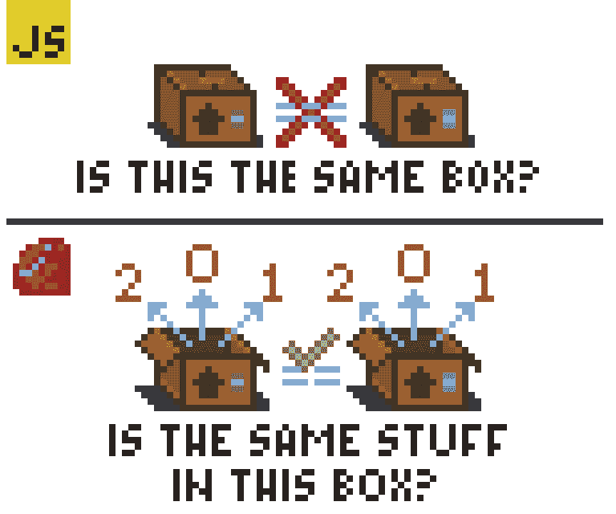

# 数据结构的平等性:Ruby 与 JavaScript

> 原文：<https://dev.to/annarankin/equality-of-data-structures-ruby-vs-javascript-48b7>

[跳到 TL；博士](https://dev.to/annarankin/equality-of-data-structures-ruby-vs-javascript-48b7#tldr)

最近几周，我和一位同事通读了雷金纳德·布莱斯维特的 JavaScript Allongé(从函数式编程的角度很好地审视了 JS 的基础)。我的同事提出了一些对她来说没有意义的事情:

> 在 JavaScript 中，为什么空数组不等于空数组？这两个相同的物体有什么不同？

[](https://res.cloudinary.com/practicaldev/image/fetch/s--lmlbtcsg--/c_limit%2Cf_auto%2Cfl_progressive%2Cq_auto%2Cw_880/https://thepracticaldev.s3.amazonaws.com/i/sq6l3flghhxaxft9ua9a.png)

对于使用 JavaScript 已经有一段时间的人来说，答案似乎很简单:“它们是两个不同的数组；当然一个不等于另一个！”然而，像我朋友这样的 ruby 专家可能会有不同的看法:“这两个数组有相同的内容——你说*它们不相等是什么意思？”在我看来，这是 Ruby 和 JavaScript 中比较运算符含义的哲学差异。一种语言使用对象*等价*的概念来比较数据结构，而另一种语言明确检查对象*的身份。**

*注意:我不打算讨论 [JS double equal](https://codeburst.io/javascript-double-equals-vs-triple-equals-61d4ce5a121a) 或 [Ruby 的 threequal](https://stackoverflow.com/a/4467823) 操作符，因为它们不仅仅是简单的比较操作符(我也避免使用它们，因为它们可能会引起混淆和误导！).*

[](https://res.cloudinary.com/practicaldev/image/fetch/s--iVwZtBJE--/c_limit%2Cf_auto%2Cfl_progressive%2Cq_auto%2Cw_880/https://thepracticaldev.s3.amazonaws.com/i/m0qtdk4jjp60buay16ke.png)

## Ruby 中数据结构的相等性

当您使用 Ruby 中的内置行为`==`来比较数据结构时，您实际上是在比较对象的*内容*——对于数组，您还会检查两者中元素的顺序是否相同。这意味着指向内存中不同对象的两个变量**可能相等。**

```
> first_array, second_array = [1,2,3], [1,2,3]

> first_array == second_array
=> true 
```

Enter fullscreen mode Exit fullscreen mode

如果出于某种原因，您确实想检查两个变量是否引用同一个对象，您可以检查对象的 ID，或者最好使用`.equal?`方法:

```
> first_array, second_array = [1,2,3], [1,2,3]

> first_array.object_id == second_array.object_id # 70176467875700 == 70176467875680
=> false
> first_array.equal?(second_array) # a clearer way to perform this comparison
=> false 
```

Enter fullscreen mode Exit fullscreen mode

与 JavaScript 不同，Ruby 中的比较操作符实际上是一个定义在你要比较的类上的方法(这个概念的精彩演示[这里](http://rubymonk.com/learning/books/4-ruby-primer-ascent/chapters/45-more-classes/lessons/105-equality_of_objects))。由于`==`只是一个方法，如果你愿意，你甚至可以覆盖它！如果您正在编写需要相互比较的定制类，这是一种合理的做法。下面傻傻的例子:

```
> class Ditto
*   def self.==(other)
*     true
*   end
* end

> Ditto == 'Pikachu'
=> true
> Ditto == 2
=> true
> Ditto == false
=> true 
```

Enter fullscreen mode Exit fullscreen mode

[](https://res.cloudinary.com/practicaldev/image/fetch/s--AEvyXdJ7--/c_limit%2Cf_auto%2Cfl_progressive%2Cq_auto%2Cw_880/https://thepracticaldev.s3.amazonaws.com/i/q4mb7fi1ukyk6o9vqt96.png)

## JavaScript 中数据结构的等价性

与 Ruby 不同，JavaScript 不公开对象的唯一 ID，因为它不需要*来。默认情况下，数据结构按标识进行比较。如果两个变量相等，可以确定它们指向内存中的同一个对象。* 

```
> const firstArray = [1,2,3]
> const secondArray = [1,2,3]
> firstArray === secondArray
false 
```

Enter fullscreen mode Exit fullscreen mode

如果您想检查两个独立的数据结构是否有相同的内容，您必须编写自己的逻辑来检查——或者使用库中的函数，如 [Lodash](https://lodash.com/docs/4.17.11#isEqual) 。

```
// Super naïve implementation:
const arraysAreEqual = (array1, array2) => {
  return array1.every((el, index) => el === array2[index])
}
> arraysAreEqual([1,2,3],[1,2,3])
true
> arraysAreEqual([1,2,3],['a','b','c'])
false 
```

Enter fullscreen mode Exit fullscreen mode

# TL；速度三角形定位法(dead reckoning)

**JavaScript 的`===`** 检查它比较的两个变量*是否指向同一个数据结构*，而 **Ruby 的`==`** 方法检查两个数组或散列的*内容*是否相等。

[](https://res.cloudinary.com/practicaldev/image/fetch/s--0MZ2bUYn--/c_limit%2Cf_auto%2Cfl_progressive%2Cq_auto%2Cw_880/https://thepracticaldev.s3.amazonaws.com/i/arqmcciw9n5tfekra6yt.png)

Ruby 的`[1,2,3] == [1,2,3]`翻译成 JS 中的`[1,2,3].every((el, index) => el === [1,2,3][index])`。

JavaScript 的`[1,2,3] === [1,2,3]`在 Ruby 中翻译成`[1,2,3].equal?([1,2,3])`。

## 参考文献

希望这有助于您理解两种不同语言在比较数据结构时的期望！如果你有兴趣深入了解，我整理了一些参考资料:

*   [MDN 关于 JS 中的等同性的文档](https://developer.mozilla.org/en-US/docs/Web/JavaScript/Equality_comparisons_and_sameness#Strict_equality_using)
*   [一个有趣的 JavaScript 等式表](https://dorey.github.io/JavaScript-Equality-Table/)(给`if()`的解释加分！)
*   [Ruby 比较运算符简介](http://ruby-for-beginners.rubymonstas.org/operators/comparison.html)
*   [RubyMonk 的自定义`.==`方法示例](http://rubymonk.com/learning/books/4-ruby-primer-ascent/chapters/45-more-classes/lessons/105-equality_of_objects)