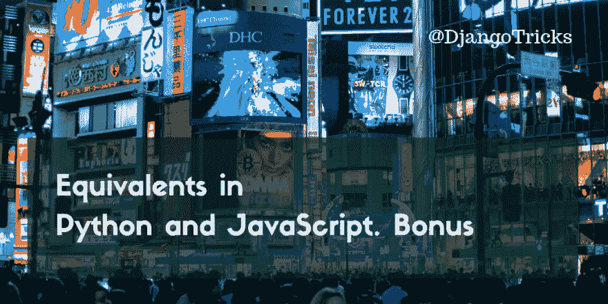

# Python 和 JavaScript 中的等价物。奖金

> 原文：<https://dev.to/djangotricks/equivalents-in-python-and-javascript-bonus-56g0>

[](https://res.cloudinary.com/practicaldev/image/fetch/s--NRmPbQiV--/c_limit%2Cf_auto%2Cfl_progressive%2Cq_auto%2Cw_880/https://3.bp.blogspot.com/-AbBqknEOT04/XFYb-oh0udI/AAAAAAAAB7w/d9zY2pG0O8IG2-D75GUkyT8RjckJU5FKACLcBGAs/s1600/equivalents-in-python-and-javascript-bonus.png)

我不时地搜索正确的语法，如何用 Python 处理列表和字典，或者用 JavaScript 处理数组和对象。所以我决定用这些函数来扩展我的等价系列。毕竟，我也会使用我在这里提供的信息。

## 所有真实要素

有时我们需要从条件列表中检查它们是否都为真，或者从元素列表中检查它们是否都不为空。

这可以通过 **Python** :
中的以下内容来检查

```
items = [1, 2, 3]
all_truthy = all(items)
# True 
```

Enter fullscreen mode Exit fullscreen mode

这里有一个对应的 **JavaScript** :

```
items = [1, 2, 3];
all_truthy = items.every(Boolean);
// true 
```

Enter fullscreen mode Exit fullscreen mode

## 任何真实的要素

类似地，我们可以检查是否至少有一个条件为真，或者列表中至少有一个非空元素。

它 **Python** 我们会这样做:

```
items = [0, 1, 2, 3]
some_truthy = any(items)
# True 
```

Enter fullscreen mode Exit fullscreen mode

在 **JavaScript** 中，我们会这样检查:

```
items = [0, 1, 2, 3];
some_truthy = items.some(Boolean);
// true 
```

Enter fullscreen mode Exit fullscreen mode

## 遍历每个元素及其索引

下面是一个例子，展示了如何在 Python 中遍历条目列表并检查它们的索引。当创建处理数据的不同命令行工具时，它对于详细的控制台输出很有用:

```
items = ['a', 'b', 'c', 'd']
for index, element in enumerate(items):
    print(f'{index}: {element};') 
```

Enter fullscreen mode Exit fullscreen mode

在 **JavaScript** 中，类似的方法是使用`forEach()`方法。通常的`for`循环也是一种选择，但我发现`forEach()`更优雅和清晰。

```
items = ['a', 'b', 'c', 'd'];
items.forEach(function(element, index) {
    console.log(`${index}: ${element};`);
}); 
```

Enter fullscreen mode Exit fullscreen mode

## 将元素映射到函数的结果

要处理一个列表的所有元素，您可以使用`for`循环遍历它们，并创建一个修改过的新列表，或者您可以通过将列表项映射到一个修改函数来一步完成。在 **Python** 中，这可以通过`map()`函数来完成:

```
items = [0, 1, 2, 3]
all_doubled = list(map(lambda x: 2 * x, items))
# [0, 2, 4, 6] 
```

Enter fullscreen mode Exit fullscreen mode

在 **JavaScript** 中，`map()`是一个数组的方法:

```
items = [0, 1, 2, 3];
all_doubled = items.map(x => 2 * x);
// [0, 2, 4, 6] 
```

Enter fullscreen mode Exit fullscreen mode

## 通过函数过滤元素

当您需要在一个列表或数组中搜索一些元素并希望避免`for`循环时，您可以使用过滤功能。在 **Python** 中，这可以通过接受过滤函数和列表并返回新的过滤列表的`filter()`函数来实现。

```
items = [0, 1, 2, 3]
only_even = list(filter(lambda x: x % 2 == 0, items))
# [0, 2] 
```

Enter fullscreen mode Exit fullscreen mode

在 **JavaScript** 中有一个数组的`filter()`方法。

```
items = [0, 1, 2, 3];
only_even = items.filter(x => x % 2 === 0);
// [0, 2] 
```

Enter fullscreen mode Exit fullscreen mode

在这两种情况下，筛选函数都会检查每个项目是否符合筛选条件，并在这种情况下返回 true。

## 通过函数将元素减少到单个值

当您想要将某个函数应用于一个项目列表以一次获得一个结果时，您可以使用 reduce 函数。它适用于求和、乘法、或运算、与运算或检查最大值和最小值。

在 **Python** 中有一个`reduce()`函数来实现这个功能。

```
from functools import reduce
items = [1, 2, 3, 4]
total = reduce(lambda total, current: total + current, items)
# 10 
```

Enter fullscreen mode Exit fullscreen mode

在 **JavaScript** 中有一个数组的`reduce()`方法。

```
items = [1, 2, 3, 4];
total = items.reduce((total, current) => total + current);
// 10 
```

Enter fullscreen mode Exit fullscreen mode

## 合并字典

有多种方法可以合并 Python 中的字典或 JavaScript 中的对象。但这些可能是最简单的。

在 **Python** 中，它将字典分解为键和数组的元组，连接它们，并创建一个新字典。

```
d1 = {'a': 'A', 'b': 'B'}
d2 = {'a': 'AAA', 'c': 'CCC'}
merged = dict(list(d1.items()) + list(d2.items()))
# {'a': 'AAA', 'b': 'B', 'c': 'CCC'} 
```

Enter fullscreen mode Exit fullscreen mode

类似地，在 **JavaScript** 中，它将两个对象扩展成一个新对象:

```
d1 = {a: 'A', b: 'B'}
d2 = {a: 'AAA', c: 'CCC'}
merged = {...d1, ...d2};
// {a: 'AAA', b: 'B', c: 'CCC'} 
```

Enter fullscreen mode Exit fullscreen mode

## 外卖

*   在这两种语言中，您都可以遍历项目列表，而无需显式递增和引用索引。
*   对于处理列表项，不一定需要循环。专用的方法或功能`all() / every()`、`any() / some()`、`map()`、`filter()`和`reduce()`可以帮助您。
*   在这两种语言中，您可以将多个词典合并为一个。如果同一个关键字出现在几个字典中，则在合并的字典中将使用最新的关键字。

当然，我也更新了备忘单，列出了你在这里看到的 **Python** 和 **JavaScript** 中的等价内容。这张备忘单有助于我在笔记本电脑旁边有一个很好的概览，所以我相信它也会对你有所帮助。新的修订版 10 是语法突出，所以它使探索和理解更好。

<center>[✨✨✨
Get the Ultimate Cheat Sheet of
Equivalents in Python and JavaScript
✨✨✨](https://www.djangotricks.com/goodies/YbnpiLKBmAZi/)</center>

好好利用它！

* * *

尹子的封面照片。