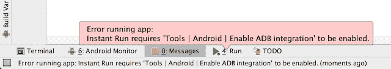

# 运行应用程序即时运行时出错，需要启用 ADB 集成

> 原文：<https://dev.to/skptricks/error-running-app-instant-run-requires-enable-adb-integration-3d97>

帖子链接:[运行 App Instant Run 时出错，需要启用 ADB 集成](https://www.skptricks.com/2019/03/error-running-app-instant-run-requires-enable-adb-integration.html)

如果您在使用最新的 Gradle 插件和最新的 Android SDK 时遇到了同样的问题“运行应用程序即时运行时出错，需要启用 ADB 集成”。您可以使用截图中提到的以下解决方案。

[错误运行 App 即时运行需要启用亚行整合](https://www.skptricks.com/2019/03/error-running-app-instant-run-requires-enable-adb-integration.html)

当试图在外部设备(连接的设备)上运行 Android 应用程序时，如果您收到此类错误消息(在 Android Studio 版本 2.2.2 上工作)，请遵循以下步骤。

可以通过以下步骤解决此错误:

[阅读更多...](https://www.skptricks.com/2019/03/error-running-app-instant-run-requires-enable-adb-integration.html)