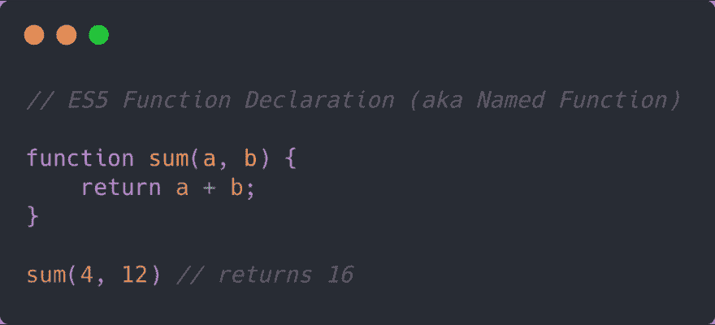
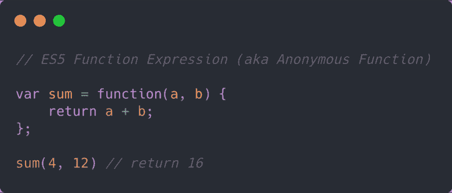
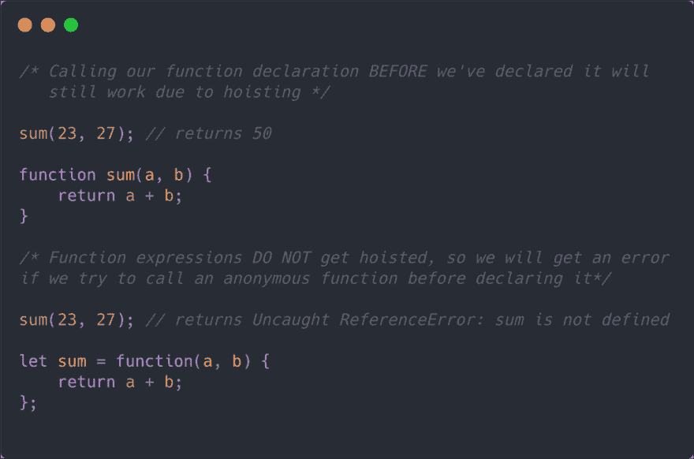
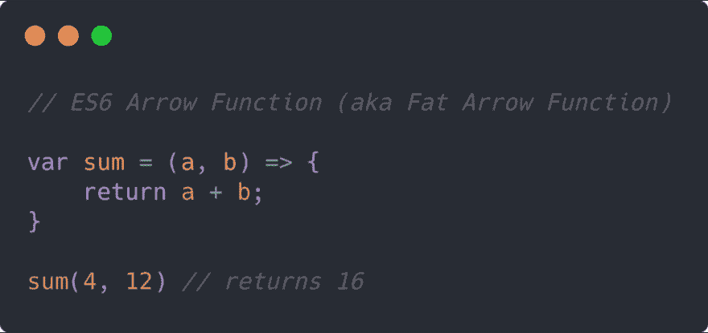
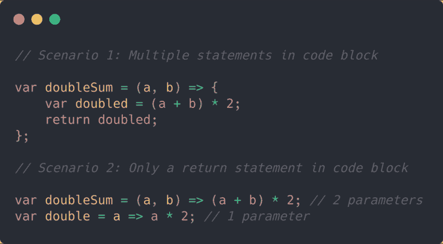

# ES5 与 ES6:功能

> 原文：<https://dev.to/zac_heisey/es5-vs-es6-functions-2dp7>

### ES5 中的函数

在 ES5 中有两种编写函数的方法，这两种方法产生的结果基本相同。

在一个**函数声明**(有时称为“命名”函数)中，我们使用 Function 关键字声明我们的函数，给它一个名称(下面例子中的 sum)，并使用 return 关键字返回我们在代码块中的语句的结果。

<figure> 

<figcaption>ES5 函数声明需要括号和一个返回语句——但没有分号。</figcaption>

</figure>

**函数表达式**(又名“匿名”函数)和函数声明有很多相同的特征(基本结构、函数和返回关键字等)。).然而，我们将函数表达式存储在变量中，并以分号结束(就像我们在 JavaScript 中处理所有变量一样)。

<figure> 

<figcaption>ES5 函数表达式需要括号、一个返回语句和一个终止分号。</figcaption>

</figure>

#### 函数声明和函数表达式有什么区别？

函数声明和函数表达式的关键区别在于*提升*。当你的脚本最初运行时，函数声明被浏览器*提升*。换句话说，脚本中的任何命名函数都将被提升到代码的顶部，并在执行任何其他代码之前解释*。*

这意味着在代码中声明一个命名函数之前，你可以调用它。看看下面的例子:

### ES6 中的功能

我们仍然可以使用上面概述的两种 ES5 函数类型，但是 ES6 也将**箭头函数**引入了 JavaScript 领域。箭头函数提供了一个简化的结构，允许以更简洁的方式编写函数表达式。

箭头函数的语法取消了 function 关键字，而是使用= >符号，该符号位于包含参数的括号的右侧。

<figure> 

<figcaption>ES6 箭头函数有几个语法选项，取决于函数的结构。</figcaption>

</figure>

箭头函数还带有一些漂亮的简写选项，我们可以用它们来使事情变得更加简洁，这取决于函数所需的结构。

<figure> 

<figcaption>ES6 箭头函数根据语句、参数等有速记选项。</figcaption>

</figure>

如果您想更深入地了解 ES6 箭头函数，并了解更多有关何时以及如何使用它们的信息，请查看以下一些资源和教程:

[JavaScript:箭头函数初学者-codeburst . io](https://codeburst.io/javascript-arrow-functions-for-beginners-926947fc0cdc)

[JavaScript 箭头函数教程- Flavio Copes](https://dev.to/flaviocopes/a-tutorial-to-javascript-arrow-functions-4kb-temp-slug-3047174)

[箭头函数- MDN web docs](https://developer.mozilla.org/en-US/docs/Web/JavaScript/Reference/Functions/Arrow_functions)

[何时(以及为什么)应该使用 ES6 箭头函数-以及为什么不应该使用- freeCodeCamp](https://medium.freecodecamp.org/when-and-why-you-should-use-es6-arrow-functions-and-when-you-shouldnt-3d851d7f0b26)

*感谢阅读！如果你有兴趣学习更多关于 HTML、CSS 和 JavaScript 的基础知识，请关注我的媒体出版物，* [*Web Dev 基础知识*](https://medium.com/web-dev-basics) *。准备好写一些代码了吗？太棒了。* [*报名参加*](https://www.web-dev-basics.com/) *课程，学习 web 开发基础知识。*

* * *