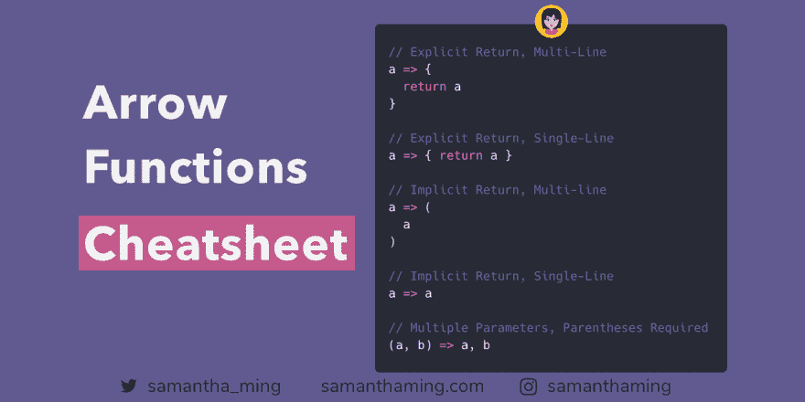

# ES6 箭头功能备忘单

> 原文：<https://dev.to/samanthaming/es6-arrow-functions-cheatsheet-1cn>

[](https://res.cloudinary.com/practicaldev/image/fetch/s--vlqQ-UWU--/c_limit%2Cf_auto%2Cfl_progressive%2Cq_auto%2Cw_880/https://thepracticaldev.s3.amazonaws.com/i/rhg7nntibsuufeibmt4u.png)

这里有一张备忘单，向你展示了许多编写箭头函数的方法。

```
// Explicit Return, Multi-Line
a => {
  return a
}

// Explicit Return, Single-Line
a => { return a }

// Implicit Return, Multi-line
a => (
  a
)

// Implicit Return, Single-Line
a => a

// Multiple Parameters, Parentheses Required
(a, b) => a, b 
```

## 隐性 vs 显性回归

我们有几种方法来编写箭头函数。这是因为箭头函数可以有“隐式返回”或“显式返回”关键字。

对于普通函数，如果你想返回某个东西，你必须使用`return`关键字。箭头函数也有。当你使用`return`关键字时，它被称为**显式返回**。然而，arrow 提升了他们游戏的功能，允许所谓的**隐含返回**，其中可以跳过`return`关键字。让我们看一些例子🤓。

### 例题 A:普通函数

```
const sayHi = function(name) {
  return name
} 
```

### 例 B:显式返回的箭头函数

```
// Multi-line
const sayHi = (name) => {
  return name
}

// Single-line
const sayHi = (name) => { return name } 
```

### 示例 C:带隐式返回的箭头函数

```
// Single-line
const sayHi = (name) => name

// Multi-line
const sayHi = (name) => (
  name
) 
```

注意到区别了吗？当你使用花括号`{}`时，你需要显式地声明返回。但是，当你不使用花括号时，`return`是隐含的，你不需要它。

这实际上有一个名字。当你在*例子 b* 中使用花括号时，它被称为**块体**。而*例子 c* 中的语法叫做**简洁体**。

⭐️规则是这样的:

*   块体➡️ `return`关键字是必需的
*   简洁正文➡️ `return`关键字是隐含的，不是必需的

## 括号

对于普通函数，我们总是不得不使用括号。但是，对于箭头函数，如果只有一个参数，括号是可选的。

### 括号对于单个参数是可选的

```
// Normal Function
const numbers = function(one) {}

// Arrow Function, with parentheses
const numbers = (one) => {}

// Arrow Function, without parentheses
const numbers = one => {} 
```

### 多个参数需要括号

```
// Normal Function
const numbers = function(one, two) {}

// Arrow Function, with parentheses
const numbers = (one, two) => {} 
```

## ⚠️箭头函数 Gotcha:返回对象

记得我提到过不同的体型——简洁体型和块状体型。只是为了快速更新你的信息，以防你跳过这一部分(我有点难过，但没有被冒犯😝).Block body 是使用花括号的地方，并且有一个显式的`return`。简洁的正文是你不用花括号的地方，你跳过了`return`关键字。好了，现在你赶上了，让我们回到你的问题上来🤯

让我们故意破坏我们的代码，这样你就可以吸取教训了😂

```
const me = () => { name: "samantha" };

me(); // undefined 😱 
```

什么？！为什么它不返回我的对象？别担心，让我们用圆括号把它括起来。

```
const me = () => ({ name: "samantha" });

me(); // { name: "samantha" } ✅ 
```

⭐️规则是这样的:

*   为了简洁起见，将对象文字括在括号中

## 资源

*   [MDN 网络文档-箭头功能](https://developer.mozilla.org/en-US/docs/Web/JavaScript/Reference/Functions/Arrow_functions)

* * *

**感谢阅读❤**
问好！[insta gram](https://www.instagram.com/samanthaming/)|[Twitter](https://twitter.com/samantha_ming)|[脸书](https://www.facebook.com/hisamanthaming) | [媒体](https://medium.com/@samanthaming) | [博客](https://www.samanthaming.com/blog)