# 初学者 ES6 第 3 部分(课程)

> 原文：<https://dev.to/2nit/es6-for-beginners-part-3-classes-bcj>

我想介绍由我们的开发人员之一 Bartosz 创作的“初学者 ES6”系列的第三部分。你可以在这里找到之前的部分[。](https://www.2n.pl/blog)

在我们开始讨论 JavaScript 中的*类*之前，需要解释一件事。JavaScript 中的类更像是语法糖，而不是新特性。然而，就像我在[前一节](https://www.2n.pl/blog/es6-part-2)中提到的箭头函数的例子一样，这是一个值得记住的工具。

JavaScript 中最糟糕的部分之一无疑是继承系统。JavaScript 没有真正的对象继承，但是有一种叫做原型继承的东西。JavaScript 中引入了类继承，因为它出现在绝大多数编程语言中。

那么 JavaScript 中除了语法糖之外还有哪些*类*，从而产生可读性更好的语法？答案很简单，和其他面向对象编程语言一样。他们是来创造物体的。它们就像蓝图，在此基础上创造出物体。另外，JavaScript 类基本上都是特殊函数。

类声明由两部分组成。表达式*类*和*类声明*。下面的例子。
[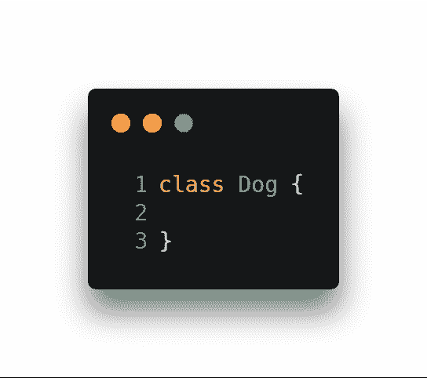](https://res.cloudinary.com/practicaldev/image/fetch/s--DTFkgtp7--/c_limit%2Cf_auto%2Cfl_progressive%2Cq_auto%2Cw_880/https://thepracticaldev.s3.amazonaws.com/i/7ysg1bnvap7ojicmsop9.png)

没什么复杂的。但是现在让我们看看在控制台中会发生什么。
T3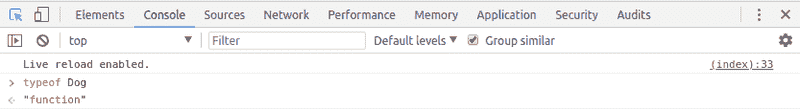T5】

正如我提到的。我们的类是一个函数，我们将通过它来创建对象。

我们*狗*班还缺几样东西。第一个将是一个*建造者*。这是一个用于初始化对象数据的特殊关键字。一个*构造函数*可以接受任意数量的参数。在我们的例子中，我们将创建两个(*名称*和*高度*)。然后，使用变量 *this* ，我们将确保参数中传递的实参将保存在变量中。在我们的例子中，也有相同的名字。当然，可以用不同于参数的名称命名 classy 属性，如下例所示，但是，这不是很清楚，不推荐使用。
T13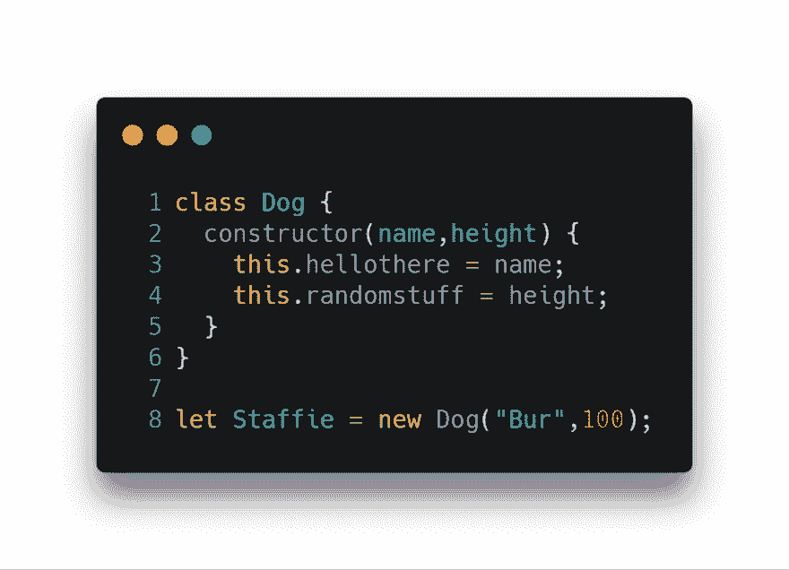T15】

[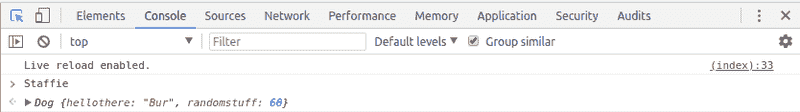](https://res.cloudinary.com/practicaldev/image/fetch/s--5NGCbRJ6--/c_limit%2Cf_auto%2Cfl_progressive%2Cq_auto%2Cw_880/https://thepracticaldev.s3.amazonaws.com/i/9ejbrlw1hytszxvm5yiw.png)

但是让我们回到正常的做事方式。
[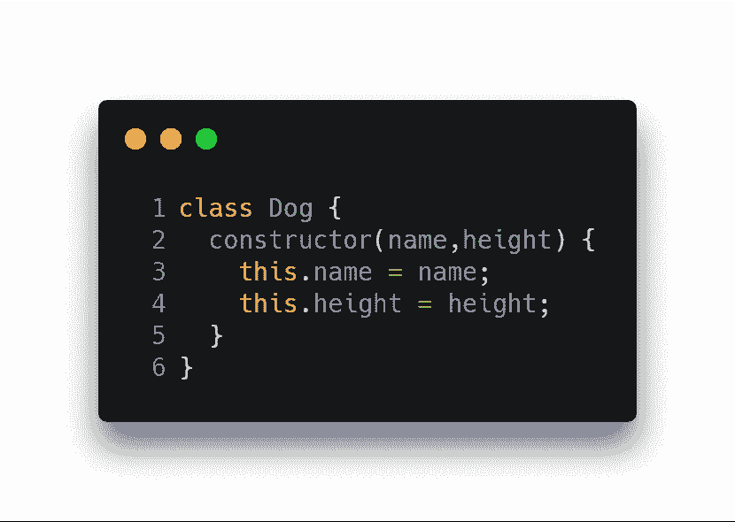T3】](https://res.cloudinary.com/practicaldev/image/fetch/s--CKDnKDuc--/c_limit%2Cf_auto%2Cfl_progressive%2Cq_auto%2Cw_880/https://thepracticaldev.s3.amazonaws.com/i/05g8oav9sxkrzntxfqbg.png)

一旦我们创建了一个类，我们就可以大胆地创建这个类的任意数量的对象/实例。我们做这件事的方法如下。
[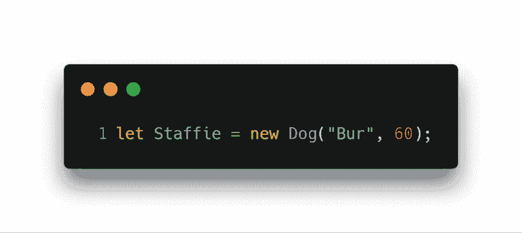T3】](https://res.cloudinary.com/practicaldev/image/fetch/s--m-GiYdQl--/c_limit%2Cf_auto%2Cfl_progressive%2Cq_auto%2Cw_880/https://thepracticaldev.s3.amazonaws.com/i/rjtom5hvh7x4iu2t2ktx.png)

在这个例子中，我们对象的名字是 *Staffie* 。接下来，我们向构造函数中定义的参数传递两个参数。第一个*【毛刺】*将是我们的*名*，第二个 *60* 将是*高*。
同样，我们可以在类中创建方法。方法只是一个放在类内部的函数。所以我们来添加一个方法，它会返回吠叫的声音。
T12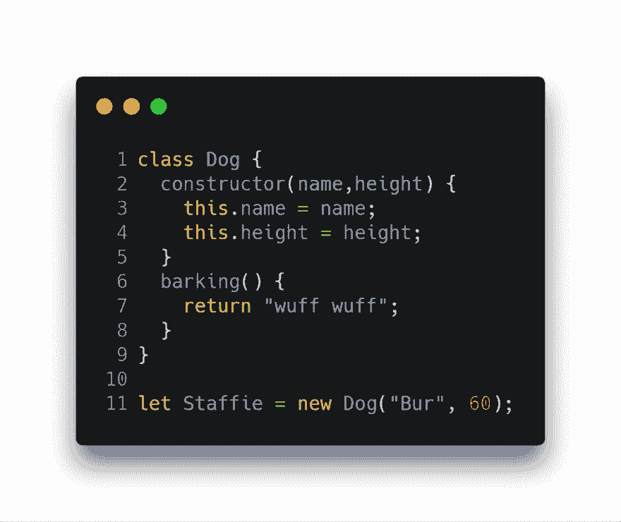T14】

现在我们的*员工*可以选择使用这种方法。当我们在控制台中调用吠叫方法时，我们得到:
[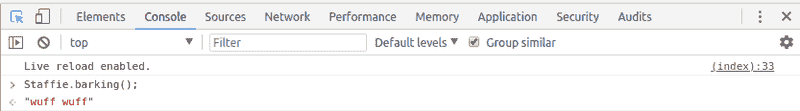](https://res.cloudinary.com/practicaldev/image/fetch/s--yCN7Ywjv--/c_limit%2Cf_auto%2Cfl_progressive%2Cq_auto%2Cw_880/https://thepracticaldev.s3.amazonaws.com/i/wdf2wyatrvowfohsxv18.png)

既然我们知道了如何创建类，那么让我们来看看*继承*。因为狗不仅按种族而且按群体来划分，所以让我们创建一个继承了*狗*类的*梗*类。它也不复杂。
[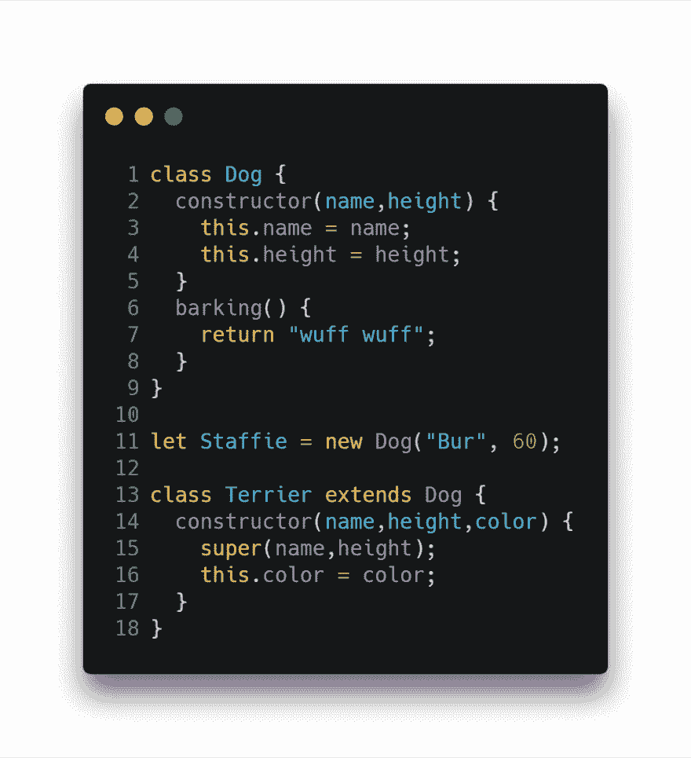](https://res.cloudinary.com/practicaldev/image/fetch/s--0_Bb4T9f--/c_limit%2Cf_auto%2Cfl_progressive%2Cq_auto%2Cw_880/https://thepracticaldev.s3.amazonaws.com/i/0rs2pmd803eks82htdwb.png)

在上面的例子中，我们看到为了能够从另一个类继承，我们使用单词*扩展了* + *我们想要继承的类的名字*。此外，我们看到关键字*超级*。它允许我们使用特殊变量 *this* 并在创建 *Terrier* 类的实例时访问从 *Dog* 类继承的 *name* 和 *height* 参数。
另一件经常遇到的事情是当我们想用我们的方法*吠叫*的时候。然而，返回值将与普通狗的值不同。
[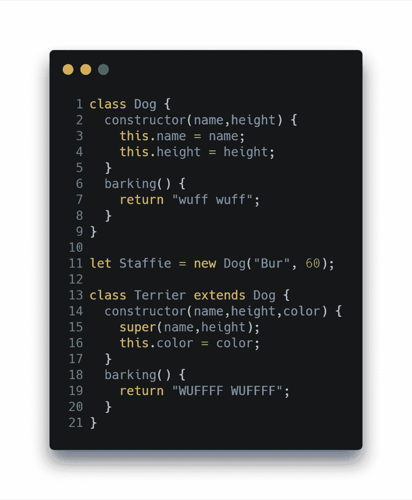](https://res.cloudinary.com/practicaldev/image/fetch/s--IBXoCcYa--/c_limit%2Cf_auto%2Cfl_progressive%2Cq_auto%2Cw_880/https://thepracticaldev.s3.amazonaws.com/i/sb7g9qm47fo2oxrba22z.png)

如你所见，这没有任何魔力。现在我们的狗汤米会像任何有自尊心的狗一样吠叫。
T3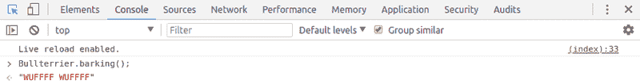T5】

一般来说，Java 之类的语言中的约定，其中有一个面向对象的编程模型，也假设在不同的文件中保存类。也就是说，与我们的例子中一个文件包含两个类不同，更好的解决方案是将它们转移到两个独立的文件中。多亏了这样一个过程，我们的代码将变得更加可读，这在写作时是一个很大的优势。

*狗*类
T3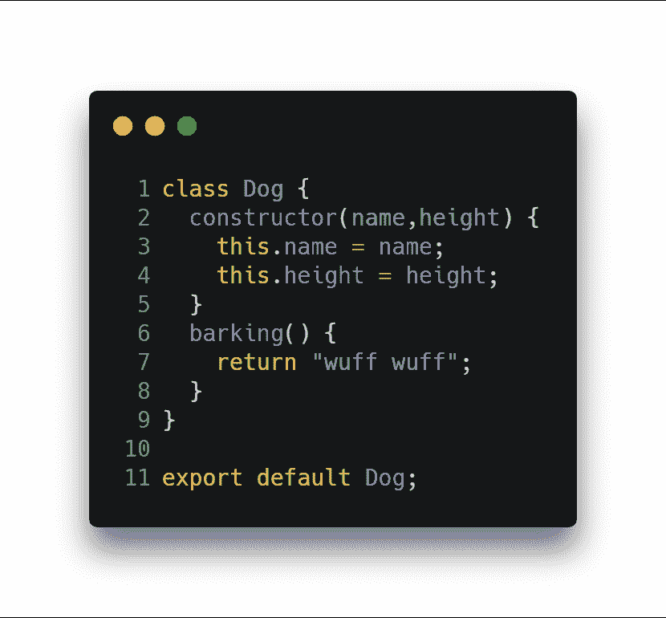T5】

*梗*类
[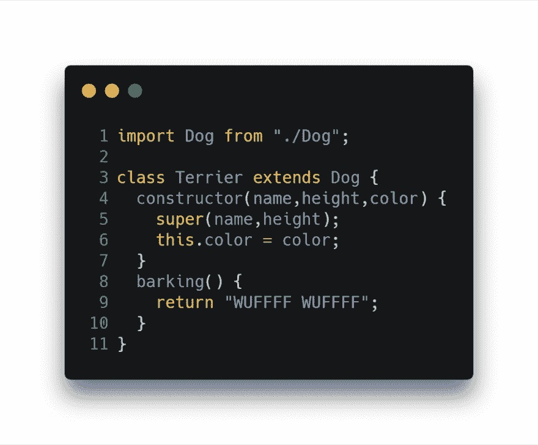](https://res.cloudinary.com/practicaldev/image/fetch/s---xS0-8LE--/c_limit%2Cf_auto%2Cfl_progressive%2Cq_auto%2Cw_880/https://thepracticaldev.s3.amazonaws.com/i/gob44ogjy6bsqgbnk43s.png)

如你所见，我们使用了两个关键字。*进口*和*出口*。因为你可能已经知道它们的用途了。我将只提到你可以从模块中导出函数、对象或原始值，这样其他带有 **import** 语句的程序就可以使用它们。

本部分中另一个值得一提的主题是静态方法。那么它们到底是什么呢？首先，它们是用一个关键字 static 创建的。关于它们最重要的一点是，它们是直接在类上调用的，而不能在类的实例上调用。他们的目的是创建一个效用函数。
[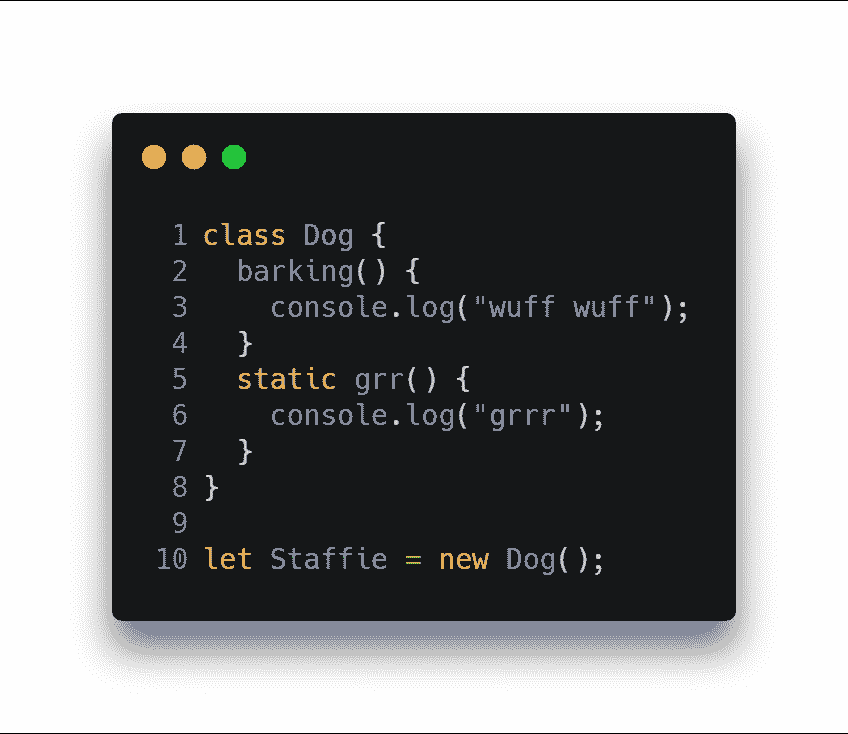T3】](https://res.cloudinary.com/practicaldev/image/fetch/s---RL2Tnk6--/c_limit%2Cf_auto%2Cfl_progressive%2Cq_auto%2Cw_880/https://thepracticaldev.s3.amazonaws.com/i/r9ztbnxo6rcqs6n33sr5.png)

我们创建了一个 *Dog* 类的实例，并再次将其命名为 *Staffie* 。让我们试着调用这两种方法。
[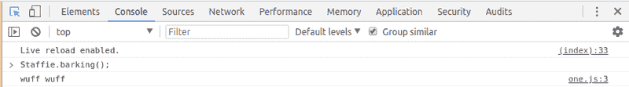](https://res.cloudinary.com/practicaldev/image/fetch/s--iyPDiNj---/c_limit%2Cf_auto%2Cfl_progressive%2Cq_auto%2Cw_880/https://thepracticaldev.s3.amazonaws.com/i/03cejwaj59ckm4vz3b2g.png)

好了，方法*叫*按预期工作。现在让我们调用第二个。
T3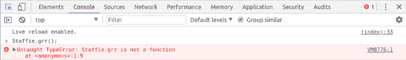T5】

如你所见，它也能按预期工作。我们不能在对象上调用静态函数。另一方面，是否有可能像预期的那样在类上调用它？
[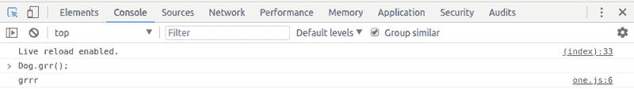T3】](https://res.cloudinary.com/practicaldev/image/fetch/s--L5eoUVRt--/c_limit%2Cf_auto%2Cfl_progressive%2Cq_auto%2Cw_880/https://thepracticaldev.s3.amazonaws.com/i/cu2c2pve0sgujg5olkcp.png)

很好，确实如此。

那么，ES6 标准引入后的 JavaScript 是否开始属于使用面向对象编程(OOP)模型的语言了呢？答案是，不会。JavaScript 仍然基于原型继承模型。

在下一篇文章中，我们将讨论休息和伸展。