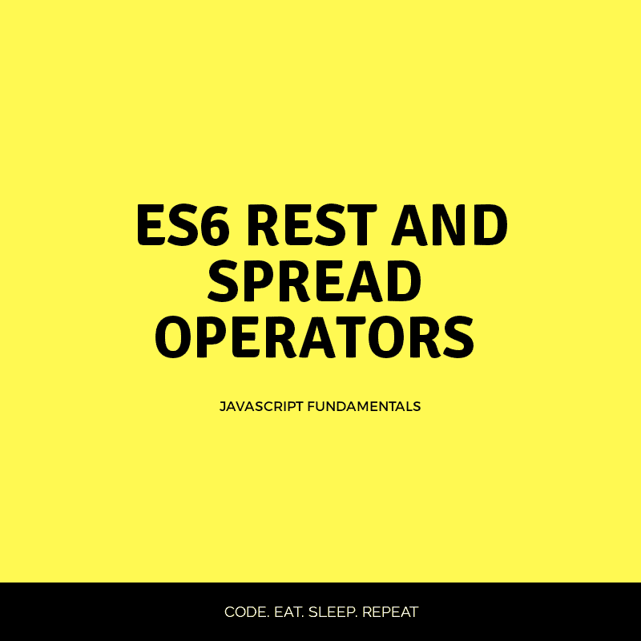

# ES6 休息和伸展运算符

> 原文：<https://dev.to/runosaduwa/es6-rest-and-spread-operators-dep>

[](https://res.cloudinary.com/practicaldev/image/fetch/s--etPCAmKZ--/c_limit%2Cf_auto%2Cfl_progressive%2Cq_auto%2Cw_880/https://thepracticaldev.s3.amazonaws.com/i/wwnx9xpy59s885qq1a72.png)

ES6 给 JavaScript 增加了很多很酷的特性。`Rest`和`Spread`操作符是强大的新特性，允许我们轻松地访问和操作数据。

`Rest`这个词在这里简单的意思是*收集参数并把它们全部放入一个**单数组*** 。

此外，`Spread`一词指的是 ***将**展开成一个可迭代的元素(数组、对象和字符串)。*

他们都使用了三个点*`...`，但是应用方式不同，以适应他们的目的。*

 *在这篇文章中，我们将学习`Rest`和`Spread`操作符，如何使用以及何时使用。

### 目录:

*   Rest 运算符
*   扩展运算符
*   摘要

# 休息符

如前所述，`Rest`操作符收集参数并把它们放在一个数组中。

它使用了一个命名参数前面的符号`...`，这个命名参数将成为一个数组，这个数组将收集传递给函数的剩余的*个*参数。请看下面的例子:

```
 function showNames(...names){
   console.log(names);
}

 showNames("Runo","Tega","Ejiro") // ["Runo","Tega","Ejiro"] 
```

在上面的例子中，`rest parameter`是前面加了一个`...`的`names`，表示`names`确实是一个`rest parameter`。当该函数被调用时，控制台将`names`的值打印为`["Runo","Tega","Ejiro"]`，这是一个由*收集*传递到`showNames`函数中的所有参数而创建的数组。

#### 时应该使用*休息符*

当您需要创建可以接受无限数量参数的函数定义时，`rest operators`非常有用，让我们来看一个例子:

```
 function add(a, b){
   return console.log(a + b);
}
add(1,2); // 3
add(1, 2, 3, 4, 5); //3 
```

第一次函数调用，`add(1,2)`返回 3。这是非常正常和直接的，但是如果您需要向函数传递更多的参数来帮助您添加 2 个以上的参数呢？

在调用下一个`add`函数`add(1, 2, 3, 4, 5)`之后，我们仍然会得到`3`，因为在 JavaScript 中，你可以调用一个带有任意数量参数的函数，但是使用的参数数量取决于函数定义中指定的参数数量。

在这种情况下，只指定了 2 个参数。因此，Javascript 选择前两个参数。

#### 休息参数救援

使用`rest parameters`,我们可以将任意数量的参数聚集到一个数组中，并对它们做任何你想做的事情。我们可以使用数组方法，比如像`forEach(), map(), reduce()`这样的高阶函数。

使用 rest 参数，我们可以像这样重写 add 函数:

```
function add(...rest){
  let total = 0;
  rest.forEach(num => total += num);

return console.log(total);
}

add(1,2); //3
add(1, 2, 3); //6
add(1, 2, 3, 4, 5, 6);//21 
```

通过这样做，我们成功地使我们的函数变得灵活，可以接受尽可能多的参数，因为 rest 参数会将它们收集到一个数组中，我们很好地利用了`forEach()`方法来迭代数组中的每个元素，并将它添加到`total`变量中。

**注意:**如果你需要在`rest parameter`旁边指定一个(或多个)参数，确保其余的参数在你的函数定义中**最后**。

```
function allNames(name1, ...name2, name3){
console.log(name2); // Error!
}

allNames("Runo", "Tega", "Ejiro", "Simi", "Gare"); 
```

请不要这样做，这对 JavaScript 没有任何意义。`rest parameters`的工作是收集将传递给函数的多余参数。这个函数应该这样重写:

```
function allNames(name1, name2, ...name3){
console.log(name2); // Tega
console.log(name3); // ["Ejiro", "Simi", "Gare"];
console.log(name3.length); // 3
}

allNames("Runo", "Tega", "Ejiro", "Simi", "Gare"); 
```

同样重要的是要知道函数的`length property`忽略了`rest parameters`，让我们看看如果我们试图找到`allNames`函数的长度会得到什么:

```
function allNames(name1, name2, ...name3){
console.log(name2); // Tega
}

console.log(allNames.length) // 2 
```

# 传播算子

`spread operator`只是做了与 rest 操作符相反的事情，它*解包*一个数组。

`spread operator`可以用于其他可迭代的数据类型，比如字符串和对象。

`spread operator`适用于以下场景:

### 需要复制数组时

```
 let arr = ["a", "b", "c"];
 let newArr = [...arr];

 console.log(newArr) // ["a", "b", "c"] 
```

这很简单，你所需要做的就是在一个现有的数组中添加一个前置的`...`，它会简单地从数组中移除所有的值。

### 将数组元素添加到另一个数组中

```
const arr = ["a", "b"];
const newArr = [...arr, "c", "d"];
console.log(newArr) //["a", "b", "c", "d"] 
```

`arr`的值被传送到`newArr`。

### 拆分字符串

```
 let name = 'Runo';
 console.log(...name) // 'R' 'u' 'n' 'o' 
```

### 合并对象

```
 const obj1 = {
       name: "Runo"
}

const obj2 = {
       age: 19
}

const obj3 = {
     ...obj1,
     ...obj2
}

console.log(obj3) // {name: "Runo", age: 19} 
```

# 总结

`rest operator`将传递给函数的剩余数据存储在一个数组中。换句话说，它创建了一个新的数组。另一方面，`spread operator`简单地与一个**现有的**数组或像字符串和对象这样的可迭代对象一起工作，它通常用于像`ReactJs`这样的现代框架中，从`state`复制数据。

希望这对某人有所帮助，开心编码 fam！*