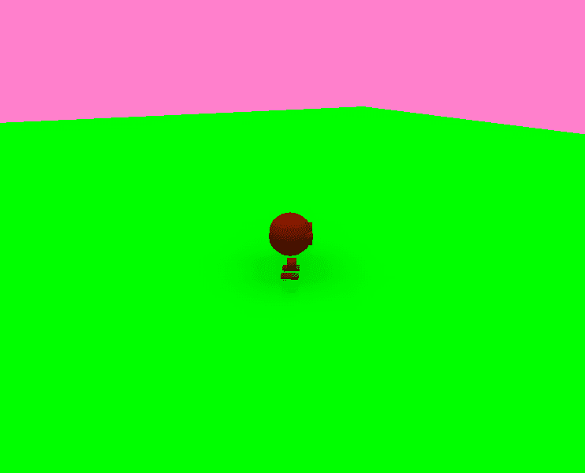
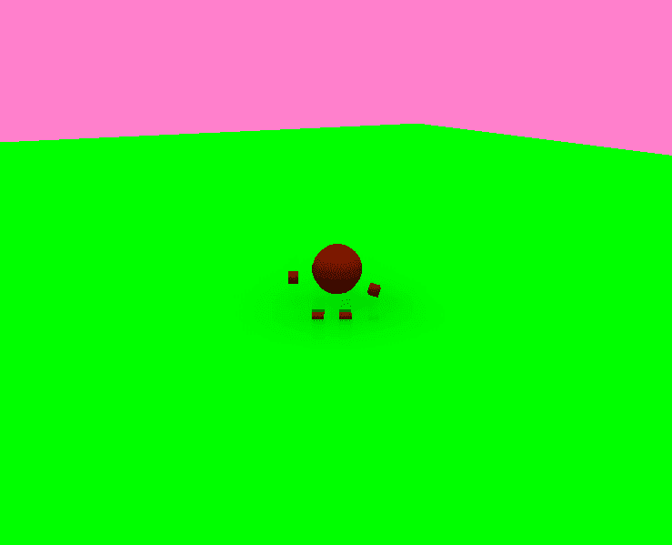
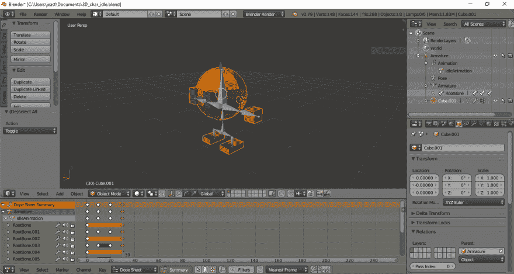

# 为 3D 模型建立正确的前向方向

> 原文：<https://dev.to/webdva/establishing-the-correct-forward-facing-direction-for-a-3d-model-5a91>

*我正在分享第一次制作 3D 游戏时在学到的[课。](https://webdva.github.io/establishing-the-correct-forward-facing-direction-for-a-3d-model/)*

与 2D 环境中的 2D 子画面不同，3D 环境中的 3D 模型具有包括所谓的面向前的方向的方向。

在下面的图片中，网格的面向前的方向是不正确的，因为网格的字符正面没有面向预期的方向。

下一张图显示了网格的正确方向，即 3D 角色的背面朝向相机的前向方向。

以下指南揭示了为 3D 网格建立正确的前向方向的正确步骤，特别是针对 Babylon.js 游戏开发框架。

# Blender 3D 建模实用程序中的正确程序

3D 模型必须面向的轴是 y 轴，以便在外部应用程序中具有正确的面向前的方向，并且必须在 y 轴的正方向。

位置、旋转和比例变换将应用于导出到 Babylon.js 应用程序。